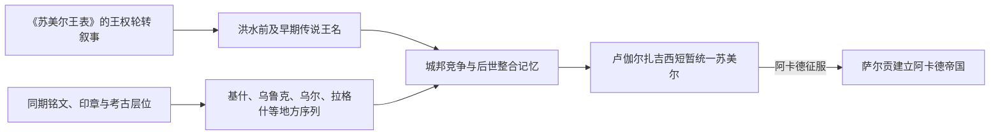

# 苏美尔城邦王朝与统治者表

## 使用范围

本表整理约前2900—前2334年苏美尔主要城邦的统治者线索。苏美尔没有一个覆盖全时期的统一王朝：乌鲁克、基什、乌尔、拉伽什、温马等城邦长期并立，某位统治者取得霸权也不等于建立稳定的“苏美尔王国”。因此各城序列分栏列出，不把彼此重叠的地方王朝强行首尾相接。

## 史料限制

后世《苏美尔王表》把“王权”描写为依次从一城转移到另一城，并列出洪水前寿命数万年的君主。这是一种关于神授王权和政治正统的文学—史学构造，不是可直接照抄的年代记录。王表不同抄本在人名、顺序和在位年数上互异；它还遗漏了有大量同时代铭文的拉伽什。下表优先采用同期王室铭文、印章、行政泥板和考古层位；约年仅供定位。

## 王名传统与历史序列图

《王表》会把同时并立的城邦整理成王权依次转移的单线，且包含异常长寿的传说人物；下表只有在同期证据足够时才列为地方统治序列，不能把文学名单直接补成“完整全国世系”。

## 传说与历史之间

| 城邦 / 传统 | 统治者 | 约期 | 证据与判断 |
|---|---|---|---|
| 洪水前诸城 | 阿卢利姆、阿拉尔加尔、杜穆齐等 | 神话时间 | 仅见于王表和文学传统，数万年在位不具历史年代意义。 |
| 乌鲁克第一王朝传统 | 恩麦卡尔、卢伽尔班达、杜穆齐、吉尔伽美什等 | 传统置于早王朝前期 | 主要为史诗人物；吉尔伽美什可能保存某位早期统治者的历史记忆，但不能据传说建立可靠世系。 |
| 基什第一王朝传统 | 王表列二十余名君主 | 早王朝前期 | 多数缺乏同期证明；“基什之王”后来成为跨城邦霸权称号，不等于始终统治基什。 |

## 有同期证据的主要地方序列

| 城邦 / 王朝 | 顺序 | 统治者 | 约期 | 继承与说明 |
|---|---:|---|---|---|
| 基什 | 1 | 恩美巴拉格西 | 约前26世纪 | 铭文可证，是王表中较早获得同期证据的君主；具体年数不详。 |
| 基什 | 2 | 阿伽 | 约前26世纪 | 王表称其为恩美巴拉格西之子；又见于与吉尔伽美什有关的文学传统，历史细节有争议。 |
| 乌尔第一王朝 | 1 | **美萨耐帕达** | 约前25世纪 | 自称“基什之王”，显示其霸权诉求；不是全苏美尔固定王位。 |
| 乌尔第一王朝 | 2 | 阿耐帕达 | 约前25世纪 | 美萨耐帕达之子，建筑铭文可证。 |
| 乌尔第一王朝 | 3 | 美斯基阿格努纳 | 约前25—前24世纪 | 与前任关系通常据王表重建，年代约略。 |
| 乌尔第一王朝 | 4 | 埃卢卢 | 约前24世纪 | 主要据王表；与前任的亲属关系及确切年代不详。 |
| 乌尔第一王朝 | 5 | 巴卢卢 | 约前24世纪 | 王表列为本王朝末王；同期证据有限。 |
| 拉伽什第一王朝 | 1 | **乌尔南舍** | 约前25世纪中叶 | 以同期建筑铭文建立较清楚的地方王朝序列。 |
| 拉伽什第一王朝 | 2 | 阿库尔伽尔 | 约前25世纪 | 乌尔南舍之子。 |
| 拉伽什第一王朝 | 3 | **伊安那图姆（Eannatum）** | 约前2450年左右 | 阿库尔伽尔之子；击败温马并留下“鹫碑”，一度取得区域霸权。 |
| 拉伽什第一王朝 | 4 | 恩安那图姆一世（Enannatum I） | 约前24世纪 | 恩安那图姆之弟，延续与温马的边界战争。 |
| 拉伽什第一王朝 | 5 | **恩铁美那** | 约前24世纪 | 恩安那图姆一世之子；铭文记述边界条约、灌溉与神庙工程。 |
| 拉伽什第一王朝 | 6 | 恩安那图姆二世（Enannatum II） | 约前24世纪 | 继承关系与短期统治细节不详。 |
| 拉伽什第一王朝 | 7 | 恩恩塔尔齐 | 约前24世纪末 | 可能由高级祭司集团上台；与前王室关系不明。 |
| 拉伽什第一王朝 | 8 | 卢伽尔安达 | 约前24世纪末 | 恩恩塔尔齐之子或近亲；行政档案显示精英家产扩张。 |
| 拉伽什第一王朝 | 9 | **乌鲁卡吉那** | 约前2350年左右 | 夺位关系不明；改革铭文抨击官吏侵夺，后败于卢伽尔扎格西。 |
| 乌鲁克地方霸权 | 1 | 恩沙库善那 | 约前24世纪 | 自称“苏美尔之王”，但与其他城邦统治重叠。 |
| 乌鲁克—乌尔 | 2 | 卢伽尔基吉内杜杜 | 约前24世纪 | 同时使用乌鲁克和乌尔王号；与恩铁美那订盟。 |
| 温马—乌鲁克 | 3 | **卢伽尔扎格西** | 约前2358—前2334年 | 先为温马王，攻破拉伽什并控制南部多城，后被萨尔贡击败。 |

## 不能补成“完整世系”的部分

- 尼普尔主要是宗教中心，未形成与乌尔、拉伽什相同的连续地方王表。
- 阿达布、舒鲁帕克、马里及迪亚拉河流域也有同期统治者，但资料多为孤立姓名或局部序列。
- 同一统治者使用 ensi、lugal 或“基什之王”等不同头衔，反映职权与霸权，而非现代意义的固定爵位等级。
- 约前24世纪的城邦序列高度重叠；任何把“基什王朝 → 乌鲁克王朝 → 乌尔王朝”画成单线继承的表格，都只是复述后世王表的正统观。

## 相关笔记

- 主笔记：[苏美尔城邦时期](/%E4%BA%BA%E6%96%87%E7%A7%91%E5%AD%A6/%E5%8E%86%E5%8F%B2/%E8%A5%BF%E4%BA%9A/%E4%B8%A4%E6%B2%B3%E6%B5%81%E5%9F%9F/%E8%8B%8F%E7%BE%8E%E5%B0%94%E5%9F%8E%E9%82%A6%E6%97%B6%E6%9C%9F.md)。
- 后续统一帝国：[阿卡德帝国](/%E4%BA%BA%E6%96%87%E7%A7%91%E5%AD%A6/%E5%8E%86%E5%8F%B2/%E8%A5%BF%E4%BA%9A/%E4%B8%A4%E6%B2%B3%E6%B5%81%E5%9F%9F/%E9%98%BF%E5%8D%A1%E5%BE%B7%E5%B8%9D%E5%9B%BD.md)。
- 所属总览：[两河流域文明](/%E4%BA%BA%E6%96%87%E7%A7%91%E5%AD%A6/%E5%8E%86%E5%8F%B2/%E8%A5%BF%E4%BA%9A/%E4%B8%A4%E6%B2%B3%E6%B5%81%E5%9F%9F/README.md)。
