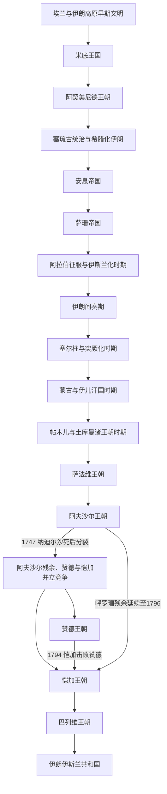

# 伊朗

## 范围与对象

本目录同时承担两个尺度，但不把两者混为一谈：

- **伊朗高原与伊朗文明长时段**：范围随时代变化，长期连接两河流域、中亚、南亚和高加索，常超出现代伊朗国界。
- **现代伊朗国家通史**：重点处理恺加后期、巴列维王朝和1979年后的国家制度、社会转型与对外关系。
- **对象边界**：“波斯”“伊朗”“伊朗高原”和现代伊朗共和国不是完全同义的概念。

上级入口：[西亚](/%E4%BA%BA%E6%96%87%E7%A7%91%E5%AD%A6/%E5%8E%86%E5%8F%B2/%E8%A5%BF%E4%BA%9A/README.md)；历史总览：[历史](/%E4%BA%BA%E6%96%87%E7%A7%91%E5%AD%A6/%E5%8E%86%E5%8F%B2/README.md)。

## 一句话全史

伊朗历史从埃兰、米底和阿契美尼德等高原文明与帝国传统展开，经希腊化、安息和萨珊重组；阿拉伯征服带来伊斯兰化，但新波斯语、行政文化和地方王权延续并复兴；突厥与蒙古征服再次改变政治精英，萨法维确立什叶派国家传统，18世纪多政权竞争后由恺加重建统一，继而经历巴列维现代化和伊斯兰共和国。

## 名称辨析：波斯、伊朗、伊朗高原

- “伊朗”适合做完整目录名，覆盖古代伊朗高原、波斯帝国传统和现代伊朗国家。
- “波斯”多是外部传统称呼，尤其常用于阿契美尼德、萨珊和前现代伊朗王朝。
- “伊朗高原”是地理文化范围，可能超出现代伊朗国界。
- “波斯帝国”通常特指阿契美尼德，广义时也可能包括萨珊等伊朗帝国，使用时需要说明。

## 政治演变图

18世纪不是“阿夫沙尔完整结束后才有赞德、赞德完整结束后才有恺加”的单线继承。1747年后中央权力破裂，阿夫沙尔残余、赞德与恺加等势力在不同区域重叠竞争；恺加通过先后击败赞德和阿夫沙尔残余完成新的统一。

## 文明连续性

| 维度 | 延续与变化 |
|---|---|
| 地理与空间 | 伊朗高原持续连接两河、中亚、南亚和高加索，但帝国疆域、边疆和现代国界反复收缩与重组。 |
| 语言与文学 | 阿拉伯征服后阿拉伯语影响加深，新波斯语及其文学、行政文化仍在地方王朝和跨区域宫廷中复兴并传播。 |
| 宗教 | 萨珊时期祆教国家传统在征服后瓦解，社会逐步伊斯兰化；萨法维又把十二伊玛目什叶派确立为国家传统。 |
| 制度与王权 | 行省治理、宫廷王权与波斯官僚文化在不同族群建立的王朝间被继承和改造；征服不等于制度全部归零。 |
| 人口与政治精英 | 伊朗语族社会、阿拉伯征服者、突厥军事集团、蒙古与地方王朝长期层叠，文化连续性不等于统治家族连续。 |
| 交流网络 | 两河城市、中亚绿洲、印度西北、高加索和波斯湾贸易把伊朗置于多条跨区域网络之间。 |

## 按时间排序的时期导航

| 顺序 | 阶段 | 时间 | 入口 | 简要概括 |
|---:|---|---|---|---|
| 1 | 埃兰与伊朗高原早期文明 | 约前3千纪—前539年 | [埃兰与伊朗高原早期文明](/%E4%BA%BA%E6%96%87%E7%A7%91%E5%AD%A6/%E5%8E%86%E5%8F%B2/%E8%A5%BF%E4%BA%9A/%E4%BC%8A%E6%9C%97/%E5%9F%83%E5%85%B0%E4%B8%8E%E4%BC%8A%E6%9C%97%E9%AB%98%E5%8E%9F%E6%97%A9%E6%9C%9F%E6%96%87%E6%98%8E.md) | 埃兰和伊朗高原早期城邦、部落与区域文明构成波斯帝国以前的长期背景。 |
| 2 | 米底王国 | 约前7世纪—前550年 | [米底王国](/%E4%BA%BA%E6%96%87%E7%A7%91%E5%AD%A6/%E5%8E%86%E5%8F%B2/%E8%A5%BF%E4%BA%9A/%E4%BC%8A%E6%9C%97/%E7%B1%B3%E5%BA%95%E7%8E%8B%E5%9B%BD.md) | 米底人建立伊朗语族早期王国，参与推翻新亚述帝国，并成为阿契美尼德兴起前的关键政治基础。 |
| 3 | 阿契美尼德王朝 | 前550年—前330年 | [阿契美尼德王朝](/%E4%BA%BA%E6%96%87%E7%A7%91%E5%AD%A6/%E5%8E%86%E5%8F%B2/%E8%A5%BF%E4%BA%9A/%E4%BC%8A%E6%9C%97/%E9%98%BF%E5%A5%91%E7%BE%8E%E5%B0%BC%E5%BE%B7%E7%8E%8B%E6%9C%9D.md) | 建立横跨西亚、埃及、安纳托利亚和中亚的波斯帝国，并与希腊城邦长期冲突。 |
| 4 | 塞琉古统治与希腊化伊朗 | 前312年—前2世纪 | [塞琉古统治与希腊化伊朗](/%E4%BA%BA%E6%96%87%E7%A7%91%E5%AD%A6/%E5%8E%86%E5%8F%B2/%E8%A5%BF%E4%BA%9A/%E4%BC%8A%E6%9C%97/%E5%A1%9E%E7%90%89%E5%8F%A4%E7%BB%9F%E6%B2%BB%E4%B8%8E%E5%B8%8C%E8%85%8A%E5%8C%96%E4%BC%8A%E6%9C%97.md) | 亚历山大帝国瓦解后，伊朗大部进入塞琉古体系，希腊化城市和伊朗地方势力并存。 |
| 5 | 安息帝国 | 前247年—224年 | [安息帝国](/%E4%BA%BA%E6%96%87%E7%A7%91%E5%AD%A6/%E5%8E%86%E5%8F%B2/%E8%A5%BF%E4%BA%9A/%E4%BC%8A%E6%9C%97/%E5%AE%89%E6%81%AF%E5%B8%9D%E5%9B%BD.md) | 帕提亚 / 安息帝国以伊朗高原和两河流域为核心，与罗马长期对峙。 |
| 6 | 萨珊帝国 | 224—651年 | [萨珊帝国](/%E4%BA%BA%E6%96%87%E7%A7%91%E5%AD%A6/%E5%8E%86%E5%8F%B2/%E8%A5%BF%E4%BA%9A/%E4%BC%8A%E6%9C%97/%E8%90%A8%E7%8F%8A%E5%B8%9D%E5%9B%BD.md) | 重建伊朗王权和祆教国家传统，与罗马 / 拜占庭长期竞争，最终被阿拉伯征服。 |
| 7 | 阿拉伯征服与伊斯兰化时期 | 651年—9世纪 | [阿拉伯征服与伊斯兰化时期](/%E4%BA%BA%E6%96%87%E7%A7%91%E5%AD%A6/%E5%8E%86%E5%8F%B2/%E8%A5%BF%E4%BA%9A/%E4%BC%8A%E6%9C%97/%E9%98%BF%E6%8B%89%E4%BC%AF%E5%BE%81%E6%9C%8D%E4%B8%8E%E4%BC%8A%E6%96%AF%E5%85%B0%E5%8C%96%E6%97%B6%E6%9C%9F.md) | 萨珊灭亡后进入哈里发统治并逐步伊斯兰化，同时保留波斯语、地方贵族和行政文化传统。 |
| 8 | 伊朗间奏期 | 9—11世纪 | [伊朗间奏期](/%E4%BA%BA%E6%96%87%E7%A7%91%E5%AD%A6/%E5%8E%86%E5%8F%B2/%E8%A5%BF%E4%BA%9A/%E4%BC%8A%E6%9C%97/%E4%BC%8A%E6%9C%97%E9%97%B4%E5%A5%8F%E6%9C%9F.md) | 塔希尔、萨法尔、萨曼、布韦希等地方王朝推动新波斯语文学和伊朗地方政治复兴。 |
| 9 | 塞尔柱与突厥化时期 | 11—13世纪 | [塞尔柱与突厥化时期](/%E4%BA%BA%E6%96%87%E7%A7%91%E5%AD%A6/%E5%8E%86%E5%8F%B2/%E8%A5%BF%E4%BA%9A/%E4%BC%8A%E6%9C%97/%E5%A1%9E%E5%B0%94%E6%9F%B1%E4%B8%8E%E7%AA%81%E5%8E%A5%E5%8C%96%E6%97%B6%E6%9C%9F.md) | 塞尔柱突厥进入伊朗和西亚，苏丹制与波斯官僚传统结合。 |
| 10 | 蒙古与伊儿汗国时期 | 13—14世纪 | [蒙古与伊儿汗国时期](/%E4%BA%BA%E6%96%87%E7%A7%91%E5%AD%A6/%E5%8E%86%E5%8F%B2/%E8%A5%BF%E4%BA%9A/%E4%BC%8A%E6%9C%97/%E8%92%99%E5%8F%A4%E4%B8%8E%E4%BC%8A%E5%84%BF%E6%B1%97%E5%9B%BD%E6%97%B6%E6%9C%9F.md) | 蒙古征服重组伊朗政治格局，伊儿汗国逐步伊斯兰化。 |
| 11 | 帖木儿与土库曼诸王朝时期 | 14—15世纪 | [帖木儿与土库曼诸王朝时期](/%E4%BA%BA%E6%96%87%E7%A7%91%E5%AD%A6/%E5%8E%86%E5%8F%B2/%E8%A5%BF%E4%BA%9A/%E4%BC%8A%E6%9C%97/%E5%B8%96%E6%9C%A8%E5%84%BF%E4%B8%8E%E5%9C%9F%E5%BA%93%E6%9B%BC%E8%AF%B8%E7%8E%8B%E6%9C%9D%E6%97%B6%E6%9C%9F.md) | 帖木儿帝国后继政治、黑羊和白羊土库曼王朝构成萨法维兴起前的过渡。 |
| 12 | 萨法维王朝 | 1501—1736年 | [萨法维王朝](/%E4%BA%BA%E6%96%87%E7%A7%91%E5%AD%A6/%E5%8E%86%E5%8F%B2/%E8%A5%BF%E4%BA%9A/%E4%BC%8A%E6%9C%97/%E8%90%A8%E6%B3%95%E7%BB%B4%E7%8E%8B%E6%9C%9D.md) | 确立十二伊玛目什叶派国家传统，并与奥斯曼和乌兹别克长期竞争。 |
| 13 | 阿夫沙尔王朝 | 1736—1796年 | [阿夫沙尔王朝](/%E4%BA%BA%E6%96%87%E7%A7%91%E5%AD%A6/%E5%8E%86%E5%8F%B2/%E8%A5%BF%E4%BA%9A/%E4%BC%8A%E6%9C%97/%E9%98%BF%E5%A4%AB%E6%B2%99%E5%B0%94%E7%8E%8B%E6%9C%9D.md) | 纳迪尔沙重建军事强权；1747年后中央权力破裂，呼罗珊残余与赞德、恺加势力并立。 |
| 14 | 赞德王朝 | 1751—1794年 | [赞德王朝](/%E4%BA%BA%E6%96%87%E7%A7%91%E5%AD%A6/%E5%8E%86%E5%8F%B2/%E8%A5%BF%E4%BA%9A/%E4%BC%8A%E6%9C%97/%E8%B5%9E%E5%BE%B7%E7%8E%8B%E6%9C%9D.md) | 以设拉子为中心维持伊朗南部和中部秩序，与阿夫沙尔残余及恺加势力重叠竞争。 |
| 15 | 恺加王朝 | 1789—1925年 | [恺加王朝](/%E4%BA%BA%E6%96%87%E7%A7%91%E5%AD%A6/%E5%8E%86%E5%8F%B2/%E8%A5%BF%E4%BA%9A/%E4%BC%8A%E6%9C%97/%E6%81%BA%E5%8A%A0%E7%8E%8B%E6%9C%9D.md) | 在与赞德和阿夫沙尔残余的竞争中重建统一，并在俄英压力、边疆丧失和宪政革命中转型。 |
| 16 | 巴列维王朝 | 1925—1979年 | [巴列维王朝](/%E4%BA%BA%E6%96%87%E7%A7%91%E5%AD%A6/%E5%8E%86%E5%8F%B2/%E8%A5%BF%E4%BA%9A/%E4%BC%8A%E6%9C%97/%E5%B7%B4%E5%88%97%E7%BB%B4%E7%8E%8B%E6%9C%9D.md) | 推动中央集权、世俗化和现代化改革，威权统治与社会冲突最终引发革命。 |
| 17 | 伊朗伊斯兰共和国 | 1979年至今 | [伊朗伊斯兰共和国](/%E4%BA%BA%E6%96%87%E7%A7%91%E5%AD%A6/%E5%8E%86%E5%8F%B2/%E8%A5%BF%E4%BA%9A/%E4%BC%8A%E6%9C%97/%E4%BC%8A%E6%9C%97%E4%BC%8A%E6%96%AF%E5%85%B0%E5%85%B1%E5%92%8C%E5%9B%BD.md) | 1979年革命后形成神权机构、共和机构和革命体制并存的政治结构。 |

## 关键断裂与现代承接

- 阿契美尼德灭亡使伊朗进入希腊化政治秩序，但伊朗地方势力随后在安息和萨珊时期重建帝国传统。
- 651年前后萨珊灭亡是政治与宗教结构的重大断裂；伊斯兰化并未消除波斯语、地方贵族和行政文化。
- 塞尔柱、蒙古和帖木儿征服多次改变军事精英与疆域，波斯官僚和宫廷文化则被新王朝吸收。
- 1501年以后萨法维把什叶派国家传统与伊朗政治空间重新结合，是近现代认同的重要转折。
- 18世纪并立竞争不是单一王朝的顺序交接；恺加统一后，俄英压力、边疆丧失和宪政革命推动近代国家转型。
- 1925年和1979年分别标志巴列维国家建设与伊斯兰革命的制度断裂。
- 现代伊朗继承波斯语文化、高原政治中心和萨法维以来的什叶派传统，但不等同于阿契美尼德、萨珊等古代帝国，也不能代表整个跨国伊朗文化世界。

## 与中亚的互链

- [中亚历史](/%E4%BA%BA%E6%96%87%E7%A7%91%E5%AD%A6/%E5%8E%86%E5%8F%B2/%E4%B8%AD%E4%BA%9A/README.md)维护绿洲—草原、突厥化、蒙古征服、俄罗斯与苏联的区域主线；伊朗页只展开这些过程对伊朗高原的影响。
- [河中地区](/%E4%BA%BA%E6%96%87%E7%A7%91%E5%AD%A6/%E5%8E%86%E5%8F%B2/%E4%B8%AD%E4%BA%9A/%E6%B2%B3%E4%B8%AD%E5%9C%B0%E5%8C%BA/README.md)与伊朗在粟特、萨曼、塞尔柱、花剌子模和帖木儿等阶段反复连接；“伊朗间奏期”和帖木儿时期不能只按现代国界阅读。
- [阿富汗](/%E4%BA%BA%E6%96%87%E7%A7%91%E5%AD%A6/%E5%8E%86%E5%8F%B2/%E4%B8%AD%E4%BA%9A/%E9%98%BF%E5%AF%8C%E6%B1%97/README.md)位于伊朗高原、中亚与南亚交会处，巴克特里亚、呼罗珊和近代东部边疆都与伊朗史交叉。
- [草原汗国](/%E4%BA%BA%E6%96%87%E7%A7%91%E5%AD%A6/%E5%8E%86%E5%8F%B2/%E4%B8%AD%E4%BA%9A/%E8%8D%89%E5%8E%9F%E6%B1%97%E5%9B%BD/README.md)提供突厥、蒙古和乌兹别克草原力量的区域背景；伊朗页保留塞尔柱、伊儿汗、帖木儿与萨法维—乌兹别克竞争的本地视角。

## 与西亚、南亚和欧洲的关系

- 阿拉伯征服和早期伊斯兰化见[阿拉伯帝国](/%E4%BA%BA%E6%96%87%E7%A7%91%E5%AD%A6/%E5%8E%86%E5%8F%B2/%E8%A5%BF%E4%BA%9A/_%E9%80%9A%E5%8F%B2/%E9%98%BF%E6%8B%89%E4%BC%AF%E5%B8%9D%E5%9B%BD/README.md)及[伊斯兰兴起与正统哈里发时期](/%E4%BA%BA%E6%96%87%E7%A7%91%E5%AD%A6/%E5%8E%86%E5%8F%B2/%E8%A5%BF%E4%BA%9A/_%E9%80%9A%E5%8F%B2/%E9%98%BF%E6%8B%89%E4%BC%AF%E5%B8%9D%E5%9B%BD/%E4%BC%8A%E6%96%AF%E5%85%B0%E5%85%B4%E8%B5%B7%E4%B8%8E%E6%AD%A3%E7%BB%9F%E5%93%88%E9%87%8C%E5%8F%91%E6%97%B6%E6%9C%9F.md)。
- 塞尔柱与突厥化时期连接伊朗、两河、叙利亚和安纳托利亚，安纳托利亚方向见[安纳托利亚突厥化与罗姆苏丹国](/%E4%BA%BA%E6%96%87%E7%A7%91%E5%AD%A6/%E5%8E%86%E5%8F%B2/%E8%A5%BF%E4%BA%9A/%E5%9C%9F%E8%80%B3%E5%85%B6/%E5%AE%89%E7%BA%B3%E6%89%98%E5%88%A9%E4%BA%9A%E7%AA%81%E5%8E%A5%E5%8C%96%E4%B8%8E%E7%BD%97%E5%A7%86%E8%8B%8F%E4%B8%B9%E5%9B%BD.md)。
- 萨法维与奥斯曼长期对峙，参见[萨法维王朝](/%E4%BA%BA%E6%96%87%E7%A7%91%E5%AD%A6/%E5%8E%86%E5%8F%B2/%E8%A5%BF%E4%BA%9A/%E4%BC%8A%E6%9C%97/%E8%90%A8%E6%B3%95%E7%BB%B4%E7%8E%8B%E6%9C%9D.md)与[奥斯曼帝国](/%E4%BA%BA%E6%96%87%E7%A7%91%E5%AD%A6/%E5%8E%86%E5%8F%B2/%E8%A5%BF%E4%BA%9A/%E5%9C%9F%E8%80%B3%E5%85%B6/%E5%A5%A5%E6%96%AF%E6%9B%BC%E5%B8%9D%E5%9B%BD/README.md)。
- 两河流域在阿契美尼德、塞琉古、安息和萨珊阶段都是伊朗帝国体系的重要西部区域，参见[两河流域文明](/%E4%BA%BA%E6%96%87%E7%A7%91%E5%AD%A6/%E5%8E%86%E5%8F%B2/%E8%A5%BF%E4%BA%9A/%E4%B8%A4%E6%B2%B3%E6%B5%81%E5%9F%9F/README.md)。
- 阿契美尼德、希腊化、安息和伊斯兰时期都与印度西北方向相连，南亚侧见[印度](/%E4%BA%BA%E6%96%87%E7%A7%91%E5%AD%A6/%E5%8E%86%E5%8F%B2/%E5%8D%97%E4%BA%9A/%E5%8D%B0%E5%BA%A6/README.md)。
- 希波战争与阿契美尼德波斯，参见[古典时代](/%E4%BA%BA%E6%96%87%E7%A7%91%E5%AD%A6/%E5%8E%86%E5%8F%B2/%E6%AC%A7%E6%B4%B2/_%E9%80%9A%E5%8F%B2/%E5%8F%A4%E5%B8%8C%E8%85%8A/%E5%8F%A4%E5%85%B8%E6%97%B6%E4%BB%A3.md)。
- 亚历山大东征与希腊化伊朗，参见[马其顿霸权与亚历山大帝国](/%E4%BA%BA%E6%96%87%E7%A7%91%E5%AD%A6/%E5%8E%86%E5%8F%B2/%E6%AC%A7%E6%B4%B2/_%E9%80%9A%E5%8F%B2/%E5%8F%A4%E5%B8%8C%E8%85%8A/%E9%A9%AC%E5%85%B6%E9%A1%BF%E9%9C%B8%E6%9D%83%E4%B8%8E%E4%BA%9A%E5%8E%86%E5%B1%B1%E5%A4%A7%E5%B8%9D%E5%9B%BD.md)、[希腊化时代](/%E4%BA%BA%E6%96%87%E7%A7%91%E5%AD%A6/%E5%8E%86%E5%8F%B2/%E6%AC%A7%E6%B4%B2/_%E9%80%9A%E5%8F%B2/%E5%8F%A4%E5%B8%8C%E8%85%8A/%E5%B8%8C%E8%85%8A%E5%8C%96%E6%97%B6%E4%BB%A3.md)。
- 安息、萨珊与罗马 / 拜占庭长期对峙，参见[罗马帝国](/%E4%BA%BA%E6%96%87%E7%A7%91%E5%AD%A6/%E5%8E%86%E5%8F%B2/%E6%AC%A7%E6%B4%B2/_%E9%80%9A%E5%8F%B2/%E5%8F%A4%E7%BD%97%E9%A9%AC/%E7%BD%97%E9%A9%AC%E5%B8%9D%E5%9B%BD.md)、[东罗马帝国与拜占庭帝国](/%E4%BA%BA%E6%96%87%E7%A7%91%E5%AD%A6/%E5%8E%86%E5%8F%B2/%E6%AC%A7%E6%B4%B2/_%E9%80%9A%E5%8F%B2/%E5%8F%A4%E7%BD%97%E9%A9%AC/%E4%B8%9C%E7%BD%97%E9%A9%AC%E5%B8%9D%E5%9B%BD%E4%B8%8E%E6%8B%9C%E5%8D%A0%E5%BA%AD%E5%B8%9D%E5%9B%BD.md)。
- 古典地中海对照可与[古希腊](/%E4%BA%BA%E6%96%87%E7%A7%91%E5%AD%A6/%E5%8E%86%E5%8F%B2/%E6%AC%A7%E6%B4%B2/_%E9%80%9A%E5%8F%B2/%E5%8F%A4%E5%B8%8C%E8%85%8A/README.md)、[古罗马](/%E4%BA%BA%E6%96%87%E7%A7%91%E5%AD%A6/%E5%8E%86%E5%8F%B2/%E6%AC%A7%E6%B4%B2/_%E9%80%9A%E5%8F%B2/%E5%8F%A4%E7%BD%97%E9%A9%AC/README.md)对读；帝国横向比较见[世界大帝国时空图](/%E4%BA%BA%E6%96%87%E7%A7%91%E5%AD%A6/%E5%8E%86%E5%8F%B2/_%E9%80%9A%E5%8F%B2/%E4%B8%96%E7%95%8C%E5%A4%A7%E5%B8%9D%E5%9B%BD%E6%97%B6%E7%A9%BA%E5%9B%BE.md)。

## 目录层级

- 直接上级：[西亚](/%E4%BA%BA%E6%96%87%E7%A7%91%E5%AD%A6/%E5%8E%86%E5%8F%B2/%E8%A5%BF%E4%BA%9A/README.md)
- 相邻区域：[中亚](/%E4%BA%BA%E6%96%87%E7%A7%91%E5%AD%A6/%E5%8E%86%E5%8F%B2/%E4%B8%AD%E4%BA%9A/README.md)、[南亚](/%E4%BA%BA%E6%96%87%E7%A7%91%E5%AD%A6/%E5%8E%86%E5%8F%B2/%E5%8D%97%E4%BA%9A/README.md)
- 历史总览：[历史](/%E4%BA%BA%E6%96%87%E7%A7%91%E5%AD%A6/%E5%8E%86%E5%8F%B2/README.md)
