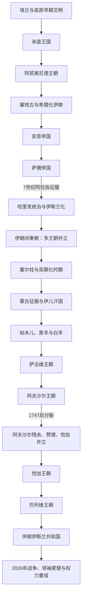

# 伊朗

## 范围

本目录以伊朗高原和伊朗文明为长时段对象，同时追踪现代伊朗国家。古代“波斯”、地理上的“伊朗高原”、跨国的伊朗文化世界和今日伊朗共和国并不等同；王朝疆域也经常超出现代国界。

上级：[西亚](/%E4%BA%BA%E6%96%87%E7%A7%91%E5%AD%A6/%E5%8E%86%E5%8F%B2/%E8%A5%BF%E4%BA%9A/README.md)；全局：[历史](/%E4%BA%BA%E6%96%87%E7%A7%91%E5%AD%A6/%E5%8E%86%E5%8F%B2/README.md)。

## 历史主线

伊朗历史由高原与两河、中亚、南亚、高加索之间的长期互动塑造。埃兰、米底和阿契美尼德奠定早期王权与跨区域帝国经验；希腊化统治后，安息和萨珊重建伊朗帝国。阿拉伯征服终结萨珊国家，却没有消除波斯语、地方贵族和行政传统，新波斯语及波斯—伊斯兰文化在地方王朝、塞尔柱和蒙古政权中扩展。萨法维把十二伊玛目什叶派与伊朗政治空间重新结合，18世纪并立竞争后由恺加恢复统一；20世纪先后经历巴列维国家建设、1979年革命，以及2026年战争与最高领袖更替。

## 全史演进图

18世纪不是简单的“阿夫沙尔结束—赞德开始—恺加开始”。1747年后阿夫沙尔残余、赞德与恺加在不同地区重叠；恺加先后击败赞德和呼罗珊阿夫沙尔残余，才建立新的全国王权。

## 按时间导航

| 顺序 | 阶段 | 时间 | 简要概括 |
|---:|---|---|---|
| 1 | [埃兰与高原早期文明](/%E4%BA%BA%E6%96%87%E7%A7%91%E5%AD%A6/%E5%8E%86%E5%8F%B2/%E8%A5%BF%E4%BA%9A/%E4%BC%8A%E6%9C%97/%E5%9F%83%E5%85%B0%E4%B8%8E%E4%BC%8A%E6%9C%97%E9%AB%98%E5%8E%9F%E6%97%A9%E6%9C%9F%E6%96%87%E6%98%8E.md) | 约前3200—前539年 | 苏萨—安善多中心文明，制度与书写传统被波斯帝国吸收。 |
| 2 | [米底王国](/%E4%BA%BA%E6%96%87%E7%A7%91%E5%AD%A6/%E5%8E%86%E5%8F%B2/%E8%A5%BF%E4%BA%9A/%E4%BC%8A%E6%9C%97/%E7%B1%B3%E5%BA%95%E7%8E%8B%E5%9B%BD.md) | 约前7世纪—前550年 | 与新巴比伦灭亚述，后被居鲁士取代。 |
| 3 | [阿契美尼德王朝](/%E4%BA%BA%E6%96%87%E7%A7%91%E5%AD%A6/%E5%8E%86%E5%8F%B2/%E8%A5%BF%E4%BA%9A/%E4%BC%8A%E6%9C%97/%E9%98%BF%E5%A5%91%E7%BE%8E%E5%B0%BC%E5%BE%B7%E7%8E%8B%E6%9C%9D.md) | 前550—前330年 | 建立跨西亚帝国与行省治理体系。 |
| 4 | [塞琉古与希腊化伊朗](/%E4%BA%BA%E6%96%87%E7%A7%91%E5%AD%A6/%E5%8E%86%E5%8F%B2/%E8%A5%BF%E4%BA%9A/%E4%BC%8A%E6%9C%97/%E5%A1%9E%E7%90%89%E5%8F%A4%E7%BB%9F%E6%B2%BB%E4%B8%8E%E5%B8%8C%E8%85%8A%E5%8C%96%E4%BC%8A%E6%9C%97.md) | 前312—约前140年 | 希腊化王权与伊朗地方社会并存，逐步失去东方。 |
| 5 | [安息帝国](/%E4%BA%BA%E6%96%87%E7%A7%91%E5%AD%A6/%E5%8E%86%E5%8F%B2/%E8%A5%BF%E4%BA%9A/%E4%BC%8A%E6%9C%97/%E5%AE%89%E6%81%AF%E5%B8%9D%E5%9B%BD.md) | 约前247—224年 | 阿尔沙克王朝重建伊朗帝国，与罗马长期对峙。 |
| 6 | [萨珊帝国](/%E4%BA%BA%E6%96%87%E7%A7%91%E5%AD%A6/%E5%8E%86%E5%8F%B2/%E8%A5%BF%E4%BA%9A/%E4%BC%8A%E6%9C%97/%E8%90%A8%E7%8F%8A%E5%B8%9D%E5%9B%BD.md) | 224—651年 | 重塑王权与祆教国家，长期罗马战争后被阿拉伯征服。 |
| 7 | [阿拉伯征服与伊斯兰化](/%E4%BA%BA%E6%96%87%E7%A7%91%E5%AD%A6/%E5%8E%86%E5%8F%B2/%E8%A5%BF%E4%BA%9A/%E4%BC%8A%E6%9C%97/%E9%98%BF%E6%8B%89%E4%BC%AF%E5%BE%81%E6%9C%8D%E4%B8%8E%E4%BC%8A%E6%96%AF%E5%85%B0%E5%8C%96%E6%97%B6%E6%9C%9F.md) | 约633—9世纪 | 征服、税制转型和数世纪伊斯兰化并行。 |
| 8 | [伊朗间奏期](/%E4%BA%BA%E6%96%87%E7%A7%91%E5%AD%A6/%E5%8E%86%E5%8F%B2/%E8%A5%BF%E4%BA%9A/%E4%BC%8A%E6%9C%97/%E4%BC%8A%E6%9C%97%E9%97%B4%E5%A5%8F%E6%9C%9F.md) | 821—1055年 | 地方王朝复兴新波斯语和波斯—伊斯兰宫廷文化。 |
| 9 | [塞尔柱与突厥化时期](/%E4%BA%BA%E6%96%87%E7%A7%91%E5%AD%A6/%E5%8E%86%E5%8F%B2/%E8%A5%BF%E4%BA%9A/%E4%BC%8A%E6%9C%97/%E5%A1%9E%E5%B0%94%E6%9F%B1%E4%B8%8E%E7%AA%81%E5%8E%A5%E5%8C%96%E6%97%B6%E6%9C%9F.md) | 1040—13世纪初 | 突厥军事、波斯官僚与逊尼合法性结合。 |
| 10 | [蒙古与伊儿汗国](/%E4%BA%BA%E6%96%87%E7%A7%91%E5%AD%A6/%E5%8E%86%E5%8F%B2/%E8%A5%BF%E4%BA%9A/%E4%BC%8A%E6%9C%97/%E8%92%99%E5%8F%A4%E4%B8%8E%E4%BC%8A%E5%84%BF%E6%B1%97%E5%9B%BD%E6%97%B6%E6%9C%9F.md) | 1219—约1357年 | 征服破坏后形成蒙古—波斯国家，1335年后分裂。 |
| 11 | [帖木儿与土库曼诸王朝](/%E4%BA%BA%E6%96%87%E7%A7%91%E5%AD%A6/%E5%8E%86%E5%8F%B2/%E8%A5%BF%E4%BA%9A/%E4%BC%8A%E6%9C%97/%E5%B8%96%E6%9C%A8%E5%84%BF%E4%B8%8E%E5%9C%9F%E5%BA%93%E6%9B%BC%E8%AF%B8%E7%8E%8B%E6%9C%9D%E6%97%B6%E6%9C%9F.md) | 1370—1501/1508年 | 帖木儿、黑羊和白羊政权并立转化。 |
| 12 | [萨法维王朝](/%E4%BA%BA%E6%96%87%E7%A7%91%E5%AD%A6/%E5%8E%86%E5%8F%B2/%E8%A5%BF%E4%BA%9A/%E4%BC%8A%E6%9C%97/%E8%90%A8%E6%B3%95%E7%BB%B4%E7%8E%8B%E6%9C%9D.md) | 1501—1736年 | 确立十二伊玛目什叶派国家传统。 |
| 13 | [阿夫沙尔王朝](/%E4%BA%BA%E6%96%87%E7%A7%91%E5%AD%A6/%E5%8E%86%E5%8F%B2/%E8%A5%BF%E4%BA%9A/%E4%BC%8A%E6%9C%97/%E9%98%BF%E5%A4%AB%E6%B2%99%E5%B0%94%E7%8E%8B%E6%9C%9D.md) | 1736—1796年 | 纳迪尔重建军事帝国，1747年后只余呼罗珊核心。 |
| 14 | [赞德王朝](/%E4%BA%BA%E6%96%87%E7%A7%91%E5%AD%A6/%E5%8E%86%E5%8F%B2/%E8%A5%BF%E4%BA%9A/%E4%BC%8A%E6%9C%97/%E8%B5%9E%E5%BE%B7%E7%8E%8B%E6%9C%9D.md) | 1751—1794年 | 设拉子中心的区域秩序，与阿夫沙尔残余、恺加并立。 |
| 15 | [恺加王朝](/%E4%BA%BA%E6%96%87%E7%A7%91%E5%AD%A6/%E5%8E%86%E5%8F%B2/%E8%A5%BF%E4%BA%9A/%E4%BC%8A%E6%9C%97/%E6%81%BA%E5%8A%A0%E7%8E%8B%E6%9C%9D.md) | 1789—1925年 | 重建统一，经历俄英压力、领土丧失与立宪革命。 |
| 16 | [巴列维王朝](/%E4%BA%BA%E6%96%87%E7%A7%91%E5%AD%A6/%E5%8E%86%E5%8F%B2/%E8%A5%BF%E4%BA%9A/%E4%BC%8A%E6%9C%97/%E5%B7%B4%E5%88%97%E7%BB%B4%E7%8E%8B%E6%9C%9D.md) | 1925—1979年 | 中央集权和高速现代化与威权危机并存。 |
| 17 | [伊朗伊斯兰共和国](/%E4%BA%BA%E6%96%87%E7%A7%91%E5%AD%A6/%E5%8E%86%E5%8F%B2/%E8%A5%BF%E4%BA%9A/%E4%BC%8A%E6%9C%97/%E4%BC%8A%E6%9C%97%E4%BC%8A%E6%96%AF%E5%85%B0%E5%85%B1%E5%92%8C%E5%9B%BD.md) | 1979—2026年7月 | 神权与共和机构并置；2026年战争和领袖更替后权力重组。 |

## 重要转折与时间节点

| 时间 | 转折 | 长期意义 |
|---|---|---|
| 前550年 | 居鲁士击败米底 | 阿契美尼德把伊朗高原、两河和安纳托利亚连接为跨区域帝国。 |
| 前330年 | 亚历山大灭阿契美尼德 | 王朝断裂，但行省、城市与地方精英被继业者吸收。 |
| 前2世纪—224年 | 安息扩张与萨珊取代 | 伊朗王权重建，形成与罗马长期对峙的东西方格局。 |
| 628—651年 | 萨珊继承崩溃与阿拉伯征服 | 政治、宗教结构断裂；伊斯兰化与波斯行政文化延续并存。 |
| 9—10世纪 | 地方王朝兴起 | 新波斯语文学和波斯—伊斯兰宫廷文化成熟。 |
| 1040—1194年 | 塞尔柱扩张与分支化 | 突厥军事精英和波斯官僚结合，阿塔贝格与伊克塔制度扩散。 |
| 1219—1335年 | 蒙古征服与伊儿汗国 | 先经历巨大破坏，后在改宗、财政改革与跨欧亚交流中重组。 |
| 1501年 | 伊斯玛仪一世称沙阿 | 十二伊玛目什叶派成为国家传统，与奥斯曼—乌兹别克形成长期边界。 |
| 1722—1796年 | 萨法维崩溃、并立竞争 | 阿富汗占领、纳迪尔帝国和赞德—恺加竞争重塑近世国家。 |
| 1906年 | 立宪革命 | 议会和成文宪法建立，王权受到制度性限制。 |
| 1925年 | 巴列维取代恺加 | 军队、官僚与基础设施推动中央集权国家建设。 |
| 1979年 | 伊斯兰革命 | 君主制终结，法学家监护与共和选举并置。 |
| 2026年2—7月 | 美以—伊朗战争、最高领袖更替与反复停火 | 阿里·哈梅内伊身亡，穆杰塔巴继任；革命卫队战时权力上升，霍尔木兹危机未结束。 |

## 长世系专表

- [安息王世系表](/%E4%BA%BA%E6%96%87%E7%A7%91%E5%AD%A6/%E5%8E%86%E5%8F%B2/%E8%A5%BF%E4%BA%9A/%E4%BC%8A%E6%9C%97/%E5%AE%89%E6%81%AF%E7%8E%8B%E4%B8%96%E7%B3%BB%E8%A1%A8.md)：阿尔沙克诸王、并立者与钱币年代争议。
- [伊朗间奏期主要王朝统治者表](/%E4%BA%BA%E6%96%87%E7%A7%91%E5%AD%A6/%E5%8E%86%E5%8F%B2/%E8%A5%BF%E4%BA%9A/%E4%BC%8A%E6%9C%97/%E4%BC%8A%E6%9C%97%E9%97%B4%E5%A5%8F%E6%9C%9F%E4%B8%BB%E8%A6%81%E7%8E%8B%E6%9C%9D%E7%BB%9F%E6%B2%BB%E8%80%85%E8%A1%A8.md)：塔希尔、萨法尔、齐亚尔与布韦希各支系完整序列；萨曼、加兹尼链接跨区域专表。
- [萨珊君主世系表](/%E4%BA%BA%E6%96%87%E7%A7%91%E5%AD%A6/%E5%8E%86%E5%8F%B2/%E8%A5%BF%E4%BA%9A/%E4%BC%8A%E6%9C%97/%E8%90%A8%E7%8F%8A%E5%90%9B%E4%B8%BB%E4%B8%96%E7%B3%BB%E8%A1%A8.md)：公认君主、复位与628—632年争位者。
- [塞琉古王朝统治者表](/%E4%BA%BA%E6%96%87%E7%A7%91%E5%AD%A6/%E5%8E%86%E5%8F%B2/%E8%A5%BF%E4%BA%9A/%E4%BC%8A%E6%9C%97/%E5%A1%9E%E7%90%89%E5%8F%A4%E7%8E%8B%E6%9C%9D%E7%BB%9F%E6%B2%BB%E8%80%85%E8%A1%A8.md)：前305—前64年全王朝君主、共治者与争位者。
- [塞尔柱伊朗诸支统治者表](/%E4%BA%BA%E6%96%87%E7%A7%91%E5%AD%A6/%E5%8E%86%E5%8F%B2/%E8%A5%BF%E4%BA%9A/%E4%BC%8A%E6%9C%97/%E5%A1%9E%E5%B0%94%E6%9F%B1%E4%BC%8A%E6%9C%97%E8%AF%B8%E6%94%AF%E7%BB%9F%E6%B2%BB%E8%80%85%E8%A1%A8.md)：大塞尔柱、伊拉克—哈马丹和克尔曼三条序列。
- [伊儿汗国统治者表](/%E4%BA%BA%E6%96%87%E7%A7%91%E5%AD%A6/%E5%8E%86%E5%8F%B2/%E8%A5%BF%E4%BA%9A/%E4%BC%8A%E6%9C%97/%E4%BC%8A%E5%84%BF%E6%B1%97%E5%9B%BD%E7%BB%9F%E6%B2%BB%E8%80%85%E8%A1%A8.md)：统一伊儿汗与1335年后各军阀拥立的名义汗。
- [黑羊与白羊王朝统治者表](/%E4%BA%BA%E6%96%87%E7%A7%91%E5%AD%A6/%E5%8E%86%E5%8F%B2/%E8%A5%BF%E4%BA%9A/%E4%BC%8A%E6%9C%97/%E9%BB%91%E7%BE%8A%E4%B8%8E%E7%99%BD%E7%BE%8A%E7%8E%8B%E6%9C%9D%E7%BB%9F%E6%B2%BB%E8%80%85%E8%A1%A8.md)：两大土库曼联盟的完整首领与并立者。
- [帖木儿王朝统治者表](/%E4%BA%BA%E6%96%87%E7%A7%91%E5%AD%A6/%E5%8E%86%E5%8F%B2/%E4%B8%AD%E4%BA%9A/%E6%B2%B3%E4%B8%AD%E5%9C%B0%E5%8C%BA/%E5%B8%96%E6%9C%A8%E5%84%BF%E7%8E%8B%E6%9C%9D%E7%BB%9F%E6%B2%BB%E8%80%85%E8%A1%A8.md)：撒马尔罕、赫拉特和费尔干纳诸支，不在伊朗页重复维护。

## 跨区域阅读

- 两河帝国核心与西部战争：[两河流域文明](/%E4%BA%BA%E6%96%87%E7%A7%91%E5%AD%A6/%E5%8E%86%E5%8F%B2/%E8%A5%BF%E4%BA%9A/%E4%B8%A4%E6%B2%B3%E6%B5%81%E5%9F%9F/README.md)。
- 河中、呼罗珊和帖木儿主线：[中亚历史](/%E4%BA%BA%E6%96%87%E7%A7%91%E5%AD%A6/%E5%8E%86%E5%8F%B2/%E4%B8%AD%E4%BA%9A/README.md)、[河中地区](/%E4%BA%BA%E6%96%87%E7%A7%91%E5%AD%A6/%E5%8E%86%E5%8F%B2/%E4%B8%AD%E4%BA%9A/%E6%B2%B3%E4%B8%AD%E5%9C%B0%E5%8C%BA/README.md)。
- 阿富汗与东部边疆：[阿富汗](/%E4%BA%BA%E6%96%87%E7%A7%91%E5%AD%A6/%E5%8E%86%E5%8F%B2/%E4%B8%AD%E4%BA%9A/%E9%98%BF%E5%AF%8C%E6%B1%97/README.md)。
- 哈里发与早期伊斯兰化：[阿拉伯帝国](/%E4%BA%BA%E6%96%87%E7%A7%91%E5%AD%A6/%E5%8E%86%E5%8F%B2/%E8%A5%BF%E4%BA%9A/_%E9%80%9A%E5%8F%B2/%E9%98%BF%E6%8B%89%E4%BC%AF%E5%B8%9D%E5%9B%BD/README.md)。
- 奥斯曼—萨法维对峙：[奥斯曼帝国](/%E4%BA%BA%E6%96%87%E7%A7%91%E5%AD%A6/%E5%8E%86%E5%8F%B2/%E8%A5%BF%E4%BA%9A/%E5%9C%9F%E8%80%B3%E5%85%B6/%E5%A5%A5%E6%96%AF%E6%9B%BC%E5%B8%9D%E5%9B%BD/README.md)。
- 古典地中海对照：[古希腊](/%E4%BA%BA%E6%96%87%E7%A7%91%E5%AD%A6/%E5%8E%86%E5%8F%B2/%E6%AC%A7%E6%B4%B2/_%E9%80%9A%E5%8F%B2/%E5%8F%A4%E5%B8%8C%E8%85%8A/README.md)、[古罗马](/%E4%BA%BA%E6%96%87%E7%A7%91%E5%AD%A6/%E5%8E%86%E5%8F%B2/%E6%AC%A7%E6%B4%B2/_%E9%80%9A%E5%8F%B2/%E5%8F%A4%E7%BD%97%E9%A9%AC/README.md)。
