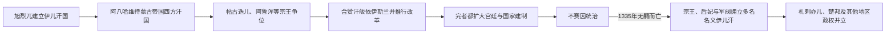

# 伊儿汗国统治者表

## 范围与读法

本表区分1256—1335年的统一伊儿汗国与1335年后的名义伊儿汗。统一期君主由旭烈兀家族掌握帝国核心；不赛因无嗣而死后，札剌亦儿、丘拜尼、伊利卡尼与呼罗珊军阀分别拥立王族或成吉思汗后裔，统治时间和地域大量重叠。“最后一位伊儿汗”取决于是否只计算旭烈兀直系、是否承认傀儡汗，不能用一条单线概括。

## 王权演变与分裂图

1335年以前可按实际在位顺序列出统一汗国君主；此后各候选者往往只受某一军阀或地区承认，表中并列标明，不能伪装成连续全国世系。

## 统一伊儿汗国

| 顺序 | 伊儿汗 | 在位时间 | 继承关系与重要事件 |
|---:|---|---|---|
| 1 | **旭烈兀** | 1256—1265年 | 拖雷之子、蒙哥与忽必烈之弟；灭尼扎里堡垒与巴格达阿拔斯政权，建立伊儿汗国。 |
| 2 | 阿八哈 | 1265—1282年 | 旭烈兀之子；与金帐汗、马穆鲁克长期战争。 |
| 3 | 艾哈迈德·忒古迭儿 | 1282—1284年 | 阿八哈之弟；改宗伊斯兰并试图与马穆鲁克议和，被阿鲁浑推翻。 |
| 4 | 阿鲁浑 | 1284—1291年 | 阿八哈之子；依赖多族官僚整顿财政，继续寻求反马穆鲁克联盟。 |
| 5 | 海合都 | 1291—1295年 | 阿八哈之子、阿鲁浑之叔；纸钞改革失败，在军政反对中被杀。 |
| 6 | 拜都 | 1295年 | 旭烈兀曾孙；推翻海合都，在位数月，被合赞击败。 |
| 7 | **合赞** | 1295—1304年 | 阿鲁浑之子；改宗伊斯兰，改革税制、度量衡、军役和驿站。 |
| 8 | 完者都 | 1304—1316年 | 合赞之弟；建设苏丹尼耶，宗教立场数次变化。 |
| 9 | **不赛因** | 1316—1335年 | 完者都之子；幼年即位，前期由出班掌权；无成年继承人而死。 |
| 10 | 阿儿巴·可汗 | 1335—1336年 | 阿里不哥后裔、非旭烈兀直系；由宰相拥立以应对金帐入侵，处死部分宗室后被阿里·帕迪沙击败处死。 |

## 1335年后并立的名义伊儿汗

| 名义伊儿汗 | 约略称位时间 | 拥立者与血统 | 控制范围与结局 |
|---|---|---|---|
| 穆萨汗 | 1336—1337年 | 阿里·帕迪沙拥立；旭烈兀后裔 | 阿儿巴败亡后称汗，旋在卡拉达拉战败；继续联合脱合帖木儿争位，后被杀。 |
| 穆罕默德汗 | 1336—1338年 | 札剌亦儿哈桑·布祖尔格拥立；旭烈兀旁支 | 控制伊拉克与阿塞拜疆部分地区，败于丘拜尼集团后被处死。 |
| 脱合帖木儿 | 约1337/1338—1353年 | 呼罗珊军阀拥立；成吉思汗弟合撒儿后裔 | 以阿斯塔拉巴德—呼罗珊为基础，多次获札剌亦儿或萨尔巴达尔名义承认；被萨尔巴达尔军杀死。 |
| 撒迪别 | 1338—1339年 | 丘拜尼哈桑·库切克拥立；完者都之女、不赛因之姐 | 第一位有明确伊儿汗王号与铸币的女性，后被迫与苏莱曼成婚并失位。 |
| 札罕帖木儿 | 1339—1340年 | 札剌亦儿哈桑·布祖尔格拥立；旭烈兀旁支 | 用以对抗丘拜尼的撒迪别、苏莱曼；失去支持后被废。 |
| 苏莱曼汗 | 1339—约1343年 | 丘拜尼集团拥立；旭烈兀后裔 | 与撒迪别共同作为王朝合法性中心，实际权力由丘拜尼军阀掌握。 |
| 努失儿完·阿迪勒 | 约1344—1356/1357年 | 丘拜尼马利克·阿什拉夫拥立；身份与旭烈兀血统均有疑问 | 主要见于铸币和名义诏令，是否为真实王族甚至是否为虚构名号存在争议。 |
| “合赞二世” | 约1356年钱币所见 | 身份不明 | 只在少量钱币中出现，无法证明建立稳定政权，列为争议名义汗。 |

阿儿巴之后的诸汗不是统一伊儿汗国的连续十一次继承。札剌亦儿、丘拜尼和呼罗珊势力以汗名铸币、发布命令来取得成吉思汗法统，实际军税则掌握在拥立者手中。

## 权力解体过程

1. 1335年不赛因无嗣而死，统一继承链断裂。
2. 1336年阿儿巴、穆萨与穆罕默德背后的军阀集团交战，帝国核心被分割。
3. 1338—1340年，札剌亦儿与丘拜尼各拥一汗；女性王族撒迪别也被用于维系正统。
4. 1340年代以后，名义汗只覆盖某一军阀控制区；法尔斯穆札法尔、巴格达札剌亦儿和呼罗珊萨尔巴达尔等成为实际政权。
5. 1353年脱合帖木儿被杀、1357年前后丘拜尼残余覆亡，伊儿汗王号逐渐失去实际作用。

## 返回

- [蒙古与伊儿汗国时期](/%E4%BA%BA%E6%96%87%E7%A7%91%E5%AD%A6/%E5%8E%86%E5%8F%B2/%E8%A5%BF%E4%BA%9A/%E4%BC%8A%E6%9C%97/%E8%92%99%E5%8F%A4%E4%B8%8E%E4%BC%8A%E5%84%BF%E6%B1%97%E5%9B%BD%E6%97%B6%E6%9C%9F.md)
- [伊朗](/%E4%BA%BA%E6%96%87%E7%A7%91%E5%AD%A6/%E5%8E%86%E5%8F%B2/%E8%A5%BF%E4%BA%9A/%E4%BC%8A%E6%9C%97/README.md)
