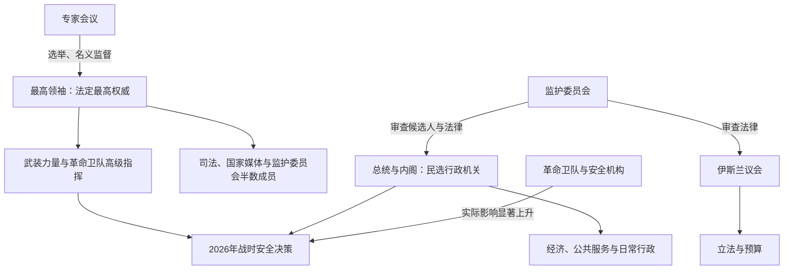

# 伊朗伊斯兰共和国

## 时间

1979年—2026年7月14日

## 概括

1979年革命推翻巴列维王朝，新宪法把民选总统、议会与法学家监护并置：最高领袖是法定最高权威，监护委员会审查法律与候选资格，革命卫队则发展为军事—安全—政治—经济复合力量。共和国先后经历革命整合、伊朗—伊拉克战争、战后重建、改革与保守竞争、核争议、制裁及多轮社会抗议。

2026年2月28日，美国与以色列发动大规模打击，第二任最高领袖阿里·哈梅内伊及多名军政高层身亡。3月8日专家会议选出其子穆杰塔巴·哈梅内伊为第三任最高领袖；截至7月13日，马苏德·佩泽希齐扬仍任总统。法定职位仍然存在，但战争削弱了最高领袖个人仲裁，革命卫队和安全机构在军事、海峡政策及部分谈判决定中取得更强的实际影响。6月停火与谅解安排未能终止冲突，7月美伊重新交火，霍尔木兹航运危机仍在持续。

## 制度与权力关系图

图中“实际影响上升”描述2026年战时权力运行，不表示宪法已经正式取消最高领袖、总统或议会权限。

## 最高领袖

| 顺序 | 最高领袖 | 任期 | 产生方式与主要作用 |
|---:|---|---|---|
| 1 | **鲁霍拉·霍梅尼** | 1979—1989年 | 革命领袖与制度创建者；确立法学家监护、革命机构和战时动员。 |
| 2 | **阿里·哈梅内伊** | 1989—2026年2月28日 | 原总统；经专家会议选出，在1989年修宪后扩大领袖办公室、革命卫队与保守机构影响；在美以打击中身亡。 |
| 3 | **穆杰塔巴·哈梅内伊** | 2026年3月8日至今 | 阿里·哈梅内伊之子；由专家会议在战争中选出。截至2026年7月14日仍为法定最高领袖，公开露面有限，个人权威弱于其父，战时决策更多依赖革命卫队与安全机构。 |

阿里·哈梅内伊死后至新领袖产生前，依据宪法由临时领导安排维持最高领袖职能；这一过渡持续时间短，不另计为一任最高领袖。

## 总统

| 顺序 | 总统或代行机构 | 任期 | 说明 |
|---:|---|---|---|
| 1 | 阿布哈桑·巴尼萨德尔 | 1980—1981年 | 首任总统；与宗教领导层冲突，被议会弹劾并流亡。 |
| — | 第一临时总统委员会 | 1981年6—8月 | 巴尼萨德尔被免至拉贾伊就任之间集体代行总统职权。 |
| 2 | 穆罕默德·阿里·拉贾伊 | 1981年8月2—30日 | 在任不足一月，与总理巴霍纳尔在爆炸中身亡。 |
| — | 第二临时总统委员会 | 1981年8—10月 | 拉贾伊遇刺后集体代行，直至阿里·哈梅内伊就任。 |
| 3 | 阿里·哈梅内伊 | 1981—1989年 | 战时总统；与总理米尔—侯赛因·穆萨维存在政策分工和冲突。 |
| 4 | 阿克巴尔·哈希米·拉夫桑贾尼 | 1989—1997年 | 修宪后首位兼任政府首脑的总统，推动战后重建与务实外交。 |
| 5 | 穆罕默德·哈塔米 | 1997—2005年 | 改革派；推动法治、公民社会和文明对话，受非民选机构制约。 |
| 6 | 马哈茂德·艾哈迈迪内贾德 | 2005—2013年 | 推行民粹经济与强硬核政策；2009年选举引发绿色运动。 |
| 7 | 哈桑·鲁哈尼 | 2013—2021年 | 2015年达成核协议；美国退出协议后经济与外交成果受损。 |
| 8 | 易卜拉欣·莱希 | 2021—2024年5月19日 | 保守派整合；任内发生2022年抗议，2024年直升机坠毁身亡。 |
| — | 穆罕默德·穆赫贝尔（代理） | 2024年5—7月 | 第一副总统依宪法代理，组织提前选举。 |
| 9 | **马苏德·佩泽希齐扬** | 2024年7月28日至今 | 改革派支持的温和派；截至2026年7月14日仍任总统，主持日常行政与对外接触，但战时安全决策受到最高领袖体系和革命卫队强力制约。 |

## 总理与临时政府首脑

| 政府首脑 | 任期 | 权力位置与结局 |
|---|---|---|
| 迈赫迪·巴扎尔甘 | 1979年2—11月 | 革命临时政府总理；与革命委员会、宗教领导层形成双重权力，使馆危机后辞职。 |
| 伊斯兰革命委员会集体主持行政 | 1979年11月—1980年8月 | 巴扎尔甘辞职至首届正式总理产生之间承担临时行政。 |
| 穆罕默德·阿里·拉贾伊 | 1980年8月—1981年8月 | 巴尼萨德尔任总统时的总理；随后当选总统。 |
| 穆罕默德—贾瓦德·巴霍纳尔 | 1981年8月 | 在任不足一月，与总统拉贾伊一同遇刺。 |
| 穆罕默德—礼萨·马赫达维·卡尼（临时） | 1981年9—10月 | 在爆炸后的过渡期主持内阁。 |
| **米尔—侯赛因·穆萨维** | 1981年10月—1989年8月 | 最后一任总理；主持战时配给与国家经济。1989年修宪取消总理职位。 |

## 制度结构

- **最高领袖**：任命武装力量和革命卫队高级指挥、司法首长、国家媒体负责人及监护委员会半数成员，并确定总体安全外交方向。
- **总统与内阁**：经选举产生，管理经济和日常行政；候选人需监护委员会审查，安全与外交核心政策受领袖体系制约。
- **伊斯兰议会**：立法、审议预算和质询内阁；法律须经监护委员会确认符合宪法与伊斯兰原则。
- **专家会议**：选举并名义监督最高领袖；其候选人同样受监护委员会审查。2026年在战争中完成第三任领袖选举。
- **确定国家利益委员会**：调解议会与监护委员会争议，并向最高领袖提供政策咨询。
- **革命卫队与巴斯基**：负责导弹、海外行动、国内安全和动员，也控制或影响大量经济项目；正规军与其并存。
- **2026年实际权力**：穆杰塔巴是法定最高领袖，佩泽希齐扬是法定政府首脑；革命卫队指挥层、安全机构及最高国家安全体系在战争、霍尔木兹海峡和与美国接触问题上具有主导性影响。外界报道的权力竞争不等于已经出现获宪法确认的新政体。

## 分阶段发展

### 革命建制与战争动员（1979—1989）

革命联盟迅速分裂，宗教领导层借宪法、公投、革命法院、革命卫队和人质危机排除自由派、左翼与其他竞争者。伊拉克1980年入侵使国家转入总体战，战时配给、巴斯基动员和“保卫革命”叙事巩固新制度；同时政治镇压和1988年大规模处决留下长期人权争议。

### 重建、改革与保守反制（1989—2005）

1989年修宪取消总理职位，强化总统行政能力，但阿里·哈梅内伊通过领袖办公室、司法、国家媒体与监护委员会扩大非民选机构影响。拉夫桑贾尼推动重建和经济开放；哈塔米时期社会与媒体空间一度扩大，改革立法却常被监护委员会和司法体系阻止。

### 核争议、制裁与社会抗议（2005—2024）

核项目扩张、联合国及美国制裁和石油经济依赖加剧通胀与就业压力。2015年核协议短暂缓和危机，2018年美国退出后制裁恢复。2009年绿色运动、2017—2018年经济抗议、2019年油价抗议及2022年“女性、生命、自由”运动显示，选举合法性、经济治理、女性权利和国家强制是相互交织的矛盾。

### 继承战争与战时权力重组（2024—2026）

莱希意外死亡后，提前选举使佩泽希齐扬上台，但其改革空间受保守机构控制。2026年战争同时造成最高领袖继承、军方高层损失、基础设施破坏、航运中断和地区报复。制度没有立即崩溃，却由“强势领袖最终裁决”转向更集体、更军事化且内部竞争明显的战时决策。

## 重要事件

1. **1979年革命与建国**：2月王朝政权崩溃，4月公投建立伊斯兰共和国，12月宪法生效。
2. **1979—1981年美国使馆人质危机**：强化反美路线，促使巴扎尔甘政府辞职，并改变美伊关系。
3. **1980—1988年伊朗—伊拉克战争**：伊拉克入侵后形成八年消耗战，巨大伤亡和战争经济巩固革命机构。
4. **1988—1989年制度转折**：停火前后大批政治犯被处决；霍梅尼去世后阿里·哈梅内伊继任，修宪取消总理。
5. **1997—2005年改革运动**：哈塔米胜选推动报刊、社团和地方选举，1999年学生抗议后遭持续压制。
6. **2002—2018年核危机与核协议**：核设施曝光后争议升级；2015年签署核协议，2018年美国退出并恢复制裁。
7. **2009年绿色运动**：总统选举结果引发大规模抗议，国家以逮捕、审判和武力恢复控制。
8. **2017—2022年连续社会抗议**：经济、油价、地方不平等和女性着装强制先后成为动员焦点；2022年玛莎·阿米尼死亡引发全国性运动。
9. **2020年苏莱曼尼被杀**：美国空袭杀死革命卫队圣城旅指挥官，地区代理人网络与美伊对抗进一步升级。
10. **2024年总统继任**：莱希死于直升机坠毁，穆赫贝尔代理，佩泽希齐扬在提前选举后就任。
11. **2026年2月28日战争升级**：美国与以色列打击伊朗，阿里·哈梅内伊及多名军政高层死亡；伊朗以导弹、无人机和海峡行动报复，冲突外溢至邻国和航运。
12. **2026年3月8日最高领袖更替**：专家会议选出穆杰塔巴·哈梅内伊；继承维持法统，却因父子相承、公开活动有限和军方权力上升而引发争议。
13. **2026年春季战时军事化**：革命卫队与安全机构在作战和谈判中取得更大主导权，文官政府仍处理经济、救援和外交接触。
14. **2026年6月停火与谅解安排**：6月中旬宣布停火和重开霍尔木兹海峡，6月17日美伊谅解备忘录进一步规定落实框架；双方对执行、海峡安全和核问题仍有分歧。
15. **2026年6月25日后再度失稳**：伊朗无人机击中试图通过霍尔木兹海峡的新加坡籍货船，显示停火并未消除海上风险。
16. **2026年7月重新交火**：伊朗袭击商船及地区目标后，美国再次打击伊朗；截至7月13日，航行自由、停火执行和国内权力协调均未解决。

## 延续条件与危机来源

共和国的延续依靠革命合法性、宗教与慈善网络、战争记忆、石油收入、安全机构和受控但真实存在的选举竞争。总统轮替为不同社会诉求提供有限渠道，宪法也能在领袖与总统突然死亡时启动继任程序。

危机则来自权力中心重叠、候选审查、经济制裁与管理失误、青年和女性的社会期待、族群与边缘地区差异，以及革命卫队和民选政府之间的权责不对称。2026年更替证明制度仍有继任能力，也暴露三个新问题：最高领袖职位的家族化观感、领袖个人权威下降、军方战时权力是否会常态化。6月协议后的反复交火说明，对外战争与国内权力重组仍处于未完成状态。

## 演变关系

- 前一王朝：[巴列维王朝](/%E4%BA%BA%E6%96%87%E7%A7%91%E5%AD%A6/%E5%8E%86%E5%8F%B2/%E8%A5%BF%E4%BA%9A/%E4%BC%8A%E6%9C%97/%E5%B7%B4%E5%88%97%E7%BB%B4%E7%8E%8B%E6%9C%9D.md)。
- 长时段什叶国家背景：[萨法维王朝](/%E4%BA%BA%E6%96%87%E7%A7%91%E5%AD%A6/%E5%8E%86%E5%8F%B2/%E8%A5%BF%E4%BA%9A/%E4%BC%8A%E6%9C%97/%E8%90%A8%E6%B3%95%E7%BB%B4%E7%8E%8B%E6%9C%9D.md)，但共和国并非萨法维制度的直接延续。
- 上级：[伊朗](/%E4%BA%BA%E6%96%87%E7%A7%91%E5%AD%A6/%E5%8E%86%E5%8F%B2/%E8%A5%BF%E4%BA%9A/%E4%BC%8A%E6%9C%97/README.md)；区域：[西亚](/%E4%BA%BA%E6%96%87%E7%A7%91%E5%AD%A6/%E5%8E%86%E5%8F%B2/%E8%A5%BF%E4%BA%9A/README.md)。
