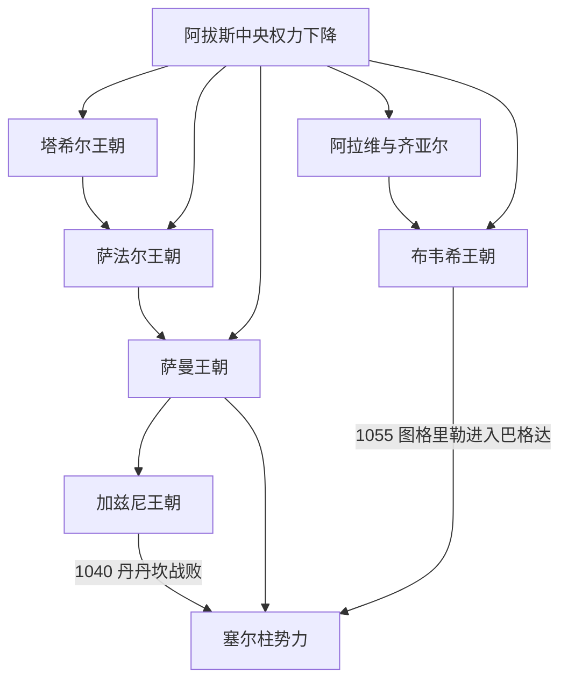

# 伊朗间奏期

## 时间

约821年—1055年

## 概括

“伊朗间奏期”指阿拔斯中央权力下降后，伊朗和河中出现由伊朗语或高度波斯化精英统治的地方王朝。塔希尔、萨法尔、萨曼、齐亚尔、布韦希等并非统一国家的顺序王朝，而在不同地区重叠竞争。它们通常承认哈里发名义，实际掌握税收和军队；新波斯语文学、波斯官僚传统和伊斯兰王权文化在此时期成熟。

## 主要政权与统治结构

| 政权 | 时间 | 核心地区 | 重要统治者与作用 |
|---|---|---|---|
| 塔希尔王朝 | 821—873年 | 呼罗珊，首府内沙布尔 | 塔希尔·本·侯赛因获阿拔斯任命；阿卜杜拉·本·塔希尔建立稳定行省统治。 |
| 萨法尔王朝 | 861年起；锡斯坦支系延续更久 | 锡斯坦、呼罗珊和伊朗东部 | **雅各布·本·莱斯**从铜匠 / 军事首领崛起，征服赫拉特、法尔斯；其弟阿姆鲁败于萨曼。 |
| 萨曼王朝 | 819—999年 | 河中与呼罗珊，布哈拉为文化中心 | 伊斯玛仪·萨曼尼统一王朝；纳斯尔二世时期文化繁荣，新波斯语宫廷文学发展。 |
| 阿拉维与齐亚尔王朝 | 864年起、约930—1090年 | 里海南岸、戈尔甘 | 山地什叶政权和地方军人并存；马尔达维季一度扩张，后被突厥卫队杀害。 |
| 布韦希王朝 | 934—1062年 | 法尔斯、吉巴勒、伊拉克 | 阿里、哈桑、艾哈迈德三兄弟扩张；945年进入巴格达，以埃米尔身份控制阿拔斯哈里发。 |
| 加兹尼王朝 | 977年起 | 阿富汗东部、呼罗珊及北印度 | 塞布克特勤、马哈茂德为突厥出身，采用波斯官僚和文学文化，显示“伊朗复兴”不等于统治者血缘单一。 |

这些政权以埃米尔、总督或“王中之王”等称号统治，依靠土地税、城市官僚、地方军和突厥奴隶兵。哈里发册封提供合法性，各王朝则在钱币和祷文中保留哈里发名号。

## 完整世系分工

塔希尔、萨法尔、齐亚尔及布韦希各地区支系的完整序列见[伊朗间奏期主要王朝统治者表](/%E4%BA%BA%E6%96%87%E7%A7%91%E5%AD%A6/%E5%8E%86%E5%8F%B2/%E8%A5%BF%E4%BA%9A/%E4%BC%8A%E6%9C%97/%E4%BC%8A%E6%9C%97%E9%97%B4%E5%A5%8F%E6%9C%9F%E4%B8%BB%E8%A6%81%E7%8E%8B%E6%9C%9D%E7%BB%9F%E6%B2%BB%E8%80%85%E8%A1%A8.md)。萨曼王朝的完整埃米尔序列由河中地区主笔记维护，加兹尼王朝的完整君主序列由阿富汗跨区域统治者表维护；本页只解释这些政权在伊朗高原上的重叠过程，不把多国君主合并成一条“伊朗王统”。

## 具体过程

阿拔斯把呼罗珊交给有军事功劳的塔希尔家族，开启世袭总督。锡斯坦的雅各布·萨法尔凭地方武装迅速扩张，却在876年攻巴格达方向受阻。萨曼王朝战胜萨法尔后，控制河中和呼罗珊贸易城市，扶持鲁达基等新波斯语作者。10世纪，里海军人和代拉木步兵南下，布韦希控制伊朗西部并进入巴格达。与此同时，突厥军人越来越多地进入王朝军队和宫廷，最终形成加兹尼、塞尔柱等新政权。

## 重要事件

- 821年塔希尔获呼罗珊总督，地方军税开始世袭化。
- 861年雅各布·萨法尔在锡斯坦掌权，随后灭塔希尔、占领呼罗珊。
- 876年萨法尔军在代尔奥阿库勒败于阿拔斯，未能控制巴格达。
- 900年萨曼王伊斯玛仪击败阿姆鲁·萨法尔，取得呼罗珊。
- 10世纪布哈拉、撒马尔罕和内沙布尔成为波斯语、阿拉伯语学术和商贸中心。
- 930年代马尔达维季试图在伊朗西部建立王权，死亡后其代拉木将领集团分化。
- 945年布韦希进入巴格达，哈里发保留宗教名义，实权由什叶派背景的埃米尔掌握。
- 977年后加兹尼王朝在萨曼军事体系基础上崛起，向呼罗珊和印度扩张。
- 999年喀喇汗夺取布哈拉，萨曼灭亡；呼罗珊逐渐落入加兹尼与塞尔柱竞争。
- 1055年塞尔柱图格里勒进入巴格达，终结布韦希对哈里发的控制。

## “复兴”的含义与局限

复兴主要指新波斯语文学、伊朗行政传统和地方宫廷重新成为政治中心，不是回到祆教萨珊国家。统治者包括波斯、代拉木、突厥和阿拉伯背景，各政权都处于伊斯兰制度和哈里发合法性网络中。王朝兴盛依靠跨亚欧商路、灌溉农业、城市税收和军事创业；衰亡多因继承分裂、奴隶军坐大、草原新力量和竞争王朝夹击。

## 演变关系

- 前一阶段：[阿拉伯征服与伊斯兰化时期](/%E4%BA%BA%E6%96%87%E7%A7%91%E5%AD%A6/%E5%8E%86%E5%8F%B2/%E8%A5%BF%E4%BA%9A/%E4%BC%8A%E6%9C%97/%E9%98%BF%E6%8B%89%E4%BC%AF%E5%BE%81%E6%9C%8D%E4%B8%8E%E4%BC%8A%E6%96%AF%E5%85%B0%E5%8C%96%E6%97%B6%E6%9C%9F.md)。
- 哈里发背景：[阿拔斯王朝](/%E4%BA%BA%E6%96%87%E7%A7%91%E5%AD%A6/%E5%8E%86%E5%8F%B2/%E8%A5%BF%E4%BA%9A/_%E9%80%9A%E5%8F%B2/%E9%98%BF%E6%8B%89%E4%BC%AF%E5%B8%9D%E5%9B%BD/%E9%98%BF%E6%8B%94%E6%96%AF%E7%8E%8B%E6%9C%9D.md)。
- 后续：[塞尔柱与突厥化时期](/%E4%BA%BA%E6%96%87%E7%A7%91%E5%AD%A6/%E5%8E%86%E5%8F%B2/%E8%A5%BF%E4%BA%9A/%E4%BC%8A%E6%9C%97/%E5%A1%9E%E5%B0%94%E6%9F%B1%E4%B8%8E%E7%AA%81%E5%8E%A5%E5%8C%96%E6%97%B6%E6%9C%9F.md)。
- 上级：[伊朗](/%E4%BA%BA%E6%96%87%E7%A7%91%E5%AD%A6/%E5%8E%86%E5%8F%B2/%E8%A5%BF%E4%BA%9A/%E4%BC%8A%E6%9C%97/README.md)。
