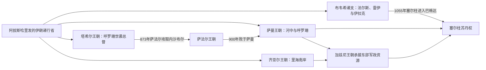

# 伊朗间奏期主要王朝统治者表

## 范围与读法

“伊朗间奏期”由多个重叠政权构成，不存在一条全国王位序列。本表补齐塔希尔、萨法尔、齐亚尔和布韦希的主要统治序列；萨曼与加兹尼已有跨区域专表，直接链接而不重复维护。阿拉维诸伊玛目来自不同阿里后裔支系并多次流亡、复辟，属于里海宗教—地区政治网络，不强行整理成单一王朝。

## 地方王朝并立与承接图

这些政权在地域、法统和年代上大量重叠，不存在“塔希尔—萨法尔—萨曼—布韦希”的全国单线。专表分别维护各王朝主线，已有跨区域完整世系则通过链接引用。

## 塔希尔王朝：呼罗珊总督主线

| 顺序 | 统治者 | 任期 | 继承关系与重要事件 |
|---:|---|---|---|
| 1 | **塔希尔·本·侯赛因** | 821—822年 | 因支持马蒙赢得内战获任呼罗珊总督；停止在礼拜中提哈里发名号后不久死亡，是否被毒杀有争议。 |
| 2 | 塔勒哈·本·塔希尔 | 822—828年 | 前任之子；在阿拔斯承认下继任，与锡斯坦哈瓦利吉势力作战。 |
| 3 | **阿卜杜拉·本·塔希尔** | 828—845年 | 前任之弟；以内沙布尔为中心整顿税收、灌溉和治安，王朝鼎盛。 |
| 4 | 塔希尔二世 | 845—862年 | 阿卜杜拉之子；延续世袭总督统治，军政控制逐渐依赖地方家族。 |
| 5 | 穆罕默德·本·塔希尔 | 862—873年 | 塔希尔二世之子；面对萨法尔扩张，873年内沙布尔失守；后在巴格达继续担任职务，但呼罗珊王权终结。 |

塔希尔家族在巴格达另长期担任治安长官，不能把伊拉克家族职位与呼罗珊总督任期混成同一世系。

## 萨法尔王朝：莱斯支系与哈拉夫支系

| 顺序 | 统治者 | 任期 | 继承关系与权力范围 |
|---:|---|---|---|
| 1 | **雅各布·本·莱斯** | 861—879年 | 从锡斯坦阿亚尔武装首领崛起；灭塔希尔并扩张至法尔斯、呼罗珊，进攻巴格达方向受阻。 |
| 2 | 阿姆鲁·本·莱斯 | 879—901年 | 雅各布之弟；获哈里发部分册封；900年败于萨曼伊斯玛仪，次年被俘，902年在巴格达被杀。 |
| 3 | 塔希尔·本·穆罕默德 | 901—909年 | 阿姆鲁之孙；与弟雅各布共同执政，失去呼罗珊后维持锡斯坦、法尔斯等残余。 |
| — | 雅各布·本·穆罕默德 | 901—908年共治 | 塔希尔之弟；作为共同埃米尔参与统治，后被宗室挑战取代。 |
| 4 | 莱斯·本·阿里 | 909—910年 | 雅各布、阿姆鲁之侄辈；夺取扎兰季，西征法尔斯失败后被俘。 |
| 5 | 穆罕默德·本·阿里 | 910—911年 | 莱斯之弟；在扎兰季即位，随后被兄弟穆阿达勒取代。 |
| 6 | 穆阿达勒·本·阿里 | 911年 | 穆罕默德之弟；萨曼军围攻后投降，锡斯坦转入萨曼直接控制。 |
| 7 | 阿姆鲁·本·雅各布 | 912—913年 | 阿姆鲁·本·莱斯曾孙辈、幼主；由反萨曼的阿亚尔集团拥立，起义失败后被俘。 |
| — | 萨曼直接统治与地方阿亚尔竞争 | 913—923年 | 非萨法尔君主；锡斯坦缺少稳定萨法尔王权。 |
| 8 | **阿布·贾法尔·艾哈迈德·本·穆罕默德** | 923—963年 | 萨法尔远支，并与阿姆鲁家族联姻；在扎兰季恢复王朝，主要控制锡斯坦和布斯特，文化赞助活跃。 |
| 9 | **哈拉夫·本·艾哈迈德** | 963—1003年 | 前任之子；末代；早期与共治者合作，后在加兹尼压力和内部战争中失去锡斯坦。 |
| — | 阿布·侯赛因·塔希尔·本·穆罕默德 | 963—约970年共治 | 哈拉夫扶立的王族成员；哈拉夫朝觐期间主持政务，后双方冲突；不另算稳定独立一朝。 |

萨法尔在901年以后不再是覆盖伊朗东部的大帝国，923—1003年的哈拉夫支系主要是锡斯坦区域政权。

## 齐亚尔王朝

| 顺序 | 统治者 | 任期 | 继承关系与重要事件 |
|---:|---|---|---|
| 1 | **马尔达维季·本·齐亚尔** | 927/930—935年 | 奠基者；从里海代拉木军人网络崛起，一度控制雷伊、伊斯法罕，后被突厥近卫杀害。 |
| 2 | 伍什米吉尔 | 935—967年 | 前任之弟；在萨曼、布韦希和地方阿拉维势力之间维持塔巴里斯坦、戈尔甘残余。 |
| 3 | 比苏通 | 967—977/978年 | 伍什米吉尔之子；击败弟弟卡布斯继位，获哈里发册封。 |
| 4 | **卡布斯·本·伍什米吉尔** | 977/978—981年；997/998—1012/1013年复位 | 比苏通之弟；被布韦希驱逐后长期流亡，复位后成为文学赞助者，晚年被军人废杀。 |
| 5 | 马努切赫尔 | 1012/1013—1029/1030年 | 卡布斯之子；依附加兹尼马哈茂德，以贡赋和联姻维持地区统治。 |
| 6 | 阿努希尔万 | 1029/1030—约1049/1050年 | 马努切赫尔之子；幼年即位，舅父及加兹尼、塞尔柱势力先后干预；独立性显著下降。 |
| 7 | 凯卡乌斯 | 约1049/1050—1087年 | 阿努希尔万之堂亲；塞尔柱宗主权下的地方统治者，《卡布斯书》作者；确切即位年有争议。 |
| 8 | 吉兰沙 | 约1087—1090年 | 凯卡乌斯之子；只见于后世记载，约1090年后齐亚尔王权消失。 |

卡布斯981—997/998年流亡期间，齐亚尔核心受布韦希和萨曼相关力量控制，不另虚构一位齐亚尔君主填补空档。

## 布韦希王朝：法尔斯主线

| 顺序 | 埃米尔 | 任期 | 继承关系与重要事件 |
|---:|---|---|---|
| 1 | 伊马德·道莱·阿里 | 934—949年 | 布韦之子、三兄弟长兄；占领法尔斯，以设拉子为中心建立支系。 |
| 2 | **阿杜德·道莱** | 949—983年 | 鲁肯·道莱之子、前任侄；先继承法尔斯，后兼并伊拉克并取得家族最高地位。 |
| 3 | 沙拉夫·道莱 | 983—989年 | 阿杜德之子；与兄弟争位，后兼管伊拉克。 |
| 4 | 萨姆萨姆·道莱 | 989—998年（法尔斯） | 沙拉夫之弟；先失伊拉克后据法尔斯、克尔曼，与巴哈·道莱竞争。 |
| 5 | 巴哈·道莱 | 998—1012年 | 阿杜德之子；击败萨姆萨姆，重新连接法尔斯与伊拉克。 |
| 6 | 苏丹·道莱 | 1012—1024年 | 巴哈之子；先为家族长，1021年失去伊拉克后继续据法尔斯。 |
| 7 | 阿布·卡利贾尔 | 1024—1048年 | 苏丹·道莱之子；兼并伊拉克晚期支系，试图恢复统一。 |
| 8 | 阿布·曼苏尔·富拉德·苏通 | 1048—1051年；1054—1062年复位 | 阿布·卡利贾尔之子；与兄弟争法尔斯；最终被舍班卡拉势力杀害，法尔斯支终结。 |
| — | 阿布·萨德·霍斯劳沙 | 1051—1054年 | 阿布·卡利贾尔之子、前任之弟；与富拉德并立并一度夺取设拉子，死后兄长复位。 |

## 布韦希王朝：雷伊—吉巴勒主线

| 顺序 | 埃米尔 | 任期 | 继承关系与重要事件 |
|---:|---|---|---|
| 1 | 鲁肯·道莱·哈桑 | 935—976年 | 布韦之子、伊马德之弟；以雷伊为中心控制吉巴勒，是后期多数强势君主之父。 |
| 2 | 法赫尔·道莱 | 976—980年；984—997年复位 | 鲁肯之子；初次败于兄弟联盟，后在萨曼帮助下复位并控制雷伊、哈马丹。 |
| 3 | 穆阿伊德·道莱 | 980—983年 | 法赫尔之弟；获阿杜德支持占据雷伊；死后法赫尔复位。 |
| 4 | 马吉德·道莱 | 997—1029年 | 法赫尔之子；幼年即位，由母后赛义德·哈通摄政；1029年加兹尼马哈茂德夺取雷伊。 |

哈马丹另有穆阿伊德·道莱（976—983）、沙姆斯·道莱（997—1021）和萨玛·道莱（1021—1024）等地区支系；它们与雷伊主线重叠，不能插入同一单线。

## 布韦希王朝：伊拉克主线

| 顺序 | 埃米尔 | 任期 | 继承关系与重要事件 |
|---:|---|---|---|
| 1 | 穆伊兹·道莱·艾哈迈德 | 945—967年 | 布韦幼子；进入巴格达，控制阿拔斯哈里发，建立伊拉克支系。 |
| 2 | 伊兹·道莱·巴赫蒂亚尔 | 967—978年 | 前任之子；与堂兄阿杜德争权，败亡。 |
| 3 | **阿杜德·道莱** | 978—983年 | 伊兹堂兄、法尔斯统治者；兼并伊拉克，家族统一达到高峰。 |
| 4 | 萨姆萨姆·道莱 | 983—987年 | 阿杜德之子；与兄沙拉夫并立，失去巴格达后转据法尔斯。 |
| 5 | 沙拉夫·道莱 | 987—989年 | 萨姆萨姆之兄；夺取巴格达，在位短暂。 |
| 6 | 巴哈·道莱 | 989—1012年 | 沙拉夫之弟；兼有伊拉克、后并法尔斯，军队派系影响扩大。 |
| 7 | 苏丹·道莱 | 1012—1021年 | 前任之子；被伊拉克军队废黜，退守法尔斯。 |
| 8 | 穆沙里夫·道莱 | 1021—1025年 | 苏丹之弟；由巴格达军人拥立。 |
| 9 | 贾拉勒·道莱 | 1025—1044年 | 穆沙里夫之兄弟；长期受突厥、代拉木军队和地方势力制约。 |
| 10 | 阿布·卡利贾尔 | 1044—1048年 | 苏丹·道莱之子；从法尔斯进入伊拉克，短暂恢复两地联结。 |
| 11 | 马利克·拉希姆 | 1048—1055年 | 阿布·卡利贾尔之子；末代伊拉克布韦希；1055年图格里勒进入巴格达后被捕。 |

布韦希三大支系从未由一位君主持续直接统治。阿杜德、巴哈和阿布·卡利贾尔只在各自阶段短暂兼并多地，因此必须分表维护。

## 已有跨区域完整世系

- 萨曼王朝完整埃米尔序列：[河中绿洲、粟特与萨曼王朝](/%E4%BA%BA%E6%96%87%E7%A7%91%E5%AD%A6/%E5%8E%86%E5%8F%B2/%E4%B8%AD%E4%BA%9A/%E6%B2%B3%E4%B8%AD%E5%9C%B0%E5%8C%BA/%E6%B2%B3%E4%B8%AD%E7%BB%BF%E6%B4%B2%E3%80%81%E7%B2%9F%E7%89%B9%E4%B8%8E%E8%90%A8%E6%9B%BC%E7%8E%8B%E6%9C%9D.md)。
- 加兹尼王朝完整君主序列：[古代、中世纪与近世早期统治者表](/%E4%BA%BA%E6%96%87%E7%A7%91%E5%AD%A6/%E5%8E%86%E5%8F%B2/%E4%B8%AD%E4%BA%9A/%E9%98%BF%E5%AF%8C%E6%B1%97/%E5%8F%A4%E4%BB%A3%E3%80%81%E4%B8%AD%E4%B8%96%E7%BA%AA%E4%B8%8E%E8%BF%91%E4%B8%96%E6%97%A9%E6%9C%9F%E7%BB%9F%E6%B2%BB%E8%80%85%E8%A1%A8.md)。

## 返回

- [伊朗间奏期](/%E4%BA%BA%E6%96%87%E7%A7%91%E5%AD%A6/%E5%8E%86%E5%8F%B2/%E8%A5%BF%E4%BA%9A/%E4%BC%8A%E6%9C%97/%E4%BC%8A%E6%9C%97%E9%97%B4%E5%A5%8F%E6%9C%9F.md)
- [伊朗](/%E4%BA%BA%E6%96%87%E7%A7%91%E5%AD%A6/%E5%8E%86%E5%8F%B2/%E8%A5%BF%E4%BA%9A/%E4%BC%8A%E6%9C%97/README.md)
