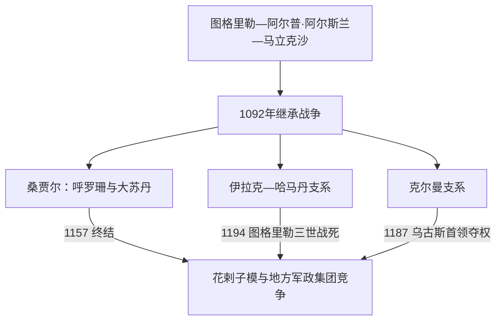

# 塞尔柱与突厥化时期

## 时间

约1040年—13世纪初

## 概括

乌古斯突厥塞尔柱家族从呼罗珊崛起，1040年丹丹坎战役击败加兹尼，1055年进入巴格达并获阿拔斯哈里发授予苏丹称号。塞尔柱把突厥军事集团、波斯语官僚和逊尼宗教机构结合，控制伊朗、两河及安纳托利亚部分地区。马立克沙一世去世后王族分封和继承战争使帝国分裂，但波斯化行政、伊克塔军政和突厥移民持续改变伊朗与西亚。

## 建立与统治结构

塞尔柱家族率乌古斯部众进入河中、呼罗珊，依靠游牧骑兵取得军事优势。建国后不能只靠部族分配，因而任用波斯书吏和维齐尔，最著名者是尼扎姆·穆尔克。苏丹掌军政，哈里发保留宗教合法性；王子、兄弟和阿塔贝格分领地区，伊克塔把税收收益分配给军人和官员。尼扎米亚学校等机构支持逊尼法学和官僚培养，也服务于对法蒂玛和地方什叶力量的竞争。

## 王朝世系与支系分化

大塞尔柱、伊拉克—哈马丹塞尔柱与克尔曼塞尔柱在12世纪长期并立，不能以“桑贾尔之后诸王”合并。三条公认统治序列、短期僭位者和复位情况见[塞尔柱伊朗诸支统治者表](/%E4%BA%BA%E6%96%87%E7%A7%91%E5%AD%A6/%E5%8E%86%E5%8F%B2/%E8%A5%BF%E4%BA%9A/%E4%BC%8A%E6%9C%97/%E5%A1%9E%E5%B0%94%E6%9F%B1%E4%BC%8A%E6%9C%97%E8%AF%B8%E6%94%AF%E7%BB%9F%E6%B2%BB%E8%80%85%E8%A1%A8.md)；安纳托利亚支系另见[安纳托利亚突厥化与罗姆苏丹国](/%E4%BA%BA%E6%96%87%E7%A7%91%E5%AD%A6/%E5%8E%86%E5%8F%B2/%E8%A5%BF%E4%BA%9A/%E5%9C%9F%E8%80%B3%E5%85%B6/%E5%AE%89%E7%BA%B3%E6%89%98%E5%88%A9%E4%BA%9A%E7%AA%81%E5%8E%A5%E5%8C%96%E4%B8%8E%E7%BD%97%E5%A7%86%E8%8B%8F%E4%B8%B9%E5%9B%BD.md)。

## 重要事件

- 1040年丹丹坎战役击败加兹尼王马苏德，塞尔柱取得呼罗珊。
- 1055年图格里勒进入巴格达，终结布韦希控制，阿拔斯哈里发承认其苏丹地位。
- 1071年曼齐刻尔特战役俘虏拜占庭皇帝；拜占庭内战使突厥部众加速进入安纳托利亚。
- 1072—1092年马立克沙与尼扎姆·穆尔克时期道路、驿传、学校和税制扩展。
- 1092年尼扎姆·穆尔克被刺、马立克沙去世，王后、王子和将领争位。
- 第一次十字军东征到来时塞尔柱世界已经分裂，叙利亚和安纳托利亚领主难以协同。
- 1141年卡特万战役，桑贾尔败于西辽，河中影响下降。
- 1153年乌古斯叛乱俘虏桑贾尔，呼罗珊遭破坏；1157年其死后大塞尔柱终结。
- 1194年花剌子模沙击败伊拉克塞尔柱末代图格里勒三世，伊朗西部支系终结。
- 13世纪初花剌子模扩张与蒙古西征相继到来，进入[蒙古与伊儿汗国时期](/%E4%BA%BA%E6%96%87%E7%A7%91%E5%AD%A6/%E5%8E%86%E5%8F%B2/%E8%A5%BF%E4%BA%9A/%E4%BC%8A%E6%9C%97/%E8%92%99%E5%8F%A4%E4%B8%8E%E4%BC%8A%E5%84%BF%E6%B1%97%E5%9B%BD%E6%97%B6%E6%9C%9F.md)。

## 突厥化与波斯化

突厥军人和牧民进入伊朗并未消除波斯文化。相反，塞尔柱宫廷以波斯语文书和文学治理，形成“突厥军事—波斯行政—伊斯兰合法性”的组合。伊朗本土并未像安纳托利亚那样普遍转为突厥语，但阿塞拜疆等西北地区语言结构显著变化。后世多个突厥出身王朝继续采用波斯宫廷文化。

## 兴盛与分裂原因

塞尔柱成功利用加兹尼衰弱、游牧骑兵和哈里发对抗布韦希的需求，并借波斯官僚把征服转为税收国家。分裂来自王族共同拥有统治权的观念、王子分封、部族忠诚和阿塔贝格坐大。东西距离、十字军、伊斯玛仪派和草原新势力增加压力。其政治统一消失后，制度文化仍由花剌子模、罗姆苏丹国和后续王朝继承。

## 演变关系

- 前一阶段：[伊朗间奏期](/%E4%BA%BA%E6%96%87%E7%A7%91%E5%AD%A6/%E5%8E%86%E5%8F%B2/%E8%A5%BF%E4%BA%9A/%E4%BC%8A%E6%9C%97/%E4%BC%8A%E6%9C%97%E9%97%B4%E5%A5%8F%E6%9C%9F.md)。
- 后续：[蒙古与伊儿汗国时期](/%E4%BA%BA%E6%96%87%E7%A7%91%E5%AD%A6/%E5%8E%86%E5%8F%B2/%E8%A5%BF%E4%BA%9A/%E4%BC%8A%E6%9C%97/%E8%92%99%E5%8F%A4%E4%B8%8E%E4%BC%8A%E5%84%BF%E6%B1%97%E5%9B%BD%E6%97%B6%E6%9C%9F.md)。
- 哈里发背景：[阿拉伯帝国](/%E4%BA%BA%E6%96%87%E7%A7%91%E5%AD%A6/%E5%8E%86%E5%8F%B2/%E8%A5%BF%E4%BA%9A/_%E9%80%9A%E5%8F%B2/%E9%98%BF%E6%8B%89%E4%BC%AF%E5%B8%9D%E5%9B%BD/README.md)。
- 上级：[伊朗](/%E4%BA%BA%E6%96%87%E7%A7%91%E5%AD%A6/%E5%8E%86%E5%8F%B2/%E8%A5%BF%E4%BA%9A/%E4%BC%8A%E6%9C%97/README.md)。
- 梅尔夫与土库曼斯坦空间：[古代绿洲、帕提亚与梅尔夫](/%E4%BA%BA%E6%96%87%E7%A7%91%E5%AD%A6/%E5%8E%86%E5%8F%B2/%E4%B8%AD%E4%BA%9A/%E5%9C%9F%E5%BA%93%E6%9B%BC%E6%96%AF%E5%9D%A6/%E5%8F%A4%E4%BB%A3%E7%BB%BF%E6%B4%B2%E3%80%81%E5%B8%95%E6%8F%90%E4%BA%9A%E4%B8%8E%E6%A2%85%E5%B0%94%E5%A4%AB.md)。
