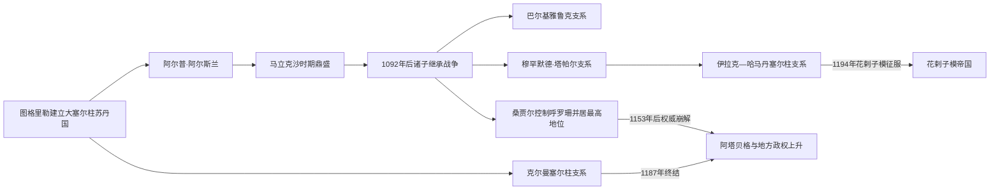

# 塞尔柱伊朗诸支统治者表

## 范围与读法

塞尔柱家族把领土视为宗族共同权利。1092年后“大苏丹”、呼罗珊苏丹、伊拉克—哈马丹苏丹和克尔曼支系经常并立，不能排成一条无重叠世系。本表按政治中心分别列出公认统治者；叙利亚与罗姆支系另属地区史，不在此重复。

## 大塞尔柱与诸支分化图

大塞尔柱最高苏丹、伊拉克—哈马丹支系和克尔曼支系长期重叠；表格按各自统治中心分列，并标注谁在某阶段具有名义宗主权。

## 大塞尔柱与最高苏丹主线

| 顺序 | 苏丹 | 在位或最高权时期 | 继承关系与重要事件 |
|---:|---|---|---|
| 1 | **图格里勒·贝格** | 1037/1040—1063年 | 塞尔柱之孙；丹丹坎后建立政权，1055年进入巴格达。 |
| 2 | **阿尔普·阿尔斯兰** | 1063—1072年 | 图格里勒之侄；击败叔辈竞争者，曼齐刻尔特获胜。 |
| 3 | **马立克沙一世** | 1072—1092年 | 前任之子；与尼扎姆·穆尔克合作，统一帝国达到高峰。 |
| 4 | 马哈茂德一世 | 1092—1094年 | 马立克沙幼子；由母后突尔坎扶立，与巴尔基亚鲁克并立。 |
| 5 | 巴尔基亚鲁克 | 1094—1105年 | 马立克沙之子；在长期内战中取得西部主要承认。 |
| 6 | 马立克沙二世 | 1105年 | 巴尔基亚鲁克幼子；在位数月，被叔父穆罕默德·塔帕尔废黜。 |
| 7 | 穆罕默德一世·塔帕尔 | 1105—1118年 | 马立克沙之子；控制伊朗西部与伊拉克。 |
| 8 | 马哈茂德二世 | 1118—1131年 | 前任之子；西部苏丹，承认叔父桑贾尔的最高地位。 |
| 9 | **艾哈迈德·桑贾尔** | 呼罗珊1097—1157年；大苏丹1118—1157年 | 马立克沙之子；以木鹿为中心，1141年败于西辽、1153年被乌古斯部众俘虏。 |

桑贾尔死后不再有获东西各支共同承认的大苏丹；西部由伊拉克—哈马丹支延续，克尔曼支则保持区域王权。

## 伊拉克—哈马丹塞尔柱支系

| 顺序 | 苏丹 | 在位时间 | 继承关系与权力结构 |
|---:|---|---|---|
| 1 | 马哈茂德二世 | 1118—1131年 | 穆罕默德·塔帕尔之子；支系开端，同时承认桑贾尔宗主地位。 |
| 2 | 达乌德 | 1131—1132年；此后继续争位至约1143年 | 马哈茂德二世之子；由部分埃米尔拥立，败于叔父。 |
| 3 | 图格里勒二世 | 1132—1134年 | 穆罕默德·塔帕尔之子、前任之叔；获桑贾尔支持，控制伊朗西部，在位短暂。 |
| 4 | **马苏德** | 1134—1152年 | 图格里勒二世之兄；依靠埃米尔与阿塔贝格，击败哈里发军事挑战，统治相对稳定。 |
| 5 | 马立克沙三世 | 1152—1153年 | 马哈茂德二世之子；由军政集团拥立，旋被弟弟取代。 |
| 6 | 穆罕默德二世 | 1153—1159/1160年 | 马立克沙三世之弟；与阿拔斯哈里发和地方埃米尔争权，围攻巴格达失败。 |
| 7 | 苏莱曼沙 | 1160—1161年 | 马立克沙一世之孙、支系长辈；由权臣扶立，因缺乏军队支持被废杀。 |
| 8 | 阿尔斯兰沙 | 1161—1176年 | 图格里勒二世之子；伊尔迪古兹阿塔贝格家族掌握实权，苏丹主要提供王朝合法性。 |
| 9 | **图格里勒三世** | 1176—1190年；1192—1194年复位 | 阿尔斯兰沙之子；试图摆脱阿塔贝格控制；被花剌子模沙击败阵亡，为伊朗西部末代塞尔柱苏丹。 |
| — | 克孜勒·阿尔斯兰 | 1191年称苏丹 | 伊尔迪古兹家族阿塔贝格，非塞尔柱王族；囚禁图格里勒三世并自称苏丹，不久被杀；必须作为短期僭位者单列。 |

## 克尔曼塞尔柱支系

| 顺序 | 统治者 | 在位时间 | 继承关系与重要事件 |
|---:|---|---|---|
| 1 | **卡武尔特（卡拉·阿尔斯兰）** | 1041/1048—1073年 | 察合里·贝格之子、阿尔普·阿尔斯兰之兄；建立克尔曼支系；争夺大苏丹失败后被马立克沙处死。 |
| 2 | 克尔曼沙 | 1073—1074年 | 卡武尔特之子；在位短暂。 |
| 3 | 苏丹沙 | 1074—1075年 | 克尔曼沙之弟；被兄弟支系取代。 |
| 4 | 侯赛因·奥马尔 | 1075—1084年 | 卡武尔特家族成员，关系与实际控制存在争议；部分资料把他列作短期支系统治者。 |
| 5 | 图兰沙一世 | 1084—1096年 | 卡武尔特之子；恢复相对稳定，经营波斯湾与阿曼方向。 |
| 6 | 伊朗沙 | 1096—1101年 | 图兰沙一世之子；宗教政策引发反对，被乌里玛与军人集团推翻。 |
| 7 | **阿尔斯兰沙一世** | 1101—1142年 | 卡武尔特后裔；长期稳定统治，商业与城市建设发展。 |
| 8 | 穆罕默德一世 | 1142—1156年 | 前任之子；维持克尔曼、马克兰与波斯湾联系。 |
| 9 | 图格里勒沙 | 1156—1169年 | 前任之子；晚年分封诸子，死后爆发内战。 |
| 10 | 巴赫拉姆沙 | 1169—1174年 | 图格里勒沙之子；与兄弟反复争位，乌古斯军逐渐介入。 |
| 11 | 阿尔斯兰沙二世 | 1174—1176年 | 巴赫拉姆沙之弟；在继承战争中掌权，控制不稳。 |
| 12 | 图兰沙二世 | 1176—1183年 | 阿尔斯兰沙二世之弟；依靠不同军政派系，王朝已难约束乌古斯集团。 |
| 13 | 穆罕默德二世 | 1183—1187年 | 巴赫拉姆沙之子；末代；弃守后，乌古斯首领马利克·迪纳尔占领克尔曼。 |

克尔曼后期诸兄弟的起止年在编年材料中有一至数年差异，本表采用常见约年；争位重叠不等于每人都能稳定控制全省。

## 世系与政权分化

- 马立克沙一世死后，王子和王后争位使中央分裂；桑贾尔只在东部保持长期核心。
- 西部苏丹越来越依赖伊尔迪古兹等阿塔贝格，形成“塞尔柱王号—军人摄政”的二元结构。
- 克尔曼支系独立性较强，最终因宗室内战、乌古斯迁入和财政军事失控灭亡。
- 完整过程见[塞尔柱与突厥化时期](/%E4%BA%BA%E6%96%87%E7%A7%91%E5%AD%A6/%E5%8E%86%E5%8F%B2/%E8%A5%BF%E4%BA%9A/%E4%BC%8A%E6%9C%97/%E5%A1%9E%E5%B0%94%E6%9F%B1%E4%B8%8E%E7%AA%81%E5%8E%A5%E5%8C%96%E6%97%B6%E6%9C%9F.md)。

## 返回

- [塞尔柱与突厥化时期](/%E4%BA%BA%E6%96%87%E7%A7%91%E5%AD%A6/%E5%8E%86%E5%8F%B2/%E8%A5%BF%E4%BA%9A/%E4%BC%8A%E6%9C%97/%E5%A1%9E%E5%B0%94%E6%9F%B1%E4%B8%8E%E7%AA%81%E5%8E%A5%E5%8C%96%E6%97%B6%E6%9C%9F.md)
- [伊朗](/%E4%BA%BA%E6%96%87%E7%A7%91%E5%AD%A6/%E5%8E%86%E5%8F%B2/%E8%A5%BF%E4%BA%9A/%E4%BC%8A%E6%9C%97/README.md)
