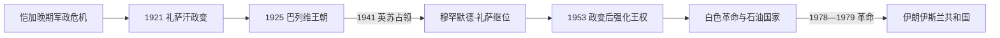

# 巴列维王朝

## 时间

1925年—1979年

## 概括

巴列维王朝以军队和中央官僚重建伊朗国家。礼萨沙统一地方武装、扩展铁路、学校和世俗法院，同时以强制手段压制部族、乌里玛和政治反对派。1941年英苏占领迫使其退位，穆罕默德·礼萨继位。1953年政变后第二任沙阿逐步掌握实权，以石油收入和“白色革命”推动土地、教育与工业改革；快速城市化、不平等、专制、外国依赖观感和宗教—世俗反对力量共同促成1979年革命。

## 完整世系

| 顺序 | 沙阿 | 在位时间 | 与前任关系 | 关键事件 |
|---:|---|---|---|---|
| 1 | **礼萨沙·巴列维** | 1925—1941 | 奠基者 | 前哥萨克旅军官；中央集权、现代化和强制世俗化；英苏入侵后被迫退位。 |
| 2 | **穆罕默德·礼萨·巴列维** | 1941—1979 | 礼萨沙之子 | 1953年后强化王权；白色革命、亲美外交和石油繁荣；1979年革命中流亡。 |

王储礼萨·巴列维未即位，因此不列入君主世系。

## 统治结构

1925年宪法和议会名义延续，沙阿通过军队、宫廷、内阁和地方官僚行使权力。礼萨沙建立全国征兵、身份证、现代法院和国营基础设施，削弱部族与宗教司法。第二任沙阿早期受议会、盟军和政党制约；1953年后军队、秘密警察萨瓦克、宫廷基金和受控政党扩大。1960年代土地改革削弱地主，却未建立强大自治农民组织，大量人口迁入城市。

## 重要事件

- 1921年礼萨汗参加政变并掌握军队；1925年议会废黜恺加，翌年加冕。
- 1928年废除不平等条约部分遗留并统一服饰政策；1936年强制揭面纱引发支持与抵制。
- 1938年纵贯伊朗铁路贯通，加强中央调兵和经济联系，但建设成本主要由国内税收承担。
- 1941年英苏以保障补给线和排除德国影响为由占领伊朗，礼萨沙退位。
- 1946年苏军撤出阿塞拜疆，中央收复当地自治政权；冷战格局形成。
- 1951年首相穆罕默德·摩萨台推动石油国有化，引发英国封锁和王权冲突。
- 1953年美英情报支持的政变推翻摩萨台，沙阿回国；此事成为外国干预和王权合法性危机的核心记忆。
- 1963年“白色革命”推行土地改革、妇女选举权、识字队和国有企业股份出售；霍梅尼因反对政策被捕，后流亡。
- 1971年波斯帝国2500周年庆典展现古代王权叙事，也因奢侈形象受批评。
- 1973年后油价上涨带来工业、军购和城市建设热潮，同时造成通胀、住房压力和经济失衡。
- 1975年建立复兴党，事实上取消有限政党竞争。
- 1978年报刊事件、库姆抗议、四十日纪念循环、罢工和黑色星期五使革命扩大。
- 1979年1月沙阿离境，2月霍梅尼回国，军队宣布中立；4月公投建立[伊朗伊斯兰共和国](/%E4%BA%BA%E6%96%87%E7%A7%91%E5%AD%A6/%E5%8E%86%E5%8F%B2/%E8%A5%BF%E4%BA%9A/%E4%BC%8A%E6%9C%97/%E4%BC%8A%E6%9C%97%E4%BC%8A%E6%96%AF%E5%85%B0%E5%85%B1%E5%92%8C%E5%9B%BD.md)。

## 现代化成效与王朝灭亡原因

王朝扩大识字、卫生、交通、工业和国家行政能力，妇女教育和法律地位部分改善。改革的高速度和强制性却破坏农村与地方中介，土地改革使许多小农难以生存。石油财富集中于国家，军购和宫廷腐败观感加深不平等。萨瓦克镇压削弱合法反对渠道，使宗教网络、市场商人、左翼、自由派和学生在反沙阿目标下联合。1978—1979年罢工切断石油和财政，军队不愿无限镇压，王朝最终失去执行能力。

## 演变关系

- 前一王朝：[恺加王朝](/%E4%BA%BA%E6%96%87%E7%A7%91%E5%AD%A6/%E5%8E%86%E5%8F%B2/%E8%A5%BF%E4%BA%9A/%E4%BC%8A%E6%9C%97/%E6%81%BA%E5%8A%A0%E7%8E%8B%E6%9C%9D.md)。
- 后继：[伊朗伊斯兰共和国](/%E4%BA%BA%E6%96%87%E7%A7%91%E5%AD%A6/%E5%8E%86%E5%8F%B2/%E8%A5%BF%E4%BA%9A/%E4%BC%8A%E6%9C%97/%E4%BC%8A%E6%9C%97%E4%BC%8A%E6%96%AF%E5%85%B0%E5%85%B1%E5%92%8C%E5%9B%BD.md)。
- 上级：[伊朗](/%E4%BA%BA%E6%96%87%E7%A7%91%E5%AD%A6/%E5%8E%86%E5%8F%B2/%E8%A5%BF%E4%BA%9A/%E4%BC%8A%E6%9C%97/README.md)。
