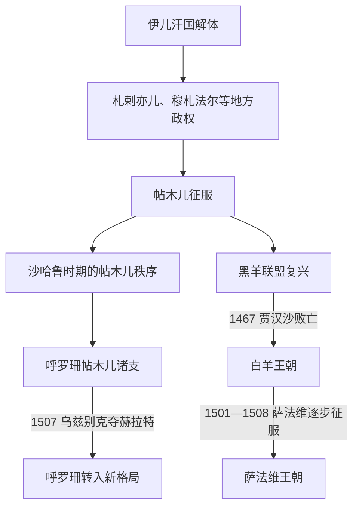

# 帖木儿与土库曼诸王朝时期

## 时间

约1370年—1501年；部分土库曼残余延续至1508年

## 概括

伊儿汗国分裂后，札剌亦儿、穆札法尔、萨尔巴达尔等地方政权并立。帖木儿从河中出发征服伊朗，以成吉思汗秩序和军事胜利建立个人帝国；1405年死后，沙哈鲁在呼罗珊重建相对稳定的帖木儿国家。西伊朗、阿塞拜疆和伊拉克则先后由黑羊、白羊土库曼联盟控制。三类政权都以突厥—蒙古军事集团和波斯官僚文化结合，为萨法维兴起提供军政、宗教和地域基础。

## 主要政权与完整世系入口

本阶段至少有帖木儿诸支、黑羊和白羊三套并立继承体系，不能合并为一条伊朗王统。

- 帖木儿王朝撒马尔罕、赫拉特和费尔干纳诸支的完整序列见[帖木儿王朝统治者表](/%E4%BA%BA%E6%96%87%E7%A7%91%E5%AD%A6/%E5%8E%86%E5%8F%B2/%E4%B8%AD%E4%BA%9A/%E6%B2%B3%E4%B8%AD%E5%9C%B0%E5%8C%BA/%E5%B8%96%E6%9C%A8%E5%84%BF%E7%8E%8B%E6%9C%9D%E7%BB%9F%E6%B2%BB%E8%80%85%E8%A1%A8.md)。伊朗主线以帖木儿、沙哈鲁、阿布·赛义德和侯赛因·拜卡拉最关键。
- 黑羊、白羊王朝所有最高首领、短期争位者和1497年后并立者见[黑羊与白羊王朝统治者表](/%E4%BA%BA%E6%96%87%E7%A7%91%E5%AD%A6/%E5%8E%86%E5%8F%B2/%E8%A5%BF%E4%BA%9A/%E4%BC%8A%E6%9C%97/%E9%BB%91%E7%BE%8A%E4%B8%8E%E7%99%BD%E7%BE%8A%E7%8E%8B%E6%9C%9D%E7%BB%9F%E6%B2%BB%E8%80%85%E8%A1%A8.md)。

## 重要事件

- 1381年帖木儿夺取赫拉特，随后系统征服伊朗；1387年伊斯法罕反抗后遭大屠杀。
- 1393年帖木儿灭穆札法尔王朝，控制法尔斯和伊拉克方向。
- 1402年安卡拉战役击败奥斯曼巴耶济德一世，帖木儿势力达到西亚高峰。
- 1405年帖木儿东征明朝途中去世，诸子孙争位。
- 1409年沙哈鲁取得撒马尔罕并以赫拉特统治，王后高哈尔绍德与宫廷赞助建筑和艺术。
- 1420年沙哈鲁击败黑羊卡拉·优素福继承者，但未直接长期吞并阿塞拜疆。
- 1467年乌尊·哈桑击杀贾汉沙，白羊取代黑羊。
- 1469年阿布·赛义德远征白羊失败被俘，帖木儿对西伊朗影响终结。
- 1473年奥特鲁克贝利战役中白羊败于奥斯曼火器军，向安纳托利亚扩张受阻。
- 1490年雅各布死后白羊王族混战，地方部族转向萨法维苏菲教团。
- 1501年伊斯玛仪一世在大不里士称沙阿，击败阿勒万德；1508年前后白羊残余被消灭。

## 兴盛与衰亡原因

帖木儿帝国靠个人军事威望、分封王子和掠夺性远征扩张，稳定期则依赖沙哈鲁的波斯官僚和贸易复兴。其弱点是王族领地分割和无固定继承。黑羊、白羊依靠部族联盟，首领需不断分配牧地、战利品和官职；强人去世后联盟易分裂。萨法维教团把宗教忠诚、红头部族军事网络和伊朗统一主张结合，利用白羊内战取代其政权。

## 演变关系

- 前一阶段：[蒙古与伊儿汗国时期](/%E4%BA%BA%E6%96%87%E7%A7%91%E5%AD%A6/%E5%8E%86%E5%8F%B2/%E8%A5%BF%E4%BA%9A/%E4%BC%8A%E6%9C%97/%E8%92%99%E5%8F%A4%E4%B8%8E%E4%BC%8A%E5%84%BF%E6%B1%97%E5%9B%BD%E6%97%B6%E6%9C%9F.md)。
- 后继：[萨法维王朝](/%E4%BA%BA%E6%96%87%E7%A7%91%E5%AD%A6/%E5%8E%86%E5%8F%B2/%E8%A5%BF%E4%BA%9A/%E4%BC%8A%E6%9C%97/%E8%90%A8%E6%B3%95%E7%BB%B4%E7%8E%8B%E6%9C%9D.md)。
- 奥斯曼交叉：[奥斯曼帝国](/%E4%BA%BA%E6%96%87%E7%A7%91%E5%AD%A6/%E5%8E%86%E5%8F%B2/%E8%A5%BF%E4%BA%9A/%E5%9C%9F%E8%80%B3%E5%85%B6/%E5%A5%A5%E6%96%AF%E6%9B%BC%E5%B8%9D%E5%9B%BD/README.md)。
- 上级：[伊朗](/%E4%BA%BA%E6%96%87%E7%A7%91%E5%AD%A6/%E5%8E%86%E5%8F%B2/%E8%A5%BF%E4%BA%9A/%E4%BC%8A%E6%9C%97/README.md)。
