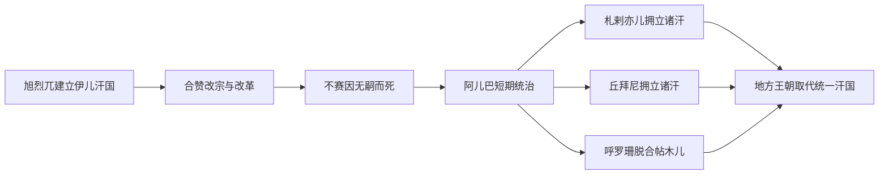

# 蒙古与伊儿汗国时期

## 时间

1219年—约1357年；伊儿汗国1256年—1335年为统一王朝阶段

## 概括

成吉思汗西征摧毁花剌子模统治并重创呼罗珊城市。1250年代旭烈兀建立伊儿汗国，控制伊朗、伊拉克、高加索和安纳托利亚东部，以蒙古王族和军事分封为上层，又依赖波斯官僚、城市税收和地方宗教机构。合赞汗改宗伊斯兰并改革财政后，王朝加速波斯—伊斯兰化。1335年不赛因死后无成年继承人，军阀拥立傀儡汗，国家分裂。

## 征服过程

- 1219年成吉思汗因讹答剌商队与使者事件进攻花剌子模；布哈拉、撒马尔罕、木鹿、内沙布尔等遭攻陷和大规模杀戮。
- 蒙古初期以总督、达鲁花赤和纳贡体系控制伊朗，各支王族和将领权力重叠。
- 1256年蒙哥汗派弟旭烈兀西征，攻灭尼扎里伊斯玛仪派堡垒；1258年攻陷巴格达。
- 1260年蒙古军在艾因贾鲁特败于马穆鲁克，叙利亚不再成为稳定领土；伊儿汗与金帐汗因高加索和宗教联盟长期敌对。

## 伊儿汗世系与分裂

1256—1335年的统一伊儿汗国共有旭烈兀至不赛因九位核心君主，阿儿巴可汗在继承断裂中短暂掌权。1336年后，穆萨、穆罕默德、脱合帖木儿、撒迪别、札罕帖木儿、苏莱曼、努失儿完等由不同军阀拥立，彼此重叠而非连续继承。完整名单、拥立集团与控制范围见[伊儿汗国统治者表](/%E4%BA%BA%E6%96%87%E7%A7%91%E5%AD%A6/%E5%8E%86%E5%8F%B2/%E8%A5%BF%E4%BA%9A/%E4%BC%8A%E6%9C%97/%E4%BC%8A%E5%84%BF%E6%B1%97%E5%9B%BD%E7%BB%9F%E6%B2%BB%E8%80%85%E8%A1%A8.md)。

## 统治结构与经济

蒙古王族以大汗授权和成吉思汗血统为合法性，军队按万户和部族组织；波斯维齐尔和文书官负责土地税、人口与城市经济。早期多重征派和军队掠夺破坏农业，地方官常预收税。合赞改革尝试登记土地、规范税率、给军人分配收益并恢复驿站。拉施特丁主持史学和慈善学术机构，显示蒙古宫廷与波斯知识文化融合。宗教政策从早期佛教、基督教和萨满多元转向合赞以后伊斯兰王朝。

## 重要事件

- 1219—1221年蒙古灭花剌子模并摧毁呼罗珊多城；死亡数字在中世纪叙事中常有夸张，具体规模难以精确。
- 1256年阿剌模忒等堡垒投降，尼扎里伊斯玛仪派国家终结。
- 1258年巴格达陷落，阿拔斯哈里发穆斯台绥木被杀。
- 1260年艾因贾鲁特战役后，伊儿汗—马穆鲁克边界大体维持在叙利亚北部。
- 1294年海合都模仿元朝发行纸钞，市场拒绝导致政策迅速撤销。
- 1295年合赞改宗伊斯兰并即位，使政权与多数臣民宗教更接近。
- 1300年前后多次进攻叙利亚但未能永久占领。
- 1317年前后不赛因亲政前后，出班家族一度控制军政。
- 1335年不赛因死，无成年继承人，札剌亦儿、丘拜尼、穆札法尔等地方势力分割伊朗。

## 恢复、融合与分裂原因

蒙古征服造成的破坏因地区而异，阿塞拜疆和部分城市成为新宫廷中心，南部和里海地区保留较多连续性。王朝能恢复经济，依靠波斯官僚、跨欧亚贸易和改宗后与地方精英合作。分裂则源于继承人断绝、将领家族掌握军队和税区，以及金帐汗与马穆鲁克外部压力。后继政权保留蒙古王号和波斯行政，形成[帖木儿与土库曼诸王朝时期](/%E4%BA%BA%E6%96%87%E7%A7%91%E5%AD%A6/%E5%8E%86%E5%8F%B2/%E8%A5%BF%E4%BA%9A/%E4%BC%8A%E6%9C%97/%E5%B8%96%E6%9C%A8%E5%84%BF%E4%B8%8E%E5%9C%9F%E5%BA%93%E6%9B%BC%E8%AF%B8%E7%8E%8B%E6%9C%9D%E6%97%B6%E6%9C%9F.md)。

## 演变关系

- 前一阶段：[塞尔柱与突厥化时期](/%E4%BA%BA%E6%96%87%E7%A7%91%E5%AD%A6/%E5%8E%86%E5%8F%B2/%E8%A5%BF%E4%BA%9A/%E4%BC%8A%E6%9C%97/%E5%A1%9E%E5%B0%94%E6%9F%B1%E4%B8%8E%E7%AA%81%E5%8E%A5%E5%8C%96%E6%97%B6%E6%9C%9F.md)及花剌子模统治。
- 后续：[帖木儿与土库曼诸王朝时期](/%E4%BA%BA%E6%96%87%E7%A7%91%E5%AD%A6/%E5%8E%86%E5%8F%B2/%E8%A5%BF%E4%BA%9A/%E4%BC%8A%E6%9C%97/%E5%B8%96%E6%9C%A8%E5%84%BF%E4%B8%8E%E5%9C%9F%E5%BA%93%E6%9B%BC%E8%AF%B8%E7%8E%8B%E6%9C%9D%E6%97%B6%E6%9C%9F.md)。
- 上级：[伊朗](/%E4%BA%BA%E6%96%87%E7%A7%91%E5%AD%A6/%E5%8E%86%E5%8F%B2/%E8%A5%BF%E4%BA%9A/%E4%BC%8A%E6%9C%97/README.md)。
