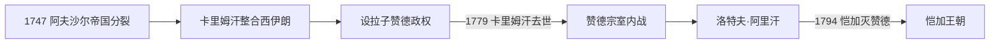

# 赞德王朝

## 时间

1751年—1794年

## 概括

纳迪尔沙死后，赞德部首领卡里姆汗在西伊朗竞争中胜出，以设拉子为首都。他不称沙阿而称“人民的代理人”，扶立萨法维傀儡以取得传统合法性。其统治恢复法尔斯、中部和西部的治安、贸易与城市建设，但没有控制阿夫沙尔呼罗珊和全部高加索。1779年卡里姆汗死后，赞德宗室连续内战；恺加首领阿迦·穆罕默德汗逐步夺取北部和中部，1794年击败末代洛特夫·阿里汗。

## 完整统治者世系

| 顺序 | 统治者 | 在位 / 掌权 | 与前任关系 | 备注 |
|---:|---|---|---|---|
| 1 | **卡里姆汗·赞德** | 1751—1779 | 奠基者 | 称“瓦基勒”而非沙阿；以设拉子为都，控制伊朗大部但不含呼罗珊。 |
| 2 | 阿布·法特赫汗 | 1779年数次；1779—1782名义存在 | 卡里姆汗长子 | 由宗室和将领反复扶立，实际权力有限。 |
| — | 穆罕默德·阿里汗 | 1779年共同名义统治 | 卡里姆汗幼子 | 被叔祖扎基汗扶立与兄共治，后失势。 |
| 3 | 萨迪克汗 | 1779—1781年 | 卡里姆汗之弟 | 控制设拉子，被阿里·穆拉德汗击败。 |
| 4 | 阿里·穆拉德汗 | 1781—1785年 | 赞德宗室 | 以伊斯法罕为中心争取统一，远征途中去世。 |
| 5 | 贾法尔汗 | 1785—1789年 | 萨迪克汗之子 | 与恺加作战，被宫廷对手毒杀 / 杀害。 |
| 6 | 赛义德·穆拉德汗 | 1789年 | 赞德宗室、政变者 | 在设拉子掌权约四个月，被洛特夫·阿里击败。 |
| 7 | **洛特夫·阿里汗** | 1789—1794年 | 贾法尔汗之子 | 勇于作战但缺乏稳定部族联盟；克尔曼失守后被俘杀。 |

赞德政权常以卡里姆汗为唯一稳定统治者。1779年以后多位宗室重叠、复立和短期称王，精确月份在资料中可能不同。

## 统治结构与经济

卡里姆汗依靠赞德部骑兵、法尔斯地方精英和商人，减少部分税负并恢复道路。他扶立萨法维伊斯玛仪三世为名义沙阿，自己掌实权，以避免直接挑战什叶王朝传统。设拉子建设城堡、市场、浴场和清真寺，波斯湾贸易经布什尔发展。地方治理仍依赖部族首领和省级将领，中央常备制度不足是继承危机的重要原因。

## 重要事件

- 1750年前后卡里姆汗与阿里·马尔丹汗合作占领伊斯法罕，扶立伊斯玛仪三世。
- 1751年卡里姆汗击败盟友，逐步成为西伊朗最强统治者。
- 1760年代击败恺加穆罕默德·哈桑汗，把其子阿迦·穆罕默德作为人质留在设拉子。
- 1763年与英国东印度公司订立商业安排，布什尔成为重要港口。
- 1765年前后设拉子确立为首都并进行大规模城市建设。
- 1775—1776年围攻并占领奥斯曼巴士拉，试图控制波斯湾贸易；卡里姆汗死后撤退。
- 1779年卡里姆汗死，阿迦·穆罕默德逃回北方重建恺加力量，赞德宗室同时内战。
- 1789年洛特夫·阿里汗即位，在法尔斯、克尔曼与恺加反复作战。
- 1794年克尔曼被恺加攻陷并遭严厉报复，洛特夫·阿里被俘杀，赞德政权终结。

## 兴盛与灭亡原因

卡里姆汗时期的稳定来自避免大规模海外远征、降低税压、恢复贸易和与法尔斯精英合作。其个人仲裁取代正式继承制度，诸子年幼且宗室拥有军队。1779年后连续政变耗尽资源，恺加在里海南岸和北部拥有更稳定部族基地。洛特夫·阿里虽有军事才能，却因与地方总督、部族和城镇精英关系破裂而失去据点。赞德灭亡是内战与恺加整合能力共同结果。

## 演变关系

- 前一统一帝国：[阿夫沙尔王朝](/%E4%BA%BA%E6%96%87%E7%A7%91%E5%AD%A6/%E5%8E%86%E5%8F%B2/%E8%A5%BF%E4%BA%9A/%E4%BC%8A%E6%9C%97/%E9%98%BF%E5%A4%AB%E6%B2%99%E5%B0%94%E7%8E%8B%E6%9C%9D.md)；两者在1747年后长期并立。
- 后继：[恺加王朝](/%E4%BA%BA%E6%96%87%E7%A7%91%E5%AD%A6/%E5%8E%86%E5%8F%B2/%E8%A5%BF%E4%BA%9A/%E4%BC%8A%E6%9C%97/%E6%81%BA%E5%8A%A0%E7%8E%8B%E6%9C%9D.md)。
- 上级：[伊朗](/%E4%BA%BA%E6%96%87%E7%A7%91%E5%AD%A6/%E5%8E%86%E5%8F%B2/%E8%A5%BF%E4%BA%9A/%E4%BC%8A%E6%9C%97/README.md)。
