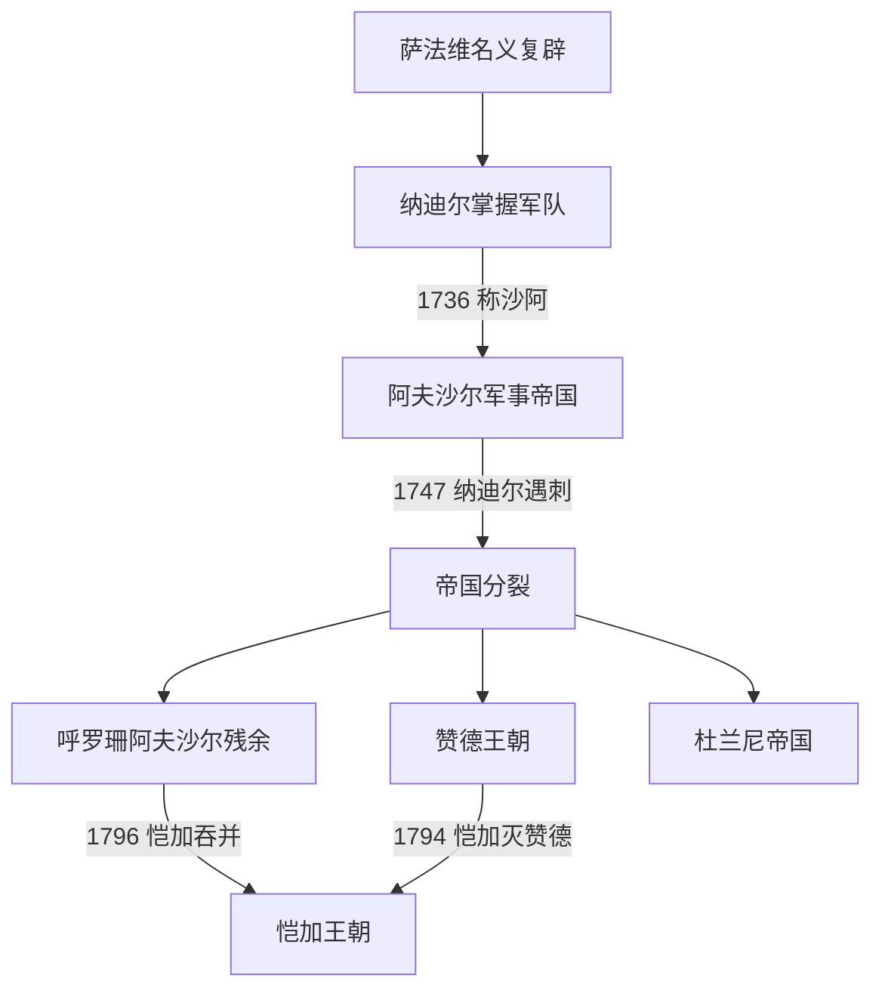

# 阿夫沙尔王朝

## 时间

1736年—1796年；1747年后实际统治主要限于呼罗珊

## 概括

纳迪尔出身阿夫沙尔部，先以萨法维军事领袖身份驱逐阿富汗军、收复失地，1736年废黜萨法维幼主称沙阿。他以火枪、炮兵和机动骑兵重建军事强权，远征印度、中亚、高加索和奥斯曼边境。连年战争、重税和宗教政策争议使统治日益残酷；1747年纳迪尔被军官刺杀后，帝国立即分裂。阿夫沙尔王室仍在呼罗珊维持名义统治，与赞德、杜兰尼和恺加长期并立，直到1796年被恺加吞并。

## 完整世系

| 顺序 | 沙阿 | 在位时间 | 与前任关系 | 统治范围与备注 |
|---:|---|---|---|---|
| 1 | **纳迪尔沙** | 1736—1747 | 奠基者 | 重建伊朗大部、征服德里；后期重税和清洗引发叛乱，被军官刺杀。 |
| 2 | 阿迪尔沙 | 1747—1748 | 纳迪尔侄阿里·库里 | 杀害多名宗室后即位；被弟弟易卜拉欣击败并弄瞎。 |
| 3 | 易卜拉欣沙 | 1748年 | 阿迪尔沙之弟 | 控制伊朗西部数月，未获呼罗珊承认，被击败处死。 |
| 4 | **沙鲁克沙** | 1748—1749；1750—1796 | 纳迪尔之孙、母系为萨法维后裔 | 主要统治马什哈德和呼罗珊；1749年被废并弄瞎，1750年复位，此后多受地方将领、杜兰尼和恺加制约。 |
| — | 苏莱曼二世 | 1749—1750 | 萨法维旁支、非阿夫沙尔王族 | 利用反沙鲁克政变称沙阿，随后被推翻；列作插入的萨法维复辟者而非阿夫沙尔正统。 |

## 建立与统治结构

纳迪尔依靠阿夫沙尔、土库曼、库尔德、阿富汗和其他骑兵部队，配合火枪兵、骆驼炮和攻城炮。1736年穆甘草原大会由军事与部族精英拥立，显示其合法性主要来自恢复秩序和胜利。纳迪尔试图淡化萨法维十二伊玛目什叶国家传统，提出承认贾法里学派以缓和与逊尼世界冲突，但什叶乌里玛和奥斯曼均未完全接受。战争经费依赖重税、没收和战利品，缺少稳定继承和文官制度。

## 重要事件

- 1729年纳迪尔在达姆甘等战役击败吉尔扎伊阿富汗军，护送塔赫玛斯普二世恢复伊斯法罕。
- 1732年废塔赫玛斯普二世，立幼儿阿拔斯三世；本人掌握摄政与军队。
- 1735年与俄国议和，收回里海沿岸部分萨法维旧地。
- 1736年穆甘大会称沙阿，正式建立阿夫沙尔王朝。
- 1738年攻占坎大哈，次年入侵莫卧儿印度。
- 1739年卡尔纳尔战役击败莫卧儿军并进入德里，获得巨额战利品；屠杀与掠夺重创城市。
- 1740年远征布哈拉、希瓦，取得短期宗主权。
- 1741年纳迪尔遇刺未遂后猜忌加深，弄瞎长子礼萨·库里并扩大清洗。
- 1743—1746年再与奥斯曼作战，未实现宗教和领土目标。
- 1747年纳迪尔在呼罗珊被军官刺杀，阿富汗军首领艾哈迈德汗建立杜兰尼帝国，西伊朗出现[赞德王朝](/%E4%BA%BA%E6%96%87%E7%A7%91%E5%AD%A6/%E5%8E%86%E5%8F%B2/%E8%A5%BF%E4%BA%9A/%E4%BC%8A%E6%9C%97/%E8%B5%9E%E5%BE%B7%E7%8E%8B%E6%9C%9D.md)等竞争者。
- 1796年阿迦·穆罕默德汗攻取马什哈德，沙鲁克遭拷问后死去，阿夫沙尔政权终结。

## 兴盛与灭亡原因

纳迪尔成功源于萨法维崩溃后的军事真空、对火器和骑兵的有效组合，以及以恢复边界争取精英支持。帝国却过度依赖个人指挥和战利品，缺少稳定税制与继承安排；印度财富只短暂减税，随后新战争再次加重负担。刺杀后各军团和王族争夺，地方力量不再服从。1796年终结只是呼罗珊残余被吞并，西伊朗早已由赞德和恺加竞争。

## 演变关系

- 前一王朝：[萨法维王朝](/%E4%BA%BA%E6%96%87%E7%A7%91%E5%AD%A6/%E5%8E%86%E5%8F%B2/%E8%A5%BF%E4%BA%9A/%E4%BC%8A%E6%9C%97/%E8%90%A8%E6%B3%95%E7%BB%B4%E7%8E%8B%E6%9C%9D.md)。
- 并立政权：[赞德王朝](/%E4%BA%BA%E6%96%87%E7%A7%91%E5%AD%A6/%E5%8E%86%E5%8F%B2/%E8%A5%BF%E4%BA%9A/%E4%BC%8A%E6%9C%97/%E8%B5%9E%E5%BE%B7%E7%8E%8B%E6%9C%9D.md)和杜兰尼帝国。
- 最终吞并者：[恺加王朝](/%E4%BA%BA%E6%96%87%E7%A7%91%E5%AD%A6/%E5%8E%86%E5%8F%B2/%E8%A5%BF%E4%BA%9A/%E4%BC%8A%E6%9C%97/%E6%81%BA%E5%8A%A0%E7%8E%8B%E6%9C%9D.md)。
- 上级：[伊朗](/%E4%BA%BA%E6%96%87%E7%A7%91%E5%AD%A6/%E5%8E%86%E5%8F%B2/%E8%A5%BF%E4%BA%9A/%E4%BC%8A%E6%9C%97/README.md)。
