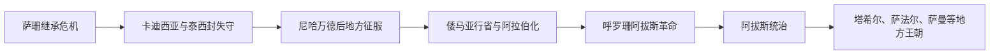

# 阿拉伯征服与伊斯兰化时期

## 时间

约633年—9世纪

## 概括

阿拉伯军队在萨珊—拜占庭大战和萨珊继承危机后进入两河与伊朗。卡迪西亚、泰西封和尼哈万德的失败使萨珊中央瓦解，但各地区的征服、和约与反抗持续数十年。伊斯兰化并非征服后立即完成：城市驻军、税制、阿拉伯移民、非阿拉伯改宗者和地方贵族共同塑造新社会。新波斯语在阿拉伯文字和伊斯兰文化中复兴，说明政治—宗教断裂与语言—行政延续同时存在。

## 征服过程

- 633—634年阿拉伯军先进入萨珊控制的伊拉克边境；早期战局反复。
- 636/637年卡迪西亚战役后，萨珊主力败退；泰西封被占，王室向伊朗高原转移。
- 642年尼哈万德战役破坏萨珊再组织大军的能力，但地方城堡、总督和山地政权仍抵抗。
- 法尔斯、克尔曼、呼罗珊、塔巴里斯坦等地通过不同条约、贡赋或战争纳入；部分山区保持半独立数世纪。
- 651年亚兹德格德三世在木鹿附近被杀，萨珊王朝终结；其子裔曾寻求中亚和唐朝支持但未能复国。

## 统治结构与社会变化

| 层面 | 具体变化 |
|---|---|
| 军事—行政 | 库法、巴士拉等军镇成为征服伊朗的基地；各地由总督、税务官和当地贵族共同管理。 |
| 税制 | 土地税和人头税沿用萨珊登记技术并逐步伊斯兰化；改宗是否免税在不同时期执行不一。 |
| 地方精英 | 地主贵族、书吏和小王可通过纳贡保留地位；部分家族转入哈里发官僚和军队。 |
| 宗教 | 祆教仍长期存在，基督徒、犹太人和佛教群体也分布各地；伊斯兰传播因地区、阶层而异。 |
| 语言 | 阿拉伯语成为帝国行政与宗教语言；中古波斯语演变为新波斯语，并借阿拉伯文字形成新文学。 |
| 身份 | 非阿拉伯改宗者常以马瓦里身份依附部落，社会与税收不平等成为反倭马亚动员因素。 |

## 重要事件

- 卡迪西亚和尼哈万德战役是中央军事瓦解节点，但具体年份在早期传统中有细微差异。
- 650年代至8世纪，塔巴里斯坦、呼罗珊和中亚边缘多次叛乱，显示征服并非一次完成。
- 680年卡尔巴拉事件与阿里家族记忆在伊朗后世什叶传统中日益重要。
- 696—697年前后倭马亚推动行政阿拉伯化和独立铸币，萨珊银币图像仍在过渡期继续使用。
- 747年阿布·穆斯林在呼罗珊发动阿拔斯革命，联合阿拉伯部落、马瓦里和反倭马亚力量。
- 750年阿拔斯取代倭马亚，政治中心由叙利亚转向伊拉克，伊朗官僚和呼罗珊军影响上升。
- 巴尔马克家族等具有伊朗 / 中亚背景的官僚进入宫廷，萨珊式文书和礼仪经转化后被继承。
- 9世纪塔希尔、萨法尔、萨曼等地方王朝取得实权，进入[伊朗间奏期](/%E4%BA%BA%E6%96%87%E7%A7%91%E5%AD%A6/%E5%8E%86%E5%8F%B2/%E8%A5%BF%E4%BA%9A/%E4%BC%8A%E6%9C%97/%E4%BC%8A%E6%9C%97%E9%97%B4%E5%A5%8F%E6%9C%9F.md)。

## 伊斯兰化的原因与节奏

改宗原因包括信仰传播、进入军政网络、婚姻、城市化和税收身份变化，不能归为单纯强迫或单纯经济选择。祆教在法尔斯、雅兹德、克尔曼等地长期延续；大规模社会伊斯兰化经历数世纪。波斯文化也不是征服后“复活”的封闭古传统，而是在阿拉伯语学术、伊斯兰法与跨区域宫廷中形成新的波斯—伊斯兰文化。

## 演变关系

- 前一王朝：[萨珊帝国](/%E4%BA%BA%E6%96%87%E7%A7%91%E5%AD%A6/%E5%8E%86%E5%8F%B2/%E8%A5%BF%E4%BA%9A/%E4%BC%8A%E6%9C%97/%E8%90%A8%E7%8F%8A%E5%B8%9D%E5%9B%BD.md)。
- 帝国背景：[伊斯兰兴起与正统哈里发时期](/%E4%BA%BA%E6%96%87%E7%A7%91%E5%AD%A6/%E5%8E%86%E5%8F%B2/%E8%A5%BF%E4%BA%9A/_%E9%80%9A%E5%8F%B2/%E9%98%BF%E6%8B%89%E4%BC%AF%E5%B8%9D%E5%9B%BD/%E4%BC%8A%E6%96%AF%E5%85%B0%E5%85%B4%E8%B5%B7%E4%B8%8E%E6%AD%A3%E7%BB%9F%E5%93%88%E9%87%8C%E5%8F%91%E6%97%B6%E6%9C%9F.md)、[倭马亚王朝](/%E4%BA%BA%E6%96%87%E7%A7%91%E5%AD%A6/%E5%8E%86%E5%8F%B2/%E8%A5%BF%E4%BA%9A/_%E9%80%9A%E5%8F%B2/%E9%98%BF%E6%8B%89%E4%BC%AF%E5%B8%9D%E5%9B%BD/%E5%80%AD%E9%A9%AC%E4%BA%9A%E7%8E%8B%E6%9C%9D.md)、[阿拔斯王朝](/%E4%BA%BA%E6%96%87%E7%A7%91%E5%AD%A6/%E5%8E%86%E5%8F%B2/%E8%A5%BF%E4%BA%9A/_%E9%80%9A%E5%8F%B2/%E9%98%BF%E6%8B%89%E4%BC%AF%E5%B8%9D%E5%9B%BD/%E9%98%BF%E6%8B%94%E6%96%AF%E7%8E%8B%E6%9C%9D.md)。
- 后续：[伊朗间奏期](/%E4%BA%BA%E6%96%87%E7%A7%91%E5%AD%A6/%E5%8E%86%E5%8F%B2/%E8%A5%BF%E4%BA%9A/%E4%BC%8A%E6%9C%97/%E4%BC%8A%E6%9C%97%E9%97%B4%E5%A5%8F%E6%9C%9F.md)。
- 上级：[伊朗](/%E4%BA%BA%E6%96%87%E7%A7%91%E5%AD%A6/%E5%8E%86%E5%8F%B2/%E8%A5%BF%E4%BA%9A/%E4%BC%8A%E6%9C%97/README.md)。
