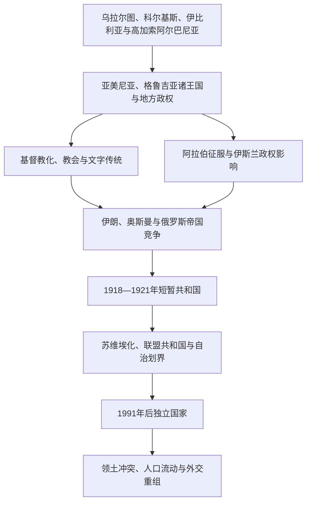

# 南高加索

## 概括

南高加索位于黑海与里海之间，通常包括亚美尼亚、阿塞拜疆和格鲁吉亚。高山、河谷和交通走廊使这里既形成长期延续的地方王国、教会和语言传统，也不断卷入罗马—拜占庭、伊朗诸帝国、阿拉伯哈里发、蒙古、奥斯曼和俄罗斯的竞争。

现代国界不能直接套用于古代。科尔基斯、高加索伊比利亚、高加索阿尔巴尼亚、乌拉尔图和历史亚美尼亚的范围均与今天国家边界不同，民族、语言和政治传统也不是简单直线继承。

## 演变图

## 区域专题导航

| 顺序 | 专题 | 时间 | 入口 | 核心问题 |
|---:|---|---|---|---|
| 1 | 古代王国与基督教化 | 前1千纪-7世纪 | [古代王国与基督教化](/%E4%BA%BA%E6%96%87%E7%A7%91%E5%AD%A6/%E5%8E%86%E5%8F%B2/%E8%A5%BF%E4%BA%9A/%E5%8D%97%E9%AB%98%E5%8A%A0%E7%B4%A2/%E5%8F%A4%E4%BB%A3%E7%8E%8B%E5%9B%BD%E4%B8%8E%E5%9F%BA%E7%9D%A3%E6%95%99%E5%8C%96.md) | 地方王国、罗马—伊朗边疆、基督教与文字传统 |
| 2 | 伊朗、奥斯曼与俄罗斯帝国竞争 | 7世纪-1917年 | [伊朗、奥斯曼与俄罗斯帝国竞争](/%E4%BA%BA%E6%96%87%E7%A7%91%E5%AD%A6/%E5%8E%86%E5%8F%B2/%E8%A5%BF%E4%BA%9A/%E5%8D%97%E9%AB%98%E5%8A%A0%E7%B4%A2/%E4%BC%8A%E6%9C%97%E3%80%81%E5%A5%A5%E6%96%AF%E6%9B%BC%E4%B8%8E%E4%BF%84%E7%BD%97%E6%96%AF%E5%B8%9D%E5%9B%BD%E7%AB%9E%E4%BA%89.md) | 帝国边界、汗国与王国、宗教社群和俄国扩张 |
| 3 | 苏维埃划界、独立与地区冲突 | 1917年至今 | [苏维埃划界、独立与地区冲突](/%E4%BA%BA%E6%96%87%E7%A7%91%E5%AD%A6/%E5%8E%86%E5%8F%B2/%E8%A5%BF%E4%BA%9A/%E5%8D%97%E9%AB%98%E5%8A%A0%E7%B4%A2/%E8%8B%8F%E7%BB%B4%E5%9F%83%E5%88%92%E7%95%8C%E3%80%81%E7%8B%AC%E7%AB%8B%E4%B8%8E%E5%9C%B0%E5%8C%BA%E5%86%B2%E7%AA%81.md) | 共和国形成、自治安排、苏联解体和冲突 |

以下三国目录是南高加索区域史的正式子目录；区域专题负责共同的帝国边疆与苏维埃划界背景，国家目录负责各自的政治和社会主线。

## 国家导航

| 国家 | 入口 | 历史主线 |
|---|---|---|
| 亚美尼亚 | [亚美尼亚](/%E4%BA%BA%E6%96%87%E7%A7%91%E5%AD%A6/%E5%8E%86%E5%8F%B2/%E8%A5%BF%E4%BA%9A/%E5%8D%97%E9%AB%98%E5%8A%A0%E7%B4%A2/%E4%BA%9A%E7%BE%8E%E5%B0%BC%E4%BA%9A/README.md) | 古代王国、基督教传统、中世纪王国、俄国与苏联时期 |
| 阿塞拜疆 | [阿塞拜疆](/%E4%BA%BA%E6%96%87%E7%A7%91%E5%AD%A6/%E5%8E%86%E5%8F%B2/%E8%A5%BF%E4%BA%9A/%E5%8D%97%E9%AB%98%E5%8A%A0%E7%B4%A2/%E9%98%BF%E5%A1%9E%E6%8B%9C%E7%96%86/README.md) | 高加索阿尔巴尼亚、伊朗—伊斯兰统治、汗国、石油与现代共和国 |
| 格鲁吉亚 | [格鲁吉亚](/%E4%BA%BA%E6%96%87%E7%A7%91%E5%AD%A6/%E5%8E%86%E5%8F%B2/%E8%A5%BF%E4%BA%9A/%E5%8D%97%E9%AB%98%E5%8A%A0%E7%B4%A2/%E6%A0%BC%E9%B2%81%E5%90%89%E4%BA%9A/README.md) | 科尔基斯、伊比利亚、统一王国、帝国竞争与现代国家 |

## 关键辨析

- 高加索是跨欧亚的地理与历史区域；本目录按西亚比较框架维护南高加索，不排斥与欧洲、俄罗斯和中亚历史交叉阅读。
- “高加索阿尔巴尼亚”是古代东高加索政体，与欧洲巴尔干地区的阿尔巴尼亚无关。
- 古代地名与现代民族国家不能机械对应；例如乌拉尔图、科尔基斯和历史亚美尼亚的范围都跨越今天边界。
- 纳戈尔诺—卡拉巴赫、阿布哈兹和南奥塞梯等问题应区分历史人口、苏联行政划界、战争结果、实际控制和国际承认。

## 上级与相邻区域

- [西亚](/%E4%BA%BA%E6%96%87%E7%A7%91%E5%AD%A6/%E5%8E%86%E5%8F%B2/%E8%A5%BF%E4%BA%9A/README.md)
- [西亚](/%E4%BA%BA%E6%96%87%E7%A7%91%E5%AD%A6/%E5%8E%86%E5%8F%B2/%E8%A5%BF%E4%BA%9A/README.md)
- [伊朗](/%E4%BA%BA%E6%96%87%E7%A7%91%E5%AD%A6/%E5%8E%86%E5%8F%B2/%E8%A5%BF%E4%BA%9A/%E4%BC%8A%E6%9C%97/README.md)
- [土耳其](/%E4%BA%BA%E6%96%87%E7%A7%91%E5%AD%A6/%E5%8E%86%E5%8F%B2/%E8%A5%BF%E4%BA%9A/%E5%9C%9F%E8%80%B3%E5%85%B6/README.md)
- [俄罗斯](/%E4%BA%BA%E6%96%87%E7%A7%91%E5%AD%A6/%E5%8E%86%E5%8F%B2/%E6%AC%A7%E6%B4%B2/%E6%96%AF%E6%8B%89%E5%A4%AB/%E4%B8%9C%E6%96%AF%E6%8B%89%E5%A4%AB/%E4%BF%84%E7%BD%97%E6%96%AF.md)
