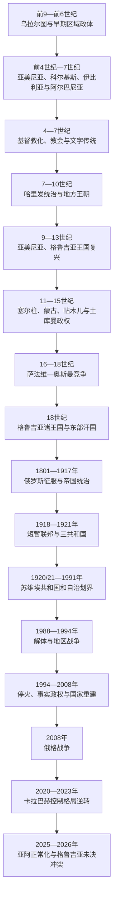

# 南高加索

## 概括

南高加索位于大高加索山脉以南、黑海与里海之间，通常包括亚美尼亚、阿塞拜疆和格鲁吉亚。高山、河谷、草原、海岸和隘口使这里既能形成延续甚久的地方王国、教会、语言和城市网络，也不断成为安纳托利亚、伊朗高原、俄罗斯草原和两海交通之间的帝国边疆。

现代国界不能直接套用古代。乌拉尔图以凡湖盆地为中心，科尔基斯位于黑海东岸，高加索伊比利亚主要在东格鲁吉亚，高加索阿尔巴尼亚位于库拉河下游和里海西岸，历史亚美尼亚的范围也跨越今日多国。它们同现代民族、语言和国家传统存在复杂联系，却不是三国的固定古代版图。

4世纪前后亚美尼亚和格鲁吉亚王权接受基督教，高加索阿尔巴尼亚亦逐步基督教化；教会与文字在王朝灭亡后继续组织社会。7世纪以后，哈里发、地方穆斯林政权与复兴的亚美尼亚、格鲁吉亚王国并存。塞尔柱、蒙古和帖木儿征服带来新的军政集团、迁徙和商路重组；萨法维伊朗与奥斯曼又把本区变成长期边疆。

俄罗斯于19世纪初通过吞并和俄伊、俄土战争占领大部分南高加索，省制、铁路、石油和人口迁移塑造现代社会。1918年三国首次独立，1920—1921年被红军控制；苏联的加盟共和国与自治单位划界成为1991年后冲突的重要制度背景。2023年阿塞拜疆恢复对原纳戈尔诺—卡拉巴赫自治州的控制，2025年亚美尼亚与阿塞拜疆草签和平文本；截至2026年7月正式条约仍待签署批准。阿布哈兹和南奥塞梯则继续处于事实政权和俄罗斯驻军控制之下，多数国家仍承认其为格鲁吉亚领土。

## 演变图

## 历史主线

### 古代王国与帝国边疆

乌拉尔图以堡垒、灌溉和仓储统治亚美尼亚高原部分地区，其前7—前6世纪的终结时间和毁灭者仍有争议。希腊化时代以后，亚美尼亚王国、高加索伊比利亚和高加索阿尔巴尼亚形成较稳定王权；科尔基斯和后来拉齐卡连接黑海贸易。前1世纪至7世纪，罗马—拜占庭与帕提亚—萨珊伊朗通过册封王室、驻军、贵族和宗教政策争夺本区。

基督教化不是一次法令完成的。亚美尼亚王权约在4世纪初、伊比利亚约在4世纪中叶接受基督教，高加索阿尔巴尼亚亦逐渐建立教会。约405年亚美尼亚字母创制，格鲁吉亚和阿尔巴尼亚文字传统也在晚期古代形成。教会、贵族和本地语言因此成为比具体王朝更持久的制度。

### 中世纪王国、征服与交通网络

阿拉伯征服后，哈里发总督、驻军城市同基督教贵族并存。9世纪中央权威衰退，亚美尼亚巴格拉图尼和格鲁吉亚巴格拉季昂王权复兴。阿尼王国在贵族分裂、拜占庭吞并和塞尔柱征服中瓦解；格鲁吉亚则在大卫四世与塔玛尔时期达到鼎盛，控制第比利斯、亚美尼亚北部和区域商路。

蒙古征服把王室和贵族纳入赋税与军役体系，帖木儿战争造成进一步破坏。黑羊、白羊等土库曼联盟后来以阿塞拜疆和东安纳托利亚为基地。王朝更替并非单纯族群替代：城市商人、教会、村社、牧民和贵族常在新政权下继续存在。

### 伊朗—奥斯曼竞争与俄罗斯征服

16—17世纪，萨法维与奥斯曼反复争夺格鲁吉亚、亚美尼亚和阿塞拜疆地区。什叶派在东南高加索逐渐占优势，沙阿阿拔斯一世的焦土和强制迁移重塑亚美尼亚商业网络。1639年《祖哈布和约》大体形成奥斯曼控制西部、伊朗控制东部的势力范围。

纳迪尔沙1747年死后，东部多个汗国高度自治；卡特利—卡赫季则于1783年接受俄国保护。俄国1801年直接吞并该王国，继而在两次俄伊战争中获胜；1813年《古利斯坦条约》和1828年《土库曼恰伊条约》使伊朗承认丧失阿拉斯河以北大部分领土。铁路、第比利斯行政中心和巴库石油工业推动现代化，也扩大土地、阶级和民族政治矛盾。

### 革命、苏维埃划界与独立冲突

1917年俄国革命摧毁帝国治理。短暂外高加索联邦于1918年5月分裂，三国在战争和边界争议中建国；红军于1920—1921年先后控制阿塞拜疆、亚美尼亚和格鲁吉亚。1922—1936年三国合组外高加索苏维埃联邦，之后成为三个加盟共和国。纳戈尔诺—卡拉巴赫、纳希切万、阿布哈兹、南奥塞梯和阿扎尔取得不同层级的自治安排。

1988年卡拉巴赫运动与族群暴力开启苏联解体战争。1991—1994年纳戈尔诺—卡拉巴赫、南奥塞梯和阿布哈兹形成事实政权，数十万人流离失所。2008年俄格战争后，俄罗斯承认阿布哈兹和南奥塞梯并驻军。阿塞拜疆在2020年战争中收复大部失地，2023年控制原自治州，当地亚美尼亚居民几乎全部离开。

2025年亚美尼亚和阿塞拜疆草签相互承认主权、边界和不使用武力的和平协定文本，边境暴力显著下降；正式签署、批准、完整划界、交通、难民和文化遗产问题仍待处理。格鲁吉亚的分离地区则仍由日内瓦国际讨论管理风险，2024—2026年国内政治危机和欧盟进程停滞又增加了不确定性。

## 区域专题导航

| 顺序 | 专题 | 时间 | 核心内容 |
|---:|---|---|---|
| 1 | [古代王国与基督教化](/%E4%BA%BA%E6%96%87%E7%A7%91%E5%AD%A6/%E5%8E%86%E5%8F%B2/%E8%A5%BF%E4%BA%9A/%E5%8D%97%E9%AB%98%E5%8A%A0%E7%B4%A2/%E5%8F%A4%E4%BB%A3%E7%8E%8B%E5%9B%BD%E4%B8%8E%E5%9F%BA%E7%9D%A3%E6%95%99%E5%8C%96.md) | 约前9世纪—7世纪 | 乌拉尔图、科尔基斯、伊比利亚、阿尔巴尼亚、亚美尼亚王国及罗马—伊朗边疆。 |
| 2 | [伊朗、奥斯曼与俄罗斯帝国竞争](/%E4%BA%BA%E6%96%87%E7%A7%91%E5%AD%A6/%E5%8E%86%E5%8F%B2/%E8%A5%BF%E4%BA%9A/%E5%8D%97%E9%AB%98%E5%8A%A0%E7%B4%A2/%E4%BC%8A%E6%9C%97%E3%80%81%E5%A5%A5%E6%96%AF%E6%9B%BC%E4%B8%8E%E4%BF%84%E7%BD%97%E6%96%AF%E5%B8%9D%E5%9B%BD%E7%AB%9E%E4%BA%89.md) | 7世纪—1917年 | 哈里发、地方王国、塞尔柱和蒙古、萨法维—奥斯曼边疆、汗国及俄罗斯征服。 |
| 3 | [苏维埃划界、独立与地区冲突](/%E4%BA%BA%E6%96%87%E7%A7%91%E5%AD%A6/%E5%8E%86%E5%8F%B2/%E8%A5%BF%E4%BA%9A/%E5%8D%97%E9%AB%98%E5%8A%A0%E7%B4%A2/%E8%8B%8F%E7%BB%B4%E5%9F%83%E5%88%92%E7%95%8C%E3%80%81%E7%8B%AC%E7%AB%8B%E4%B8%8E%E5%9C%B0%E5%8C%BA%E5%86%B2%E7%AA%81.md) | 1917年至今 | 短暂共和国、苏维埃化、自治划界、三场主要冲突与2025—2026年正常化。 |

区域专题维护共同帝国、划界和冲突机制；国家目录维护各自政治主线、王朝世系和元首／政府首脑，不在两处重复长表。

## 国家导航

| 国家 | 入口 | 历史主线 |
|---|---|---|
| 亚美尼亚 | [亚美尼亚](/%E4%BA%BA%E6%96%87%E7%A7%91%E5%AD%A6/%E5%8E%86%E5%8F%B2/%E8%A5%BF%E4%BA%9A/%E5%8D%97%E9%AB%98%E5%8A%A0%E7%B4%A2/%E4%BA%9A%E7%BE%8E%E5%B0%BC%E4%BA%9A/README.md) | 古代亚美尼亚诸王朝、基督教和文字、中世纪侨散、俄苏统治、独立及和平转向。 |
| 阿塞拜疆 | [阿塞拜疆](/%E4%BA%BA%E6%96%87%E7%A7%91%E5%AD%A6/%E5%8E%86%E5%8F%B2/%E8%A5%BF%E4%BA%9A/%E5%8D%97%E9%AB%98%E5%8A%A0%E7%B4%A2/%E9%98%BF%E5%A1%9E%E6%8B%9C%E7%96%86/README.md) | 高加索阿尔巴尼亚、伊朗—伊斯兰传统、汗国、俄国征服、石油与现代共和国。 |
| 格鲁吉亚 | [格鲁吉亚](/%E4%BA%BA%E6%96%87%E7%A7%91%E5%AD%A6/%E5%8E%86%E5%8F%B2/%E8%A5%BF%E4%BA%9A/%E5%8D%97%E9%AB%98%E5%8A%A0%E7%B4%A2/%E6%A0%BC%E9%B2%81%E5%90%89%E4%BA%9A/README.md) | 科尔基斯、伊比利亚、统一王国、俄苏统治、玫瑰革命、2008年战争与当代制度危机。 |

## 重要转折与时间节点

| 时间 | 转折 | 意义 |
|---|---|---|
| 约前9世纪中叶 | 乌拉尔图形成 | 高原出现堡垒、灌溉和行省型王权。 |
| 前1世纪 | 提格兰二世扩张、罗马进入高加索 | 南高加索纳入罗马—伊朗长期边疆体系。 |
| 4—5世纪 | 王权基督教化和文字形成 | 教会、翻译与本土书写成为持久制度。 |
| 7世纪中叶 | 阿拉伯征服 | 区域进入哈里发与地方贵族并存格局。 |
| 9世纪后期 | 亚美尼亚、格鲁吉亚王权复兴 | 阿拔斯权威衰退后地方国家重建。 |
| 1121年 | 迪德格里战役 | 格鲁吉亚统一王国进入区域鼎盛。 |
| 1230年代 | 蒙古征服 | 王室和贵族纳入跨欧亚赋税与军役体系。 |
| 1501—1639年 | 萨法维建立及奥斯曼战争 | 宗教、人口和东西势力范围重组。 |
| 1747年 | 汗国兴起 | 伊朗中央衰退后地方权力碎片化。 |
| 1801—1828年 | 俄罗斯吞并及俄伊战争 | 大部分南高加索纳入俄罗斯，现代俄伊边界基础形成。 |
| 1870年代后 | 巴库石油工业兴起 | 工业、铁路、资本与工人政治重塑区域。 |
| 1918年 | 三共和国独立 | 现代国家建构首次展开。 |
| 1920—1921年 | 红军征服 | 苏维埃政体与后来自治划界建立。 |
| 1988—1994年 | 苏联解体与地区战争 | 形成事实政权和大规模人口迁移。 |
| 2008年 | 俄格战争 | 俄罗斯承认并驻军阿布哈兹、南奥塞梯。 |
| 2020—2023年 | 两次卡拉巴赫军事转折 | 阿塞拜疆恢复原自治州控制，亚美尼亚居民外流。 |
| 2025年 | 亚美尼亚—阿塞拜疆和平文本草签 | 冲突转入国家间正常化，但条约尚未生效。 |
| 2026年 | 亚美尼亚选举、格鲁吉亚政治危机持续 | 三国外交与制度路径进一步分化。 |

## 关键辨析

- **南高加索既属西亚比较，也跨越欧洲和俄罗斯历史**：本目录的归类服务于知识结构，不宣称只有一种区域身份。
- **古代政体不能直接民族国家化**：乌拉尔图、科尔基斯、伊比利亚、阿尔巴尼亚和历史亚美尼亚都跨越现代疆界。
- **高加索阿尔巴尼亚与巴尔干阿尔巴尼亚无关**；高加索伊比利亚也与伊比利亚半岛无关。
- **宗教与政治效忠并非一一对应**：基督教王室可同伊朗结盟，穆斯林汗国也可同俄罗斯合作。
- **苏联边界不是冲突的唯一原因**：帝国遗产、战争记忆、人口迁移、国家崩溃和外部军事力量同样关键。
- **实际控制、国际承认、历史主张和居民权利必须分开表述**。
- **自治单位与加盟共和国法律层级不同**，这决定了1991年后各自主权诉求获得承认的差异。
- **草签和平文本不等于完成和解**：签署批准、边境、交通、返乡、在押人员和文化遗产仍是独立议题。

## 上级与相邻区域

- 直接上级：[西亚](/%E4%BA%BA%E6%96%87%E7%A7%91%E5%AD%A6/%E5%8E%86%E5%8F%B2/%E8%A5%BF%E4%BA%9A/README.md)；全库入口：[历史](/%E4%BA%BA%E6%96%87%E7%A7%91%E5%AD%A6/%E5%8E%86%E5%8F%B2/README.md)。
- 帝国背景：[伊朗](/%E4%BA%BA%E6%96%87%E7%A7%91%E5%AD%A6/%E5%8E%86%E5%8F%B2/%E8%A5%BF%E4%BA%9A/%E4%BC%8A%E6%9C%97/README.md)、[土耳其](/%E4%BA%BA%E6%96%87%E7%A7%91%E5%AD%A6/%E5%8E%86%E5%8F%B2/%E8%A5%BF%E4%BA%9A/%E5%9C%9F%E8%80%B3%E5%85%B6/README.md)、[俄罗斯](/%E4%BA%BA%E6%96%87%E7%A7%91%E5%AD%A6/%E5%8E%86%E5%8F%B2/%E6%AC%A7%E6%B4%B2/%E6%96%AF%E6%8B%89%E5%A4%AB/%E4%B8%9C%E6%96%AF%E6%8B%89%E5%A4%AB/%E4%BF%84%E7%BD%97%E6%96%AF.md)。
