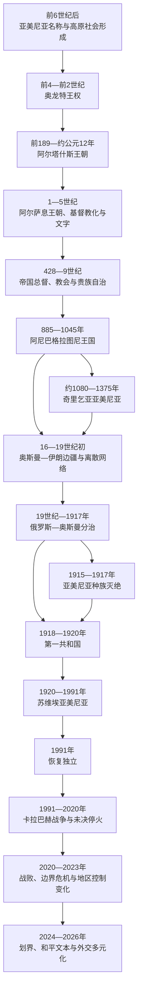

# 亚美尼亚

## 历史主线

亚美尼亚历史的连续性不等同于国家疆域或王朝连续。其核心来自亚美尼亚高原上的语言形成、王权与纳哈拉尔贵族结构、4世纪基督教化、5世纪文字与教会网络，以及王国灭亡后仍跨越帝国边界的城市、乡村和离散社群。

古代王国在伊朗与罗马之间发展；中世纪巴格拉图尼和奇里乞亚两次恢复独立王权，之后人口长期分属奥斯曼、伊朗和俄罗斯。20世纪经历种族灭绝、第一共和国、苏维埃化、独立和卡拉巴赫战争。2020年战争与2023年地区控制变化后，亚美尼亚把国家安全重点转向国际公认边界、和平条约、交通开放和外交多元化。2025年亚美尼亚与阿塞拜疆草签和平协定文本，截至2026年7月14日尚未正式签署和批准。

## 按时间排序的时期导航

| 顺序 | 阶段 | 时间 | 入口 | 简要概括 |
|---:|---|---|---|---|
| 1 | 古代亚美尼亚与基督教化 | 约前6世纪—7世纪 | [古代亚美尼亚与基督教化](/%E4%BA%BA%E6%96%87%E7%A7%91%E5%AD%A6/%E5%8E%86%E5%8F%B2/%E8%A5%BF%E4%BA%9A/%E5%8D%97%E9%AB%98%E5%8A%A0%E7%B4%A2/%E4%BA%9A%E7%BE%8E%E5%B0%BC%E4%BA%9A/%E5%8F%A4%E4%BB%A3%E4%BA%9A%E7%BE%8E%E5%B0%BC%E4%BA%9A%E4%B8%8E%E5%9F%BA%E7%9D%A3%E6%95%99%E5%8C%96.md) | 说明高原社会与族群形成、奥龙特—阿尔塔什斯—阿尔萨息王权、罗马—伊朗竞争、基督教化、字母和428年废王。 |
| 2 | 中世纪王国与帝国夹缝 | 7世纪—19世纪初 | [中世纪王国与帝国夹缝](/%E4%BA%BA%E6%96%87%E7%A7%91%E5%AD%A6/%E5%8E%86%E5%8F%B2/%E8%A5%BF%E4%BA%9A/%E5%8D%97%E9%AB%98%E5%8A%A0%E7%B4%A2/%E4%BA%9A%E7%BE%8E%E5%B0%BC%E4%BA%9A/%E4%B8%AD%E4%B8%96%E7%BA%AA%E7%8E%8B%E5%9B%BD%E4%B8%8E%E5%B8%9D%E5%9B%BD%E5%A4%B9%E7%BC%9D.md) | 从哈里发统治、巴格拉图尼复兴、拜占庭与塞尔柱冲击、奇里乞亚王国，到蒙古及奥斯曼—伊朗边疆。 |
| 3 | 俄国、苏联与独立亚美尼亚 | 19世纪初至今 | [俄国、苏联与独立亚美尼亚](/%E4%BA%BA%E6%96%87%E7%A7%91%E5%AD%A6/%E5%8E%86%E5%8F%B2/%E8%A5%BF%E4%BA%9A/%E5%8D%97%E9%AB%98%E5%8A%A0%E7%B4%A2/%E4%BA%9A%E7%BE%8E%E5%B0%BC%E4%BA%9A/%E4%BF%84%E5%9B%BD%E3%80%81%E8%8B%8F%E8%81%94%E4%B8%8E%E7%8B%AC%E7%AB%8B%E4%BA%9A%E7%BE%8E%E5%B0%BC%E4%BA%9A.md) | 俄奥分治、种族灭绝、第一共和国、苏维埃化、独立、政体变迁、卡拉巴赫战争及截至2026年的和平进程。 |

## 世系与统治者专表

| 专表 | 覆盖范围 | 使用说明 |
|---|---|---|
| [亚美尼亚古代君主世系表](/%E4%BA%BA%E6%96%87%E7%A7%91%E5%AD%A6/%E5%8E%86%E5%8F%B2/%E8%A5%BF%E4%BA%9A/%E5%8D%97%E9%AB%98%E5%8A%A0%E7%B4%A2/%E4%BA%9A%E7%BE%8E%E5%B0%BC%E4%BA%9A/%E4%BA%9A%E7%BE%8E%E5%B0%BC%E4%BA%9A%E5%8F%A4%E4%BB%A3%E5%90%9B%E4%B8%BB%E4%B8%96%E7%B3%BB%E8%A1%A8.md) | 奥龙特、阿尔塔什斯、罗马—安息竞争王位和阿尔萨息王朝至428年 | 保留共治、复位、外来扶立者、直接统治空档及古代年代争议。 |
| [亚美尼亚中世纪君主世系表](/%E4%BA%BA%E6%96%87%E7%A7%91%E5%AD%A6/%E5%8E%86%E5%8F%B2/%E8%A5%BF%E4%BA%9A/%E5%8D%97%E9%AB%98%E5%8A%A0%E7%B4%A2/%E4%BA%9A%E7%BE%8E%E5%B0%BC%E4%BA%9A/%E4%BA%9A%E7%BE%8E%E5%B0%BC%E4%BA%9A%E4%B8%AD%E4%B8%96%E7%BA%AA%E5%90%9B%E4%B8%BB%E4%B8%96%E7%B3%BB%E8%A1%A8.md) | 阿尼巴格拉图尼、瓦斯普拉坎、卡尔斯与奇里乞亚全部公认统治者 | 并立王国分表，不拼成虚假的单一王系；奇里乞亚编号以日期和亲属关系校正。 |
| [亚美尼亚国家元首、政府首脑与苏维埃实际领导人表](/%E4%BA%BA%E6%96%87%E7%A7%91%E5%AD%A6/%E5%8E%86%E5%8F%B2/%E8%A5%BF%E4%BA%9A/%E5%8D%97%E9%AB%98%E5%8A%A0%E7%B4%A2/%E4%BA%9A%E7%BE%8E%E5%B0%BC%E4%BA%9A/%E4%BA%9A%E7%BE%8E%E5%B0%BC%E4%BA%9A%E5%9B%BD%E5%AE%B6%E5%85%83%E9%A6%96%E3%80%81%E6%94%BF%E5%BA%9C%E9%A6%96%E8%84%91%E4%B8%8E%E8%8B%8F%E7%BB%B4%E5%9F%83%E5%AE%9E%E9%99%85%E9%A2%86%E5%AF%BC%E4%BA%BA%E8%A1%A8.md) | 1918年以来议会负责人、总理、苏维埃法定首长、第一书记、总统与实际权力结构 | 按政体和角色拆表，现任信息核验至2026年7月14日。 |

## 重要转折与时间节点

| 时间 | 转折 | 主线意义 |
|---|---|---|
| 前6世纪后半叶 | 外部文献明确提到亚美尼亚 | 地区和人群名称进入可证历史，不能倒推成自远古不变的国家。 |
| 前189年 | 阿尔塔什斯一世建立王朝 | 高原整合加强，城市、土地和王室制度发展。 |
| 前95—前55年 | 提格兰二世统治 | 利用西亚权力真空短暂建立区域帝国，随后在罗马压力下收缩。 |
| 传统301年／研究常取约314年 | 王室基督教化 | 教会成为跨政治边界的长期制度；具体日期仍有学术争议。 |
| 约405／406年 | 梅斯罗普·马什托茨创制亚美尼亚字母 | 翻译、教育和历史书写强化共同体连续性。 |
| 428年 | 萨珊废除东部亚美尼亚王位 | 古代君主制终结，贵族和教会继续在马兹班制度下运作。 |
| 885年前后 | 阿硕特一世获王号 | 巴格拉图尼王国恢复，阿尼时代随后到来。 |
| 1045年 | 拜占庭吞并阿尼 | 分裂、继承协议和外部压力共同终结高原主王国。 |
| 1198／1199年 | 奇里乞亚升格王国 | 亚美尼亚政治中心接入地中海与十字军外交体系。 |
| 1375年 | 西斯陷落 | 奇里乞亚王国灭亡，离散网络进一步扩大。 |
| 1604年 | 萨法维强制迁徙 | 高原人口受灾，新朱尔法商网在被迫迁移后形成。 |
| 1828年 | 《土库曼恰伊条约》 | 东亚美尼亚主要地区转属俄罗斯，人口迁移和帝国分治重组。 |
| 1915—1917年 | 亚美尼亚种族灭绝 | 奥斯曼亚美尼亚社会大部被摧毁，全球离散与记忆政治形成。 |
| 1918年 | 第一共和国成立 | 在战争与难民危机中建立现代议会国家。 |
| 1920年 | 苏维埃化 | 第一共和国在土耳其进攻和红军压力下终结。 |
| 1988年 | 卡拉巴赫运动与斯皮塔克地震 | 民族冲突、人道灾难和苏联崩解叠加。 |
| 1991年 | 独立公投 | 恢复主权，战争、封锁和经济转型同步开始。 |
| 2018年 | 天鹅绒革命 | 非暴力群众运动完成权力更替，议会制成为实际政体。 |
| 2020年 | 第二场卡拉巴赫战争 | 亚美尼亚一方失去大部原控制区，安全体系受重创。 |
| 2023年 | 阿塞拜疆重新控制纳戈尔诺—卡拉巴赫 | 当地亚美尼亚人口几乎整体外逃，旧事实政权终止。 |
| 2025—2026年 | 和平文本草签、明斯克进程关闭与交通框架 | 从冲突调停转向双边建交、划界和交通安排，但正式和平条约尚未生效。 |

## 阅读提示

- 古代“大亚美尼亚”、中世纪诸王国、奥斯曼／伊朗辖区和现代共和国范围不同，不能把历史地理直接投射为现代领土主张。
- 王朝更替只是主线之一。贵族、教会、城市贸易、村社、迁徙与离散网络常在没有独立王国时承担连续性。
- 基督教化传统年份、古代世系、共治及中世纪小王国年代存在争议；专表用“约”、空档和并列口径明确材料边界。
- 1915年事件应区分战时背景、国家政策、执行过程、受害人口和长期后果，不以“双方冲突”抹平驱逐与大规模杀戮。
- 纳戈尔诺—卡拉巴赫须分别说明苏联行政地位、事实控制、国际承认、战争结果与人口变化；这些概念不能互相替代。
- 现代“至今”信息的核验截止时间为2026年7月14日。

## 上级与相关区域

- 直接上级：[南高加索](/%E4%BA%BA%E6%96%87%E7%A7%91%E5%AD%A6/%E5%8E%86%E5%8F%B2/%E8%A5%BF%E4%BA%9A/%E5%8D%97%E9%AB%98%E5%8A%A0%E7%B4%A2/README.md)
- 宏观区域：[西亚](/%E4%BA%BA%E6%96%87%E7%A7%91%E5%AD%A6/%E5%8E%86%E5%8F%B2/%E8%A5%BF%E4%BA%9A/README.md)
- 历史总览：[历史](/%E4%BA%BA%E6%96%87%E7%A7%91%E5%AD%A6/%E5%8E%86%E5%8F%B2/README.md)
