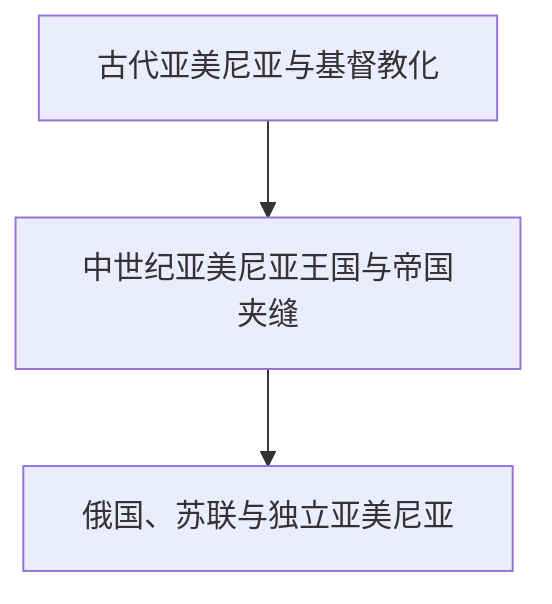

# 亚美尼亚

## 历史主线

亚美尼亚历史以亚美尼亚高原、亚美尼亚语、亚美尼亚使徒教会和跨帝国离散网络为核心。古代王国在罗马与伊朗之间发展，4世纪初形成基督教王国传统；中世纪政治中心多次转移，近代人口分属奥斯曼与俄罗斯帝国；20世纪经历大规模暴力、短暂独立、苏维埃化和1991年后国家重建。

## 演变图

## 按时间排序的时期导航

| 顺序 | 阶段 | 时间 | 入口 | 简要概括 |
|---:|---|---|---|---|
| 1 | 古代亚美尼亚与基督教化 | 约前6世纪-7世纪 | [古代亚美尼亚与基督教化](/%E4%BA%BA%E6%96%87%E7%A7%91%E5%AD%A6/%E5%8E%86%E5%8F%B2/%E8%A5%BF%E4%BA%9A/%E5%8D%97%E9%AB%98%E5%8A%A0%E7%B4%A2/%E4%BA%9A%E7%BE%8E%E5%B0%BC%E4%BA%9A/%E5%8F%A4%E4%BB%A3%E4%BA%9A%E7%BE%8E%E5%B0%BC%E4%BA%9A%E4%B8%8E%E5%9F%BA%E7%9D%A3%E6%95%99%E5%8C%96.md) | 古代亚美尼亚王国在伊朗、希腊化和罗马世界之间形成，基督教与文字传统成为长期文化核心。 |
| 2 | 中世纪亚美尼亚王国与帝国夹缝 | 7世纪-19世纪初 | [中世纪亚美尼亚王国与帝国夹缝](/%E4%BA%BA%E6%96%87%E7%A7%91%E5%AD%A6/%E5%8E%86%E5%8F%B2/%E8%A5%BF%E4%BA%9A/%E5%8D%97%E9%AB%98%E5%8A%A0%E7%B4%A2/%E4%BA%9A%E7%BE%8E%E5%B0%BC%E4%BA%9A/%E4%B8%AD%E4%B8%96%E7%BA%AA%E7%8E%8B%E5%9B%BD%E4%B8%8E%E5%B8%9D%E5%9B%BD%E5%A4%B9%E7%BC%9D.md) | 阿拉伯、拜占庭、塞尔柱、蒙古、伊朗和奥斯曼势力更替，巴格拉图尼与奇里乞亚王国维持政治传统。 |
| 3 | 俄国、苏联与独立亚美尼亚 | 19世纪初至今 | [俄国、苏联与独立亚美尼亚](/%E4%BA%BA%E6%96%87%E7%A7%91%E5%AD%A6/%E5%8E%86%E5%8F%B2/%E8%A5%BF%E4%BA%9A/%E5%8D%97%E9%AB%98%E5%8A%A0%E7%B4%A2/%E4%BA%9A%E7%BE%8E%E5%B0%BC%E4%BA%9A/%E4%BF%84%E5%9B%BD%E3%80%81%E8%8B%8F%E8%81%94%E4%B8%8E%E7%8B%AC%E7%AB%8B%E4%BA%9A%E7%BE%8E%E5%B0%BC%E4%BA%9A.md) | 东西亚美尼亚分属俄奥帝国，20世纪经历大规模灾难、共和国、苏维埃化、独立和地区冲突。 |

## 重要转折与时间节点

| 时间 | 转折 |
|---|---|
| 约前189年 | 阿尔塔什斯王朝建立，古代亚美尼亚王国走向强盛。 |
| 传统301年 | 亚美尼亚王权接受基督教，形成重要国家与教会传统。 |
| 约405年 | 梅斯罗普·马什托茨创制亚美尼亚字母。 |
| 885年 | 巴格拉图尼亚美尼亚王国获得承认。 |
| 1828年 | 《土库曼恰伊条约》后俄国控制东亚美尼亚主要地区。 |
| 1918年 | 亚美尼亚第一共和国成立。 |
| 1920年 | 亚美尼亚苏维埃化。 |
| 1991年 | 亚美尼亚恢复独立。 |

## 阅读提示

- 古代地名和政体范围不等同于现代国界，民族形成也不是从单一古代王国直线延续。
- 帝国统治、教会或伊斯兰制度、地方贵族、城市贸易和山地社群需要放在同一框架中理解。
- 现代冲突应分别说明苏联行政边界、人口变化、战争过程、实际控制和国际承认。

## 上级与相关区域

- [南高加索](/%E4%BA%BA%E6%96%87%E7%A7%91%E5%AD%A6/%E5%8E%86%E5%8F%B2/%E8%A5%BF%E4%BA%9A/%E5%8D%97%E9%AB%98%E5%8A%A0%E7%B4%A2/README.md)
- [西亚](/%E4%BA%BA%E6%96%87%E7%A7%91%E5%AD%A6/%E5%8E%86%E5%8F%B2/%E8%A5%BF%E4%BA%9A/README.md)

## 目录层级

- 直接上级：[南高加索](/%E4%BA%BA%E6%96%87%E7%A7%91%E5%AD%A6/%E5%8E%86%E5%8F%B2/%E8%A5%BF%E4%BA%9A/%E5%8D%97%E9%AB%98%E5%8A%A0%E7%B4%A2/README.md)
- 宏观区域：[西亚](/%E4%BA%BA%E6%96%87%E7%A7%91%E5%AD%A6/%E5%8E%86%E5%8F%B2/%E8%A5%BF%E4%BA%9A/README.md)
- 历史总览：[历史](/%E4%BA%BA%E6%96%87%E7%A7%91%E5%AD%A6/%E5%8E%86%E5%8F%B2/README.md)
