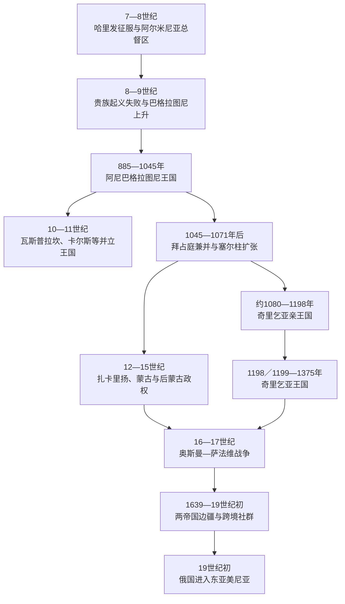

# 中世纪亚美尼亚王国与帝国夹缝

## 时间

7世纪至19世纪初

## 概括

7世纪阿拉伯征服没有立即消灭亚美尼亚贵族与教会。哈里发通过总督、贡赋和地方军役统治，巴格拉图尼等纳哈拉尔家族在帝国边疆竞争中重新积累权力，885年前后恢复获国际承认的王国。阿尼成为商贸与宗教中心，但王族分封、并立王国、拜占庭继承政策和塞尔柱扩张使高原王权在11世纪瓦解。

部分贵族和人口向奇里乞亚迁移，约1080年建立亲王国，1198／1199年升格为王国。它依靠地中海贸易、十字军联盟和蒙古合作生存，最终因马穆鲁克持续进攻、联盟失效和内部继承危机于1375年灭亡。高原本土则先后处于塞尔柱、格鲁吉亚—扎卡里扬、蒙古、帖木儿、黑羊与白羊等权力之下。

16世纪以后，亚美尼亚高原成为奥斯曼与萨法维／后继伊朗王朝的边疆。1639年边界大体固定后，亚美尼亚人主要分处两个帝国，通过教会、城市行会、乡村共同体和离散商网维持联系。1604年强制迁徙造成巨大破坏，却也促成新朱尔法跨欧亚商业网络。19世纪俄国南进改变东亚美尼亚归属，开启下一阶段。

## 主要政治阶段

| 阶段 | 时间 | 主要统治结构 | 历史特点 |
|---|---|---|---|
| 哈里发征服与阿尔米尼亚总督区 | 7—9世纪 | 总督、税吏、驻军与纳哈拉尔贵族并存 | 地方家族在纳贡和反抗间调整，教会维持社会组织。 |
| 巴格拉图尼及并立王国 | 885—11世纪中叶 | 阿尼“万王之王”、支系国王、贵族与教会 | 城市和商路繁荣，但复合王权逐步分裂。 |
| 拜占庭兼并与塞尔柱扩张 | 11世纪 | 拜占庭行省、边防军区、塞尔柱苏丹及埃米尔 | 王室被迁走、边防重组失败，战争和移民扩大。 |
| 奇里乞亚亲王国／王国 | 约1080—1375年 | 鲁本、海屯与吕西尼昂诸王；贵族、教会与港口城市 | 地中海化、十字军外交和蒙古联盟；后遭马穆鲁克蚕食。 |
| 扎卡里扬、蒙古及后蒙古政权 | 12世纪末—15世纪 | 格鲁吉亚宗主下亲王、蒙古税制、地方贵族与修道院 | 一度重建城市和商路，后受重税、战争和帖木儿入侵破坏。 |
| 奥斯曼—伊朗边疆 | 16世纪—19世纪初 | 奥斯曼行省与米利特、伊朗省区／汗国、教会及地方领主 | 边界战争、迁徙与离散贸易并行；东部最终转入俄罗斯。 |

## 阿拉伯征服与贵族自治

640年代起，阿拉伯军队进入亚美尼亚高原。早期哈里发更关心贡赋、交通和军事服从，地方贵族可在纳贡后保留领地、骑兵与基督教信仰。亚美尼亚、格鲁吉亚东部和高加索阿尔巴尼亚部分地区后来被整合为“阿尔米尼亚”总督区，首府和行政重心随时期变化，德温长期是重要城市。

统治并不稳定。高税、驻军、王朝内战和拜占庭反攻都能引发贵族反叛。705年前后的纳希切万处决贵族事件重创若干家族；8世纪起马米科尼扬力量下降，较擅长在哈里发体制内管理税收、婚姻和土地的巴格拉图尼上升。774—775年大起义失败后，旧军事贵族进一步衰落，巴格拉图尼反而接收部分土地和领导地位。

9世纪阿拔斯中央权威削弱，地方埃米尔与帝国官员竞争。阿硕特·巴格拉图尼先获“亲王之亲王”地位，控制税收、军役和贵族仲裁。哈里发希望借他稳定边疆，拜占庭也希望争取基督教盟友；885年前后双方都承认阿硕特一世为王，形成巴格拉图尼复兴。

## 巴格拉图尼王国的建立与鼎盛

### 复合王权而非单一中央集权

阿尼国王通过王号、婚姻、教会赞助和军事仲裁取得优先地位，但纳哈拉尔仍保有世袭土地与军队。瓦斯普拉坎的阿尔茨鲁尼、卡尔斯的巴格拉图尼支系、洛里和休尼克等地先后称王。阿尼王有时使用“万王之王”，表示礼仪上的首位，而不是完全吞并所有支系。

阿硕特二世“铁王”在10世纪初内战和萨吉王朝压力后恢复王权。阿硕特三世961年迁都阿尼，加吉克一世时期王国达到高峰。阿尼位于黑海、伊朗、美索不达米亚和安纳托利亚商路之间，城墙、市场、教堂和工匠群支撑王室税收。修道院既是宗教中心，也是地主、学校、抄写和地方救济机构。

### 分裂与拜占庭兼并

繁荣没有消除结构矛盾。支系王国把原本可调整的分封变为永久王位，国王去世时兄弟、侄子和贵族都可能寻求拜占庭或穆斯林埃米尔支持。加吉克一世1020年去世后，长子霍夫汉内斯—松巴特与幼子阿硕特四世分治；前者在拜占庭压力下同意死后转交领地，协议是否出于强迫仍有争议。

1040—1042年两兄弟相继死亡，幼年加吉克二世获部分贵族拥立。拜占庭以继承协议和军事压力要求阿尼，加吉克被诱至君士坦丁堡后无法返回，1045年城内派系交出首都。瓦斯普拉坎早在1021／1022年以领地交换方式并入拜占庭，卡尔斯1065年也走同一路径。王国灭亡因此不是“塞尔柱一战灭国”，而是分裂、继承协议和拜占庭吸收先拆掉政治中心。

## 塞尔柱冲击与人口迁移

拜占庭把亚美尼亚王族、贵族和兵户迁往帝国内地，以希腊官员和新的军区体系接管边疆，却未能稳定替代原有地方军事网络。塞尔柱突厥部队自11世纪中叶持续袭入，1064年攻陷阿尼。1071年曼齐刻尔特战役后，拜占庭内战和边防崩溃加速各地埃米尔、游牧集团与地方领主争夺。

人口变化是长期且不均匀的。部分亚美尼亚贵族、军人、教士、农民和商人向卡帕多西亚、幼发拉底河西部、叙利亚和奇里乞亚移动；另一些留在高原，在新统治者下缴税、经营城市或依附山地要塞。不能把这一过程写成某一年所有亚美尼亚人“离开故土”，也不能忽略突厥语游牧与定居人口逐步进入所造成的社会重组。

## 奇里乞亚亲王国的崛起

### 山地根据地与十字军网络

约1080年鲁本一世在托罗斯山地建立要塞权力。山地易守、拜占庭内战和塞尔柱—地方埃米尔竞争给新政权留下空间。第一次十字军东征后，鲁本家族同安条克、埃德萨等十字军政权建立婚姻、军事与贸易关系，也同它们争夺城堡、平原和港口。

拜占庭1137年远征一度俘获列翁一世并取消亲王权，但托罗斯二世逃归后重建政权。姆莱赫甚至同穆斯林的努尔丁结盟对抗拜占庭和十字军，说明奇里乞亚外交以生存和权力为中心，不能简单等同“基督教共同阵线”。

列翁二世夺取更多平原和港口，在教廷、神圣罗马皇帝与拜占庭多方认可竞争中于1198／1199年加冕为王。王国以西斯为政治中心，以阿亚斯等港口连接意大利商人和地中海贸易；关税、转口贸易、铸币与农业平原支撑王权。

### 海屯王朝与蒙古联盟

列翁无成年男性继承人，女儿扎贝尔成为合法女王。其首任丈夫菲利普因亲拉丁政策和权力斗争被废，第二任丈夫海屯通过婚姻建立海屯王朝。扎贝尔不是被丈夫取代的“过渡者”，而是王位合法性的核心。

13世纪蒙古西征改变力量对比。海屯一世主动赴蒙古宫廷结盟，希望借蒙古压制罗姆苏丹国和马穆鲁克。联盟初期扩大外交空间，也使王国卷入蒙古—马穆鲁克战争。1266年马穆鲁克在马里战役重创奇里乞亚，俘获王子并破坏平原；蒙古援助此后时到时无，无法成为可靠安全保证。

### 衰落与1375年灭亡

13世纪末至14世纪，王室出现多次退位、复位、兄弟篡位、幼主摄政和亲拉丁／本地教会派冲突。海屯二世多次退位复位，松巴特和康斯坦丁短暂夺权；吕西尼昂支系入主又加深宫廷分歧。与此同时，马穆鲁克逐步夺取港口、平原、城堡和税源。

奇里乞亚的衰落应分层理解：

| 层次 | 因素 |
|---|---|
| 结构因素 | 狭小王国依赖港口、少数平原与贵族要塞；王室继承和教会路线分歧反复消耗军政能力。 |
| 外部压力 | 马穆鲁克拥有更大人口、财政和持续动员能力；蒙古帝国分裂后联盟价值下降。 |
| 经济收缩 | 港口和农业区受袭，商人改换路线，赔款和贡赋削弱守城资源。 |
| 直接触发 | 1374年列翁五世／六世即位时仅余少数据点；1375年马穆鲁克围攻西斯，守军粮尽投降，末王被俘。 |

王国灭亡后，亚美尼亚教会与社区没有终结。王室成员和商人进入塞浦路斯、威尼斯、热那亚、法国及黎凡特其他城市，奇里乞亚法律、艺术和手抄本传统进入更广的离散网络。

## 高原本土：格鲁吉亚、扎卡里扬与蒙古统治

12世纪末，格鲁吉亚王国扩张到亚美尼亚北部，亚美尼亚—库尔德血统的扎卡里扬兄弟在格鲁吉亚王权下收复阿尼等城市，作为世袭军事贵族治理。城市、修道院和商路一度复兴，但这不是统一亚美尼亚王国复活；扎卡里扬是格鲁吉亚宗主体系中的地方亲王。

1230年代蒙古征服南高加索。多数地方领主在纳贡、提供军队和人口登记后保留部分领地；蒙古治下的欧亚商路在某些时期促进贸易，重税、征兵和汗位战争又造成破坏。14世纪伊儿汗国瓦解后，札剌亦儿、楚邦家族及地方政权竞争；帖木儿多次入侵和强制迁徙进一步打击城市与农业。15世纪黑羊、白羊部落联盟相继控制高原，亚美尼亚政治权力主要由地方教会、山地贵族、城市共同体和外部统治者分享。

1441年，亚美尼亚教会最高座从奇里乞亚传统中心恢复到埃奇米阿津。教会内部仍有西斯等教座并存，但埃奇米阿津成为高原与离散社群的重要连接点。政治主权缺失时，教会通过主教区、修道院、学校、婚姻与财产法维持共同体秩序。

## 奥斯曼—伊朗边疆的形成

### 16世纪战争与分区

萨法维建立后，奥斯曼与伊朗争夺东安纳托利亚、阿拉斯河谷、格鲁吉亚和阿塞拜疆。1514年查尔迪兰战役使奥斯曼取得战略优势，但边界此后仍反复移动。1555年《阿马西亚和约》与1639年《祖哈卜和约》逐步把西亚美尼亚大部置于奥斯曼、东亚美尼亚置于萨法维及后继伊朗政权之下。

边界不是民族分界线。两侧都有亚美尼亚、库尔德、突厥语、波斯语和其他群体；行省、部落、教区和商路相互交错。战争常带来围城、征粮、人口外逃和统治者强制迁徙。

### 1604年强制迁徙与新朱尔法

奥斯曼反攻时，沙阿阿拔斯一世在阿拉斯河沿线实行焦土和强制迁移，试图让敌军得不到粮食与人口资源。大量居民被迫越过阿拉斯河，途中死亡；朱尔法等城镇遭破坏。这是国家军事策略造成的人口灾难，不能只以“商业迁移”美化。

部分朱尔法商人被安置在伊斯法罕的新朱尔法，获相对自治、宗教空间和王室商业特许。他们建立连接印度洋、伊朗、俄罗斯、奥斯曼、意大利与西北欧的丝绸和金融网络。繁荣来自专业知识与跨境亲族，也以被迫迁徙和萨法维国家利用商人为前提；乡村迁民的处境通常远差于精英商人。

### 奥斯曼制度与亚美尼亚社群

奥斯曼帝国通过行省官员、地方军役和宗教共同体机构治理。君士坦丁堡亚美尼亚宗主教区逐步承担婚姻、教育、慈善和同国家交涉等职能，后世常概括为“米利特”，但其权力并非从征服第一天就固定成型。地方主教、修道院、行会、村社与显贵共同分担治理，不同地区差异很大。

多数亚美尼亚农民同其他乡民一样承担土地税、什一、劳役和地方加派；基督徒还受身份性税负与法律不平等影响。城市工匠、建筑师、商人和金融家可获得重要职位或财富，但精英成功不能代表全部社群生活。

### 伊朗辖区、汗国与地方梅利克

东亚美尼亚在萨法维瓦解后经历奥斯曼占领、纳迪尔沙重建伊朗权力、卡扎尔王朝兴起等变动。埃里温与纳希切万等汗国由伊朗任命或认可的汗治理，城市与乡村税收通过地方官、地主、宗教机构和村社征集。卡拉巴赫山地若干亚美尼亚梅利克保留世袭权力，但彼此竞争，且受更大汗国与伊朗王权制约，不能等同独立民族国家。

18世纪以色列·奥里、教会人士和商人曾向欧洲与俄罗斯寻求援助；这反映精英希望借外部强权改善安全，并不意味着整个社会已有统一的现代民族国家方案。俄罗斯南进、格鲁吉亚并入和俄伊战争才真正改变地区力量结构。

## 王朝世系与统治结构

完整王表见[亚美尼亚中世纪君主世系表](/%E4%BA%BA%E6%96%87%E7%A7%91%E5%AD%A6/%E5%8E%86%E5%8F%B2/%E8%A5%BF%E4%BA%9A/%E5%8D%97%E9%AB%98%E5%8A%A0%E7%B4%A2/%E4%BA%9A%E7%BE%8E%E5%B0%BC%E4%BA%9A/%E4%BA%9A%E7%BE%8E%E5%B0%BC%E4%BA%9A%E4%B8%AD%E4%B8%96%E7%BA%AA%E5%90%9B%E4%B8%BB%E4%B8%96%E7%B3%BB%E8%A1%A8.md)，其中：

- 阿尼巴格拉图尼十位公认国王全部按在位顺序列出，霍夫汉内斯—松巴特与阿硕特四世的并治不合并。
- 瓦斯普拉坎六王、卡尔斯三王分别完整列出，不误作阿尼王位的顺序继承者。
- 奇里乞亚从鲁本一世起的十位亲王、升格后的全部女王、国王、共同统治者、篡位者和复位段均保留。
- 亲王与国王的列翁、康斯坦丁编号在不同传统中不一，世系表以姓名、日期和关系消除歧义。
- 塔希尔—佐拉盖特、休尼克等后期碎片化王权不以争议年代伪造无断点名单，说明材料边界和统治结构。

## 重要事件

| 时间 | 事件 | 过程、结果与长期影响 |
|---|---|---|
| 640年代起 | 阿拉伯军进入亚美尼亚 | 以纳贡、总督和地方贵族自治逐步取代拜占庭—萨珊旧框架。 |
| 705年前后 | 纳希切万贵族处决事件 | 多个纳哈拉尔家族受重创，改变贵族力量分布。 |
| 774—775年 | 大起义失败 | 马米科尼扬等衰落，巴格拉图尼因较灵活的帝国合作而上升。 |
| 885年前后 | 阿硕特一世获王号 | 哈里发与拜占庭双重承认，巴格拉图尼王国建立。 |
| 961年 | 阿尼成为首都 | 王室、商贸和教会建设推动城市鼎盛。 |
| 1045年 | 拜占庭吞并阿尼 | 加吉克二世被扣留，贵族交城；高原主王国终结。 |
| 1064、1071年 | 塞尔柱攻陷阿尼与曼齐刻尔特战役 | 拜占庭边防崩溃，人口与政治中心向西转移。 |
| 1198／1199年 | 奇里乞亚升格王国 | 地中海外交和贸易体系成熟。 |
| 1230年代 | 蒙古进入高原 | 地方领主纳贡保地，贸易机会与重税、征兵并存。 |
| 1266年 | 马里战役 | 马穆鲁克重创奇里乞亚，王国开始长期领土收缩。 |
| 1375年 | 西斯陷落 | 奇里乞亚王国灭亡，王室与精英流亡，离散网络扩大。 |
| 1441年 | 埃奇米阿津教座恢复 | 高原教会中心重建，强化跨帝国宗教联系。 |
| 1514年 | 查尔迪兰战役 | 奥斯曼取得优势，亚美尼亚高原进入长期奥斯曼—伊朗竞争。 |
| 1604年 | 沙阿阿拔斯强制迁徙 | 边区人口遭灾难性迁移；新朱尔法商网随后兴起。 |
| 1639年 | 《祖哈卜和约》 | 奥斯曼—伊朗边界大体稳定，亚美尼亚人口长期分属两帝国。 |
| 1804—1828年 | 俄伊战争及条约 | 俄罗斯逐步取得东亚美尼亚，为现代阶段的帝国分治与迁移奠定条件。 |

## 演变关系

- 前一阶段：[古代亚美尼亚与基督教化](/%E4%BA%BA%E6%96%87%E7%A7%91%E5%AD%A6/%E5%8E%86%E5%8F%B2/%E8%A5%BF%E4%BA%9A/%E5%8D%97%E9%AB%98%E5%8A%A0%E7%B4%A2/%E4%BA%9A%E7%BE%8E%E5%B0%BC%E4%BA%9A/%E5%8F%A4%E4%BB%A3%E4%BA%9A%E7%BE%8E%E5%B0%BC%E4%BA%9A%E4%B8%8E%E5%9F%BA%E7%9D%A3%E6%95%99%E5%8C%96.md)。
- 完整中世纪王统：[亚美尼亚中世纪君主世系表](/%E4%BA%BA%E6%96%87%E7%A7%91%E5%AD%A6/%E5%8E%86%E5%8F%B2/%E8%A5%BF%E4%BA%9A/%E5%8D%97%E9%AB%98%E5%8A%A0%E7%B4%A2/%E4%BA%9A%E7%BE%8E%E5%B0%BC%E4%BA%9A/%E4%BA%9A%E7%BE%8E%E5%B0%BC%E4%BA%9A%E4%B8%AD%E4%B8%96%E7%BA%AA%E5%90%9B%E4%B8%BB%E4%B8%96%E7%B3%BB%E8%A1%A8.md)。
- 后一阶段：[俄国、苏联与独立亚美尼亚](/%E4%BA%BA%E6%96%87%E7%A7%91%E5%AD%A6/%E5%8E%86%E5%8F%B2/%E8%A5%BF%E4%BA%9A/%E5%8D%97%E9%AB%98%E5%8A%A0%E7%B4%A2/%E4%BA%9A%E7%BE%8E%E5%B0%BC%E4%BA%9A/%E4%BF%84%E5%9B%BD%E3%80%81%E8%8B%8F%E8%81%94%E4%B8%8E%E7%8B%AC%E7%AB%8B%E4%BA%9A%E7%BE%8E%E5%B0%BC%E4%BA%9A.md)。
- 区域比较：[伊朗、奥斯曼与俄罗斯帝国竞争](/%E4%BA%BA%E6%96%87%E7%A7%91%E5%AD%A6/%E5%8E%86%E5%8F%B2/%E8%A5%BF%E4%BA%9A/%E5%8D%97%E9%AB%98%E5%8A%A0%E7%B4%A2/%E4%BC%8A%E6%9C%97%E3%80%81%E5%A5%A5%E6%96%AF%E6%9B%BC%E4%B8%8E%E4%BF%84%E7%BD%97%E6%96%AF%E5%B8%9D%E5%9B%BD%E7%AB%9E%E4%BA%89.md)。
- 帝国背景：[伊朗历史](/%E4%BA%BA%E6%96%87%E7%A7%91%E5%AD%A6/%E5%8E%86%E5%8F%B2/%E8%A5%BF%E4%BA%9A/%E4%BC%8A%E6%9C%97/README.md)、[奥斯曼帝国](/%E4%BA%BA%E6%96%87%E7%A7%91%E5%AD%A6/%E5%8E%86%E5%8F%B2/%E8%A5%BF%E4%BA%9A/%E5%9C%9F%E8%80%B3%E5%85%B6/%E5%A5%A5%E6%96%AF%E6%9B%BC%E5%B8%9D%E5%9B%BD/README.md)。
- 上级入口：[亚美尼亚](/%E4%BA%BA%E6%96%87%E7%A7%91%E5%AD%A6/%E5%8E%86%E5%8F%B2/%E8%A5%BF%E4%BA%9A/%E5%8D%97%E9%AB%98%E5%8A%A0%E7%B4%A2/%E4%BA%9A%E7%BE%8E%E5%B0%BC%E4%BA%9A/README.md)。
