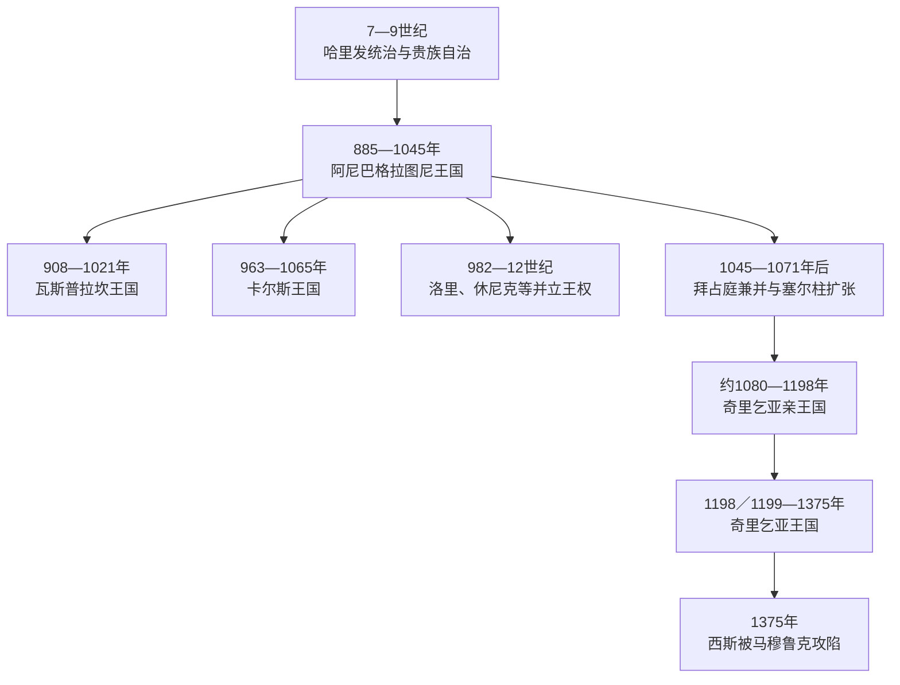

# 亚美尼亚中世纪君主世系表

## 范围与口径

本表覆盖885年巴格拉图尼王国获得承认至1375年奇里乞亚亚美尼亚王国灭亡的主要王位。中世纪亚美尼亚并非始终存在一个覆盖全体亚美尼亚人的王国：阿尼王室之外，瓦斯普拉坎、卡尔斯、塔希尔—佐拉盖特和休尼克等地先后形成并立王国；11世纪后政治中心又部分转向奇里乞亚。因此按各政体分别列系，不把并立者误排成单一继承链。

- 阿尼巴格拉图尼王表列全部公认国王，并保留1020年后兄弟分治。
- 瓦斯普拉坎与卡尔斯是材料和王统较清楚的并立王国，完整列出其国王；其他小王国以统治结构说明，不用不可靠年份制造伪完整表。
- 奇里乞亚先是鲁本家族亲王国，1198／1199年升为王国。列出全部公认亲王、国王、女王、共治配偶、复位和篡位者。
- 奇里乞亚的列翁、海屯和康斯坦丁编号因是否把亲王、共同统治者和不同语言传统计入而不同，表中以姓名和在位时间为识别核心，并在括号中说明常见异号。
- 拜占庭、塞尔柱、蒙古、马穆鲁克或伊儿汗直接控制时期不是亚美尼亚王位，不虚构国王填补空档。

## 阿尼巴格拉图尼王国

巴格拉图尼家族先在哈里发体系中取得“亲王之亲王”和税收、军事领导权。阿拔斯与拜占庭都希望以册封拉拢阿硕特一世，885年前后其王号获双方承认。王国的强盛依赖贵族联盟、商路城市和在两大帝国间保持弹性；分封支系、兄弟共治和拜占庭逐步吞并则削弱了统一。

| 顺序 | 国王 | 在位 | 与前任关系 | 关键事件与备注 |
|---:|---|---|---|---|
| 1 | **阿硕特一世“大王”** | 885—890年 | 巴格拉图尼家族首位获承认的国王 | 统一多数贵族，获阿拔斯与拜占庭承认；王都在巴加兰一带。 |
| 2 | 松巴特一世 | 890—914年 | 阿硕特一世之子 | 在阿拔斯总督与阿尔茨鲁尼竞争中失利，被萨吉王朝埃米尔处死。 |
| 3 | **阿硕特二世“铁王”** | 914—929年 | 松巴特一世之子 | 击退竞争者和地方叛乱，922年获哈里发承认“万王之王”，恢复王权。 |
| 4 | 阿巴斯一世 | 929—953年 | 阿硕特二世之弟 | 定都卡尔斯，较长和平促进经济与教会建设。 |
| 5 | **阿硕特三世“仁慈者”** | 953—977年 | 阿巴斯一世之子 | 961年迁都阿尼，城市、教会和贸易扩张；其弟穆舍格在卡尔斯另立支系。 |
| 6 | 松巴特二世 | 977—989年 | 阿硕特三世之子 | 加固阿尼城墙，维持“万王之王”名义，但并立王国继续扩大。 |
| 7 | **加吉克一世** | 989—1020年 | 松巴特二世之弟 | 阿尼王国达到文化与经济高峰，压服部分贵族并建设教堂。 |
| 8 | 霍夫汉内斯—松巴特三世 | 1020—1041年 | 加吉克一世长子 | 控制阿尼及中部；1022年前后答应死后把领地交给拜占庭，协议性质与是否自愿有争议。 |
| 9 | 阿硕特四世“勇者” | 1021—1040年 | 加吉克一世幼子；与兄长并治 | 控制东部和外缘领地；兄弟冲突使贵族与拜占庭更易介入。 |
| — | 继承危机 | 1041—1042年 | 两兄弟相继去世 | 拜占庭依据旧协议要求接收阿尼，贵族派系围绕幼年加吉克争执。 |
| 10 | **加吉克二世** | 1042—1045年 | 阿硕特四世之子 | 最后国王；被诱至君士坦丁堡后失去自由，阿尼贵族交城，王国被拜占庭吞并。 |

## 并立的巴格拉图尼时代王国

### 瓦斯普拉坎阿尔茨鲁尼王国

908年阿尔茨鲁尼家族的加吉克一世获阿拔斯方面授王号，既是阿尼王权的竞争者，也在后期承认其优先地位。王国以凡湖地区为中心，阿赫塔马尔教堂体现其资源与文化。1021／1022年塞内克里姆把王国交给拜占庭，换取塞巴斯蒂亚地区领地。

| 顺序 | 国王 | 在位 | 继承关系 | 关键事项 |
|---:|---|---|---|---|
| 1 | **加吉克一世·阿尔茨鲁尼** | 908—943／944年 | 王国建立者 | 在萨吉王朝与巴格拉图尼竞争间称王，建阿赫塔马尔宫殿与圣十字教堂。 |
| 2 | 德雷尼克—阿硕特 | 943／944—953年 | 加吉克一世之子 | 与兄弟共同分配家族领地。 |
| 3 | 阿布萨赫勒—哈马扎斯普 | 953—972年 | 德雷尼克—阿硕特之弟 | 统一兄弟领地，维持独立王位。 |
| 4 | 阿硕特—萨哈克 | 972—983年 | 阿布萨赫勒—哈马扎斯普之子 | 长子继承。 |
| 5 | 古尔根—哈奇克 | 983—1003年 | 阿硕特—萨哈克之弟 | 延续王国，面对东部穆斯林政权与拜占庭影响。 |
| 6 | 塞内克里姆—霍夫汉内斯 | 1003—1021／1022年 | 前王之弟 | 在突厥袭扰与拜占庭压力下交换领地，王国并入拜占庭。 |

### 卡尔斯／瓦南德王国

卡尔斯由阿硕特三世之弟穆舍格建立，是巴格拉图尼分支。1065年加吉克—阿巴斯在塞尔柱压力下把王国交给拜占庭，换取卡帕多西亚地产；不久区域又落入塞尔柱势力。

| 顺序 | 国王 | 在位 | 继承关系 | 关键事项 |
|---:|---|---|---|---|
| 1 | 穆舍格 | 963—984年 | 阿硕特三世之弟 | 在卡尔斯称王，通常承认阿尼王“万王之王”的优先地位。 |
| 2 | 阿巴斯 | 984—1029年 | 穆舍格之子 | 维持分支王国与城市贸易。 |
| 3 | 加吉克—阿巴斯 | 1029—1065年 | 阿巴斯之子 | 塞尔柱压力下与拜占庭交换领地，卡尔斯王位终结。 |

### 其他并立王权

| 政体 | 约存在时间 | 王族与结构 | 不列伪完整表的原因 |
|---|---|---|---|
| 塔希尔—佐拉盖特 | 约982—1118年 | 巴格拉图尼的基乌里基支系，以洛里为中心；大卫一世“无地者”等扩大势力 | 后期领地分裂为数个支系，国王、地方领主与名义宗主头衔重叠。 |
| 休尼克王国 | 987—1170年 | 休尼／西萨克家族与后继支系，以卡潘等地为中心 | 中晚期多次迁都、共治，部分统治者只控制要塞；精确王表在不同重建中差异较大。 |
| 塔龙等公国 | 9—10世纪 | 巴格拉图尼与地方贵族支系 | 多数使用亲王而非独立国王称号，后逐步交给拜占庭。 |

这些支系说明“巴格拉图尼复兴”不是现代民族国家式集中统一，而是阿尼国王享有礼仪优先、多个世袭王公分享政治空间的复合体系。

## 奇里乞亚亚美尼亚亲王

11世纪拜占庭吞并高原王国和塞尔柱扩张推动贵族、军人、教士与农民向西迁移。鲁本家族在托罗斯山地夺取要塞，以复杂的血缘主张连接巴格拉图尼传统。亲王国利用山地防御、地中海港口、十字军联盟和拜占庭—塞尔柱竞争生存。

| 顺序 | 亲王 | 在位 | 继承关系 | 关键事件与备注 |
|---:|---|---|---|---|
| 1 | **鲁本一世** | 约1080—1095年 | 王朝建立者；自称与巴格拉图尼有关 | 以山地要塞为据点建立独立权力。 |
| 2 | 康斯坦丁一世 | 1095—约1100／1102年 | 鲁本一世之子 | 同第一次十字军势力结盟，扩展平原通道。 |
| 3 | 托罗斯一世 | 约1100／1102—1129年 | 康斯坦丁一世之子 | 扩张至西斯等地，恢复城市与要塞。 |
| 4 | 康斯坦丁二世 | 1129年 | 托罗斯一世之子 | 幼年短暂继承，旋即死亡；具体月数不详。 |
| 5 | 列翁一世 | 1129／1130—1137年 | 托罗斯一世之弟 | 进入奇里乞亚平原；拜占庭皇帝约翰二世远征后被俘。 |
| — | 拜占庭直接统治 | 1137—约1144／1145年 | 无亲王 | 鲁本家族幸存成员逃亡或被囚。 |
| 6 | 托罗斯二世 | 约1144／1145—1169年 | 列翁一世之子 | 逃离君士坦丁堡后恢复山地政权，迫使拜占庭承认一定自治。 |
| 7 | 鲁本二世 | 1169—1170年 | 托罗斯二世幼子 | 由摄政保护，后被叔父姆莱赫夺权。 |
| 8 | 姆莱赫 | 1170—1175年 | 托罗斯二世之弟 | 联合叙利亚赞吉王朝努尔丁对抗拜占庭和十字军，后被贵族杀害。 |
| 9 | 鲁本三世 | 1175—1187年 | 列翁一世之孙、托罗斯三世之子 | 同安条克反复冲突；退位入修道院。 |
| 10 | **列翁二世** | 1187—1198／1199年 | 鲁本三世之弟 | 扩张港口和平原，通过教廷、神圣罗马帝国与拜占庭争取王冠；加冕后按国王序号常称列翁一世。 |

## 奇里乞亚亚美尼亚国王

| 统治段 | 国王／女王 | 在位 | 王室与继承关系 | 关键事件、共治与废立 |
|---:|---|---|---|---|
| 1 | **列翁一世“伟大者”** | 1198／1199—1219年 | 即亲王列翁二世 | 获西方王冠并把亲王国升为王国；扩大港口税收和外交，未有存活的男性继承人。 |
| 2 | **扎贝尔女王（伊莎贝拉）** | 1219—1252年 | 列翁一世之女 | 幼年继位，王位合法性经两次婚姻连接不同王族；始终是合法君主，不应只列丈夫。 |
| — | 菲利普 | 1222—1225年 | 扎贝尔首任丈夫、安条克王族 | 作为共治国王推行亲拉丁政策，遭贵族废黜并死于囚禁。 |
| 3 | **海屯一世** | 1226—1270年 | 兰普龙海屯家族；扎贝尔第二任丈夫 | 与扎贝尔共治至1252年；主动同蒙古结盟，以对抗罗姆、埃及和邻国，后让位入修道院。 |
| 4 | 列翁二世 | 1270—1289年 | 海屯一世与扎贝尔之子 | 1266年马穆鲁克入侵的后果延续；努力重建并在蒙古—马穆鲁克间求援。 |
| 5 | 海屯二世 | 1289—1293年 | 列翁二世之子 | 第一次在位，倾向修道生活和亲蒙古、亲拉丁路线。 |
| 6 | 托罗斯三世 | 1293—1296／1298年 | 海屯二世之弟 | 海屯首次退位后继承；1296年被兄弟松巴特拘禁，1298年遇害。 |
| 7 | 松巴特 | 1296—1298年 | 托罗斯三世之弟 | 趁兄长们在外夺位，获部分蒙古支持；后被另一兄弟推翻。 |
| 8 | 康斯坦丁（常编号二世或三世） | 1298—1299年 | 松巴特之弟 | 推翻松巴特后短期掌权，旋因试图控制复位的海屯而被废。 |
| 9 | 海屯二世 | 1295—1296年、1299—1303年再次在位 | 复位 | 多次退位复位；1303年把王号交给侄子，但继续摄政。 |
| 10 | 列翁三世 | 1303—1307年 | 托罗斯三世之子 | 幼年／青年国王，海屯二世摄政；二人在蒙古将领比拉尔古宴会中被杀。 |
| 11 | 奥辛 | 1307—1320年 | 列翁二世之子、海屯二世之弟 | 加强同拉丁教会合作，引发本地教会反对；对马穆鲁克压力妥协。 |
| 12 | 列翁四世 | 1320—1341年 | 奥辛之子 | 幼年由摄政掌权，后清洗权臣；在马穆鲁克和内部派系压力下遇害。 |
| — | 王位危机 | 1341—1342年 | 无公认稳定君主 | 海屯直系断绝，贵族邀请塞浦路斯吕西尼昂支系。 |
| 13 | 康斯坦丁二世／四世（居伊·吕西尼昂） | 1342—1344年 | 列翁一世外孙系后裔；塞浦路斯吕西尼昂王族 | 亲拉丁政策触发反对，被本地贵族杀害。 |
| 14 | 康斯坦丁三世／五世 | 1344—1362年 | 内格尔的海屯支系 | 本地贵族扶立；在马穆鲁克蚕食、财政和派系危机中维持残余王国。 |
| 15 | 康斯坦丁四世／六世 | 1362—1373年 | 海屯家族另一支系 | 失去更多城堡和收入；谋求同马穆鲁克议和时被反对派杀害。 |
| — | 摄政与继承争议 | 1373—1374年 | 贵族会议与王后等掌权 | 邀请吕西尼昂的列翁继承。 |
| 16 | **列翁五世／六世** | 1374—1375年 | 吕西尼昂支系；末代国王 | 1375年西斯被马穆鲁克攻陷后被俘，获释后流亡西欧，王国终结。 |

## 王国兴衰机制

### 巴格拉图尼复兴为何成功

- 阿拔斯中央控制减弱，需要可靠家族征税、供军并牵制地方埃米尔；巴格拉图尼把帝国授权转化为本地优先权。
- 亚美尼亚教会、纳哈拉尔贵族和王室形成联盟，王权通过婚姻、册封与“万王之王”礼仪协调并立支系。
- 阿尼、卡尔斯、德温和凡湖地区连接黑海、伊朗、美索不达米亚与安纳托利亚，商税和手工业支持城市繁荣。

### 高原王国为何瓦解

| 层次 | 因素 |
|---|---|
| 结构因素 | 分封给王族支系形成永久并立王国；纳哈拉尔保有军队、土地和外交关系，中央难以垄断资源。 |
| 外部压力 | 拜占庭以交换领地、继承协议和扣留国王逐步兼并；塞尔柱袭击又在兼并完成后摧毁边防平衡。 |
| 继承危机 | 加吉克一世死后兄弟分治，1040—1042年两支相继绝嗣或留下幼主。 |
| 直接终结 | 1045年加吉克二世被留在君士坦丁堡，阿尼交给拜占庭；1064年阿尼又被塞尔柱攻陷。 |

### 奇里乞亚为何崛起又灭亡

- 山地要塞和移民军事贵族提供早期防御，阿亚斯等港口把王国接入地中海贸易。
- 十字军国家、教廷、塞浦路斯、拜占庭与蒙古相互竞争，给奇里乞亚留下结盟空间；王室婚姻和多语外交提高国际地位。
- 13世纪后马穆鲁克军事压力持续，蒙古盟友无法长期提供有效防卫；港口、平原和税源逐步丧失。
- 王室多次幼主、共治、强制婚姻、兄弟篡位和教会派争，削弱征税与守城协调。
- 1375年西斯陷落是直接终点，但它是一个世纪领土收缩、财政衰竭和联盟失效的结果，不应归结为单次战败。

## 演变关系

- 历史过程、社会与帝国关系见[中世纪王国与帝国夹缝](/%E4%BA%BA%E6%96%87%E7%A7%91%E5%AD%A6/%E5%8E%86%E5%8F%B2/%E8%A5%BF%E4%BA%9A/%E5%8D%97%E9%AB%98%E5%8A%A0%E7%B4%A2/%E4%BA%9A%E7%BE%8E%E5%B0%BC%E4%BA%9A/%E4%B8%AD%E4%B8%96%E7%BA%AA%E7%8E%8B%E5%9B%BD%E4%B8%8E%E5%B8%9D%E5%9B%BD%E5%A4%B9%E7%BC%9D.md)。
- 前一时期王统见[亚美尼亚古代君主世系表](/%E4%BA%BA%E6%96%87%E7%A7%91%E5%AD%A6/%E5%8E%86%E5%8F%B2/%E8%A5%BF%E4%BA%9A/%E5%8D%97%E9%AB%98%E5%8A%A0%E7%B4%A2/%E4%BA%9A%E7%BE%8E%E5%B0%BC%E4%BA%9A/%E4%BA%9A%E7%BE%8E%E5%B0%BC%E4%BA%9A%E5%8F%A4%E4%BB%A3%E5%90%9B%E4%B8%BB%E4%B8%96%E7%B3%BB%E8%A1%A8.md)。
- 现代政体领导体系见[亚美尼亚国家元首、政府首脑与苏维埃实际领导人表](/%E4%BA%BA%E6%96%87%E7%A7%91%E5%AD%A6/%E5%8E%86%E5%8F%B2/%E8%A5%BF%E4%BA%9A/%E5%8D%97%E9%AB%98%E5%8A%A0%E7%B4%A2/%E4%BA%9A%E7%BE%8E%E5%B0%BC%E4%BA%9A/%E4%BA%9A%E7%BE%8E%E5%B0%BC%E4%BA%9A%E5%9B%BD%E5%AE%B6%E5%85%83%E9%A6%96%E3%80%81%E6%94%BF%E5%BA%9C%E9%A6%96%E8%84%91%E4%B8%8E%E8%8B%8F%E7%BB%B4%E5%9F%83%E5%AE%9E%E9%99%85%E9%A2%86%E5%AF%BC%E4%BA%BA%E8%A1%A8.md)。
- 上级入口：[亚美尼亚](/%E4%BA%BA%E6%96%87%E7%A7%91%E5%AD%A6/%E5%8E%86%E5%8F%B2/%E8%A5%BF%E4%BA%9A/%E5%8D%97%E9%AB%98%E5%8A%A0%E7%B4%A2/%E4%BA%9A%E7%BE%8E%E5%B0%BC%E4%BA%9A/README.md)。
