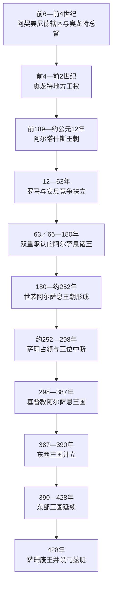

# 亚美尼亚古代君主世系表

## 范围与口径

本表整理约前6世纪至428年大亚美尼亚王权的主要统治者。古代材料来自阿契美尼德铭文、希腊罗马作者、钱币与晚出的亚美尼亚史书，资料密度很不均衡，因此“完整”是指列出学界通常承认或严肃讨论的已知统治者、共治者、复位者和帝国直接统治空档，而不是把后世传说强行补成无缝世系。

- “亚美尼亚”在早期既是地理名称，也是阿契美尼德帝国辖区；总督、地方王和独立国王的地位不可混同。
- 奥龙特王朝的姓名、亲属关系和确切年代争议最大，表中用“约”“可能”或“关系不详”标示，不采用中世纪编年史中无法由同时代材料支持的远古长名单。
- 前1世纪末至2世纪，罗马与安息反复扶立竞争者，同一年可能有两个王位主张者；复位和并立均按统治段记录。
- 387年分割后，西部与东部各有王权；390年前后西部王位终止，428年东部王位被萨珊废除。
- 国王姓名同时存在亚美尼亚、希腊、拉丁和伊朗语形式，中文译名并不完全统一。本表以常见中文音译为主，在容易混淆处补充别名。

## 奥龙特／埃鲁万德王朝与早期王权

阿契美尼德时期的亚美尼亚由帝国总督和地方贵族治理。奥龙特家族在前4—3世纪逐渐把总督权、军事资源和地方婚姻网络转化为世袭王权，但其不同支系也统治科马基尼与索菲尼等地。下表只列大亚美尼亚主线中可辨认者。

| 顺序 | 统治者 | 约在位／活动时间 | 身份与继承关系 | 关键事项与争议 |
|---:|---|---|---|---|
| 1 | 奥龙特一世 | 前401—约前344年 | 阿契美尼德亚美尼亚总督；与王室通婚 | 参与小居鲁士叛乱后的帝国政治；是否连续统治至前344年并不确定。 |
| 2 | 奥龙特二世 | 约前344—前331年 | 通常视为同族后继者 | 亚历山大东征时的亚美尼亚统治者之一；高加米拉战役相关记载与同名人物辨认有争议。 |
| — | 米特里涅斯 | 前331年后 | 原萨第斯守将，向亚历山大投降后受命管理亚美尼亚 | 是否真正控制整个亚美尼亚、是否属于奥龙特家族均不明，故不编为世袭国王。 |
| 3 | 奥龙特三世 | 约前321—约前260年 | 奥龙特家族；与马其顿继业者时代相接 | 在塞琉古势力与地方自主之间维持王权，确切起讫年为重建年代。 |
| 4 | 萨梅斯 | 约前260年前后 | 可能为奥龙特三世之子 | 亦与科马基尼王系相连；大亚美尼亚实际统治范围不详。 |
| 5 | 阿尔萨梅斯 | 约前260—约前228年 | 可能继承萨梅斯 | 建立或扩建阿尔萨莫萨塔等城市；同名人物与支系关系存在争议。 |
| 6 | 克塞尔克塞斯 | 约前228—前212年 | 通常视为阿尔萨梅斯之子 | 受塞琉古安条克三世压力，后与其家族联姻；约前212年遇害。 |
| 7 | 阿布狄萨雷斯 | 前3世纪末 | 可能为同一王族的短期统治者 | 主要由钱币得知，统治区域可能在索菲尼或邻近地区，不能确定为全亚美尼亚国王。 |
| 8 | 奥龙特四世 | 约前212—前200／前189年 | 奥龙特王朝末期统治者 | 以埃鲁万达沙特为中心；被塞琉古体系中的阿尔塔什斯取代，具体年份与过程有争议。 |

## 阿尔塔什斯王朝

前189年塞琉古王安条克三世在马格尼西亚战败后，原将领阿尔塔什斯与索菲尼的扎里亚德里斯获罗马承认而称王。阿尔塔什斯王朝整合阿拉斯河谷和高原诸贵族，在提格兰二世时成为短暂的区域帝国；其扩张依赖塞琉古衰落、安息暂时受挫和同本都结盟，罗马东进后迅速收缩。

| 顺序 | 君主 | 在位 | 与前任关系 | 关键事件／备注 |
|---:|---|---|---|---|
| 1 | **阿尔塔什斯一世** | 前189—前160年 | 王朝建立者；自称与奥龙特家族相连 | 扩张大亚美尼亚，建立阿尔塔沙特，立阿拉米语界碑以整顿土地与税源。 |
| 2 | 阿尔塔瓦兹德一世 | 前160—约前115年 | 阿尔塔什斯一世之子 | 面临安息扩张；王室成员提格兰被送往安息为质。 |
| 3 | 提格兰一世 | 约前115—前95年 | 阿尔塔瓦兹德一世之弟 | 维持王国，通常被视为提格兰二世之父。 |
| 4 | **提格兰二世“大帝”** | 前95—前55年 | 提格兰一世之子；由安息释放后即位 | 兼并索菲尼，控制北美索不达米亚、叙利亚等地；与本都米特里达梯六世结盟。前69年后受罗马进攻，前66年向庞培议和并保留本土王位。 |
| 5 | 阿尔塔瓦兹德二世 | 前55—前34年 | 提格兰二世之子 | 在罗马与安息间周旋；克拉苏远征失败后转与安息联姻，后被马克·安东尼俘获，约前30年被处死。 |
| 6 | 阿尔塔什斯二世 | 前34—前20年 | 阿尔塔瓦兹德二世之子 | 借安息支持复位，后在亲罗马势力推动下被杀。 |
| 7 | 提格兰三世 | 前20—前8年 | 阿尔塔瓦兹德二世之子、阿尔塔什斯二世之弟 | 长期居罗马后由奥古斯都扶立，象征罗马对继承的干预。 |
| 8 | 提格兰四世与埃拉托 | 前8—前5年 | 提格兰三世子女；兄妹共治 | 未获罗马预先认可；前5年被取代。埃拉托是明确的共同统治者，不应从王表中删除。 |
| 9 | 阿尔塔瓦兹德三世 | 前5—前2年 | 王族旁支；罗马扶立 | 亲罗马政策引发反对，被驱逐。 |
| 10 | 提格兰四世与埃拉托 | 前2年—约公元1年 | 复位 | 提格兰四世约公元1年在北方战争中死亡，埃拉托一度退位。 |
| 11 | 阿里奥巴尔扎内斯 | 公元2—4年 | 米底阿特罗帕特王族；奥古斯都扶立 | 不属阿尔塔什斯父系，是罗马为稳定王位引入的外来王。 |
| 12 | 阿尔塔瓦兹德四世 | 4—6年 | 阿里奥巴尔扎内斯之子 | 遭地方反抗杀害。 |
| 13 | 提格兰五世与埃拉托 | 6—约12年 | 提格兰五世为希律王族外孙；埃拉托再度共治 | 罗马安排的联合统治未能建立稳固新王朝；约12年后阿尔塔什斯时代终结。 |

## 罗马—安息竞争下的王位

阿尔塔什斯主线断绝后，王位由安息阿尔萨息王子、罗马客户王族及本地候选人交替占据。63年朗代亚安排确立折衷：国王原则上出自安息阿尔萨息家族，但须得到罗马认可。66年梯里达底一世赴罗马由尼禄加冕，这不是单纯“罗马征服”，而是双重合法性的制度化。

| 统治段 | 君主／状态 | 在位 | 来源与继承关系 | 关键事项 |
|---:|---|---|---|---|
| 1 | 沃诺内斯一世 | 约12—16年 | 被废的安息王；罗马支持 | 因安息反对而退出亚美尼亚。 |
| — | 王位空缺与竞争 | 16—18年 | 无稳定国王 | 罗马与安息谈判。 |
| 2 | 阿尔塔什斯三世（芝诺） | 18—34年 | 本都王族；罗马扶立并获本地支持 | 在日耳曼尼库斯主持下加冕，采用亚美尼亚王号。 |
| 3 | 阿尔萨克一世 | 34—35年 | 安息王阿尔达班二世之子 | 被安息扶立，旋遭毒杀。 |
| 4 | 奥罗德 | 35年、约37—42年 | 阿尔萨克一世之兄弟 | 两次争夺王位，实际控制与年份均和罗马候选人重叠。 |
| 5 | 米特里达梯 | 35—37年、42—51年 | 高加索伊比利亚王族；罗马支持 | 首次被召回，后复位；最终被侄子拉达米斯杀害。 |
| 6 | 拉达米斯 | 51—53年、54—55年 | 米特里达梯之侄、女婿；伊比利亚王子 | 以暴力夺位，遭本地反抗和安息入侵；最终逃回伊比利亚。 |
| 7 | **梯里达底一世** | 52／53—60年、62／63—约88年 | 安息王沃洛加西斯一世之弟 | 与罗马争战后依朗代亚安排复位；66年赴罗马加冕，奠定阿尔萨息王权模式。 |
| 8 | 提格兰六世 | 60—62年 | 卡帕多西亚—希律王族；罗马扶立 | 进攻安息附属地引发反攻，被梯里达底取代。 |
| 9 | 萨纳特鲁克 | 约88—约110年 | 阿尔萨息家族，确切亲属关系有争议 | 统治年代主要依后世与外部资料重建。 |
| 10 | 阿克西达雷斯 | 约110—113年 | 安息王帕科罗斯二世之子 | 未经罗马同意被立，引发图拉真战争。 |
| 11 | 帕尔塔马西里斯 | 113—114年 | 阿克西达雷斯之兄弟 | 向图拉真请封后被废，离营途中死亡。 |
| — | 罗马行省统治 | 114—117年 | 图拉真直接兼并 | 哈德良即位后放弃永久兼并。 |
| 12 | 沃洛加西斯一世（亚美尼亚） | 约117—约140年 | 阿尔萨息王子；与安息同名王须区分 | 在罗马撤出后恢复附庸王权，年代仍有讨论。 |
| 13 | 索海穆斯 | 约140—161年、164—约180年 | 埃梅萨王族并具阿尔萨息血缘；罗马元老 | 两次在位；第二次由罗马—安息战争后恢复。 |
| 14 | 帕科罗斯 | 161—163年 | 安息扶立的阿尔萨息王子 | 罗马反攻后被逐。 |

## 世袭阿尔萨息王朝及王位终结

沃洛加西斯二世以后，亚美尼亚终于形成较稳定的本地阿尔萨息父系。萨珊王朝取代安息后，亚美尼亚王室与伊朗新王朝从亲族网络转为竞争关系；4世纪基督教化又强化了同罗马世界的宗教联系。王权同时受到萨珊／罗马干预与纳哈拉尔世袭贵族制约。

| 顺序 | 君主／状态 | 在位 | 与前任关系 | 关键事件与备注 |
|---:|---|---|---|---|
| 1 | 沃洛加西斯二世 | 约180—191年 | 阿尔萨息王子；建立可连续追踪的本地父系 | 191年又成为安息大王沃洛加西斯五世，亚美尼亚王位由后裔延续。 |
| 2 | 霍斯罗夫一世 | 约191／198—216／217年 | 沃洛加西斯二世之子 | 同罗马维持关系；年代因其父兼任安息王而有不同编排。 |
| 3 | 梯里达底二世 | 217—约252年 | 霍斯罗夫一世之子 | 萨珊取代安息后继续抵抗；3世纪中叶王权被沙普尔一世军队打断。 |
| — | 萨珊占领与王位中断 | 约252—287／298年 | 无稳定本地王 | 纳尔塞等萨珊王子曾管理亚美尼亚；部分后世王名缺少同时代证据。 |
| 4 | **梯里达底三世“大帝”** | 约287／298—330年 | 阿尔萨息王族；在罗马支持下复位 | 297年后地位稳固；传统以301年为国家基督教化之年，现代研究常把决定性转折置于约314年。 |
| 5 | 霍斯罗夫三世“小王” | 330—约338／339年 | 梯里达底三世之子 | 建设新都与教会设施；依赖贵族和罗马支持。 |
| 6 | 提兰 | 约338／339—350年 | 霍斯罗夫三世之子 | 在罗马—萨珊战争中被沙普尔二世俘获并致盲，后退位。 |
| 7 | 阿尔沙克二世 | 350—367／368年 | 提兰之子 | 试图加强王权、建立阿尔沙卡万；被沙普尔二世诱捕，死于囚禁。 |
| — | 萨珊军事占领 | 约368—370年 | 无稳定国王 | 王后帕兰泽姆守卫阿尔塔格尔斯，最终被俘；贵族派系分裂。 |
| 8 | 帕普 | 370—374年 | 阿尔沙克二世之子；罗马军支持复位 | 恢复部分王权并限制教会地产；因罗马疑忌被杀。 |
| 9 | 瓦拉兹达特 | 374—378年 | 阿尔萨息旁支，帕普近亲 | 由罗马扶立；同马米科尼扬家族冲突后被逐。 |
| 10 | 阿尔沙克三世与瓦加尔沙克 | 378—约386年共治 | 帕普之子；幼年共治 | 马努埃尔·马米科尼扬摄政；瓦加尔沙克先卒，阿尔沙克三世继续统治。 |
| 11 | 阿尔沙克三世 | 约386—389／390年 | 继续在位 | 384／387年分割后统治西部亚美尼亚；死后西部王位被罗马取消。 |
| 12 | 霍斯罗夫四世 | 约387—389年 | 阿尔萨息旁支；萨珊扶立于东部 | 因被认为过于亲罗马而遭废；约414／417年短暂复位，具体年份有争议。 |
| 13 | 弗拉姆沙普 | 389—约414年 | 阿尔萨息王族，通常视为霍斯罗夫四世之兄弟 | 其时代梅斯罗普·马什托茨约405／406年创制亚美尼亚字母，王权、教会与学术合作。 |
| 14 | 霍斯罗夫四世 | 约414／417—约415／418年 | 复位 | 年老复位时间很短，不同编年口径相差数年。 |
| 15 | 沙普尔 | 416／418—420年 | 萨珊王叶兹德格德一世之子 | 伊朗王子直接占据亚美尼亚王位；父死后返伊朗争位并战死。 |
| — | 无王与贵族自治 | 420—422年 | 纳哈拉尔与萨珊总督周旋 | 本地贵族请求恢复阿尔萨息王室。 |
| 16 | **阿尔塔什斯四世** | 422—428年 | 弗拉姆沙普之子；末代阿尔萨息王 | 贵族与国王冲突加剧，部分纳哈拉尔请求萨珊废王；428年王位终止，东部改设马兹班总督。 |

## 王权的崛起、转型与终结

| 层次 | 机制 |
|---|---|
| 王权形成 | 高原交通、河谷农业、要塞与贵族军役提供地方资源；阿契美尼德行政传统让总督家族能够转为世袭王族。 |
| 阿尔塔什斯扩张 | 塞琉古衰落、兼并索菲尼、与本都联姻以及对商路和城市的控制，使提格兰二世一度建立区域帝国。 |
| 扩张收缩 | 帝国范围超过稳定税收和行政能力，且与本都联盟把亚美尼亚卷入罗马战争；前66年议和后回到高原核心。 |
| 阿尔萨息平衡 | 国王由安息王族提供、由罗马认可，短期缓和两帝国争夺；但每当两帝国开战，王位仍成为干预工具。 |
| 基督教与文字 | 王室基督教化、教会网络和亚美尼亚字母强化跨地区共同体，使政治分割后仍能维持文化连续性。 |
| 结构性弱点 | 纳哈拉尔拥有世袭领地、军队和对外联系，王室难以建立稳定常备军与官僚财政。 |
| 直接终结 | 387年罗马—萨珊分割削弱王权；428年东部贵族与萨珊合作废黜末王，君主制被马兹班制度取代。 |

## 演变关系

- 历史过程与制度背景见[古代亚美尼亚与基督教化](/%E4%BA%BA%E6%96%87%E7%A7%91%E5%AD%A6/%E5%8E%86%E5%8F%B2/%E8%A5%BF%E4%BA%9A/%E5%8D%97%E9%AB%98%E5%8A%A0%E7%B4%A2/%E4%BA%9A%E7%BE%8E%E5%B0%BC%E4%BA%9A/%E5%8F%A4%E4%BB%A3%E4%BA%9A%E7%BE%8E%E5%B0%BC%E4%BA%9A%E4%B8%8E%E5%9F%BA%E7%9D%A3%E6%95%99%E5%8C%96.md)。
- 后续独立王国世系见[亚美尼亚中世纪君主世系表](/%E4%BA%BA%E6%96%87%E7%A7%91%E5%AD%A6/%E5%8E%86%E5%8F%B2/%E8%A5%BF%E4%BA%9A/%E5%8D%97%E9%AB%98%E5%8A%A0%E7%B4%A2/%E4%BA%9A%E7%BE%8E%E5%B0%BC%E4%BA%9A/%E4%BA%9A%E7%BE%8E%E5%B0%BC%E4%BA%9A%E4%B8%AD%E4%B8%96%E7%BA%AA%E5%90%9B%E4%B8%BB%E4%B8%96%E7%B3%BB%E8%A1%A8.md)。
- 上级入口：[亚美尼亚](/%E4%BA%BA%E6%96%87%E7%A7%91%E5%AD%A6/%E5%8E%86%E5%8F%B2/%E8%A5%BF%E4%BA%9A/%E5%8D%97%E9%AB%98%E5%8A%A0%E7%B4%A2/%E4%BA%9A%E7%BE%8E%E5%B0%BC%E4%BA%9A/README.md)。
