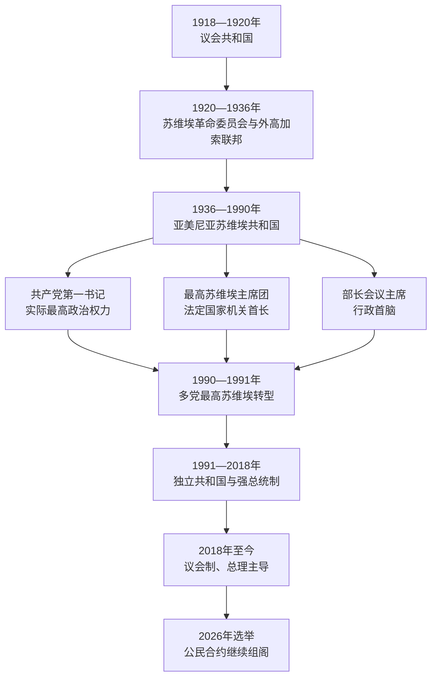

# 亚美尼亚国家元首、政府首脑与苏维埃实际领导人表

## 范围与编排

本表覆盖1918年第一共和国、1920—1991年苏维埃时期和恢复独立后的共和国，核验截止至2026年7月14日。不同政体的职位不能混入一张“总统表”：

- 第一共和国是议会制国家，没有共和国总统；议长承担立法机关和部分国家代表职能，总理主持政府。
- 苏维埃时期，中央执行委员会或最高苏维埃主席团主席是法定国家机关首长，部长会议主席主持行政，但共产党第一书记通常掌握实际最高权力，三类职位必须区分。
- 1990—1991年最高苏维埃主席在多党转型中成为国家最高负责人；1991年后才设民选总统。
- 2015年宪法修正案分阶段生效，2018年后亚美尼亚转为议会制，总理与政府掌握主要行政权，总统主要履行代表与宪法程序职能。
- 代理、辞职生效期和复任均单列或在备注中说明；同名的阿拉姆·萨尔基相、瓦兹根·萨尔基相等不是同一人。
- 中世纪以前的王位见[亚美尼亚中世纪君主世系表](/%E4%BA%BA%E6%96%87%E7%A7%91%E5%AD%A6/%E5%8E%86%E5%8F%B2/%E8%A5%BF%E4%BA%9A/%E5%8D%97%E9%AB%98%E5%8A%A0%E7%B4%A2/%E4%BA%9A%E7%BE%8E%E5%B0%BC%E4%BA%9A/%E4%BA%9A%E7%BE%8E%E5%B0%BC%E4%BA%9A%E4%B8%AD%E4%B8%96%E7%BA%AA%E5%90%9B%E4%B8%BB%E4%B8%96%E7%B3%BB%E8%A1%A8.md)。

## 第一共和国议会最高负责人

1918年8月1日议会正式开会。阿韦蒂克·萨哈基扬、阿韦蒂斯·阿哈罗尼扬和霍夫汉内斯·卡贾兹努尼依次主持议会；阿哈罗尼扬长期出国从事外交时，副议长曾代行主持会议，但不另构成国家元首。

| 顺序 | 议会主席 | 任期 | 说明 |
|---:|---|---|---|
| 1 | 阿韦蒂克·萨哈基扬 | 1918年8月1日—1919年8月1日 | 主持“亚美尼亚委员会／议会”制度化，政府向议会负责。 |
| 2 | 阿韦蒂斯·阿哈罗尼扬 | 1919年8月1日—1920年11月4日 | 同时承担重要外交使命；在外期间由副议长主持日常议事。 |
| 3 | 霍夫汉内斯·卡贾兹努尼 | 1920年11月4日—12月2日 | 前首任总理；在共和国最后阶段主持议会。 |

## 第一共和国政府首脑

| 顺序 | 总理 | 任期 | 与前任关系 | 关键事项 |
|---:|---|---|---|---|
| 1 | **霍夫汉内斯·卡贾兹努尼** | 1918年7月30日—1919年5月28日 | 首任 | 在领土狭小、难民、饥荒和交通中断中建立部委、军队与学校体系；赴欧美争取粮援。 |
| 2 | 亚历山大·哈季相 | 1919年5月28日—1920年5月5日 | 原代行总理后正式接任 | 议会选举、国际承认努力和同邻国边界战争时期。 |
| 3 | 哈莫·奥汉贾尼扬 | 1920年5月5日—11月25日 | 五月布尔什维克起义后组阁 | 执政党权力集中；面对凯末尔军队进攻和红军压力。 |
| 4 | 西蒙·弗拉齐扬 | 1920年11月25日—12月2日 | 危机内阁 | 在亚历山德罗波尔战败与苏俄军队进入条件下交权；1921年二月起义时短暂参与反苏政府。 |

## 苏维埃时期法定国家机关首长

苏维埃时期的“法定国家首长”先后属于军事革命委员会、中央执行委员会、最高苏维埃及其主席团。1922—1936年亚美尼亚同时是外高加索联邦组成共和国，故共和国机关还受联邦和联盟机关约束。下表保留短期代理与制度转换空档，不以共产党第一书记替代法定职位。

| 顺序 | 法定最高负责人／机构 | 职位 | 任期 | 说明 |
|---:|---|---|---|---|
| 1 | 萨尔基斯·卡西扬 | 军事革命委员会主席 | 1920年11月29日—约1921年5月5日 | 委员会在巴库成立，随红军进入后于12月在埃里温建立统治。 |
| 2 | 亚历山大·米亚斯尼基扬 | 军事革命委员会主席 | 约1921年5月5—21日 | 短期接任，随后主持人民委员会。 |
| — | 苏维埃代表大会及过渡集体机关 | 最高权力机关 | 1921年5月21日—1922年2月5日 | 军事革命委员会结束到中央执行委员会稳定设立之间，不另设共和国总统。 |
| 3 | 萨尔基斯·汉巴尔楚米扬 | 中央执行委员会主席 | 1922年2月5日—1925年6月23日 | 同时在外高加索联邦机关任职。 |
| 4 | 阿尔塔谢斯·卡里尼扬 | 中央执行委员会主席 | 1925年6月23日—1928年7月7日 | 原姓加布里埃良，主持共和国苏维埃常设机关。 |
| 5 | 萨尔基斯·卡西扬 | 中央执行委员会主席 | 1928年7月7日—1931年2月18日 | 前军事革命委员会主席再任法定首长。 |
| 6 | 阿尔缅·阿纳尼扬 | 中央执行委员会主席 | 1931年2月18日—1933年4月23日 | 集体化与外高加索联邦时期。 |
| 7 | 谢尔戈·马尔季基扬 | 中央执行委员会主席 | 1933年4月23日—1936年11月17日 | 跨越外高加索联邦撤销和亚美尼亚成为直接加盟共和国。 |
| 8 | 格沃尔格·阿涅索格良 | 中央执行委员会主席 | 1936年11月17日—1937年7月28／29日 | 大清洗时期被撤换；具体交接日史表有一日差异。 |
| 9 | 巴赫希·涅尔西相 | 中央执行委员会代理主席 | 1937年7月28／29日—10月6日 | 短期代理。 |
| 10 | 马察克·帕皮扬 | 中央执行委员会代理主席 | 1937年10月6日—1938年7月12日 | 新宪制实施前的末任代理。 |
| — | 哈奇克·哈科布贾尼扬 | 最高苏维埃主席 | 1938年7月12—13日 | 新最高苏维埃第一次会议中的一日过渡；主席团成立后不再是持续性国家首长职位。 |
| 11 | **马察克·帕皮扬** | 最高苏维埃主席团主席 | 1938年7月13日—1954年4月1日 | 经历大清洗后期、第二次世界大战和战后初期。 |
| 12 | 什马翁·阿鲁沙尼扬 | 最高苏维埃主席团主席 | 1954年4月1日—1963年4月3日 | 去斯大林化时期的法定首长。 |
| 13 | 纳古什·哈鲁秋尼扬 | 最高苏维埃主席团主席 | 1963年4月3日—1975年7月3日 | 礼仪与立法程序职位，实际权力仍在党组织。 |
| 14 | 巴布肯·萨尔基索夫 | 最高苏维埃主席团主席 | 1975年7月3日—1985年12月6日 | 德米尔强时期的法定首长。 |
| 15 | 赫兰特·沃斯卡尼扬 | 最高苏维埃主席团主席 | 1985年12月6日—1990年8月4日 | 改革开放、卡拉巴赫运动和1988年地震时期。 |
| 16 | **列翁·捷尔—彼得罗相** | 最高苏维埃主席 | 1990年8月4日—1991年11月11日 | 多党选举后成为国家实际最高负责人；推动主权宣言和独立公投，后转任总统。 |

## 苏维埃时期共产党实际最高领导人

早期职位先称执行书记、总书记，1923年后通常称第一书记。1920年代党、政府与外高加索联邦机构权力交叉，不能把第一书记误写成法定国家元首；但在一党制下，其干部任免和政策权力通常高于共和国政府。

| 顺序 | 党组织主要负责人 | 任期 | 关键事项与结局 |
|---:|---|---|---|
| 1 | 格沃尔格·阿利哈尼扬 | 1920年12月—1921年5月 | 创建时期的执行书记；后在大清洗中被处决。 |
| 2 | 萨尔基斯·卢卡申 | 1921年5月—1922年4月 | 执行书记；同时参与苏维埃政府建设，后在大清洗中被处决。 |
| 3 | 阿斯卡纳兹·姆拉维扬 | 1922年4月—1923年3月 | 总书记；外高加索联邦形成时期。 |
| 4 | 阿硕特·霍夫汉尼相 | 1923年3月—1927年7月6日 | 推进新经济政策后期、教育和文化制度建设。 |
| 5 | 海克·奥夫塞皮扬 | 1927年7月6日—1928年4月8日 | 短期任职，后在大清洗中被处决。 |
| 6 | 海卡兹·科斯塔尼扬 | 1928年4月8日—1930年5月7日 | 集体化和快速工业化开始，后在大清洗中被处决。 |
| 7 | **阿加西·汉吉扬** | 1930年5月7日—1936年7月9日 | 推动工业、教育和本地干部；同贝利亚冲突后在第比利斯死亡，官方“自杀”说长期受质疑。 |
| 8 | 阿马图尼·阿马图尼 | 1936年9月21日—1937年9月23日 | 大清洗扩大时期，后被处决。 |
| 9 | 格里戈里·阿鲁季诺夫 | 1937年9月23日—1953年11月28日 | 大清洗、战争动员与战后建设；斯大林去世后被撤换。 |
| 10 | 苏伦·托夫马相 | 1953年11月28日—1960年12月28日 | 去斯大林化和1950年代经济调整。 |
| 11 | 雅科夫·扎罗比扬 | 1960年12月28日—1966年2月5日 | 工业发展；1965年埃里温大规模纪念1915年受难者，推动官方纪念空间形成。 |
| 12 | 安东·科奇尼扬 | 1966年2月5日—1974年11月27日 | 长期工业化与城市扩张，中央计划和环境压力并存。 |
| 13 | **卡连·德米尔强** | 1974年11月27日—1988年5月21日 | 基础设施和文化建设；卡拉巴赫运动爆发后被撤换。 |
| 14 | 苏伦·哈鲁秋尼扬 | 1988年5月21日—1990年4月5日 | 1988年地震救灾、民族运动与联盟危机。 |
| 15 | 弗拉基米尔·莫夫西相 | 1990年4月5日—11月30日 | 多党选举后共产党失去执政垄断。 |
| 16 | 斯捷潘·波戈相 | 1990年11月30日—1991年5月14日 | 共和国党组织脱离旧有权力核心。 |
| 17 | 阿拉姆·加斯帕尔·萨尔基相 | 1991年5月14日—9月7日 | 最后一任；党代会决定解散原苏维埃共产党组织，转组民主党。 |

## 苏维埃政府首脑

下表列人民委员会／部长会议主席。行政首脑负责经济和部门协调，但关键任命、计划指标及安全政策受党组织和联盟中央控制。

| 顺序 | 政府首脑 | 任期 | 说明 |
|---:|---|---|---|
| 1 | 亚历山大·米亚斯尼基扬 | 1921—1922年 | 苏维埃亚美尼亚首任人民委员会主席，参与外高加索联邦建立。 |
| 2 | 萨尔基斯·卢卡申 | 1922—1925年 | 同时是早期党领导人之一。 |
| 3 | 萨尔基斯·汉巴尔楚米扬 | 1925—1928年 | 新经济政策末期。 |
| 4 | 萨哈克·捷尔—加布里埃良 | 1928—1935年 | 集体化和工业化阶段，后在清洗中死亡。 |
| 5 | 亚伯拉罕·古洛扬 | 1935—1937年2月 | 大清洗前期，后被处决。 |
| 6 | 萨尔基斯·汉巴尔楚米扬 | 1937年2—5月 | 短期再任。 |
| 7 | 斯捷潘·哈科比扬 | 1937年5—9月 | 清洗中的短期过渡。 |
| 8 | 阿拉姆·皮鲁兹扬 | 1937年11月—1943年10月 | 组织战时工业和物资供应。 |
| 9 | 阿加西·萨尔基相 | 1943年10月—1947年3月 | 战争后期及初步重建；1946年职称改为部长会议主席。 |
| 10 | 萨哈克·卡拉佩特扬 | 1947年3月—1952年11月 | 战后计划经济与人口迁入时期。 |
| 11 | 安东·科奇尼扬 | 1952年11月—1966年2月 | 后转任党第一书记。 |
| 12 | 巴达尔·穆拉迪扬 | 1966年2月—1972／1973年11月 | 工业和城市建设；官方名录的年度取整与精确交接日略有差异。 |
| 13 | 格里戈尔·阿尔祖马尼扬 | 1972／1973年11月—1976年11月 | 计划经济管理。 |
| — | G·A·马尔季罗相 | 1976年11月—1977年1月 | 代理主席。 |
| 14 | 法杰伊·萨尔基相 | 1977年1月—1989年1月 | 长期政府首脑；晚期面对地震和联盟经济危机。 |
| 15 | 弗拉基米尔·马尔卡良茨 | 1989年1月—1990年8月 | 苏联末期过渡。 |
| 16 | 瓦兹根·马努基扬 | 1990年8月—1991年9月25日 | 多党最高苏维埃产生的政府首脑，跨越主权宣言与独立公投。 |

## 独立共和国总统

| 顺序 | 总统 | 任期 | 关键事项与权力变化 |
|---:|---|---|---|
| 1 | **列翁·捷尔—彼得罗相** | 1991年11月11日—1998年2月3日 | 首任民选总统；第一场卡拉巴赫战争和经济封锁时期。因和平方案与执政联盟分裂辞职。 |
| — | 罗伯特·科恰良 | 1998年2月4日—4月9日 | 时任总理依宪制代理总统。 |
| 2 | **罗伯特·科恰良** | 1998年4月9日—2008年4月9日 | 总统权力集中、经济增长与寡头网络扩张；1999年议会枪击后政治结构重组，2008年选举危机结束任期。 |
| 3 | **谢尔日·萨尔基相** | 2008年4月9日—2018年4月9日 | 推动2015年宪改由总统制转向议会制；2016年四日战争与安全压力。 |
| 4 | 阿尔缅·萨尔基相 | 2018年4月9日—2022年2月1日 | 议会选出的礼仪性总统；2022年辞职生效。 |
| — | 阿连·西蒙扬 | 2022年2月1日—3月13日 | 国民议会议长依宪法代理。 |
| 5 | **瓦哈根·哈恰图良** | 2022年3月13日至今 | 由国民议会选出；截至2026年7月14日仍任总统，主要履行代表和宪法程序职能。 |

## 独立共和国政府首脑

| 顺序 | 总理 | 任期 | 关键事项／备注 |
|---:|---|---|---|
| 1 | 瓦兹根·马努基扬 | 1990年8月—1991年9月25日 | 从苏维埃共和国政府过渡到独立初期。 |
| — | 赫兰特·巴格拉强 | 1991年9月25日—11月22日 | 第一副总理代理政府首脑。 |
| 2 | 加吉克·哈鲁秋尼扬 | 1991年11月22日—1992年7月30日 | 独立、战争和市场转型初期。 |
| 3 | 霍斯罗夫·哈鲁秋尼扬 | 1992年7月30日—1993年2月 | 能源与战争危机。 |
| 4 | 赫兰特·巴格拉强 | 1993年2月—1996年11月 | 市场改革、私有化和停火后的经济调整。 |
| 5 | 阿尔缅·萨尔基相 | 1996年11月—1997年3月 | 因健康原因辞职；后任第四任总统。 |
| 6 | 罗伯特·科恰良 | 1997年3月—1998年4月 | 从纳戈尔诺—卡拉巴赫事实政权领导层进入亚美尼亚政府，后当选总统。 |
| 7 | 阿尔缅·达尔比尼扬 | 1998年4月—1999年6月 | 金融与行政改革。 |
| 8 | **瓦兹根·萨尔基相** | 1999年6月—10月27日 | 军政强人；在国民议会枪击事件中遇害。 |
| 9 | 阿拉姆·萨尔基相 | 1999年11月—2000年5月 | 瓦兹根之弟；议会枪击后的过渡内阁。 |
| 10 | 安德拉尼克·马尔加良 | 2000年5月—2007年3月25日 | 共和党政府长期化；任内病逝。 |
| 11 | 谢尔日·萨尔基相 | 2007年4月—2008年4月 | 后当选总统。 |
| 12 | 季格兰·萨尔基相 | 2008年4月—2014年4月 | 全球金融危机、税制和欧亚一体化选择。 |
| 13 | 霍维克·阿布拉米扬 | 2014年4月—2016年9月 | 宪制转型和2016年四日战争时期。 |
| 14 | 卡连·卡拉佩强 | 2016年9月—2018年4月17日 | 议会制转换前后。 |
| 15 | 谢尔日·萨尔基相 | 2018年4月17—23日 | 卸任总统后转任总理，引发天鹅绒革命并辞职。 |
| — | 卡连·卡拉佩强 | 2018年4月23日—5月8日 | 代理总理。 |
| 16 | **尼科尔·帕希尼扬** | 2018年5月8日—2021年4月25日 | 天鹅绒革命后由议会选出；2018年提前选举巩固多数。 |
| — | 尼科尔·帕希尼扬 | 2021年4月25日—8月2日 | 为提前选举辞职后代理。 |
| 16 | **尼科尔·帕希尼扬** | 2021年8月2日至今 | 2021年重新获议会多数；2026年6月7日选举中“公民合约”以约49.7%得票取得可单独组阁的议会多数。截至2026年7月14日政府官网仍列其为总理。 |

## 截至2026年7月14日的实际权力结构

| 层次 | 人物／机构 | 实际作用 |
|---|---|---|
| 总统 | 瓦哈根·哈恰图良 | 国家元首；主要承担礼仪、签署、任命与宪法程序职责，不主持日常行政。 |
| 总理与政府 | 尼科尔·帕希尼扬及内阁 | 最高行政权中心，决定国内、外交、安全与经济政策主线。 |
| 国民议会 | 议会制核心；2026年选举后“公民合约”保持多数 | 选举总理与总统、通过法律并监督政府；反对党可质询和组织议会监督。 |
| 司法与宪法机关 | 宪法法院、普通法院及司法行政机构 | 处理选举、权力边界和公民权利争议；独立性与改革方式仍是政治争论焦点。 |
| 军队与安全机构 | 国防部、武装力量、国家安全局等 | 受文官政府法定领导；2020年战败后军政关系、改革和采购成为核心议题。 |
| 教会与社会力量 | 亚美尼亚使徒教会、离散组织、媒体与公民团体 | 无宪定行政权，但在身份、战争记忆、社会动员和对外网络中有显著影响；2025—2026年政府与部分教会高层关系紧张。 |

## 演变关系

- 具体历史过程见[俄国、苏联与独立亚美尼亚](/%E4%BA%BA%E6%96%87%E7%A7%91%E5%AD%A6/%E5%8E%86%E5%8F%B2/%E8%A5%BF%E4%BA%9A/%E5%8D%97%E9%AB%98%E5%8A%A0%E7%B4%A2/%E4%BA%9A%E7%BE%8E%E5%B0%BC%E4%BA%9A/%E4%BF%84%E5%9B%BD%E3%80%81%E8%8B%8F%E8%81%94%E4%B8%8E%E7%8B%AC%E7%AB%8B%E4%BA%9A%E7%BE%8E%E5%B0%BC%E4%BA%9A.md)。
- 地区冲突与边界问题比较见[苏维埃划界、独立与地区冲突](/%E4%BA%BA%E6%96%87%E7%A7%91%E5%AD%A6/%E5%8E%86%E5%8F%B2/%E8%A5%BF%E4%BA%9A/%E5%8D%97%E9%AB%98%E5%8A%A0%E7%B4%A2/%E8%8B%8F%E7%BB%B4%E5%9F%83%E5%88%92%E7%95%8C%E3%80%81%E7%8B%AC%E7%AB%8B%E4%B8%8E%E5%9C%B0%E5%8C%BA%E5%86%B2%E7%AA%81.md)。
- 上级入口：[亚美尼亚](/%E4%BA%BA%E6%96%87%E7%A7%91%E5%AD%A6/%E5%8E%86%E5%8F%B2/%E8%A5%BF%E4%BA%9A/%E5%8D%97%E9%AB%98%E5%8A%A0%E7%B4%A2/%E4%BA%9A%E7%BE%8E%E5%B0%BC%E4%BA%9A/README.md)。
