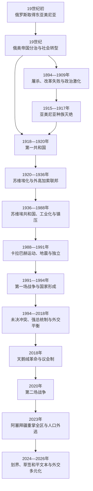

# 俄国、苏联与独立亚美尼亚

## 时间

19世纪初至今

## 概括

19世纪俄国通过俄伊战争取得埃里温、纳希切万等东亚美尼亚地区，亚美尼亚人口由此更明显地分处俄罗斯与奥斯曼帝国。帝国边界带来迁移、城市教育和新政治网络，也造成不同法律、经济与安全经验。奥斯曼帝国改革未能解决土地、地方暴力和政治代表问题，1890年代与1909年发生大规模屠杀。

第一次世界大战期间，奥斯曼统一与进步委员会政府对亚美尼亚知识分子、士兵和普通人口实施逮捕、解除武装、驱逐、财产没收、死亡行军与大规模杀戮。事件广泛被历史学界和许多国家、机构认定为亚美尼亚种族灭绝。俄国革命后，第一共和国在战争、难民、饥荒和疫情中建立，1920年又遭凯末尔军进攻与红军苏维埃化。

苏维埃亚美尼亚经历国家主导工业化、教育普及、城市化、政治镇压和离散人口回迁。1988年卡拉巴赫运动、斯皮塔克地震与苏联危机相互叠加。1991年独立后，国家建设始终同纳戈尔诺—卡拉巴赫战争、封锁、人口外流、经济改革和政体竞争交织。2018年天鹅绒革命完成和平权力更替；2020年战争和2023年阿塞拜疆重新控制纳戈尔诺—卡拉巴赫后，亚美尼亚转向边界划定、对外关系多元化与和平谈判。2025年双方草签和平条约文本，但截至2026年7月14日尚未正式签署和批准。

## 政治阶段

| 阶段 | 时间 | 统治结构 | 核心问题 |
|---|---|---|---|
| 俄罗斯与奥斯曼帝国分治 | 19世纪初—1917／1918年 | 俄国省制、奥斯曼行省与宗教共同体机构 | 迁移、改革、民族政治、土地与安全不平等。 |
| 战争、种族灭绝与帝国崩溃 | 1914—1918年 | 奥斯曼战时党国、俄国高加索军政机构、难民与志愿军网络 | 驱逐和大规模杀戮、前线战事、人口结构断裂。 |
| 亚美尼亚第一共和国 | 1918—1920年 | 一院制议会共和国；政府向议会负责 | 生存战争、饥荒、难民、边界和国际承认。 |
| 苏维埃亚美尼亚 | 1920—1991年 | 共产党实际领导，苏维埃与部长会议为法定机关；1922—1936年属外高加索联邦 | 工业化、镇压、文化国家化、联盟分工与民族问题。 |
| 独立共和国早期 | 1991—1998年 | 强总统制、议会与政府 | 第一场卡拉巴赫战争、封锁、市场转型与停火。 |
| 科恰良—萨尔基相时期 | 1998—2018年 | 总统主导，政商精英网络；后以宪改转向议会制 | 经济增长与不平等、选举争议、外交平衡和安全依赖。 |
| 议会制与帕希尼扬时期 | 2018年至今 | 总理和议会多数主导，礼仪性总统 | 民主改革、战争失败、和平谈判、军政改革与外交多元化。 |

## 俄罗斯取得东亚美尼亚

### 俄伊战争与条约

俄罗斯1801年吞并东格鲁吉亚后，继续向南高加索推进。1804—1813年俄伊战争以《古利斯坦条约》结束，俄国取得包括卡拉巴赫等地在内的大片南高加索领土，但埃里温和纳希切万仍属卡扎尔伊朗。1826—1828年第二次俄伊战争后，《土库曼恰伊条约》把埃里温、纳希切万汗国交给俄罗斯。

俄国先设置“亚美尼亚州”，后并入省制。它废除汗国政治权力，却没有立刻消除地主、教会、村社和族群差异。新边界和俄国鼓励政策推动部分亚美尼亚人从伊朗及奥斯曼领地迁入，穆斯林人口也有外迁；埃里温地区人口构成因此在19世纪显著变化。迁移既包含宗教与安全选择，也受到战争破坏、税负和国家规划影响，不能简化为“古老人口自然回归”。

### 帝国整合与社会变化

俄国行政、军役、法院和学校把东亚美尼亚纳入第比利斯主导的高加索体系。教会拥有广泛文化权威，却受帝国法令和财产政策约束；1903年俄国没收亚美尼亚教会财产的决定激起抗议，随后撤回。铁路、印刷、石油城市巴库和第比利斯商业吸引亚美尼亚工人、专业人士和资本家，形成跨城市政治网络。

19世纪末，达什纳克、洪恰克等政党在俄奥两帝国和离散社群中活动。其目标从改革、保护地方人口到自治、革命不等，不能把所有亚美尼亚人视为同一政治组织。1905—1906年俄国革命与国家权威松动期间，亚美尼亚人与当时常称“高加索鞑靼人”的阿塞拜疆人发生严重族群冲突，形成此后相互恐惧和报复记忆。

## 奥斯曼亚美尼亚人的改革、危机与暴力

### 坦志麦特与共同体制度

1839年后坦志麦特改革承诺改善臣民法律地位，1856年改革诏书进一步强调非穆斯林平等。1863年《亚美尼亚民族宪章》规范君士坦丁堡宗主教区和世俗代表机关，在教育、慈善与共同体治理方面具有重要意义。它不是领土自治宪法，且帝国中央、地方官、宗主教、城市显贵和乡村居民的权力并不对等。

东安纳托利亚乡村的核心矛盾包括土地登记、税负、地方官腐败、部落劫掠和司法保护不足。1877—1878年俄土战争后，《柏林条约》要求改革亚美尼亚人居住省份，但列强没有建立有效执行机制。奥斯曼政府日益把外国干预、亚美尼亚政党和地方请愿视为分离威胁。

### 哈米德屠杀与阿达纳屠杀

1894—1896年，萨松冲突、抗议和政府镇压演变为多地大规模杀戮，军队、哈米迪耶骑兵和地方人群参与程度因地区不同。大量亚美尼亚人死亡、流亡或失去财产。暴力同时打击革命组织和普通平民，不能以个别起义解释对广泛人口的集体惩罚。

1908年青年土耳其革命一度带来立宪与平等希望，1909年阿达纳反革命危机中又发生针对亚美尼亚人的屠杀。统一与进步委员会随后集中权力，巴尔干战争、领土丧失、穆斯林难民涌入和民族主义激化，为大战时期的极端人口政策提供背景，但背景不等于为国家犯罪开脱。

## 第一次世界大战与亚美尼亚种族灭绝

### 战时背景

奥斯曼帝国1914年加入同盟国，在高加索同俄国作战。萨勒卡默什战败后，统一与进步委员会领导层把亚美尼亚整体描绘为潜在“内敌”，尽管奥斯曼亚美尼亚人政治立场多样，大量男子也在奥斯曼军中服役。俄军中的亚美尼亚志愿队、凡城抵抗等事件被政府用于为全面措施辩护，但局部军事活动不能说明对整个族群的驱逐具有必要性。

### 实施过程

- 1915年4月24日前后，君士坦丁堡及其他城市的亚美尼亚知识分子、宗教人士和政治人物被逮捕、流放，许多人遇害。
- 军中亚美尼亚士兵普遍被解除武装、编入劳工营，许多人被成批杀害，社区失去成年男性防卫力量。
- 1915年5月后，临时迁徙法为大范围驱逐提供形式依据。妇女、儿童、老人从安纳托利亚各地被迫向叙利亚沙漠和代尔祖尔方向行进。
- 宪兵、特别组织成员、地方官与非正规武装在不同地点实施屠杀、绑架、强奸、强迫改宗和掠夺；饥饿、疾病、暴露和缺水造成大量死亡。
- 国家通过财产法规接管“弃置财产”，房屋、土地、商店和教堂被重新分配。人口消灭同经济剥夺相互连接。
- 1916年后，对幸存营地和孤儿的迫害、同化与再驱逐继续。个别奥斯曼官员、穆斯林家庭、传教士和外交人员曾救助受害者，但不能改变政策总体性质。

死亡人数因统计范围、失踪、改宗和资料损毁而有差异，通常以约一百万至一百五十万计；应写明估计而非制造虚假精确值。种族灭绝造成奥斯曼亚美尼亚社会大部被摧毁，幸存者散居高加索、黎凡特、欧洲和美洲，财产与文化遗产问题延续至今。土耳其共和国官方长期拒绝“种族灭绝”定性，但历史学界的主流认定不因国家否认而成为对等的两种事实。

## 帝国崩溃与第一共和国

### 从俄国革命到独立

1917年俄国革命使高加索前线瓦解。外高加索委员会、议会和短暂联邦尝试共同治理，但格鲁吉亚、阿塞拜疆和亚美尼亚政党在战争、外交与边界上分歧。奥斯曼军趁俄军撤退向东推进，亚美尼亚难民和地方武装承担防御。

1918年5月萨达拉帕特、巴什阿帕兰和卡拉基利萨战斗阻止奥斯曼军进一步进入埃里温核心区，为国家生存留下空间。外高加索联邦解体后，亚美尼亚民族委员会于5月28日承担独立国家权力；政府7月抵达埃里温。6月《巴统条约》迫使新共和国接受狭小领土和严格限制，战争结束后才获得扩展空间。

### 生存危机与国家建设

第一共和国接收的是难民集中、粮食不足、交通断裂和疾病流行的地区。政府在极端条件下建立议会、部委、军队、法院、学校和大学，并争取美国粮援。1919年议会选举扩大制度基础，但达什纳克占绝对优势，反对派与少数族群代表有限。

边界并未确定。共和国同格鲁吉亚在洛里短暂战争，同阿塞拜疆围绕纳希切万、赞格祖尔和卡拉巴赫发生冲突，也面对境内穆斯林社区叛乱与双方人口驱逐。巴黎和会、协约国短期驻军及1920年《色佛尔条约》提供“大亚美尼亚”设想，却缺少可执行军事保证；美国参议院拒绝委任统治，凯末尔运动也不承认条约。

### 1920年双重进攻与灭亡

1920年秋，凯末尔土耳其东方军进攻，亚美尼亚军在卡尔斯等地迅速失败。失败原因包括军队与后勤薄弱、饥荒和疫情、指挥与动员问题、外交孤立，以及同时承受苏俄压力。11月底西蒙·弗拉齐扬组建危机政府。

12月2日，亚美尼亚代表同苏俄达成交权安排，红军进入埃里温；亚历山德罗波尔条约又在政权已转移的夜间由旧政府代表同土耳其签署，其法律地位随后被苏俄—土耳其条约取代。共和国灭亡不是单一“民众选择苏维埃”，而是土耳其军事失败、苏俄扩张、盟国撤离与内部崩溃共同造成。

## 苏维埃化、边界与早期反抗

布尔什维克征收、逮捕和政治排除很快引发反抗。1921年2月起义一度把苏维埃机关逐出埃里温，红军4月重新控制首都；加列津·恩日德在赞格祖尔继续抵抗并建立“山地亚美尼亚”，直到确保该区留在苏维埃亚美尼亚后于7月撤离。

1921年《莫斯科条约》和《卡尔斯条约》确定苏俄／南高加索同土耳其的边界：卡尔斯与阿尔达汉归土耳其，纳希切万在阿塞拜疆保护下形成自治实体。纳戈尔诺—卡拉巴赫1923年被设为阿塞拜疆苏维埃社会主义共和国境内的自治州。边界安排混合了战争结果、交通、族群分布和布尔什维克地区战略，不宜用单一领袖“赠送领土”解释。

1922—1936年，亚美尼亚同格鲁吉亚、阿塞拜疆组成外高加索社会主义联邦苏维埃共和国，再作为整体加入苏联；1936年联邦撤销，亚美尼亚成为直接加盟共和国。

## 苏维埃亚美尼亚的发展与代价

### 国家建设、工业化与城市化

新经济政策稳定初期经济，随后集体化、计划工业和联盟投资改变社会。埃里温从省城扩展为工业、科研与文化中心，能源、化工、机械、电子和建材产业发展。普及教育、卫生和亚美尼亚语出版提高识字率与专业人口，科学院、大学、剧院与电影形成共和国文化机构。

1946—1948年苏联鼓励离散亚美尼亚人“回归”，数万人从中东、欧洲和美洲迁入；他们同时面对住房、适应、监控和部分再迁限制。苏维埃民族政策一方面在领土共和国中制度化语言和文化，另一方面由莫斯科控制边界、外交、军队和关键经济决策。

### 集体化、清洗与战争

强制集体化破坏传统村社和生产安排，宗教机构受压制。1930年代大清洗处决、监禁或流放党政干部、知识分子、教士和普通人；第一共和国人物与离散联系也可能成为指控理由。第二次世界大战中，大量亚美尼亚士兵在苏军服役，共和国工业和农业支援前线，伤亡沉重。

斯大林去世后政治恐怖减弱。1965年埃里温大规模游行要求纪念种族灭绝，1967年齐齐尔纳卡贝尔德纪念馆开放，显示民族记忆在苏维埃制度内部重新公共化。1970—1980年代生活水平、教育和文化继续发展，计划经济低效、腐败、污染和住房问题也日益突出。

## 1988年危机与独立

1988年2月，纳戈尔诺—卡拉巴赫自治州议会请求转归亚美尼亚，埃里温出现大规模群众运动。苏联中央拒绝改界，苏姆盖特等地针对亚美尼亚人的暴力、随后双方人口逃离和武装化使争议从行政诉求升级为族群冲突。同年12月斯皮塔克地震造成巨大伤亡和城市破坏，救灾暴露联盟体制失灵，也动员了全球离散网络。

1990年多党选举后，列翁·捷尔—彼得罗相领导的亚美尼亚全国运动控制最高苏维埃。1991年9月21日独立公投获压倒性支持，苏联解体后共和国获得国际承认。独立并非从稳定起点开始：战争、能源管线中断、土耳其与阿塞拜疆边界关闭、苏联市场瓦解和私有化同时发生。

## 第一场卡拉巴赫战争与国家形成

亚美尼亚与纳戈尔诺—卡拉巴赫亚美尼亚武装在1991—1994年逐步占优势，不仅控制原自治州大部，也控制其周围多个阿塞拜疆区；阿塞拜疆人口大规模流离失所，亚美尼亚和阿塞拜疆境内的少数族群人口交换趋于完成。1994年停火没有形成和平条约，纳戈尔诺—卡拉巴赫事实政权运作但未获包括亚美尼亚在内的联合国会员国正式承认。

战争胜利帮助军政精英取得合法性，却也固化封锁、安全优先和非正式经济网络。1990年代“黑暗寒冷年代”中电力和燃料严重短缺，人口大量外流；土地与企业私有化形成新财富差距。捷尔—彼得罗相支持分阶段和平方案后，同安全和政府高层分裂，1998年辞职，来自卡拉巴赫政治体系的罗伯特·科恰良接任。

## 政体竞争与安全依赖

科恰良与谢尔日·萨尔基相时期，侨汇、建筑、矿业和服务业推动增长，国家机构更稳定；寡头垄断、选举不信任与反对派空间问题持续。1999年国民议会枪击杀害总理瓦兹根·萨尔基相、议长卡连·德米尔强等领导人，重组了权力平衡。2008年总统选举后抗议遭武力驱散，造成死亡并加深社会裂痕。

外交上，亚美尼亚加入俄罗斯主导的集体安全条约组织，俄军基地和武器关系成为安全支柱；同时参与欧盟合作、美国援助和伊朗经贸。土耳其1993年关闭陆地边界，2009年苏黎世议定书未能获批准。2013年亚美尼亚放弃已谈妥的欧盟联系国协定转而加入欧亚经济联盟，显示安全与经济依赖对外交选择的限制。

2015年宪法修正案把体制转向议会制。批评者认为谢尔日·萨尔基相可能在总统任满后以总理延续权力；支持者强调议会责任。2016年纳戈尔诺—卡拉巴赫四日战争显示停火线并不稳定，也暴露军队采购、指挥与俄罗斯武器政策争议。

## 2018年天鹅绒革命

2018年4月，谢尔日·萨尔基相卸任总统后由议会选为总理，引发尼科尔·帕希尼扬领导的步行、罢课、封路与非暴力抗议。安全机构没有发动大规模镇压，萨尔基相4月23日辞职；议会5月选帕希尼扬为总理，12月提前选举给予其联盟压倒性多数。

革命成功依赖广泛社会联盟、非暴力纪律、旧精英分裂和军警克制。它开启反腐、选举与司法改革，也产生行政经验不足、政治极化和“革命合法性”同制度制衡之间的张力。外交安全结构短期未改变，卡拉巴赫谈判却在亚美尼亚与事实政权领导关系变化中更复杂。

## 2020年战争、2023年巨变与安全转向

### 第二场战争

2020年9月阿塞拜疆发动大规模攻势，使用无人机、精确火力和由土耳其支持的现代作战体系。亚美尼亚与卡拉巴赫部队在情报、防空、指挥和动员方面处于劣势。阿塞拜疆夺回周边区和舒沙／舒希后，11月9／10日停火声明由俄罗斯斡旋；亚美尼亚交还更多区，俄罗斯维和部队部署于剩余亚美尼亚人聚居区及拉钦走廊。

失败原因不能归于单一领导人或武器：

| 层次 | 因素 |
|---|---|
| 长期结构 | 阿塞拜疆凭能源收入扩大军费并获得土耳其训练与装备；亚美尼亚人口、经济和后勤规模较小。 |
| 军事准备 | 防空、无人机对抗、侦察火力链、工事和动员体系未适应战场变化。 |
| 外交环境 | 国际调停长期无结果，俄罗斯安全承诺不自动覆盖国际承认属阿塞拜疆的卡拉巴赫。 |
| 指挥与政治 | 战时信息、军政协调和目标判断存在严重问题，战后责任仍有国内争议。 |
| 直接触发 | 9月27日全面战事及阿塞拜疆突破南线，舒沙失守后亚美尼亚接受停火。 |

战败引发要求政府下台的抗议和军政冲突。帕希尼扬辞职代理后，2021年提前选举再次取得多数，说明社会虽不满战败，仍有相当部分选民拒绝旧精英回归。

### 边界危机、走廊封锁与2023年攻势

2021—2022年，尚未划定的亚美尼亚—阿塞拜疆国境发生进入、占点和交火，部分亚美尼亚国际公认领土受到阿塞拜疆军队控制。亚美尼亚请求集体安全条约组织支持但认为回应不足，开始冻结参与并扩大同欧盟、美国、法国和印度的安全合作。

2022年12月起拉钦走廊通行受阻，纳戈尔诺—卡拉巴赫出现食品、药品与能源短缺。2023年9月阿塞拜疆发动约一日军事行动，事实当局接受解除武装；超过十万当地亚美尼亚人几乎全部逃往亚美尼亚。阿塞拜疆恢复对该区完整实际控制，事实政权机构随后停止运作。对驱离是否构成“种族清洗”的法律与政治表述存在争论，但人口近乎整体出走和人道后果是不能回避的事实。

亚美尼亚政府此前已在和平谈判中表示按1991年《阿拉木图宣言》相互承认领土完整，包括承认纳戈尔诺—卡拉巴赫属于阿塞拜疆。此立场旨在保障亚美尼亚共和国边界，却在难民、反对派与部分离散社群中引发强烈争议。

## 边界划定、和平文本与2026年现状

2024年两国边界委员会以苏联末期行政边界为基础启动实地划界，亚美尼亚一侧向阿塞拜疆移交塔武什附近四个废弃村址的控制。支持者认为这是把边界从军事事实转为法律程序，反对者担心安全、防线和让步不对称。边境村民抗议显示和平政策的全国目标与地方成本并不相同。

2025年3月双方宣布完成和平条约文本谈判。8月8日，两国领导人在华盛顿签署联合声明，外长草签《建立和平与国家间关系协定》文本；条约确认相互主权、领土完整、不得提出领土要求、推动建交与边界划定。双方又共同请求关闭欧洲安全与合作组织明斯克进程，相关机构于2025年11月底正式终止。

草签不等于条约生效。截至2026年7月14日：

- 和平协定文本尚未正式签署和批准，亚美尼亚外交部长仍将其表述为“已草签、未签署和批准”。
- 争议包括阿塞拜疆要求亚美尼亚修改宪法相关表述、最后签署条件和具体国内程序；两国对这些问题的法律解释不同。
- 交通方案“国际和平与繁荣特朗普路线”拟在亚美尼亚主权、管辖和领土完整下连接阿塞拜疆本土与纳希切万。亚美尼亚与美国2026年签署实施框架，但建设、边检、海关和商业运营仍需后续程序。
- 边境总体较2021—2022年平静，交通和有限贸易出现松动；这不等于所有难民、被拘人员、文化遗产、边界与安全问题已经解决。
- 亚美尼亚—土耳其正常化对话继续，但陆地边界截至2026年5月官方说明仍未按已议定的第三国公民与外交护照方案开放。

## 2026年选举与外交多元化

2026年6月7日议会选举中，帕希尼扬领导的“公民合约”获得约49.7%选票并取得可单独组阁的议会多数；“强大亚美尼亚”联盟和“亚美尼亚”联盟进入议会，部分反对派质疑选举环境和结果。选举意味着和平路线、对俄降温和向欧美靠近获得新的议会授权，但社会对卡拉巴赫、教会关系、司法改革和反对派案件仍高度分裂。

亚美尼亚并未简单从“亲俄”一夜转为“亲西方”。俄罗斯仍是重要贸易、能源、移民与安全因素，俄军基地和双边条约尚在；与此同时，亚美尼亚事实上冻结参与集体安全条约组织活动，邀请欧盟边境／伙伴任务，扩大同美国、欧盟、法国、印度和伊朗合作。2026年首次亚美尼亚—欧盟峰会和同美国的交通框架显示多元化加速，其目标是减少单一依赖，而不是消除地缘约束。

## 统治结构与完整领导人表

第一共和国议长和四任总理、苏维埃时期法定国家机关首长、全部共产党主要负责人、政府首脑、独立共和国历任总统及总理，见[亚美尼亚国家元首、政府首脑与苏维埃实际领导人表](/%E4%BA%BA%E6%96%87%E7%A7%91%E5%AD%A6/%E5%8E%86%E5%8F%B2/%E8%A5%BF%E4%BA%9A/%E5%8D%97%E9%AB%98%E5%8A%A0%E7%B4%A2/%E4%BA%9A%E7%BE%8E%E5%B0%BC%E4%BA%9A/%E4%BA%9A%E7%BE%8E%E5%B0%BC%E4%BA%9A%E5%9B%BD%E5%AE%B6%E5%85%83%E9%A6%96%E3%80%81%E6%94%BF%E5%BA%9C%E9%A6%96%E8%84%91%E4%B8%8E%E8%8B%8F%E7%BB%B4%E5%9F%83%E5%AE%9E%E9%99%85%E9%A2%86%E5%AF%BC%E4%BA%BA%E8%A1%A8.md)。该表按角色拆分，避免以下常见错误：

- 把第一共和国总理称作“总统”；
- 把苏维埃最高苏维埃主席团主席同实际掌权的第一书记混为一人；
- 忽略代理总统、代理总理和复任；
- 把2018年后的礼仪总统误写成行政最高领导；
- 在现代“至今”项中沿用已经过时的人物或政体描述。

## 重要事件与转折

| 时间 | 事件 | 结果与长期影响 |
|---|---|---|
| 1813年 | 《古利斯坦条约》 | 俄国取得南高加索大片领土，东亚美尼亚周边力量格局改变。 |
| 1828年 | 《土库曼恰伊条约》 | 埃里温、纳希切万转属俄国，跨境人口迁移扩大。 |
| 1863年 | 《亚美尼亚民族宪章》 | 规范奥斯曼亚美尼亚共同体机构，但不是领土自治。 |
| 1894—1896年 | 哈米德屠杀 | 大量人口死亡、财产损失和流亡，改革问题国际化。 |
| 1909年 | 阿达纳屠杀 | 立宪希望受挫，地方暴力与中央责任争议加深。 |
| 1915—1917年 | 驱逐与种族灭绝 | 奥斯曼亚美尼亚社会大部被毁，形成全球离散与长期记忆政治。 |
| 1918年5月 | 萨达拉帕特等战役与独立 | 保住埃里温核心区，第一共和国建立。 |
| 1920年秋冬 | 土耳其进攻与红军苏维埃化 | 第一共和国在双重压力下灭亡。 |
| 1921年 | 《莫斯科条约》《卡尔斯条约》 | 确定土耳其—南高加索边界与纳希切万安排。 |
| 1930年代 | 集体化与大清洗 | 经济社会强制重组，大批干部、知识分子和教士受害。 |
| 1965—1967年 | 纪念游行与纪念馆开放 | 种族灭绝记忆重新进入苏维埃公共空间。 |
| 1988年 | 卡拉巴赫运动与斯皮塔克地震 | 民族动员、人道灾难和苏联合法性危机叠加。 |
| 1991年9月21日 | 独立公投 | 恢复主权，随即面对战争、封锁和市场崩溃。 |
| 1994年 | 第一场战争停火 | 亚美尼亚一方控制优势形成，冲突冻结但未解决。 |
| 1999年10月27日 | 国民议会枪击 | 总理、议长等遇害，政治权力结构重组。 |
| 2008年3月 | 选举后镇压 | 造成死亡，长期损害制度信任。 |
| 2015—2018年 | 宪改与议会制生效 | 行政中心从总统转向总理。 |
| 2018年4—5月 | 天鹅绒革命 | 非暴力抗议迫使总理辞职，完成和平政权轮替。 |
| 2020年9—11月 | 第二场卡拉巴赫战争 | 阿塞拜疆夺回大部失地，俄罗斯维和部署，亚美尼亚安全战略受重创。 |
| 2023年9月 | 阿塞拜疆重新控制全区 | 纳戈尔诺—卡拉巴赫亚美尼亚人口几乎整体外逃。 |
| 2024年 | 首段实地划界 | 和平进程从原则转向边界操作，也触发国内抗议。 |
| 2025年8月 | 华盛顿联合声明与和平文本草签 | 双方确认条约文本并关闭明斯克进程，但尚未完成正式签署批准。 |
| 2026年6月 | 议会选举 | 公民合约保持多数，和平与外交多元化路线延续。 |

## 演变关系

- 前一阶段：[中世纪王国与帝国夹缝](/%E4%BA%BA%E6%96%87%E7%A7%91%E5%AD%A6/%E5%8E%86%E5%8F%B2/%E8%A5%BF%E4%BA%9A/%E5%8D%97%E9%AB%98%E5%8A%A0%E7%B4%A2/%E4%BA%9A%E7%BE%8E%E5%B0%BC%E4%BA%9A/%E4%B8%AD%E4%B8%96%E7%BA%AA%E7%8E%8B%E5%9B%BD%E4%B8%8E%E5%B8%9D%E5%9B%BD%E5%A4%B9%E7%BC%9D.md)。
- 完整现代领导体系：[亚美尼亚国家元首、政府首脑与苏维埃实际领导人表](/%E4%BA%BA%E6%96%87%E7%A7%91%E5%AD%A6/%E5%8E%86%E5%8F%B2/%E8%A5%BF%E4%BA%9A/%E5%8D%97%E9%AB%98%E5%8A%A0%E7%B4%A2/%E4%BA%9A%E7%BE%8E%E5%B0%BC%E4%BA%9A/%E4%BA%9A%E7%BE%8E%E5%B0%BC%E4%BA%9A%E5%9B%BD%E5%AE%B6%E5%85%83%E9%A6%96%E3%80%81%E6%94%BF%E5%BA%9C%E9%A6%96%E8%84%91%E4%B8%8E%E8%8B%8F%E7%BB%B4%E5%9F%83%E5%AE%9E%E9%99%85%E9%A2%86%E5%AF%BC%E4%BA%BA%E8%A1%A8.md)。
- 地区冲突比较：[苏维埃划界、独立与地区冲突](/%E4%BA%BA%E6%96%87%E7%A7%91%E5%AD%A6/%E5%8E%86%E5%8F%B2/%E8%A5%BF%E4%BA%9A/%E5%8D%97%E9%AB%98%E5%8A%A0%E7%B4%A2/%E8%8B%8F%E7%BB%B4%E5%9F%83%E5%88%92%E7%95%8C%E3%80%81%E7%8B%AC%E7%AB%8B%E4%B8%8E%E5%9C%B0%E5%8C%BA%E5%86%B2%E7%AA%81.md)。
- 相邻国家主线：[阿塞拜疆](/%E4%BA%BA%E6%96%87%E7%A7%91%E5%AD%A6/%E5%8E%86%E5%8F%B2/%E8%A5%BF%E4%BA%9A/%E5%8D%97%E9%AB%98%E5%8A%A0%E7%B4%A2/%E9%98%BF%E5%A1%9E%E6%8B%9C%E7%96%86/README.md)、[土耳其](/%E4%BA%BA%E6%96%87%E7%A7%91%E5%AD%A6/%E5%8E%86%E5%8F%B2/%E8%A5%BF%E4%BA%9A/%E5%9C%9F%E8%80%B3%E5%85%B6/README.md)、[俄罗斯](/%E4%BA%BA%E6%96%87%E7%A7%91%E5%AD%A6/%E5%8E%86%E5%8F%B2/%E6%AC%A7%E6%B4%B2/%E6%96%AF%E6%8B%89%E5%A4%AB/%E4%B8%9C%E6%96%AF%E6%8B%89%E5%A4%AB/%E4%BF%84%E7%BD%97%E6%96%AF.md)。
- 上级入口：[亚美尼亚](/%E4%BA%BA%E6%96%87%E7%A7%91%E5%AD%A6/%E5%8E%86%E5%8F%B2/%E8%A5%BF%E4%BA%9A/%E5%8D%97%E9%AB%98%E5%8A%A0%E7%B4%A2/%E4%BA%9A%E7%BE%8E%E5%B0%BC%E4%BA%9A/README.md)。
