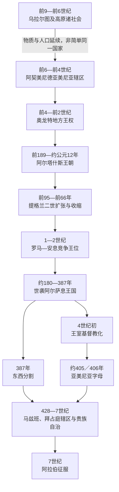

# 古代亚美尼亚与基督教化

## 时间

约前6世纪至7世纪

## 概括

古代亚美尼亚不是由某个更早王国完整、直线地“变成”的国家，而是在亚美尼亚高原多种人口、语言和帝国制度长期互动中形成。乌拉尔图留下城市、灌溉、要塞和区域政治传统；阿契美尼德帝国的总督制、伊朗礼仪与贵族结构又塑造早期王权。前6世纪后，“亚美尼亚”作为外部文献中的地区和人群名称逐渐明确，亚美尼亚语则在多语环境中扩展。

奥龙特、阿尔塔什斯和阿尔萨息诸王朝先后统治大亚美尼亚。提格兰二世利用西亚权力真空建立短暂区域帝国；此后罗马与安息／萨珊长期争夺王位。4世纪初王室基督教化、5世纪初亚美尼亚字母形成，使教会、礼仪和书写文化在国家分割后仍维持共同体。428年萨珊废除东部王位，但地方贵族、教会和语言文化继续存在；7世纪阿拉伯扩张才结束古代拜占庭—萨珊双重框架。

## 地理范围与形成背景

### 亚美尼亚高原不是现代国界

古代大亚美尼亚的范围随王朝和战争改变，通常包括阿拉斯河流域、凡湖周围及幼发拉底河上游若干区域，横跨今日亚美尼亚、土耳其东部、伊朗西北和南高加索部分地区。现代亚美尼亚共和国只是这一历史空间的一部分。索菲尼、小亚美尼亚、科马基尼和阿特罗帕特等邻近政体有时受亚美尼亚王室控制，有时独立或属于罗马、伊朗体系。

### 乌拉尔图是重要前史，但不是简单同一国家

前9—前6世纪乌拉尔图以凡湖和高原要塞为中心，建立铭文、仓储、灌溉与道路网络。其灭亡后，原有人口并未消失，物质与地方组织也可能被后继社会吸收；然而乌拉尔图使用的语言、王号与政治体系不能直接等同于后来的亚美尼亚语王国。亚美尼亚族群形成更适合解释为高原原有人群、进入或扩散的印欧语群体、帝国移民和地方贵族长期融合。

### 阿契美尼德制度提供早期政治框架

前6世纪后半叶的波斯与希腊资料首次明确提到亚美尼亚人／亚美尼亚地区。阿契美尼德帝国通过总督、贡赋和军役整合高原，本地贵族仍掌握土地、骑兵与要塞。帝国阿拉米语、伊朗人名和宫廷礼仪长期影响王权；亚历山大征服阿契美尼德后，马其顿势力并未像在叙利亚和埃及那样完全重组高原，奥龙特家族因而能延续地方权力。

## 政治主线

| 阶段 | 约时间 | 统治结构 | 历史意义 |
|---|---|---|---|
| 阿契美尼德辖区与奥龙特总督 | 前6—前4世纪 | 帝国总督、地方王族、贡赋与军役体系 | “亚美尼亚”名称明确，伊朗制度与本地贵族结合。 |
| 奥龙特地方王国 | 前4世纪末—前2世纪初 | 世袭王族协调高原贵族；受塞琉古影响 | 总督权逐渐转为区域王权，希腊化城市与钱币出现。 |
| 阿尔塔什斯王朝 | 前189年—约公元12年 | 国王、纳哈拉尔贵族、城市与王室领地 | 完成较大范围整合，提格兰二世时短暂成为区域帝国。 |
| 罗马—安息竞争王位 | 1—2世纪 | 外部扶立国王与本地贵族共同维持统治 | 63／66年形成“安息王族、罗马认可”的折衷。 |
| 世袭阿尔萨息王国 | 约180—387年 | 阿尔萨息王室、纳哈拉尔、军职家族和祭司／教会 | 王统较稳定；萨珊兴起后对抗加强，王室基督教化。 |
| 分割王国与马兹班时代 | 387—7世纪 | 西部属罗马／拜占庭，东部先保留王位、428年后由萨珊总督治理 | 王权消失后，贵族、教会与文字文化继续维持政治社会。 |
| 拜占庭—萨珊战争与阿拉伯征服 | 6—7世纪 | 帝国行省、马兹班、地方亲王与教会并存 | 591年再次分区；7世纪哈里发势力进入，古代帝国框架终结。 |

## 从奥龙特王权到阿尔塔什斯国家

奥龙特家族既使用伊朗名字与宫廷传统，也处在希腊化世界影响下。前4—3世纪，亚美尼亚并不是高度集中的领土国家，王室需要同众多地方家族交换军役、婚姻与土地权利。埃鲁万达沙特、阿尔萨莫萨塔等城市和钱币显示王权试图建立常驻中心，但不同奥龙特支系在大亚美尼亚、索菲尼和科马基尼并立，世系与边界常不清楚。

前3世纪末，塞琉古王安条克三世任用阿尔塔什斯管理大亚美尼亚、扎里亚德里斯管理索菲尼。前190年马格尼西亚战败削弱塞琉古控制，两位地方统治者转而获罗马承认称王。阿尔塔什斯一世扩展阿拉斯河谷领地，建立阿尔塔沙特，并以界碑、王室土地和城市加强税收。王朝可能自称奥龙特后裔，说明“新王朝”仍需借旧家族合法性。

## 提格兰二世的扩张、鼎盛与收缩

### 崛起机制

提格兰二世前95年即位时曾向安息割让土地以换取释放。他随后利用安息内部压力、塞琉古王朝衰亡和罗马尚未全面进入西亚的窗口，重新夺回边地、兼并索菲尼，并同本都王米特里达梯六世联姻。骑兵、附庸军、征服城市的税赋与强制迁徙人口共同支撑扩张；新都提格兰诺塞塔被设计为王权和多族人口的中心。

### 帝国阶段

前1世纪80年代，提格兰控制北美索不达米亚、叙利亚及部分黎凡特，采用“万王之王”式威仪。该帝国不是均质化行政国家：核心高原、附庸王、希腊城市和新征服区受到不同程度控制。繁荣来自商路、贡赋和战争所得，但也高度依赖君主个人、军事胜利与外部权力真空。

### 衰退与直接触发

提格兰与本都联盟把亚美尼亚卷入米特里达梯战争。前69年罗马将领卢库鲁斯攻破提格兰诺塞塔，前66年庞培迫使提格兰议和。王国失去叙利亚和多数外部征服，却保留高原核心和王位。扩张终结的结构原因是疆域过大、行政层级不一、被迁人口忠诚有限；外部压力是罗马持续东进；直接触发则是庇护米特里达梯并同罗马开战。把衰落简单归因于一场战役会忽略这一连串条件。

## 罗马与安息之间的王位政治

阿尔塔什斯主线约公元1世纪初断绝后，罗马皇帝、安息大王、本都—卡帕多西亚王族和高加索伊比利亚王族相继提出候选人。国王能否统治，不只取决于外部军队，也取决于纳哈拉尔是否接受。芝诺因采用本地王号和礼仪而较稳定；拉达米斯依靠暴力夺位则引发反抗。

安息王沃洛加西斯一世扶立弟弟梯里达底，罗马随后派科尔布罗作战。双方在63年朗代亚达成折衷，66年梯里达底赴罗马由尼禄加冕：国王血缘来自安息阿尔萨息王族，同时接受罗马的政治确认。该安排减少了继承规则的不确定，却没有消除帝国战争。图拉真114年一度把亚美尼亚改为罗马行省，哈德良撤退后又恢复附庸王权；161—164年战争中，安息与罗马候选人再次交替。

## 阿尔萨息国家与萨珊压力

约180年沃洛加西斯二世建立可连续追踪的本地阿尔萨息父系。王室统辖的并非现代官僚国家，而是世袭贵族共同体。马米科尼扬家族常掌军职，其他纳哈拉尔控制大片领地、要塞和骑兵；国王需要册封、婚姻与王室地产协调他们。贵族既能保卫王国，也能向罗马或伊朗寻求外援，成为王权的长期结构性限制。

224年萨珊王朝推翻安息后，原有“泛阿尔萨息亲族秩序”消失。萨珊把亚美尼亚视为恢复伊朗帝国边疆的重要部分，亚美尼亚王室则把新王朝视为夺取其同族王位的敌人。3世纪中叶萨珊军队打断本地王统；罗马战胜纳尔塞并签订尼西比斯和约后，梯里达底三世的地位才在约298年稳固。

## 基督教化：事件而非单一日期

基督教在王室改宗前已由叙利亚、美索不达米亚与小亚细亚方向进入高原。亚美尼亚传统把梯里达底三世与启蒙者格里高利推动国家改宗定于301年，并强调亚美尼亚是首个正式奉基督教为国教的王国；现代研究常把格里高利在凯撒利亚受职及王室决定性转向置于约314／315年。两种日期反映材料和定义差异，笔记不把仍有争议的年份写成无条件确定事实。

王室改宗有多重后果：

- 旧祭司土地和圣所逐步转给教会，格里高利家族一度世袭教会最高职位。
- 王权获得跨地区主教和修道网络，但教会也发展出独立地产、法权和对国王的道德约束。
- 与萨珊祆教国家的差异加深，同时同罗马／拜占庭基督教世界联系加强。
- 普通人口的宗教转换持续数代，地方习俗并未在某一年全部消失。

## 4世纪危机、分割与王位灭亡

阿尔沙克二世试图加强王权、建设阿尔沙卡万并削弱贵族，激起内外反对。萨珊沙普尔二世以谈判诱捕国王，约368年直接入侵；王后帕兰泽姆守卫阿尔塔格尔斯失败。罗马扶立其子帕普，但帕普限制教会地产、谋求独立外交，又被罗马将领杀害。之后幼王、摄政贵族和外部册封不断交替。

约384—387年，罗马与萨珊承认亚美尼亚分割。西部王国在阿尔沙克三世死后约390年被罗马并入；较大的东部王国仍由萨珊扶立的阿尔萨息国王统治。弗拉姆沙普时期，梅斯罗普·马什托茨在国王和教会领袖萨哈克支持下约405／406年创制亚美尼亚字母，圣经翻译、学校和本地史学迅速发展。文字并不是“国家灭亡后的装饰”，而是使跨越帝国边界的教会和贵族共享礼仪、教育与记忆的基础设施。

428年，部分纳哈拉尔因同末王阿尔塔什斯四世冲突，请求萨珊废王。萨珊宫廷借机取消东部王位，设置马兹班总督。直接触发是贵族控诉与帝国决定，深层原因则是分割后的王室税源、军力和合法性均不足。王位终结没有使地方社会消失：纳哈拉尔仍提供骑兵和治理，教会继续组织教育与救济。

## 马兹班时代、阿瓦赖尔与古代框架终结

萨珊最初容许地方贵族和教会延续，但叶兹德格德二世要求贵族接受祆教，引发反抗。451年瓦尔丹·马米科尼扬率军在阿瓦赖尔战败，军事结果有利于萨珊，宗教争端却未解决。484年另一轮起义后，《努瓦尔萨克协议》恢复基督教实践与贵族权利。阿瓦赖尔因此成为身份记忆中的“失败而守信”事件，但不能误写成当场赢得完全独立。

6世纪拜占庭—萨珊战争多次改划边界，591年拜占庭取得大片西部和中部地区。628年萨珊危机后帝国秩序迅速松动，640年代起阿拉伯军进入高原。哈里发先以纳贡和贵族自治整合亚美尼亚，再逐渐设置更稳定的总督区；这标志古代罗马—伊朗双帝国框架向中世纪伊斯兰帝国体系转换。

## 统治结构

| 层次 | 角色 | 权力来源与限制 |
|---|---|---|
| 国王 | 军事统帅、最高裁判和册封者 | 依赖王室领地、城市税收、帝国承认与贵族效忠；无稳定常备官僚体系。 |
| 纳哈拉尔 | 世袭贵族家族与领地主 | 控制土地、骑兵、要塞和地方司法；可支撑王权，也能结盟外部帝国或废立国王。 |
| 军职家族 | 尤以马米科尼扬等掌斯帕拉佩特军职 | 组织贵族军队；军权世袭使国王难以垄断武力。 |
| 城市与商路 | 阿尔塔沙特、提格兰诺塞塔、德温等 | 提供市场、工艺、关税和外交节点；战争与迁徙可迅速改变繁荣。 |
| 祭司与教会 | 前基督教祭司集团，后为主教、修道院和教会地产 | 掌礼仪、教育、司法与社会组织；既为王权提供合法性，也形成独立利益。 |
| 罗马／安息／萨珊 | 册封者、宗主或直接统治者 | 提供军援和王位承认，同时要求外交服从、贡赋、驻军或宗教政策配合。 |

## 君主世系

奥龙特、阿尔塔什斯、竞争王位和阿尔萨息王统较长，且包含共治、复位和直接统治空档，完整表另见[亚美尼亚古代君主世系表](/%E4%BA%BA%E6%96%87%E7%A7%91%E5%AD%A6/%E5%8E%86%E5%8F%B2/%E8%A5%BF%E4%BA%9A/%E5%8D%97%E9%AB%98%E5%8A%A0%E7%B4%A2/%E4%BA%9A%E7%BE%8E%E5%B0%BC%E4%BA%9A/%E4%BA%9A%E7%BE%8E%E5%B0%BC%E4%BA%9A%E5%8F%A4%E4%BB%A3%E5%90%9B%E4%B8%BB%E4%B8%96%E7%B3%BB%E8%A1%A8.md)。该表不使用“后期诸王”之类合并项，并明确区分：

- 可由同时代铭文、钱币或外部记载确认的统治者；
- 仅能按后世史书重建、年代仍有争议者；
- 罗马或安息扶立的竞争君主；
- 114—117年罗马行省化、3世纪萨珊占领等无本地王空档；
- 387年后东西并立和428年最终废王。

## 重要事件与长期影响

| 时间 | 事件 | 过程与影响 |
|---|---|---|
| 前6世纪后半叶 | 波斯与希腊资料明确提及亚美尼亚 | 说明地区名称进入帝国地理，但不等于现代民族国家已形成。 |
| 前189年 | 阿尔塔什斯一世建立独立王权 | 利用塞琉古战败，在罗马承认下整合高原。 |
| 前95—前55年 | 提格兰二世统治 | 建立短暂区域帝国，随后在罗马战争中收缩至核心领地。 |
| 63／66年 | 朗代亚安排与梯里达底加冕 | 形成安息血缘、罗马认可的双重合法性。 |
| 114—117年 | 图拉真改设罗马行省 | 直接兼并短暂，显示罗马后勤和地方政治限制。 |
| 约298年 | 尼西比斯和约后阿尔萨息复位稳固 | 罗马胜利暂时压低萨珊影响。 |
| 传统301年／研究常取约314年 | 王室基督教化 | 教会成为国家与跨境共同体核心，年代和“国教”定义仍有争议。 |
| 约368—374年 | 萨珊入侵、帕普复位及被杀 | 王权同时受伊朗军事压力、罗马干预和贵族—教会矛盾牵制。 |
| 387年 | 罗马—萨珊分割 | 西部王位很快消失，东部王国继续约四十年。 |
| 约405／406年 | 亚美尼亚字母形成 | 推动翻译、教育、礼仪和历史书写，强化分割后的文化连续性。 |
| 428年 | 萨珊废除东部王位 | 马兹班制度取代君主制，贵族和教会仍保有社会权力。 |
| 451年、484年 | 阿瓦赖尔战争与努瓦尔萨克协议 | 军事失败、长期谈判和再次起义共同促成宗教实践获保障。 |
| 640年代后 | 阿拉伯征服 | 古代拜占庭—萨珊竞争框架转入哈里发统治与贵族自治。 |

## 演变关系

- 详细王统：[亚美尼亚古代君主世系表](/%E4%BA%BA%E6%96%87%E7%A7%91%E5%AD%A6/%E5%8E%86%E5%8F%B2/%E8%A5%BF%E4%BA%9A/%E5%8D%97%E9%AB%98%E5%8A%A0%E7%B4%A2/%E4%BA%9A%E7%BE%8E%E5%B0%BC%E4%BA%9A/%E4%BA%9A%E7%BE%8E%E5%B0%BC%E4%BA%9A%E5%8F%A4%E4%BB%A3%E5%90%9B%E4%B8%BB%E4%B8%96%E7%B3%BB%E8%A1%A8.md)。
- 后续阶段：[中世纪王国与帝国夹缝](/%E4%BA%BA%E6%96%87%E7%A7%91%E5%AD%A6/%E5%8E%86%E5%8F%B2/%E8%A5%BF%E4%BA%9A/%E5%8D%97%E9%AB%98%E5%8A%A0%E7%B4%A2/%E4%BA%9A%E7%BE%8E%E5%B0%BC%E4%BA%9A/%E4%B8%AD%E4%B8%96%E7%BA%AA%E7%8E%8B%E5%9B%BD%E4%B8%8E%E5%B8%9D%E5%9B%BD%E5%A4%B9%E7%BC%9D.md)。
- 区域比较：[南高加索古代王国与基督教化](/%E4%BA%BA%E6%96%87%E7%A7%91%E5%AD%A6/%E5%8E%86%E5%8F%B2/%E8%A5%BF%E4%BA%9A/%E5%8D%97%E9%AB%98%E5%8A%A0%E7%B4%A2/%E5%8F%A4%E4%BB%A3%E7%8E%8B%E5%9B%BD%E4%B8%8E%E5%9F%BA%E7%9D%A3%E6%95%99%E5%8C%96.md)。
- 伊朗帝国背景：[伊朗历史](/%E4%BA%BA%E6%96%87%E7%A7%91%E5%AD%A6/%E5%8E%86%E5%8F%B2/%E8%A5%BF%E4%BA%9A/%E4%BC%8A%E6%9C%97/README.md)。
- 上级入口：[亚美尼亚](/%E4%BA%BA%E6%96%87%E7%A7%91%E5%AD%A6/%E5%8E%86%E5%8F%B2/%E8%A5%BF%E4%BA%9A/%E5%8D%97%E9%AB%98%E5%8A%A0%E7%B4%A2/%E4%BA%9A%E7%BE%8E%E5%B0%BC%E4%BA%9A/README.md)。
