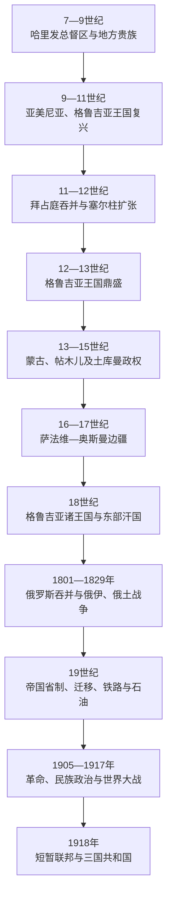

# 伊朗、奥斯曼与俄罗斯帝国竞争下的南高加索

## 时间

7世纪—1917年

## 概括

7世纪阿拉伯征服以后，南高加索并未从古代王国直接过渡到现代民族国家，而是经历哈里发总督区、亚美尼亚与格鲁吉亚巴格拉图尼／巴格拉季昂王国、穆斯林埃米尔国、塞尔柱与蒙古征服、伊朗—奥斯曼边疆以及俄罗斯帝国统治等多层次秩序。王室、贵族、教会、穆斯林法官、城市商人、游牧集团和帝国官员在同一时期往往同时拥有不同权力。

9—13世纪，阿拔斯权威减弱使亚美尼亚和格鲁吉亚王权复兴。阿尼的亚美尼亚王国随后因贵族分裂、拜占庭吞并与塞尔柱征服瓦解；部分政治和文化中心转向奇里乞亚。格鲁吉亚王国则在大卫四世与塔玛尔时期控制南高加索重要商路，后被蒙古征服并逐步分裂。

16—18世纪，萨法维伊朗与奥斯曼帝国争夺要塞、税源和附庸。东南高加索逐渐形成什叶派占优势的社会，格鲁吉亚和亚美尼亚基督教社群则在两帝国之间维持教会、贵族和商业网络。18世纪伊朗中央权力反复崩解后，东部出现多个汗国，格鲁吉亚王国寻求俄罗斯保护。

俄罗斯以保护、吞并、战争和条约逐步占领南高加索：1801年吞并卡特利—卡赫季，1813年《古利斯坦条约》和1828年《土库曼恰伊条约》迫使伊朗承认失地，随后从奥斯曼取得部分西南高加索。帝国省制、铁路、教育、人口迁移与巴库石油工业重塑区域，却没有消除土地、宗教和政治矛盾。1905年革命、族群冲突、民族政党和第一次世界大战最终把南高加索推向1917年后的国家重建。

## 统治层次

| 层次 | 主要主体 | 权力方式 |
|---|---|---|
| 区域帝国 | 哈里发、拜占庭、塞尔柱、蒙古汗国、伊朗诸朝、奥斯曼、俄罗斯 | 征服、驻军、税收、册封、条约和省制。 |
| 地方王国与汗国 | 亚美尼亚和格鲁吉亚诸王国、希尔凡沙、埃里温、卡拉巴赫、占贾等汗国 | 王室或汗室、贵族、骑兵、城市和地方税区。 |
| 贵族与军事领主 | 亚美尼亚纳哈拉尔、格鲁吉亚塔瓦迪、突厥和库尔德军政集团 | 掌握土地、堡垒、农民义务和私兵，可在帝国间转换效忠。 |
| 宗教机构 | 亚美尼亚使徒教会、格鲁吉亚正教会、伊斯兰法官与教产机构等 | 教育、司法、慈善、土地、礼仪和跨境社群组织。 |
| 城市和商人 | 第比利斯、阿尼、巴库、占贾、埃里温、舒沙等 | 商路、手工业、石油、信贷和侨民网络。 |
| 山地与游牧共同体 | 高山村社、部落联盟、季节迁徙群体 | 地形防御、牧场权、贡赋谈判和边疆军事服务。 |

## 阿拉伯征服与地方王朝复兴

7世纪40年代起，阿拉伯军队进入亚美尼亚、伊比利亚和高加索阿尔巴尼亚。哈里发通常通过“阿尔米尼亚”总督区、驻军城市、贡税和地方贵族治理，范围和中心随时期变化。第比利斯形成穆斯林埃米尔政权，德尔本特和库拉河下游承担里海防务；基督教教会和本地贵族则保留大量乡村组织。

高税负、王朝内斗和边疆距离导致多次起义。8世纪末至9世纪，阿拔斯中央权威减弱，巴格拉图尼家族在亚美尼亚、巴格拉季昂家族在格鲁吉亚逐步扩大领地。885年阿绍特一世获承认为亚美尼亚国王，既接受哈里发册封，也寻求拜占庭承认；约888年阿达尔纳塞四世建立格鲁吉亚巴格拉季昂王权。两支家族名称和远祖传统相关，但已发展为不同政治实体。

### 亚美尼亚王国的兴衰

巴格拉图尼王国以卡尔斯和后来阿尼为中心，10世纪在阿绍特三世、斯姆巴特二世、加吉克一世时期发展城市、教堂和商路。其“复兴”并非统一控制整个历史亚美尼亚：瓦斯普拉坎、休尼克、洛里等地有独立或半独立王室，阿尔茨鲁尼等贵族保持强大。

11世纪，继承分裂和拜占庭扩张削弱王国。拜占庭于1045年兼并阿尼，试图以官僚和驻军取代本地王权；1064年塞尔柱攻陷阿尼，1071年曼齐克特战役后突厥政权和游牧群体在安纳托利亚、高原与南高加索扩大。部分亚美尼亚贵族、军人、商人和农民向卡帕多西亚、奇里乞亚及其他地区迁移，奇里乞亚亚美尼亚后来形成新的王国；高原内部的教会和地方贵族并未全部消失。

### 格鲁吉亚王国的统一与鼎盛

10—11世纪，陶—克拉尔杰蒂等巴格拉季昂支系整合西、东格鲁吉亚。巴格拉特三世约在1008年前后统一主要王国，但第比利斯仍由穆斯林埃米尔控制，塞尔柱“大入侵”又造成破坏。大卫四世通过重组军队、引入钦察战士、限制大贵族和教会会议改革恢复国家；1121年迪德格里战役击败塞尔柱联盟，次年夺取第比利斯。

塔玛尔女王时期，王国及附庸网络延伸到黑海东岸和亚美尼亚北部。扎卡里德亚美尼亚贵族在格鲁吉亚宗主权下管理阿尼等地，商路、修道院和城市复兴。鼎盛依赖强势王室、军事贵族合作和周边强权暂时分裂；1220年代花剌子模与蒙古进军打破平衡。

## 蒙古、帖木儿与后蒙古秩序

蒙古军队于1220—1221年首次深入，1230年代完成对格鲁吉亚和亚美尼亚大部的征服。地方王室和贵族登记户口、缴纳赋税并提供军队，有些家族借服役保住领地。南高加索主要进入伊儿汗国体系，贸易路线一度因大帝国联通而活跃，但军役、争位战争和税负沉重。

伊儿汗国14世纪中叶瓦解后，札剌亦儿、金帐汗国、楚邦系、地方王公等争夺控制。帖木儿在1386—1403年间多次入侵，造成城市、农业和人口损失。15世纪黑羊与白羊土库曼联盟以阿塞拜疆和东安纳托利亚为基地，控制南高加索大部；格鲁吉亚王国在贵族竞争和持续战争中于15世纪后期分裂为卡特利、卡赫季、伊梅列季等王国及若干公国。

## 萨法维—奥斯曼边疆

### 争夺与分界

1501年沙阿伊斯玛仪一世建立萨法维王朝，以阿塞拜疆为核心并确立十二伊玛目什叶派国教。奥斯曼帝国则从安纳托利亚和黑海方向扩张。1514年查尔迪兰战役后，双方长期争夺格鲁吉亚、亚美尼亚、希尔凡和里海通道。

1555年《阿马西亚和约》首次较稳定地划分势力范围；战争仍不断重启。1639年《祖哈布和约》大体确立奥斯曼控制西格鲁吉亚和西部亚美尼亚、萨法维控制东格鲁吉亚、东部亚美尼亚及今日阿塞拜疆大部的格局。边界并非封闭国界，附庸王国、部落牧场和商路仍跨界活动。

### 人口与宗教重组

萨法维通过任命可汗、利用奇兹尔巴什军事部落、册封格鲁吉亚王族和建立王室奴仆军治理。沙阿阿拔斯一世在1604年对奥斯曼战争中实施焦土和强制迁移，朱法等地大量亚美尼亚人被迁往伊朗内地，新朱法商人后来构成跨欧亚贸易网络。格鲁吉亚贵族有人在伊朗宫廷改宗并任军政高官，也有人领导反叛。

奥斯曼通过行省、税区、驻军和地方贵族统治西部。今日阿塞拜疆地区的突厥语传播是长期迁徙、政治和语言转换的结果；萨法维国教政策使什叶派逐渐成为多数，但逊尼派、基督徒、犹太人及多种山地社群继续存在。不能把帝国宗教分界直接理解为现代民族边界。

## 18世纪的权力碎片化

1722年萨法维崩溃后，俄罗斯彼得一世与奥斯曼一度瓜分里海及西北伊朗地区。纳迪尔沙重新统一伊朗并恢复对南高加索多数地区的宗主权，但其1747年遇刺后，卡拉巴赫、占贾、库巴、巴库、希尔凡、舍基、埃里温、纳希切万等汗国相继独立或高度自治。汗国以城堡、部落、土地税和伊朗政治文化为基础，相互战争，也同格鲁吉亚、俄罗斯、奥斯曼和卡扎尔伊朗结盟。

格鲁吉亚东部的卡特利—卡赫季在埃雷克勒二世统治下统一并推动军事、商业改革。为抵御伊朗和奥斯曼，1783年同俄罗斯签订《格奥尔吉耶夫斯克条约》，接受俄国保护并保留王朝。俄国保护未能阻止1795年卡扎尔建立者阿迦·穆罕默德汗攻陷第比利斯；俄国随后决定直接吞并，而非恢复平等保护关系。

## 俄罗斯征服

| 时间 | 行动或条约 | 结果 |
|---|---|---|
| 1801年 | 俄国废除卡特利—卡赫季王位并宣布吞并 | 东格鲁吉亚纳入俄罗斯；巴格拉季昂王族失去统治权。 |
| 1804—1813年 | 第一次俄伊战争 | 俄军夺取占贾等地；《古利斯坦条约》使伊朗承认俄国控制格鲁吉亚、达吉斯坦及卡拉巴赫、舍基、希尔凡、巴库等汗国。 |
| 1804—1810年代 | 兼并西格鲁吉亚王国和公国 | 伊梅列季王国被废，明格列利亚、古里亚等先保留附庸后改为直接统治。 |
| 1826—1828年 | 第二次俄伊战争 | 《土库曼恰伊条约》使伊朗割让埃里温和纳希切万汗国，以阿拉斯河附近边界为基础的俄伊分界形成。 |
| 1828—1829年 | 俄土战争与《阿德里安堡条约》 | 俄国巩固黑海东岸和阿哈尔齐赫等地，奥斯曼承认既成占领。 |
| 1877—1878年 | 再次俄土战争 | 俄国取得卡尔斯、阿尔达汉和巴统等地，西南高加索边界再变。 |
| 19世纪后期 | 高加索战争结束与行政整合 | 俄国在北、南高加索的军事省制和交通网络相互连接。 |

俄国征服不是单纯的宗教“解放”。部分亚美尼亚和格鲁吉亚精英把俄国视为对抗穆斯林帝国的保护者，部分穆斯林汗与贵族也选择合作；另一些王族、农民和山地群体则抵抗吞并。帝国废除王位和汗国，把土地、宗教和司法纳入总督区、 губерния 省与军政机构。不同社群在新制度中获得或失去的权利并不相同。

## 帝国统治下的社会转型

### 行政与土地

第比利斯成为高加索总督区的行政和文化中心。俄国确认部分贵族等级，改造农民义务，并逐步在1860—1870年代实施农奴和依附关系改革。土地登记、国家森林与牧场政策引发贵族、农民和游牧群体之间的新争议。

### 人口迁移

1828年后，许多来自卡扎尔伊朗和奥斯曼帝国的亚美尼亚人迁入俄属亚美尼亚，同时部分穆斯林人口向南或向奥斯曼境内迁移。19世纪俄土战争、北高加索战争和地方冲突继续推动人口移动。迁移改变若干地区人口比例，但不能用单一“替换”叙事概括：战争、政策、经济机会、季节迁徙和难民流动均发挥作用。

### 城市、铁路与石油

第比利斯聚集格鲁吉亚、亚美尼亚、俄国及其他知识分子和商人；巴库在19世纪后期成为世界级石油中心，诺贝尔、罗斯柴尔德和本地企业家共同投资。巴库—第比利斯铁路、黑海港口和输油设施把里海能源接入帝国及全球市场。工业化创造工人阶级、财富和现代教育，也带来拥挤、劳资冲突与族群分工。

### 民族政治与革命

教会学校、印刷、报刊和历史研究推动现代亚美尼亚、格鲁吉亚及阿塞拜疆突厥语穆斯林知识界形成。社会民主主义、自由主义、亚美尼亚革命联盟、穆萨瓦特等不同组织把阶级、自治、民族与帝国改革结合。1905年革命期间，罢工、国家权威崩解和亚美尼亚—穆斯林武装冲突相互叠加，巴库、纳希切万和卡拉巴赫等地出现严重暴力。

第一次世界大战中，俄奥战线横跨南高加索与东安纳托利亚。奥斯曼帝国对亚美尼亚人的驱逐和大规模杀害构成亚美尼亚种族灭绝，幸存者大量逃往俄属高加索；同时穆斯林平民及其他社群也因战斗、报复、饥荒和迁移遭受重大损失。1917年俄国革命使军队与行政体系瓦解，为短暂外高加索联邦和三国共和国铺路。

## 重要事件

| 时间 | 事件 | 结果与长期影响 |
|---|---|---|
| 7世纪40年代 | 阿拉伯征服南高加索 | 区域进入哈里发税收与总督体系，地方贵族和教会仍存。 |
| 885年 | 阿绍特一世获承认为亚美尼亚国王 | 巴格拉图尼王国复兴。 |
| 约888年 | 阿达尔纳塞四世称格鲁吉亚人之王 | 格鲁吉亚巴格拉季昂王权形成。 |
| 1045—1071年 | 拜占庭吞并阿尼、塞尔柱攻陷与曼齐克特战役 | 亚美尼亚高原政治碎片化，迁徙与突厥政权扩张。 |
| 1121—1122年 | 迪德格里胜利和夺取第比利斯 | 格鲁吉亚统一王国进入鼎盛阶段。 |
| 1184—1213年 | 塔玛尔统治 | 格鲁吉亚附庸网络、贸易和文化扩张达到高峰。 |
| 1230年代 | 蒙古完成征服 | 王国和贵族纳入赋税、军役与伊儿汗国体系。 |
| 1386—1403年 | 帖木儿多次入侵 | 城市和农业受损，旧王权进一步衰弱。 |
| 1501—1639年 | 萨法维建立及长期奥斯曼战争 | 什叶派化、强制迁徙和东西势力范围大体定型。 |
| 1747年 | 纳迪尔沙死后汗国兴起 | 东南高加索进入多个汗国和王国竞争。 |
| 1783年 | 《格奥尔吉耶夫斯克条约》 | 卡特利—卡赫季接受俄国保护。 |
| 1795年 | 卡扎尔军攻陷第比利斯 | 暴露俄国保护不足，也加速其直接吞并。 |
| 1801年 | 俄国吞并东格鲁吉亚 | 俄罗斯系统征服南高加索开始。 |
| 1813、1828年 | 《古利斯坦》《土库曼恰伊》条约 | 伊朗丧失阿拉斯河以北多数领土，现代俄伊边界基础形成。 |
| 1872年后 | 巴库石油业自由开发 | 工业化、移民和资本网络重塑区域。 |
| 1905—1907年 | 革命、罢工与族群冲突 | 民族政党和武装自卫扩大，帝国秩序受挑战。 |
| 1914—1917年 | 高加索战线、种族灭绝与俄国革命 | 难民和国家崩溃推动1918年新共和国出现。 |

## 兴衰与更替原因

### 地方王国崛起

- 哈里发、拜占庭或区域穆斯林强权衰弱时，掌握山口、堡垒和贵族联盟的王室获得扩张机会。
- 教会、修道院和文字行政为亚美尼亚与格鲁吉亚王权提供跨地区组织能力。
- 阿尼、第比利斯等城市及黑海—里海商路为军队和宫廷提供税源。
- 强势君主能重组军队、压制贵族和吸纳外来战士，但制度往往依赖个人统治。

### 地方王国衰落

- 分封继承和大贵族掌兵使统一王权容易在君主死亡后分裂。
- 拜占庭以吞并盟国消除缓冲，反而削弱本地抵抗塞尔柱的能力。
- 蒙古和帖木儿征服叠加高额军役、人口迁移与商路变化。
- 萨法维—奥斯曼战争把附庸王国和汗国变为反复易手的边疆。

### 俄罗斯能够取胜

- 俄国拥有长期动员、炮兵、驻军和跨高加索军事道路，地方王国与汗国难以联合。
- 伊朗与奥斯曼同时面对内部危机和其他战线，不能持续支援高加索。
- 部分基督教精英主动寻求保护，汗国间竞争也让俄国逐个结盟或吞并。
- 保护条约被转化为直接吞并，战争胜利再由国际条约合法化。

### 帝国秩序最终瓦解

- 工业化和教育制造新的工人、专业阶层与民族知识界，旧贵族—官僚秩序无法吸收其诉求。
- 土地、石油收益和人口迁移激化社会及社群竞争。
- 1905年后民族政党、社会主义组织和武装网络扩张。
- 第一次世界大战的军事失败、难民危机和1917年俄国革命直接摧毁帝国行政与军队。

## 演变关系

- 前一阶段：[古代王国与基督教化](/%E4%BA%BA%E6%96%87%E7%A7%91%E5%AD%A6/%E5%8E%86%E5%8F%B2/%E8%A5%BF%E4%BA%9A/%E5%8D%97%E9%AB%98%E5%8A%A0%E7%B4%A2/%E5%8F%A4%E4%BB%A3%E7%8E%8B%E5%9B%BD%E4%B8%8E%E5%9F%BA%E7%9D%A3%E6%95%99%E5%8C%96.md)。
- 后一阶段：[苏维埃划界、独立与地区冲突](/%E4%BA%BA%E6%96%87%E7%A7%91%E5%AD%A6/%E5%8E%86%E5%8F%B2/%E8%A5%BF%E4%BA%9A/%E5%8D%97%E9%AB%98%E5%8A%A0%E7%B4%A2/%E8%8B%8F%E7%BB%B4%E5%9F%83%E5%88%92%E7%95%8C%E3%80%81%E7%8B%AC%E7%AB%8B%E4%B8%8E%E5%9C%B0%E5%8C%BA%E5%86%B2%E7%AA%81.md)。
- 分国详述：[中世纪王国与帝国夹缝](/%E4%BA%BA%E6%96%87%E7%A7%91%E5%AD%A6/%E5%8E%86%E5%8F%B2/%E8%A5%BF%E4%BA%9A/%E5%8D%97%E9%AB%98%E5%8A%A0%E7%B4%A2/%E4%BA%9A%E7%BE%8E%E5%B0%BC%E4%BA%9A/%E4%B8%AD%E4%B8%96%E7%BA%AA%E7%8E%8B%E5%9B%BD%E4%B8%8E%E5%B8%9D%E5%9B%BD%E5%A4%B9%E7%BC%9D.md)、[统一王国、分裂与帝国竞争](/%E4%BA%BA%E6%96%87%E7%A7%91%E5%AD%A6/%E5%8E%86%E5%8F%B2/%E8%A5%BF%E4%BA%9A/%E5%8D%97%E9%AB%98%E5%8A%A0%E7%B4%A2/%E6%A0%BC%E9%B2%81%E5%90%89%E4%BA%9A/%E7%BB%9F%E4%B8%80%E7%8E%8B%E5%9B%BD%E3%80%81%E5%88%86%E8%A3%82%E4%B8%8E%E5%B8%9D%E5%9B%BD%E7%AB%9E%E4%BA%89.md)、[汗国、俄国征服与石油城市](/%E4%BA%BA%E6%96%87%E7%A7%91%E5%AD%A6/%E5%8E%86%E5%8F%B2/%E8%A5%BF%E4%BA%9A/%E5%8D%97%E9%AB%98%E5%8A%A0%E7%B4%A2/%E9%98%BF%E5%A1%9E%E6%8B%9C%E7%96%86/%E6%B1%97%E5%9B%BD%E3%80%81%E4%BF%84%E5%9B%BD%E5%BE%81%E6%9C%8D%E4%B8%8E%E7%9F%B3%E6%B2%B9%E5%9F%8E%E5%B8%82.md)。
- 帝国背景：[伊朗](/%E4%BA%BA%E6%96%87%E7%A7%91%E5%AD%A6/%E5%8E%86%E5%8F%B2/%E8%A5%BF%E4%BA%9A/%E4%BC%8A%E6%9C%97/README.md)、[奥斯曼帝国](/%E4%BA%BA%E6%96%87%E7%A7%91%E5%AD%A6/%E5%8E%86%E5%8F%B2/%E8%A5%BF%E4%BA%9A/%E5%9C%9F%E8%80%B3%E5%85%B6/%E5%A5%A5%E6%96%AF%E6%9B%BC%E5%B8%9D%E5%9B%BD/README.md)。
- 上级入口：[南高加索](/%E4%BA%BA%E6%96%87%E7%A7%91%E5%AD%A6/%E5%8E%86%E5%8F%B2/%E8%A5%BF%E4%BA%9A/%E5%8D%97%E9%AB%98%E5%8A%A0%E7%B4%A2/README.md)。
