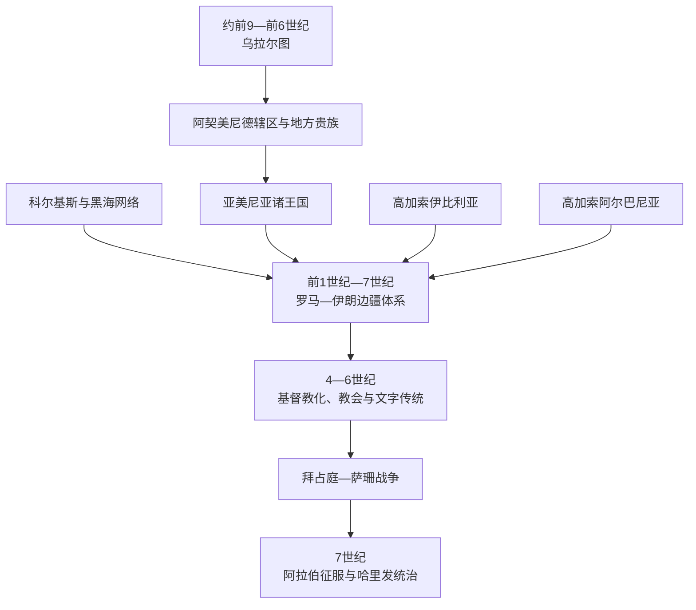

# 南高加索古代王国与基督教化

## 时间

约前9世纪—7世纪

## 概括

南高加索的古代政治没有一条可以直接通往亚美尼亚、格鲁吉亚和阿塞拜疆三国的单线谱系。亚美尼亚高原、库拉—阿拉斯河流域、黑海东岸和里海西岸分别形成乌拉尔图、科尔基斯、高加索伊比利亚、高加索阿尔巴尼亚和亚美尼亚诸王国，其疆域不断跨越今天的国界。山脉限制大规模统一，却使河谷、隘口和商路成为帝国竞争的关键节点。

前1千纪早期，乌拉尔图以凡湖盆地为中心，通过堡垒、灌溉、仓储和行省官员建立高原王权。其衰亡后，米底、阿契美尼德和地方贵族共同塑造新的政治格局。希腊化时代以来，亚美尼亚王国一度在提格兰二世时期扩张，高加索伊比利亚和阿尔巴尼亚也形成王权；黑海沿岸科尔基斯则连接本地社会与希腊、罗马贸易网络。

从前1世纪到7世纪，南高加索成为罗马—拜占庭与帕提亚—萨珊伊朗的边疆。两大帝国通常不直接管理所有山地，而是利用地方王室、贵族、驻军、贡赋和宗教政策。4世纪前后，亚美尼亚和伊比利亚的王权相继接受基督教，高加索阿尔巴尼亚亦逐步基督教化。5世纪亚美尼亚字母创制及格鲁吉亚、阿尔巴尼亚文字传统的发展，使教会、翻译和历史书写成为跨越王朝灭亡的制度载体。7世纪阿拉伯征服没有立即消除这些传统，却把区域纳入新的哈里发政治和税收体系。

## 地理与政治空间

| 空间 | 古代主要政体 | 统治基础 | 不能混淆之处 |
|---|---|---|---|
| 亚美尼亚高原与凡湖盆地 | 乌拉尔图、亚美尼亚诸王国 | 堡垒、灌溉、王室领地、贵族封地与高原商路 | 乌拉尔图使用胡里—乌拉尔图语支语言，不能直接等同于后世亚美尼亚国家；二者存在空间和物质文化承接，但族群连续性更复杂。 |
| 黑海东岸 | 科尔基斯、拉齐卡 | 港口、河谷农业、金属资源和黑海贸易 | 科尔基斯并非统一且边界固定的“古格鲁吉亚”，其政治整合程度随时期变化。 |
| 库拉河上游与东格鲁吉亚 | 高加索伊比利亚，又称卡特利 | 姆茨赫塔王都、山口、地方贵族与王室 | 与伊比利亚半岛无关；“伊比利亚”是古典作者对东格鲁吉亚政体的称呼。 |
| 库拉河下游至里海 | 高加索阿尔巴尼亚 | 多语言部族、河谷农业、德尔本特通道与地方王室 | 与巴尔干阿尔巴尼亚无关；其疆域、居民与现代阿塞拜疆民族国家不能简单画等号。 |
| 山脉与边缘河谷 | 多种部族、贵族领地和自治共同体 | 隘口、牧业、村社和季节迁徙 | 帝国地图上的宗主权不等于持续、均匀的基层控制。 |

## 主要政体与发展过程

### 乌拉尔图

约前9世纪中叶，萨尔杜里一世等统治者以图什帕为都，整合凡湖周边堡垒，并同亚述争夺高原和商路。伊什普伊尼、梅努阿、阿尔吉什提一世与萨尔杜里二世时期，王国向亚拉腊平原、塞凡湖和伊朗西北扩张。国王派驻官员，修建渠道、梯田、仓库和祭祀至高神哈尔迪的神庙，以铭文记录征服与工程。

亚述在前8世纪后期反击，游牧群体活动、宫廷重组和区域战争又加重压力。已知多处乌拉尔图中心在前7世纪后半叶前后遭破坏，但具体毁灭者、各地终结时间和王国最后阶段仍有争议。前6世纪初以后，米底和阿契美尼德体系取代其政治框架；部分聚落、灌溉和技术传统继续存在。

### 科尔基斯与黑海世界

古典文献把黑海东岸称为科尔基斯，希腊神话以金羊毛故事表现其遥远、富产金属的形象。前6世纪起，希腊人在法西斯等沿海地点建立贸易据点，本地精英通过金属、木材、农产品和奴隶贸易同黑海世界联系。科尔基斯内部并非始终由一个王朝集中统治，沿海城市、河谷首领和周边山地维持不同关系。

前1世纪本区卷入本都国王米特里达梯六世同罗马的战争。罗马获胜后以附庸、驻军和港口网络施加影响；晚期古代的拉齐卡王国承接西格鲁吉亚部分政治传统，并成为拜占庭与萨珊伊朗争夺黑海通道的焦点。

### 亚美尼亚诸王国

阿契美尼德时期，亚美尼亚作为帝国辖下地区由地方统治者和总督治理。亚历山大东征后，奥龙特王族及地方贵族获得更大自主；约前2世纪初，阿尔塔什斯一世建立阿尔塔什斯王朝并扩展王权。提格兰二世利用塞琉古衰落和帕提亚暂时受挫，在前1世纪一度控制北美索不达米亚、叙利亚和部分小亚细亚。

扩张依赖征服、迁徙城市人口和地方附庸，未形成稳定一体化帝国。前69—前66年罗马进攻后，提格兰保留亚美尼亚本部但放弃大部分征服地。此后罗马和帕提亚争夺继承安排，1世纪建立的阿尔萨息王朝具有帕提亚王族背景，却逐渐形成自身的亚美尼亚政治和基督教传统。

### 高加索伊比利亚

高加索伊比利亚约在前4—前3世纪形成较稳定王权，核心在姆茨赫塔及库拉—阿拉格维河交汇处。王室依靠贵族、山口和农业河谷，与亚美尼亚、黑海、北高加索及伊朗世界往来。前65年庞培进入南高加索后，伊比利亚时而承认罗马优势，时而同帕提亚或萨珊结盟。

4世纪王权接受基督教后，教会成为连接王都、贵族和乡村的新制度。5世纪瓦赫唐一世传统上与第比利斯发展及教会组织调整联系在一起，但后世编年史中的细节需与考古、铭文和外部史料对读。萨珊在6世纪一度废除伊比利亚王权，以总督和地方贵族治理；拜占庭—萨珊战争仍让本地贵族有周旋空间。

### 高加索阿尔巴尼亚

高加索阿尔巴尼亚约在前几个世纪由库拉河下游和东高加索多个语言群体逐步整合。古典文献记载其王权和多语言结构；前65年庞培进军时曾同当地国王交战。帕提亚和萨珊时期，阿尔萨息旁支王室、伊朗总督、地方贵族与北方隘口防务共同构成政治结构。

基督教约在4世纪开始获得王室支持，但传播并不均匀，祆教和地方信仰长期并存。5世纪瓦切二世反抗萨珊后退位，瓦恰甘三世在5世纪后期恢复王权并整顿教会。阿尔巴尼亚文字及教会文献的存留极少，其教会后来日益同亚美尼亚教会体系相连；这段遗产在现代民族叙事中高度政治化，应区分古代居民、教会管辖和现代认同。

## 罗马—伊朗边疆体系

| 机制 | 实际运作 |
|---|---|
| 王位干预 | 罗马、帕提亚和萨珊支持不同候选人，以人质、婚姻、册封或军事干预影响地方王位。 |
| 分割与和约 | 387年亚美尼亚被罗马与萨珊分割；428年萨珊废除东部亚美尼亚王权，改由总督治理，但贵族和教会仍存。 |
| 军事通道 | 德尔本特和达里亚尔等隘口既用于贸易，也用于防御匈人、阿兰及其他北方力量；修筑要塞需要帝国与本地合作。 |
| 宗教政策 | 基督教可能加强同罗马—拜占庭的文化联系，却不必然等于政治亲罗马；萨珊也通过祆教政策和教会安排巩固边疆。 |
| 地方贵族 | 亚美尼亚纳哈拉尔、伊比利亚和阿尔巴尼亚贵族掌土地、骑兵和堡垒，常在帝国之间转换效忠。 |
| 城市与贸易 | 姆茨赫塔、德尔本特、杜温及黑海港口连接里海、伊朗高原、安纳托利亚和北高加索，战争并未完全中断交换。 |

## 基督教化与文字传统

亚美尼亚传统把梯里达底三世接受格列高利启蒙者的信仰置于301年，现代研究对准确年份有争论，常把王权正式改宗放在4世纪初。伊比利亚王室在圣尼诺传教传统下约于4世纪30年代接受基督教。高加索阿尔巴尼亚的王室改宗也大致始于4世纪，但地方实践延续更久。基督教化是王室、贵族、主教区、修道院和乡村礼仪逐步重组的过程，不是一次法令即可完成。

约405年，梅斯罗普·马什托茨创制亚美尼亚字母，促成《圣经》翻译、神学教育和本土史书。格鲁吉亚文字最早铭文见于晚期古代，其确切起源和最初年代仍有讨论；高加索阿尔巴尼亚字母的存在由中世纪手稿记载和现代发现的铭文、重写本相互印证。文字使教会在王国分裂后继续保存礼仪和历史记忆，也让教义分歧成为身份边界的一部分。

451年迦克墩会议后，亚美尼亚教会最终没有接受其基督论公式；格鲁吉亚教会在早期曾同亚美尼亚教会关系密切，7世纪初转向迦克墩立场。不能把这些神学选择只解释为民族政治，但它们确实强化了长期教会制度差异。

## 重要事件

| 时间 | 事件 | 结果与影响 |
|---|---|---|
| 约前840年 | 乌拉尔图国家在萨尔杜里一世时期形成 | 以凡湖为中心的堡垒—行省王权兴起。 |
| 前8世纪 | 乌拉尔图向亚拉腊平原扩张 | 灌溉、仓储与铭文行政进入今亚美尼亚地区。 |
| 前7—前6世纪之交 | 乌拉尔图政权消失 | 高原进入米底、阿契美尼德及地方政治重组；毁灭过程仍有争议。 |
| 前2世纪初 | 阿尔塔什斯王朝建立 | 亚美尼亚王权整合加强。 |
| 前95—前66年 | 提格兰二世扩张与罗马反攻 | 亚美尼亚短暂成为区域帝国，后退回高原核心。 |
| 前65年 | 庞培进入伊比利亚和阿尔巴尼亚 | 罗马把南高加索纳入附庸和边疆外交体系。 |
| 1世纪中叶 | 亚美尼亚阿尔萨息王朝确立 | 帕提亚王族来源与本地贵族结构结合。 |
| 4世纪初至中叶 | 亚美尼亚、伊比利亚王权基督教化 | 教会逐渐成为政治、教育和文化核心。 |
| 387年 | 罗马与萨珊分割亚美尼亚 | 亚美尼亚王权和贵族进入两帝国长期边疆格局。 |
| 约405年 | 亚美尼亚字母创制 | 翻译、教育与本土史书快速发展。 |
| 428年 | 萨珊废除东亚美尼亚王权 | 总督制取代国王，但贵族和教会延续。 |
| 451年 | 阿瓦赖尔战役 | 亚美尼亚贵族反抗强制祆教化失败于战场，却推动后续宗教妥协。 |
| 6世纪 | 拉齐卡战争 | 拜占庭与萨珊争夺黑海东岸，地方王国成为关键盟友与战场。 |
| 7世纪中叶 | 阿拉伯军队进入南高加索 | 罗马—伊朗二元格局转为哈里发、地方贵族和拜占庭多方竞争。 |

## 兴盛与转型机制

### 地方王国能够兴起的条件

- 山口、河谷和跨海贸易让控制交通节点的王室能够收税、聚集军队并同大帝国谈判。
- 帝国力量均衡时，地方统治者可在罗马、伊朗和北方力量之间转换效忠，换取王位承认。
- 堡垒、灌溉、教会和文字等制度将统治延伸到王室直接驻地之外。
- 贵族军事网络提供骑兵和地方治理，同时也是限制中央集权的主要力量。

### 王权衰落或被废的原因

- 扩张往往依赖个人君主、贡赋和附庸，继承危机后容易迅速收缩。
- 罗马、萨珊等帝国直接干预王位，或在边疆成本可控时改行总督制。
- 贵族掌握土地和私兵，既能抵御外敌，也能邀请外部力量对抗国王。
- 北方游牧力量、长期战争、城市破坏和商路改变会削弱税收基础。
- 王朝灭亡不等于社会断裂；教会、贵族家族、语言和地方行政往往进入下一制度继续存在。

## 演变关系

- 后一阶段：[伊朗、奥斯曼与俄罗斯帝国竞争](/%E4%BA%BA%E6%96%87%E7%A7%91%E5%AD%A6/%E5%8E%86%E5%8F%B2/%E8%A5%BF%E4%BA%9A/%E5%8D%97%E9%AB%98%E5%8A%A0%E7%B4%A2/%E4%BC%8A%E6%9C%97%E3%80%81%E5%A5%A5%E6%96%AF%E6%9B%BC%E4%B8%8E%E4%BF%84%E7%BD%97%E6%96%AF%E5%B8%9D%E5%9B%BD%E7%AB%9E%E4%BA%89.md)。
- 分国详述：[古代亚美尼亚与基督教化](/%E4%BA%BA%E6%96%87%E7%A7%91%E5%AD%A6/%E5%8E%86%E5%8F%B2/%E8%A5%BF%E4%BA%9A/%E5%8D%97%E9%AB%98%E5%8A%A0%E7%B4%A2/%E4%BA%9A%E7%BE%8E%E5%B0%BC%E4%BA%9A/%E5%8F%A4%E4%BB%A3%E4%BA%9A%E7%BE%8E%E5%B0%BC%E4%BA%9A%E4%B8%8E%E5%9F%BA%E7%9D%A3%E6%95%99%E5%8C%96.md)、[科尔基斯、伊比利亚与基督教化](/%E4%BA%BA%E6%96%87%E7%A7%91%E5%AD%A6/%E5%8E%86%E5%8F%B2/%E8%A5%BF%E4%BA%9A/%E5%8D%97%E9%AB%98%E5%8A%A0%E7%B4%A2/%E6%A0%BC%E9%B2%81%E5%90%89%E4%BA%9A/%E7%A7%91%E5%B0%94%E5%9F%BA%E6%96%AF%E3%80%81%E4%BC%8A%E6%AF%94%E5%88%A9%E4%BA%9A%E4%B8%8E%E5%9F%BA%E7%9D%A3%E6%95%99%E5%8C%96.md)、[高加索阿尔巴尼亚与伊朗—伊斯兰统治](/%E4%BA%BA%E6%96%87%E7%A7%91%E5%AD%A6/%E5%8E%86%E5%8F%B2/%E8%A5%BF%E4%BA%9A/%E5%8D%97%E9%AB%98%E5%8A%A0%E7%B4%A2/%E9%98%BF%E5%A1%9E%E6%8B%9C%E7%96%86/%E9%AB%98%E5%8A%A0%E7%B4%A2%E9%98%BF%E5%B0%94%E5%B7%B4%E5%B0%BC%E4%BA%9A%E4%B8%8E%E4%BC%8A%E6%9C%97%E2%80%94%E4%BC%8A%E6%96%AF%E5%85%B0%E7%BB%9F%E6%B2%BB.md)。
- 上级入口：[南高加索](/%E4%BA%BA%E6%96%87%E7%A7%91%E5%AD%A6/%E5%8E%86%E5%8F%B2/%E8%A5%BF%E4%BA%9A/%E5%8D%97%E9%AB%98%E5%8A%A0%E7%B4%A2/README.md)。
