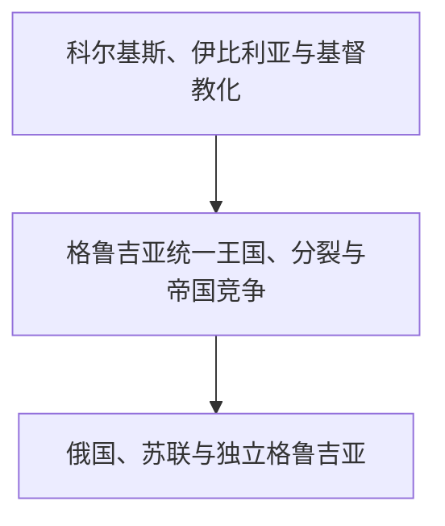

# 格鲁吉亚

## 历史主线

格鲁吉亚历史由黑海东岸科尔基斯、东部高加索伊比利亚、格鲁吉亚语与教会传统逐渐汇合而成。中世纪统一王国在11—13世纪达到高峰，此后蒙古入侵、政治分裂以及奥斯曼—伊朗竞争削弱王权。19世纪俄罗斯吞并格鲁吉亚诸政体，20世纪经历短暂共和国、苏维埃化和1991年后独立。

## 演变图

## 按时间排序的时期导航

| 顺序 | 阶段 | 时间 | 入口 | 简要概括 |
|---:|---|---|---|---|
| 1 | 科尔基斯、伊比利亚与基督教化 | 古代-10世纪 | [科尔基斯、伊比利亚与基督教化](/%E4%BA%BA%E6%96%87%E7%A7%91%E5%AD%A6/%E5%8E%86%E5%8F%B2/%E8%A5%BF%E4%BA%9A/%E5%8D%97%E9%AB%98%E5%8A%A0%E7%B4%A2/%E6%A0%BC%E9%B2%81%E5%90%89%E4%BA%9A/%E7%A7%91%E5%B0%94%E5%9F%BA%E6%96%AF%E3%80%81%E4%BC%8A%E6%AF%94%E5%88%A9%E4%BA%9A%E4%B8%8E%E5%9F%BA%E7%9D%A3%E6%95%99%E5%8C%96.md) | 黑海科尔基斯与东部伊比利亚在罗马、伊朗和基督教世界之间发展，逐步形成格鲁吉亚政治文化基础。 |
| 2 | 格鲁吉亚统一王国、分裂与帝国竞争 | 1008年-1801年 | [格鲁吉亚统一王国、分裂与帝国竞争](/%E4%BA%BA%E6%96%87%E7%A7%91%E5%AD%A6/%E5%8E%86%E5%8F%B2/%E8%A5%BF%E4%BA%9A/%E5%8D%97%E9%AB%98%E5%8A%A0%E7%B4%A2/%E6%A0%BC%E9%B2%81%E5%90%89%E4%BA%9A/%E7%BB%9F%E4%B8%80%E7%8E%8B%E5%9B%BD%E3%80%81%E5%88%86%E8%A3%82%E4%B8%8E%E5%B8%9D%E5%9B%BD%E7%AB%9E%E4%BA%89.md) | 统一王国在大卫四世和塔玛尔时期兴盛，蒙古征服后分裂并受奥斯曼与伊朗长期挤压。 |
| 3 | 俄国、苏联与独立格鲁吉亚 | 1801年至今 | [俄国、苏联与独立格鲁吉亚](/%E4%BA%BA%E6%96%87%E7%A7%91%E5%AD%A6/%E5%8E%86%E5%8F%B2/%E8%A5%BF%E4%BA%9A/%E5%8D%97%E9%AB%98%E5%8A%A0%E7%B4%A2/%E6%A0%BC%E9%B2%81%E5%90%89%E4%BA%9A/%E4%BF%84%E5%9B%BD%E3%80%81%E8%8B%8F%E8%81%94%E4%B8%8E%E7%8B%AC%E7%AB%8B%E6%A0%BC%E9%B2%81%E5%90%89%E4%BA%9A.md) | 俄罗斯帝国吞并、1918年共和国、苏维埃时期及独立后的国家建设和领土冲突构成现代主线。 |

## 重要转折与时间节点

| 时间 | 转折 |
|---|---|
| 4世纪 | 高加索伊比利亚王权接受基督教。 |
| 1008年 | 巴格拉特三世推动格鲁吉亚王国统一。 |
| 12—13世纪初 | 大卫四世与塔玛尔时期进入政治文化高峰。 |
| 13世纪 | 蒙古征服破坏统一王国秩序。 |
| 1801年 | 俄罗斯吞并卡特利—卡赫季王国。 |
| 1918年 | 格鲁吉亚民主共和国成立。 |
| 1921年 | 红军进入格鲁吉亚，建立苏维埃政权。 |
| 1991年 | 格鲁吉亚恢复独立。 |
| 2008年 | 俄格战争改变阿布哈兹和南奥塞梯冲突格局。 |

## 阅读提示

- 古代地名和政体范围不等同于现代国界，民族形成也不是从单一古代王国直线延续。
- 帝国统治、教会或伊斯兰制度、地方贵族、城市贸易和山地社群需要放在同一框架中理解。
- 现代冲突应分别说明苏联行政边界、人口变化、战争过程、实际控制和国际承认。

## 上级与相关区域

- [南高加索](/%E4%BA%BA%E6%96%87%E7%A7%91%E5%AD%A6/%E5%8E%86%E5%8F%B2/%E8%A5%BF%E4%BA%9A/%E5%8D%97%E9%AB%98%E5%8A%A0%E7%B4%A2/README.md)
- [西亚](/%E4%BA%BA%E6%96%87%E7%A7%91%E5%AD%A6/%E5%8E%86%E5%8F%B2/%E8%A5%BF%E4%BA%9A/README.md)

## 目录层级

- 直接上级：[南高加索](/%E4%BA%BA%E6%96%87%E7%A7%91%E5%AD%A6/%E5%8E%86%E5%8F%B2/%E8%A5%BF%E4%BA%9A/%E5%8D%97%E9%AB%98%E5%8A%A0%E7%B4%A2/README.md)
- 宏观区域：[西亚](/%E4%BA%BA%E6%96%87%E7%A7%91%E5%AD%A6/%E5%8E%86%E5%8F%B2/%E8%A5%BF%E4%BA%9A/README.md)
- 历史总览：[历史](/%E4%BA%BA%E6%96%87%E7%A7%91%E5%AD%A6/%E5%8E%86%E5%8F%B2/README.md)
