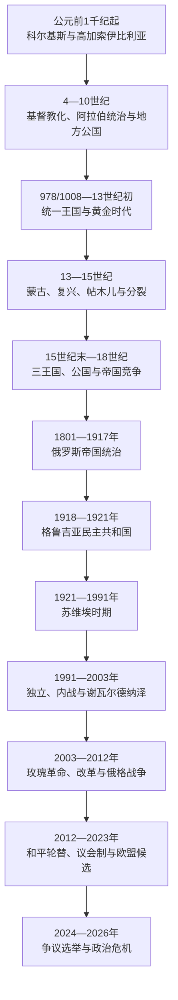

# 格鲁吉亚

## 历史主线

格鲁吉亚历史由黑海东岸科尔基斯—拉齐卡、东部高加索伊比利亚、南部陶—克拉尔杰蒂及格鲁吉亚语教会传统逐步汇合而成。巴格拉季昂王室在978—1008年合并主要王位，大卫四世与塔玛尔时期形成中世纪高峰。花剌子模、蒙古和帖木儿入侵削弱国家，15世纪以后分裂王国又在奥斯曼—伊朗竞争中求存。俄罗斯于1801年吞并东部王国、1810年废除伊梅列季王位，并逐步取消西部公国。

1918—1921年格鲁吉亚曾建立议会共和国，此后成为苏维埃共和国。1991年恢复独立后经历政变、内战、阿布哈兹与南奥塞梯战争、玫瑰革命和2008年俄格战争。2012年首次和平政党轮替后，格鲁吉亚转向议会制并于2023年取得欧盟候选国地位；2024—2026年的选举、限制公民社会法律和亲欧抗议又造成持续政治合法性危机。

## 演变图

## 按时间排序的时期导航

| 顺序 | 阶段 | 时间 | 入口 | 简要概括 |
|---:|---|---|---|---|
| 1 | 科尔基斯、伊比利亚与基督教化 | 约前1千纪—10世纪末 | [科尔基斯、伊比利亚与基督教化](/%E4%BA%BA%E6%96%87%E7%A7%91%E5%AD%A6/%E5%8E%86%E5%8F%B2/%E8%A5%BF%E4%BA%9A/%E5%8D%97%E9%AB%98%E5%8A%A0%E7%B4%A2/%E6%A0%BC%E9%B2%81%E5%90%89%E4%BA%9A/%E7%A7%91%E5%B0%94%E5%9F%BA%E6%96%AF%E3%80%81%E4%BC%8A%E6%AF%94%E5%88%A9%E4%BA%9A%E4%B8%8E%E5%9F%BA%E7%9D%A3%E6%95%99%E5%8C%96.md) | 两个古代区域在罗马、伊朗、拜占庭和哈里发之间发展，教会、文字及地方王朝为统一奠基。 |
| 2 | 统一王国、分裂与帝国竞争 | 1008—1810年 | [格鲁吉亚统一王国、分裂与帝国竞争](/%E4%BA%BA%E6%96%87%E7%A7%91%E5%AD%A6/%E5%8E%86%E5%8F%B2/%E8%A5%BF%E4%BA%9A/%E5%8D%97%E9%AB%98%E5%8A%A0%E7%B4%A2/%E6%A0%BC%E9%B2%81%E5%90%89%E4%BA%9A/%E7%BB%9F%E4%B8%80%E7%8E%8B%E5%9B%BD%E3%80%81%E5%88%86%E8%A3%82%E4%B8%8E%E5%B8%9D%E5%9B%BD%E7%AB%9E%E4%BA%89.md) | 大卫四世与塔玛尔时期强盛，蒙古后复兴而再分裂，最终被俄罗斯废除东、西王位。 |
| 3 | 俄国、苏联与独立格鲁吉亚 | 1801年至今 | [俄国、苏联与独立格鲁吉亚](/%E4%BA%BA%E6%96%87%E7%A7%91%E5%AD%A6/%E5%8E%86%E5%8F%B2/%E8%A5%BF%E4%BA%9A/%E5%8D%97%E9%AB%98%E5%8A%A0%E7%B4%A2/%E6%A0%BC%E9%B2%81%E5%90%89%E4%BA%9A/%E4%BF%84%E5%9B%BD%E3%80%81%E8%8B%8F%E8%81%94%E4%B8%8E%E7%8B%AC%E7%AB%8B%E6%A0%BC%E9%B2%81%E5%90%89%E4%BA%9A.md) | 帝国统治、第一共和国、苏维埃化和独立国家建设，同领土冲突及欧洲道路相互交织。 |

## 世系与领导人专表

| 专表 | 覆盖范围 | 入口 |
|---|---|---|
| 格鲁吉亚君主世系表 | 888—1810年的巴格拉季昂前身、统一王国、蒙古时期并立王位、卡特利、卡赫季、卡特利—卡赫季和伊梅列季 | [格鲁吉亚君主世系表](/%E4%BA%BA%E6%96%87%E7%A7%91%E5%AD%A6/%E5%8E%86%E5%8F%B2/%E8%A5%BF%E4%BA%9A/%E5%8D%97%E9%AB%98%E5%8A%A0%E7%B4%A2/%E6%A0%BC%E9%B2%81%E5%90%89%E4%BA%9A/%E6%A0%BC%E9%B2%81%E5%90%89%E4%BA%9A%E5%90%9B%E4%B8%BB%E4%B8%96%E7%B3%BB%E8%A1%A8.md) |
| 国家元首、政府首脑与苏维埃实际领导人表 | 1918—1921年议会与政府、苏维埃第一书记、独立后总统、代理国家元首、国务部长和总理 | [格鲁吉亚国家元首、政府首脑与苏维埃实际领导人表](/%E4%BA%BA%E6%96%87%E7%A7%91%E5%AD%A6/%E5%8E%86%E5%8F%B2/%E8%A5%BF%E4%BA%9A/%E5%8D%97%E9%AB%98%E5%8A%A0%E7%B4%A2/%E6%A0%BC%E9%B2%81%E5%90%89%E4%BA%9A/%E6%A0%BC%E9%B2%81%E5%90%89%E4%BA%9A%E5%9B%BD%E5%AE%B6%E5%85%83%E9%A6%96%E3%80%81%E6%94%BF%E5%BA%9C%E9%A6%96%E8%84%91%E4%B8%8E%E8%8B%8F%E7%BB%B4%E5%9F%83%E5%AE%9E%E9%99%85%E9%A2%86%E5%AF%BC%E4%BA%BA%E8%A1%A8.md) |

## 重要转折与时间节点

| 时间 | 转折 | 意义 |
|---|---|---|
| 4世纪上半叶 | 高加索伊比利亚王权接受基督教 | 教会和格鲁吉亚文字文化逐渐成为跨政权纽带 |
| 978—1008年 | 巴格拉特三世合并主要王位 | 统一王国主干形成 |
| 1121—1122年 | 迪德格里胜利并收复第比利斯 | 摆脱塞尔柱压力，重建军事与城市税基 |
| 1184—1213年 | 塔玛尔女王统治 | 王国的政治、宗属网络和文化达到高峰 |
| 1226—1243年 | 花剌子模破坏与蒙古征服 | 贡赋、军役和并立王位削弱统一 |
| 1463—1490年前后 | 王位战争与三王国形成 | 统一王国实质及制度上解体 |
| 1555、1639年 | 奥斯曼—伊朗划分势力圈 | 东西诸王国长期受不同宗主体系干预 |
| 1783—1801年 | 俄国保护条约转为吞并 | 卡特利—卡赫季王位被单方面废除 |
| 1918年5月26日 | 民主共和国成立 | 建立议会制、普选和土地改革 |
| 1921年2—3月 | 红军进攻 | 格鲁吉亚苏维埃化，第一共和国政府流亡 |
| 1989—1991年 | 4月9日镇压、独立公投与恢复独立 | 苏联合法性崩解并重建主权国家 |
| 1991—1993年 | 政变、内战、南奥塞梯与阿布哈兹战争 | 中央国家崩解，形成事实分离地区 |
| 2003年 | 玫瑰革命 | 开始快速国家改革及更明确的欧洲—大西洋取向 |
| 2008年 | 俄格战争 | 俄罗斯承认两事实政权并长期驻军 |
| 2012年 | 和平政党轮替 | 格鲁吉亚梦想上台并推进议会制转型 |
| 2023—2026年 | 欧盟候选、争议法律与选举危机 | 欧洲道路由制度性突破转为实质停滞 |

## 阅读提示

- 古代科尔基斯、伊比利亚和阿布哈兹王国都不等同于现代民族国家；文化延续与现代领土主张需要分开讨论。
- 中世纪统一王国与分裂诸王国多由巴格拉季昂不同支系统治，共同王朝不等于当时仍有统一国家。
- 阿布哈兹、南奥塞梯冲突应分别考察苏联自治安排、解体期武装行动、人口驱逐、俄罗斯介入、实际控制和国际承认。
- 2024年后的格鲁吉亚须区分宪法机关的实际履职与选举、法律及民主授权争议。

## 上级与相关区域

- [南高加索](/%E4%BA%BA%E6%96%87%E7%A7%91%E5%AD%A6/%E5%8E%86%E5%8F%B2/%E8%A5%BF%E4%BA%9A/%E5%8D%97%E9%AB%98%E5%8A%A0%E7%B4%A2/README.md)
- [南高加索古代王国与基督教化](/%E4%BA%BA%E6%96%87%E7%A7%91%E5%AD%A6/%E5%8E%86%E5%8F%B2/%E8%A5%BF%E4%BA%9A/%E5%8D%97%E9%AB%98%E5%8A%A0%E7%B4%A2/%E5%8F%A4%E4%BB%A3%E7%8E%8B%E5%9B%BD%E4%B8%8E%E5%9F%BA%E7%9D%A3%E6%95%99%E5%8C%96.md)
- [伊朗、奥斯曼与俄罗斯帝国竞争](/%E4%BA%BA%E6%96%87%E7%A7%91%E5%AD%A6/%E5%8E%86%E5%8F%B2/%E8%A5%BF%E4%BA%9A/%E5%8D%97%E9%AB%98%E5%8A%A0%E7%B4%A2/%E4%BC%8A%E6%9C%97%E3%80%81%E5%A5%A5%E6%96%AF%E6%9B%BC%E4%B8%8E%E4%BF%84%E7%BD%97%E6%96%AF%E5%B8%9D%E5%9B%BD%E7%AB%9E%E4%BA%89.md)
- [苏维埃划界、独立与地区冲突](/%E4%BA%BA%E6%96%87%E7%A7%91%E5%AD%A6/%E5%8E%86%E5%8F%B2/%E8%A5%BF%E4%BA%9A/%E5%8D%97%E9%AB%98%E5%8A%A0%E7%B4%A2/%E8%8B%8F%E7%BB%B4%E5%9F%83%E5%88%92%E7%95%8C%E3%80%81%E7%8B%AC%E7%AB%8B%E4%B8%8E%E5%9C%B0%E5%8C%BA%E5%86%B2%E7%AA%81.md)
- [西亚](/%E4%BA%BA%E6%96%87%E7%A7%91%E5%AD%A6/%E5%8E%86%E5%8F%B2/%E8%A5%BF%E4%BA%9A/README.md)
- [历史](/%E4%BA%BA%E6%96%87%E7%A7%91%E5%AD%A6/%E5%8E%86%E5%8F%B2/README.md)
