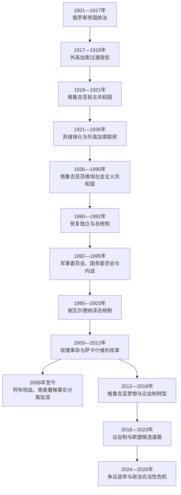

# 俄国、苏联与独立格鲁吉亚

## 时间

1801年至今

## 概括

1801年俄罗斯废除卡特利—卡赫季王位，1810年废除伊梅列季王位，并在19世纪逐步取消西部公国、吞并奥斯曼边疆，把格鲁吉亚各地区纳入高加索总督体系。帝国统治结束了地方王朝和教会自主，却也通过第比利斯行政中心、铁路、学校、报刊和商品经济催生新的知识阶层、工人运动与民族政治。1918年格鲁吉亚民主共和国建立议会制度和土地改革，1921年苏俄红军进攻后被苏维埃政权取代。

苏联时期带来工业化、城市化和普及教育，也伴随1924年起义镇压、集体化、大清洗、党国垄断及自治边界制度化。1989年4月9日第比利斯示威遭军队镇压，推动独立运动。1991年恢复独立后，政变、内战以及南奥塞梯和阿布哈兹战争使中央国家濒临瓦解；谢瓦尔德纳泽恢复部分秩序，2003年玫瑰革命后萨卡什维利政府大幅改革国家机构。改革伴随权力集中和人权争议，俄格关系恶化并在2008年爆发战争。

2012年格鲁吉亚梦想通过选举上台，完成首次和平政党轮替。此后国家转向议会制、获得欧盟候选国地位，同时执政党长期优势、非正式权力、司法与媒体争议不断加深。2024年议会选举、总统选举方式及限制公民社会的法律引发持续合法性危机。截至2026年7月13日，宪法机关由总统米哈伊尔·卡韦拉什维利、总理伊拉克利·科巴希泽及格鲁吉亚梦想主导的议会运作；反对派和前总统萨洛梅·祖拉比什维利不承认这一政治授权，欧洲一体化进程实际停滞。阿布哈兹、南奥塞梯仍由事实当局和俄罗斯军力控制，多数国家继续承认两地属于格鲁吉亚。

各阶段完整的议会负责人、政府主席、共产党第一书记、总统、代理总统、国务部长和总理名单，见[格鲁吉亚国家元首、政府首脑与苏维埃实际领导人表](/%E4%BA%BA%E6%96%87%E7%A7%91%E5%AD%A6/%E5%8E%86%E5%8F%B2/%E8%A5%BF%E4%BA%9A/%E5%8D%97%E9%AB%98%E5%8A%A0%E7%B4%A2/%E6%A0%BC%E9%B2%81%E5%90%89%E4%BA%9A/%E6%A0%BC%E9%B2%81%E5%90%89%E4%BA%9A%E5%9B%BD%E5%AE%B6%E5%85%83%E9%A6%96%E3%80%81%E6%94%BF%E5%BA%9C%E9%A6%96%E8%84%91%E4%B8%8E%E8%8B%8F%E7%BB%B4%E5%9F%83%E5%AE%9E%E9%99%85%E9%A2%86%E5%AF%BC%E4%BA%BA%E8%A1%A8.md)。

## 俄国帝国统治

### 吞并与地方王朝终结

俄罗斯以1783年保护条约和东格鲁吉亚继承危机为进入依据，于1801年废除卡特利—卡赫季王国。东部王族被阻止加冕并逐步迁往俄国内地，原有王室行政改为俄国省制。1810年俄军废黜伊梅列季国王所罗门二世，随后借俄土战争和高加索战争扩张：

| 时间 | 地区或制度变化 | 说明 |
|---|---|---|
| 1801年 | 卡特利—卡赫季王国被吞并 | 俄国取消受保护的巴格拉季昂王位 |
| 1810年 | 伊梅列季王位被废 | 所罗门二世流亡，西部王国终结 |
| 1828—1829年 | 古里亚公国被取消；阿哈尔齐赫等地转归俄国 | 同新一轮俄土战争及地方反抗相关 |
| 1858年 | 斯瓦涅季公国被取消 | 山地自治纳入直接行政 |
| 1864年 | 阿布哈兹公国被取消 | 高加索战争结束阶段，人口流亡奥斯曼帝国加剧 |
| 1867年 | 明格列尔公国正式被取消 | 此前摄政和俄国监督已削弱地方主权 |
| 1878年 | 巴统、阿扎尔等地归俄国 | 俄土战争后形成新的港口与边疆行政区 |

吞并并非毫无抵抗。1804年姆季乌列季起义、1812年卡赫季起义和1832年贵族密谋分别反映山地负担、地方王族复辟和贵族自治诉求。俄军镇压后，一部分格鲁吉亚贵族被吸收进帝国军政体系，获得俄国爵位和教育机会；另一些王族及教士失去政治资源。

### 教会、行政与社会转型

1811年俄国取消格鲁吉亚教会自主，罢免末任本地天主教牧首安东二世，以俄罗斯主教领导的督主教区取代。礼仪和学校的俄语化、教产调整引发长期不满。教会于1917年俄国革命期间自行恢复自主，其地位后来才获得其他正教会承认。

第比利斯成为高加索总督府中心，是格鲁吉亚人、亚美尼亚人、俄国人、阿塞拜疆人、德国移民及其他群体共同生活的多语城市。农奴制从1864年起分地区废除，但农民往往需承担赎买和土地不足。1872年第比利斯—波季铁路通车，随后线路连到巴统和巴库；黑海港口、锰矿、葡萄酒、石油转运和城市工业把格鲁吉亚纳入帝国与世界市场，也形成铁路工人和城市贫民。

### 民族运动与社会民主主义

19世纪中后期，“饮过捷列克河水者”等知识分子以伊利亚·恰夫恰瓦泽、阿卡基·策列铁里为代表，发展格鲁吉亚文报刊、学校、合作社和民族历史叙事。他们最初多追求文化复兴、地方自治和农民改善，而非立即建立独立国家。与此同时，第比利斯和西部工业区的马克思主义组织成长，格鲁吉亚孟什维克在工人、农民和知识界获得广泛基础。

1902—1906年的古里亚农民运动建立村社委员会、抵制地租并组织民兵，在1905年俄国革命中一度形成“古里亚共和国”。帝国军队恢复控制，但群众组织、政党竞争和自治实践成为1917年后建国的重要经验。民族文化运动与社会民主主义并非完全一致，却共同削弱了沙皇行政的合法性。

## 格鲁吉亚民主共和国

### 建立

1917年二月革命后，外高加索先由特别委员会、后由外高加索委员会和议会治理。布尔什维克夺取彼得格勒后，南高加索领导人拒绝接受其权威。1918年4月成立的外高加索民主联邦共和国因对奥斯曼战争、边界和外交路线分歧迅速瓦解。格鲁吉亚于1918年5月26日宣布独立，采用议会共和国而非总统制；国民议会、后来的制宪会议为最高代表机关，政府主席主持行政。

新国家先接受德国军事保护以阻止奥斯曼推进，德国战败后由英国军队进入。格鲁吉亚社会民主党在普选中占主导，妇女和少数族群享有选举权；政府实施土地改革，将大地产分配或出售给农民，建立国民卫队、法院、学校和货币制度。1921年2月通过的宪法强调议会主权、公民权利与地方自治，但几乎没有实施时间。

### 安全困境

第一共和国同时面对多条边界冲突：1918年同亚美尼亚因洛里等地短暂交战；北部同白军将领邓尼金争夺黑海沿岸；奥斯曼撤退后巴统和西南边界需要重新安排；阿布哈兹、南奥塞梯等地的自治、土地和中央权力争议伴随武装冲突。政府镇压亲布尔什维克的南奥塞梯起义，造成平民死亡和流离失所，后来被格鲁吉亚与奥塞梯民族叙事作出相反解释。

1920年5月苏俄在条约中承认格鲁吉亚独立，格鲁吉亚则承诺限制反苏武装。苏俄领导层仍把外高加索视为安全和革命空间；本地布尔什维克活动、亚美尼亚和阿塞拜疆已经苏维埃化、红军部署以及边境冲突共同改变力量平衡。

### 1921年红军进攻

1921年2月，苏俄以支持边境地区起义和保护当地革命为由发动进攻。第11集团军从亚美尼亚、阿塞拜疆方向推进，其他部队从北高加索进入；格鲁吉亚军和国民卫队在第比利斯外围抵抗，2月25日撤出首都。政府退到库塔伊西和巴统，3月流亡海外。战斗、土耳其同时进入西南及随后签订的安排使边界重组；阿扎尔以自治共和国形式留在格鲁吉亚苏维埃共和国，卡尔斯—阿尔达汉地区归土耳其。

共和国覆亡的结构性原因包括多线边防、有限财政、正规军与党属国民卫队协调不足、邻国相继苏维埃化和缺乏可靠大国保障；直接触发是红军以边境起义为名发动全面军事行动。不能把政权更替仅写成本地自发革命，也不能忽略格鲁吉亚布尔什维克确实参与建立新政权。

## 苏维埃时期

### 苏维埃化、联邦化与镇压

格鲁吉亚苏维埃社会主义共和国于1921年建立。围绕是否在外高加索联邦内保留更大共和国权力，格鲁吉亚布尔什维克同斯大林、奥尔忠尼启则等发生“格鲁吉亚事件”；中央集权路线胜出。1922—1936年格鲁吉亚同亚美尼亚、阿塞拜疆组成外高加索社会主义联邦苏维埃共和国，1936年后恢复为单独加盟共和国。

1924年8月，地下独立委员会组织全国性反苏起义。准备泄露、发动不同步和红军优势使起义迅速失败，随后大规模处决、逮捕和流放摧毁许多旧政党、贵族和知识阶层。流亡政府继续主张1918年共和国的法律连续性，但未获列强实际恢复支持。

苏维埃政权把阿扎尔设为自治共和国，把南奥塞梯设为自治州；阿布哈兹1921年先以特殊“条约共和国”同格鲁吉亚联合，1931年降为自治共和国。这些制度承认地区差异并提供教育、干部和行政资源，也把边界、地位和中心—自治关系固定为后来冲突可动员的政治框架。自治设计并不意味着1990年代战争在1920年代已经注定，人口、精英竞争、苏联解体和外部干预同样关键。

### 工业化、战争与大清洗

1920—1930年代土地集体化改变农村产权，茶叶、柑橘、葡萄和锰矿等被纳入计划经济。第比利斯、鲁斯塔维、库塔伊西等城市工业发展，识字、医疗和高等教育普及。与此同时，强制征粮、反宗教政策和干部清洗造成严重创伤。1937—1938年，大量党政干部、作家、教士和普通公民被处决或送往劳改系统；出生于格鲁吉亚的斯大林掌握整个苏联，并不等于格鲁吉亚共和国享有特殊主权。

第二次世界大战期间，数十万格鲁吉亚居民参加苏军，伤亡沉重；德国曾试图利用高加索流亡者，但未占领格鲁吉亚核心地区。战后旅游、农业、轻工业和地下经济共同增长，教育与城市化进一步提高。计划分配和私人关系网络也滋生腐败及地区差异。

### 去斯大林化与民族政治

1956年3月，第比利斯青年和市民以捍卫斯大林及格鲁吉亚尊严为口号举行示威，苏军开火造成多人死亡。事件既有亲斯大林情绪，也反映对莫斯科以“格鲁吉亚人”标签解释个人崇拜的不满。1972年任共和国党第一书记的爱德华·谢瓦尔德纳泽以反腐名义更换干部，同时保留党国控制。

1978年苏维埃新宪法草案可能削弱格鲁吉亚语的共和国国语地位，引发大规模和平示威，中央最终保留相关条款。这次成功动员使语言、教会、环境和历史保护逐渐汇入民族运动。戈尔巴乔夫改革后，独立团体公开组织；阿布哈兹和南奥塞梯精英也分别要求提高地位或脱离格鲁吉亚，中心与自治地区的民族动员相互强化。

1989年4月9日，苏军在第比利斯驱散支持独立的绝食和集会，造成至少20人死亡、多人中毒或受伤。镇压使苏联制度在格鲁吉亚迅速丧失合法性。1990年10月，多党联盟“圆桌—自由格鲁吉亚”击败共产党；1991年3月31日公投支持恢复1918年共和国独立，4月9日议会正式宣布恢复国家独立。

## 独立初期的国家崩解

### 加姆萨胡尔季阿、政变与内战

兹维亚德·加姆萨胡尔季阿从最高苏维埃主席转为总统，并于1991年5月经普选确认。政府以快速巩固主权和格鲁吉亚民族国家为目标，但行政集中、反对派受压、武装组织分裂、经济崩溃及对少数族群的不信任不断扩大。1991年12月至1992年1月，反对派国民卫队和“姆赫德里奥尼”武装在第比利斯围攻政府大楼，加姆萨胡尔季阿出逃。

军事委员会邀请谢瓦尔德纳泽回国，改设国务委员会。加姆萨胡尔季阿支持者在明格列尔等西部地区继续抵抗，1993年一度建立并行权力；俄军协助政府控制关键交通线后，反对力量失败。加姆萨胡尔季阿于1993年末死亡，其具体死亡情形仍存在争议。政变摧毁了宪政连续性，也让非国家武装在随后地区战争中扮演重要角色。

### 南奥塞梯战争

南奥塞梯自治州领导层在苏联末期要求升格并逐步寻求脱离，格鲁吉亚议会于1990年取消其自治州地位。1991—1992年，格鲁吉亚武装、奥塞梯力量和地方民兵围绕茨欣瓦利及村庄作战，双方平民被杀、驱逐或逃离。1992年《索契协议》建立俄、格、奥三方维和与联合监督机制，结束大规模战斗，却形成第比利斯无法控制的事实政权。

### 阿布哈兹战争

阿布哈兹的地位争议涉及自治共和国宪制、人口变化、地方权力分配和相互排斥的历史叙事。1992年8月，格鲁吉亚国民卫队以保护铁路和解救官员等名义进入阿布哈兹并控制苏呼米，冲突升级为全面战争。阿布哈兹军获得北高加索志愿者和俄罗斯境内多方支持；俄罗斯官方在不同阶段调停、施压或支持不同力量，其军人和装备对战局有重大影响。

1993年9月苏呼米陷落后，格鲁吉亚军撤出，大量格鲁吉亚族平民遭杀害或被迫离开阿布哈兹；阿布哈兹一方也经历战争伤亡和早期驱逐。1994年停火后，独联体名义下的俄罗斯维和部队和联合国观察团部署。战争结果形成事实分离，却没有获得多数国家承认，数十万流离失所者问题长期未解。

## 谢瓦尔德纳泽时期

1995年宪法建立总统制，谢瓦尔德纳泽当选总统。政府削弱部分军阀、发行拉里、恢复国际联系，并推动连接里海与黑海—地中海的油气管线，使格鲁吉亚成为东西交通走廊。阿扎尔领导人阿斯兰·阿巴希泽仍保持高度自治，中央对税收和地方安全的掌控有限。

稳定的代价是腐败、停电、贫困、司法薄弱和庇护网络。总统两次遇刺，说明安全机构仍受多方势力渗透。西方援助和制度建设扩大，但选举管理与媒体环境恶化。2003年议会选举被指大规模舞弊，萨卡什维利、日瓦尼亚和布尔贾纳泽领导群众抗议；军警拒绝全面镇压，谢瓦尔德纳泽于11月辞职，政权在“玫瑰革命”中和平更替。

## 玫瑰革命、国家改革与2008年战争

### 改革与权力集中

萨卡什维利2004年当选总统。政府解散并重建交通警察、简化税制和许可、提高公务员工资、改善电力与公共服务，国家财政和对地方的控制迅速增强。2004年通过政治与经济压力迫使阿扎尔领导人阿巴希泽离境，自治共和国重新纳入中央实际治理。基础设施、教育和军队改革以加入北约、欧盟为战略方向。

快速改革也把权力集中到总统和执政党。财产征收、监狱虐待、司法独立、电视媒体控制及对反对派压力引发批评。2007年政府驱散第比利斯抗议并短暂停止部分媒体播出，萨卡什维利提前举行总统选举。改革成效与强制治理并存，是这一时期不能拆开的两面。

### 冲突升级与五日战争

2004年后，格鲁吉亚试图改变南奥塞梯走私和事实政权结构；俄罗斯扩大向当地居民发放护照、财政与安全支持。边境枪击、绑架、爆炸和无人机事件频繁发生。2008年北约布加勒斯特峰会承诺格鲁吉亚未来将成为成员，却未给予成员行动计划，使安全期待和俄方威胁认知同时上升。

2008年8月初，南奥塞梯周边炮击和人员撤离加剧。8月7日晚至8日，格鲁吉亚军对茨欣瓦利发动大规模炮击和地面进攻；俄罗斯以保护维和人员和公民为由从罗基隧道投入大军，并将行动扩展到格鲁吉亚其他地区。俄军与阿布哈兹力量打开西部战线，五日内击退格军并深入哥里、波季等地。欧盟调停的六点协议终止主要战斗。

关于“谁发动战争”须区分层次：格军对茨欣瓦利的大规模攻击开启了公开的全面战事；此前已有长期俄罗斯军事、护照和事实政权支持以及双方不断升级的武装事件；俄罗斯越出南奥塞梯的大规模反攻、占领和战后行动也不能仅以保护维和人员解释。战争中各方均被记录有违反战争法的行为，奥塞梯和格鲁吉亚村庄居民再次流离失所。

俄罗斯于2008年8月承认阿布哈兹和南奥塞梯“独立”，在两地建立长期军事基地；多数国家和国际组织仍承认格鲁吉亚领土完整。欧盟监测团只能在第比利斯控制区巡查，日内瓦国际讨论成为处理安全、失踪人员和人道问题的主要多边平台。

## 格鲁吉亚梦想时期

### 选举轮替与议会制

2012年，比济纳·伊万尼什维利领导的格鲁吉亚梦想联盟赢得议会选举，统一民族运动政府接受结果。伊万尼什维利出任总理，萨卡什维利留任总统到2013年，形成首次选举后的和平跨党派交权。宪法改革逐步把行政权从总统转向总理和议会，2018年后总统主要承担代表和宪法程序职能。

政府继续欧盟联系，2014年签署联系国协定，2017年获得申根区短期免签。与此同时，前政府官员被起诉、司法和媒体所有权争议、执政党长期占优以及伊万尼什维利卸任后的非正式影响，引发“选择性司法”和国家俘获担忧。政府认为这些行动是追责旧政权滥权，反对派则视为压缩竞争空间。

### 欧洲道路与国内极化

2019年议会风波、2020年有争议的选举和反对派抵制加深政治分裂。2022年俄乌全面战争后，格鲁吉亚申请加入欧盟；政府在支持乌克兰主权的同时避免加入对俄双边制裁，称需防止本国卷入战争，反对派则指其对俄过度妥协。欧盟于2023年12月给予格鲁吉亚候选国地位，并把司法、去极化、媒体与权力制衡改革列为关键条件。

2024年，议会通过要求获得一定比例境外资金的组织登记为“外国力量利益承载者”的法律。政府称其为财务透明措施，反对者认为其污名化媒体和公民社会、仿照俄罗斯限制模式。数月大规模抗议遭逮捕、暴力和恐吓指控，欧盟方面认定入盟进程事实上停滞。

### 2024—2026年合法性危机

2024年10月议会选举的官方结果给予格鲁吉亚梦想多数席位。国际观察记录选民压力、公共资源使用、秘密投票受损和高度不平等环境，同时没有宣布一个替代结果；反对党和总统祖拉比什维利拒绝承认选举，多个反对党不进入议会。新议会组成选举人团，于12月选出卡韦拉什维利为总统。祖拉比什维利在任期届满后离开总统府，但继续主张新议会和总统缺乏民主授权。

总理科巴希泽宣布政府在2028年底前不主动推动开启欧盟入盟谈判，并拒绝部分预算援助；这引发新一轮亲欧抗议。2025—2026年，针对示威、媒体、境外资助、政治活动和反对党领导人的法律与刑事措施扩大。政府称其维护主权、秩序并防止外部干预；反对派、公民团体及多个欧洲机构认为这构成民主倒退。

截至2026年7月13日，国家机关仍由格鲁吉亚梦想体系稳定控制，未出现并行政府接管行政机关；因此应把现状写成“宪法机关实际履职但政治合法性受到持续挑战”，而不是已经发生第二次政权更替。欧盟候选身份形式上保留，实质谈判和条件改革停滞。

## 当代统治结构

| 层次 | 2026年实际结构 | 说明 |
|---|---|---|
| 总统 | 米哈伊尔·卡韦拉什维利 | 由选举人团产生，主要行使代表与程序性职权；产生过程受反对派质疑 |
| 总理与内阁 | 伊拉克利·科巴希泽政府 | 掌握行政、外交、经济、警务与国家安全主导权 |
| 议会 | 格鲁吉亚梦想占多数 | 选举政府、立法并组成总统选举人团；反对派参与度和合法性争议突出 |
| 非正式影响 | 比济纳·伊万尼什维利及执政党网络 | 无国家行政职务但对战略、干部和政党资源具有重大影响 |
| 地方与自治 | 阿扎尔自治共和国纳入国家体系 | 地方政府受中央宪法和执政党体系约束 |
| 事实分离地区 | 阿布哈兹、南奥塞梯事实当局及俄军 | 第比利斯不实际控制；国际承认高度有限 |

## 重要事件

| 时间 | 事件 | 结果与长期影响 |
|---|---|---|
| 1801—1810年 | 俄国废除东、西格鲁吉亚王位 | 王朝国家转为帝国直辖 |
| 1811年 | 格鲁吉亚教会自主被取消 | 教会俄国化成为民族运动的重要记忆 |
| 1872年起 | 铁路连接第比利斯、波季、巴统与巴库 | 城市化、出口经济和工人政治发展 |
| 1918年5月26日 | 格鲁吉亚民主共和国成立 | 建立议会制、普选与土地改革 |
| 1921年2—3月 | 红军进攻并建立苏维埃政权 | 民主共和国流亡，格鲁吉亚纳入苏联体系 |
| 1924年8—9月 | 反苏起义与镇压 | 地下独立运动和旧精英遭重创 |
| 1978年4月 | 语言地位示威 | 格鲁吉亚语官方地位保留，群众民族动员增强 |
| 1989年4月9日 | 第比利斯示威被镇压 | 苏联政权合法性崩解，独立运动转为主流 |
| 1991年4月9日 | 恢复独立 | 以1918年共和国的法律连续性建国 |
| 1991—1993年 | 政变、内战与两场分离战争 | 国家崩解、事实分离和大规模流离失所 |
| 2003年11月 | 玫瑰革命 | 谢瓦尔德纳泽辞职，进入激进国家改革 |
| 2008年8月 | 俄格战争 | 俄国承认两事实政权并长期驻军 |
| 2012年10月 | 首次和平政党轮替 | 格鲁吉亚梦想上台，宪制转向议会制 |
| 2023年12月 | 获欧盟候选国地位 | 欧洲道路得到形式确认，但附带改革条件 |
| 2024—2026年 | 外国影响法、争议选举与持续抗议 | 入盟进程停滞，国家机关控制与民主授权分离成为核心矛盾 |

## 冲突与国家建设的因果分析

### 结构因素

- 苏联自治边界、混居人口和不同历史记忆为地位争议提供制度资源，但没有自动导致战争。
- 独立初期中央军队、警察、财政与政党制度薄弱，非国家武装可以左右政府和地区冲突。
- 格鲁吉亚位于俄罗斯、黑海、土耳其和里海交通之间，安全选择容易被周边大国理解为势力范围变化。
- 总统制时期行政集中有利于快速改革，也削弱司法、媒体和反对派对权力的约束；议会制并未自动消除执政党资源优势。

### 外部压力

- 俄罗斯在阿布哈兹和南奥塞梯的维和、护照、财政、政治和军事角色，使其既是谈判参与者也是冲突一方。
- 北约和欧盟提供改革目标与安全期待，却没有给予格鲁吉亚共同防御保障。
- 经济、能源、劳工迁移和对俄贸易让第比利斯即使政治对立也难以完全切断关系。

### 直接触发因素

- 1991—1993年的武装冲突由自治地位取消、政变、部队进入争议地区和外部武装支持相继触发。
- 2008年战争的直接公开升级是格军攻击茨欣瓦利及俄军大规模介入，背景则是多年军事化和互不信任。
- 2024年后的政治危机由限制境外资助法律、选举公正争议、入盟谈判路线改变及强制执法叠加触发。

## 关键辨析

- **帝国现代化不等于自愿并入**：铁路、学校和城市发展发生在废除王位、压制教会自主和多次起义的制度背景中。
- **苏维埃发展不抵消政治镇压**：工业、教育和社会流动与起义镇压、清洗和党国垄断同时存在。
- **自治边界不是战争宿命**：苏联制度提供冲突框架，战争仍由解体期政策、武装行动、人口恐惧和外部干预造成。
- **事实独立不等于普遍承认**：阿布哈兹、南奥塞梯有本地事实机构，但俄罗斯军事与财政依赖深，多数国家承认格鲁吉亚主权。
- **宪法机关与民主合法性可分开描述**：2026年的政府实际控制国家机器；选举、法律和镇压争议则影响其民主授权评价。

## 演变关系

- 前一阶段：[格鲁吉亚统一王国、分裂与帝国竞争](/%E4%BA%BA%E6%96%87%E7%A7%91%E5%AD%A6/%E5%8E%86%E5%8F%B2/%E8%A5%BF%E4%BA%9A/%E5%8D%97%E9%AB%98%E5%8A%A0%E7%B4%A2/%E6%A0%BC%E9%B2%81%E5%90%89%E4%BA%9A/%E7%BB%9F%E4%B8%80%E7%8E%8B%E5%9B%BD%E3%80%81%E5%88%86%E8%A3%82%E4%B8%8E%E5%B8%9D%E5%9B%BD%E7%AB%9E%E4%BA%89.md)
- 领导人专表：[格鲁吉亚国家元首、政府首脑与苏维埃实际领导人表](/%E4%BA%BA%E6%96%87%E7%A7%91%E5%AD%A6/%E5%8E%86%E5%8F%B2/%E8%A5%BF%E4%BA%9A/%E5%8D%97%E9%AB%98%E5%8A%A0%E7%B4%A2/%E6%A0%BC%E9%B2%81%E5%90%89%E4%BA%9A/%E6%A0%BC%E9%B2%81%E5%90%89%E4%BA%9A%E5%9B%BD%E5%AE%B6%E5%85%83%E9%A6%96%E3%80%81%E6%94%BF%E5%BA%9C%E9%A6%96%E8%84%91%E4%B8%8E%E8%8B%8F%E7%BB%B4%E5%9F%83%E5%AE%9E%E9%99%85%E9%A2%86%E5%AF%BC%E4%BA%BA%E8%A1%A8.md)
- 区域比较：[南高加索的苏维埃划界、独立与地区冲突](/%E4%BA%BA%E6%96%87%E7%A7%91%E5%AD%A6/%E5%8E%86%E5%8F%B2/%E8%A5%BF%E4%BA%9A/%E5%8D%97%E9%AB%98%E5%8A%A0%E7%B4%A2/%E8%8B%8F%E7%BB%B4%E5%9F%83%E5%88%92%E7%95%8C%E3%80%81%E7%8B%AC%E7%AB%8B%E4%B8%8E%E5%9C%B0%E5%8C%BA%E5%86%B2%E7%AA%81.md)
- 本国入口：[格鲁吉亚](/%E4%BA%BA%E6%96%87%E7%A7%91%E5%AD%A6/%E5%8E%86%E5%8F%B2/%E8%A5%BF%E4%BA%9A/%E5%8D%97%E9%AB%98%E5%8A%A0%E7%B4%A2/%E6%A0%BC%E9%B2%81%E5%90%89%E4%BA%9A/README.md)
