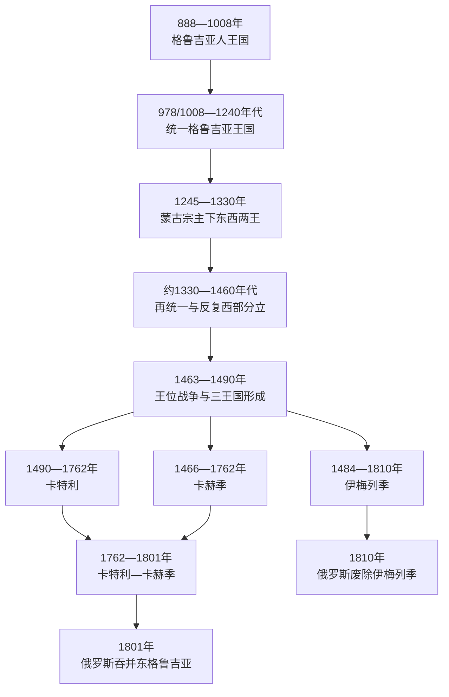

# 格鲁吉亚君主世系表

## 范围与口径

本表从巴格拉季昂家族获得“格鲁吉亚人之王”称号的888年列起，重点覆盖统一格鲁吉亚王国及其分裂后的卡特利、卡赫季、卡特利—卡赫季和伊梅列季诸王国，直到俄罗斯于1801年吞并东格鲁吉亚、1810年废除西部最后王位。

中世纪格鲁吉亚并非始终只有一位国王。蒙古宗主权下出现东西两王，14—15世纪西部又数次自立；16—18世纪伊朗和奥斯曼会册封、废黜、扣留或改宗君主。因此本表采用“公认统治段”而非人为拼成一条无中断直线：

- 共治者、复位者和短暂争位者均单列或在备注中说明。
- 伊朗、奥斯曼直接统治时不虚构格鲁吉亚国王；行政空档明确写出。
- 早期编年史的人名编号、共治年份和西部短期王位在不同研究中存在一两年差异，使用“约”或并列口径。
- 古代高加索伊比利亚和拉齐卡王表资料残缺、不同史源冲突较多，不与巴格拉季昂世系混合；其代表君主见[科尔基斯、伊比利亚与基督教化](/%E4%BA%BA%E6%96%87%E7%A7%91%E5%AD%A6/%E5%8E%86%E5%8F%B2/%E8%A5%BF%E4%BA%9A/%E5%8D%97%E9%AB%98%E5%8A%A0%E7%B4%A2/%E6%A0%BC%E9%B2%81%E5%90%89%E4%BA%9A/%E7%A7%91%E5%B0%94%E5%9F%BA%E6%96%AF%E3%80%81%E4%BC%8A%E6%AF%94%E5%88%A9%E4%BA%9A%E4%B8%8E%E5%9F%BA%E7%9D%A3%E6%95%99%E5%8C%96.md)。

## “格鲁吉亚人王国”前身

这一王国主要位于陶—克拉尔杰蒂等西南地区。978年巴格拉特三世兼领西部阿布哈兹王国，1008年继承父系王位，才完成统一王国的关键整合。

| 顺序 | 统治者 | 在位 | 王室 / 继承关系 | 关键事项 |
|---:|---|---|---|---|
| 1 | 阿达尔纳塞（常编号二世或四世） | 888—923年 | 巴格拉季昂家族；前任大公之子 | 首位正式采用“格鲁吉亚人之王”称号。编号因是否把早期大公计入而异。 |
| 2 | 大卫二世 | 923—937年 | 阿达尔纳塞之子 | 维持西南王国及拜占庭宫廷头衔。 |
| — | 巴格拉特“长官” | 937—945年 | 大卫二世之弟 | 掌权但通常不列正式国王。 |
| 3 | 阿绍特四世 | 945—954年 | 巴格拉特家族近支 | 获拜占庭“库罗帕拉特”头衔。 |
| 4 | 松巴特一世 | 954—958年 | 阿绍特之弟 | 短期继承。 |
| 5 | 巴格拉特二世 | 958—975年 | 松巴特之子 | 阿达尔纳塞三世、陶的大卫三世先后共治或掌握大片领地。 |
| 6 | 古尔根 | 975—1008年 | 巴格拉特二世之子 | 其子巴格拉特三世自978年先统治西部，1008年继承后完成主要王位合并。 |

## 统一王国及蒙古时期并立君主

### 统一主线与东部王位

| 顺序 | 君主 | 在位 | 与前任关系 | 关键事件与备注 |
|---:|---|---|---|---|
| 1 | **巴格拉特三世** | 978/1008—1014年 | 古尔根之子；兼具西部王位继承权 | 978年统治西部，1008年兼并父系王位；逐步压制分支王公，被视为统一格鲁吉亚首王。 |
| 2 | 吉奥尔基一世 | 1014—1027年 | 巴格拉特三世之子 | 同拜占庭争夺陶地区失败，交出领地并送王子为质。 |
| 3 | 巴格拉特四世 | 1027—1072年 | 吉奥尔基一世之子 | 幼年即位；同大贵族利帕里特和拜占庭长期斗争，后面对塞尔柱入侵。 |
| 4 | 吉奥尔基二世 | 1072—1089年 | 巴格拉特四世之子 | “大突厥入侵”下王权收缩；让位给儿子，可能保留名义共治地位至约1112年。 |
| 5 | **大卫四世“建国者”** | 1089—1125年 | 吉奥尔基二世之子 | 改革军队和教会，1121年迪德格里获胜，1122年夺取第比利斯。 |
| 6 | 德米特里一世 | 1125—1154年 | 大卫四世之子 | 维持扩张成果；被长子逼迫退位并入修道院。 |
| 7 | 大卫五世 | 1154—1155年 | 德米特里一世长子 | 经宫廷政变即位，数月后去世。 |
| 8 | 德米特里一世 | 1155—1156年 | 复位 | 为确保幼子继位短暂复位，随后再次退位。 |
| 9 | 吉奥尔基三世 | 1156—1184年 | 德米特里一世幼子 | 镇压贵族叛乱；1178年起让女儿塔玛尔共治。 |
| 10 | **塔玛尔女王** | 1184—1213年 | 吉奥尔基三世之女 | 克服贵族限制，王国及附庸网络达到鼎盛；支持特拉比松政权建立。 |
| 11 | 吉奥尔基四世“拉沙” | 1213—1223年 | 塔玛尔之子 | 约1207年起共治；花剌子模和蒙古初次进入时期受伤身亡。 |
| 12 | 鲁苏丹女王 | 1223—1245年 | 吉奥尔基四世之妹 | 花剌子模军攻陷第比利斯，后接受蒙古宗主权。 |
| 13 | 大卫六世“纳林” | 1245/1247—1259年共治 | 鲁苏丹之子 | 蒙古确认的两位大卫之一；1259年反叛后转治西部。 |
| 14 | 大卫七世“乌鲁” | 1247—1259年共治；1259—1270年东部 | 吉奥尔基四世私生子 | 接受蒙古册封；反叛失败后再度臣服，东部王位延续。 |
| 15 | 德米特里二世“献身者” | 1270—1289年 | 大卫七世之子 | 为避免蒙古报复臣民赴汗廷受刑。 |
| 16 | 瓦赫唐二世 | 1289—1292/1293年 | 大卫六世之子；德米特里二世表亲 | 蒙古选立，兼具西部王系血缘。 |
| 17 | 大卫八世 | 1292/1293—1302年，继续抗争至约1310年 | 德米特里二世之子 | 反蒙古后据山地，伊儿汗另立竞争君主。 |
| — | 吉奥尔基五世 | 1299—1302年第一次 | 德米特里二世幼子 | 蒙古支持的竞争君主，实际控制有限。 |
| 18 | 瓦赫唐三世 | 1302—1308年 | 德米特里二世之子 | 蒙古支持以对抗兄长大卫八世。 |
| 19 | 吉奥尔基六世“小王” | 1308—1313年 | 大卫八世之子 | 幼年名义即位，由权臣和蒙古体系监护。 |
| 20 | **吉奥尔基五世“辉煌者”** | 1314—1346年第二次 | 复位 | 利用伊儿汗衰落结束贡赋，约1330年重新合并西部，恢复王国权威。 |
| 21 | 大卫九世 | 1346—1360年 | 吉奥尔基五世之子 | 黑死病及区域动荡时期。 |
| 22 | 巴格拉特五世“大王” | 1360—1393年 | 大卫九世之子 | 一度被帖木儿俘获并名义改宗，后恢复第比利斯。 |
| 23 | 吉奥尔基七世 | 1393—1407年 | 巴格拉特五世之子 | 持续抵抗帖木儿多次入侵，王国遭严重破坏。 |
| 24 | 康斯坦丁一世 | 1407—1412年 | 巴格拉特五世之子、吉奥尔基七世之弟 | 同黑羊王朝作战中被处决。 |
| 25 | **亚历山大一世“大王”** | 1412—1442年 | 康斯坦丁一世之子 | 重建教堂与税制；1433年起让诸子共治，晚年退位。 |
| 26 | 瓦赫唐四世 | 1442—1446年 | 亚历山大一世之子 | 自1433年共治；无子而终。 |
| — | 德米特里三世 | 1442—1446年共治 | 瓦赫唐四世之兄弟 | 与兄弟共治，瓦赫唐死后放弃最高王位；其子成为卡特利支系祖先。 |
| 27 | 吉奥尔基八世 | 1446—1466年 | 亚历山大一世之子 | 1463年失去西部，1465年被萨姆茨赫领主俘获；1466年后转为卡赫季国王吉奥尔基一世。 |
| 28 | 巴格拉特六世 | 1463—1478年 | 康斯坦丁一世旁支孙 | 1463年在伊梅列季称王，1466年占卡特利，短暂连接东西两部分。 |
| 29 | 康斯坦丁二世 | 1478—1505年 | 德米特里三世之子 | 1478年夺卡特利并主张全格鲁吉亚；1490年王族会议承认三王国分立，此后仅为卡特利王。 |

### 蒙古时期及14—15世纪西部并立线

| 统治者 | 西部地位与时间 | 与主线关系 | 备注 |
|---|---|---|---|
| 大卫六世“纳林” | 西格鲁吉亚国王，1259—1293年 | 原统一王国共治者 | 反蒙古后在库塔伊西建立独立西部王权。 |
| 康斯坦丁一世 | 1293—1327年 | 大卫六世之子 | 西部统治者；同弟弟米哈伊尔争权。 |
| 米哈伊尔 | 1327—1329年 | 康斯坦丁一世之弟 | 短期继位。 |
| 巴格拉特一世“小王” | 1329—1330年 | 米哈伊尔之子 | 向吉奥尔基五世臣服，西部降为公国。 |
| 亚历山大一世 | 1387—1389年 | 巴格拉特一世之子 | 趁帖木儿战争自立为王。 |
| 吉奥尔基一世 | 1389—1392年 | 亚历山大一世之弟 | 死后西部一度重新并入。 |
| 康斯坦丁二世 | 1396—1401年 | 巴格拉特一世之子 | 再次自立，死后由子德米特里掌公国。 |
| 德米特里一世 | 1401—约1455年 | 康斯坦丁二世之子 | 1412年后承认统一王国宗主权，多数时期称公爵而非独立国王。 |
| 德米特里二世 | 1446—1452年 | 伊梅列季旁支 | 西部公爵 / 短期王位主张者。 |
| 巴格拉特二世／六世 | 1463—1478年 | 后转为统一王位竞争者 | 1463年起为伊梅列季王，1466年进入卡特利。 |

## 卡特利王国

| 顺序 | 国王 | 在位 | 继承关系 | 关键事项与中断 |
|---:|---|---|---|---|
| 1 | 康斯坦丁二世 | 1478—1505年；1490年后仅卡特利 | 德米特里三世之子 | 正式承认分裂，以第比利斯为中心。 |
| 2 | 大卫十世 | 1505—1525/1526年 | 康斯坦丁二世之子 | 抵御伊梅列季、卡赫季和萨法维压力。 |
| 3 | 吉奥尔基九世 | 1525/1526—1527年 | 大卫十世之弟 | 短期即位后退入修道院。 |
| 4 | 卢阿尔萨布一世 | 1527—1556年 | 大卫十世之子 | 抗击萨法维入侵，战死。 |
| 5 | **西蒙一世** | 1556—1569年；1578—1599/1600年 | 卢阿尔萨布一世之子 | 第一次被伊朗俘获；复位后转而抗击奥斯曼。 |
| 6 | 大卫十一世（达乌德汗） | 1569—1578年 | 西蒙一世之弟 | 改宗伊斯兰并获萨法维册封；西蒙复位后退往伊朗。 |
| 7 | 吉奥尔基十世 | 1599/1600—1606年 | 西蒙一世之子 | 在奥斯曼与萨法维战争间周旋。 |
| 8 | 卢阿尔萨布二世 | 1606—1615年 | 吉奥尔基十世之子 | 拒绝沙阿阿拔斯要求改宗，后在伊朗被处死。 |
| 9 | 巴格拉特七世 | 1615—1619年 | 大卫十一世之子 | 改宗伊斯兰，由萨法维扶立。 |
| 10 | 西蒙二世 | 1619—约1630/1631年 | 巴格拉特七世之子 | 幼年即位，萨法维和摄政者掌实权。 |
| — | 泰穆拉兹一世 | 1625—1632年在卡特利掌权 | 卡赫季国王 | 反萨法维起义后一度联合卡特利、卡赫季，不被伊朗持续承认。 |
| 11 | 罗斯托姆 | 1633—1658年 | 巴格拉季昂旁支；无嗣 | 改宗穆斯林的萨法维瓦利，保留本地法律和教会，开启“妥协统治”。 |
| 12 | 瓦赫唐五世（沙阿纳瓦兹） | 1658—1675年 | 穆赫拉尼支；罗斯托姆养子 | 接受伊朗册封并扩大对西部影响。 |
| 13 | 吉奥尔基十一世 | 1676—1688年；1703—1709年 | 瓦赫唐五世之子 | 因反伊朗被废；第二次获封后长期在伊朗、阿富汗任军职。 |
| 14 | 埃雷克勒一世（纳扎尔·阿里汗） | 1688—1703年 | 卡赫季王族 | 伊朗扶立；后转任卡赫季。 |
| 15 | 凯霍斯罗 | 1709—1711年 | 瓦赫唐五世之孙 | 在阿富汗为萨法维作战时阵亡，未长期居第比利斯。 |
| 16 | 瓦赫唐六世 | 1711—1714年摄政／候任；1716—1724年获封 | 吉奥尔基十一世之侄 | 编纂法律、印刷和行政改革；因拒绝或延迟改宗被扣留，后在奥斯曼入侵时流亡俄罗斯。 |
| 17 | 伊塞（阿里-库利汗／穆斯塔法帕夏） | 1714—1716年；1724—1727年为奥斯曼总督 | 瓦赫唐六世之弟 | 先依萨法维，后改宗逊尼派服务奥斯曼；第二段不等同独立国王。 |
| — | 巴卡尔 | 1716—1719年摄政 | 瓦赫唐六世之子 | 父亲在伊朗时主持王国，未形成独立王系。 |
| — | 奥斯曼直接统治 | 1724—1735年 | 无 | 设总督与驻军；伊塞只在前期以奥斯曼官员身份治理。 |
| — | 伊朗直接统治 | 1735—1744年 | 无 | 纳迪尔沙逐出奥斯曼，先以官员治理。 |
| 18 | 泰穆拉兹二世 | 1744—1762年 | 卡赫季王族；埃雷克勒二世之父 | 获纳迪尔沙按基督教礼仪加冕；与在卡赫季的儿子形成父子联盟。 |
| 19 | 埃雷克勒二世 | 1762年起合并王位 | 泰穆拉兹二世之子 | 父死后兼领卡特利，建立卡特利—卡赫季王国。 |

## 卡赫季王国

| 顺序 | 国王 | 在位 | 继承关系 | 关键事项与中断 |
|---:|---|---|---|---|
| 1 | 吉奥尔基一世（原统一王吉奥尔基八世） | 1466—1476年 | 亚历山大一世之子 | 失去卡特利后在卡赫季建立新王国。 |
| 2 | 亚历山大一世 | 1476—1511年 | 吉奥尔基一世之子 | 以妥协外交维持稳定，后被儿子谋杀。 |
| 3 | 吉奥尔基二世“恶王” | 1511—1513年 | 亚历山大一世之子 | 进攻卡特利失败被俘，卡赫季被吞并。 |
| — | 卡特利兼并 | 1513—1520年 | 无 | 吉奥尔基二世之子列万重新集结支持。 |
| 4 | 列万 | 1520—1574年 | 吉奥尔基二世之子 | 恢复王国，利用帝国均势获得较长和平。 |
| 5 | 亚历山大二世 | 1574—1601年；1602—1605年 | 列万之子 | 一度接受奥斯曼宗主权，亦同俄罗斯交涉；被改宗的儿子杀害。 |
| 6 | 大卫一世 | 1601—1602年 | 亚历山大二世之子 | 宫廷政变夺位，死后父亲复位。 |
| 7 | 康斯坦丁一世 | 1605年 | 亚历山大二世之子 | 在伊朗改宗，杀父兄后获扶立，旋被贵族击杀。 |
| 8 | **泰穆拉兹一世** | 1605—1614年、1615年、1625—1633年、1634—1648年 | 大卫一世之子 | 多次复位，领导反萨法维斗争；母亲凯特万在伊朗殉难。 |
| — | 伊朗直接统治 | 1614—1615年、1616—1625年、1633年、1648—1664年 | 无 | 沙阿阿拔斯远征、强制迁移；部分时期同卡特利合并管理。 |
| 9 | 阿尔奇尔二世（沙阿纳扎尔汗） | 1664—1675年 | 卡特利瓦赫唐五世之子 | 伊朗同意后被立，尝试恢复秩序。 |
| 10 | 埃雷克勒一世 | 1675—1676年 | 泰穆拉兹一世之孙 | 短期掌权，随后伊朗重新直辖。 |
| — | 伊朗总督统治 | 1676—1703年 | 无 | 巴格拉季昂王位中断。 |
| 11 | 大卫二世（伊玛目库利汗） | 1703—1722年 | 埃雷克勒一世之子 | 改宗什叶派，长期受达吉斯坦劫掠压力。 |
| 12 | 康斯坦丁二世（马哈茂德库利汗） | 1722—1732年 | 大卫二世之弟 | 先属伊朗，奥斯曼占领后又以其附庸身份统治。 |
| 13 | 泰穆拉兹二世 | 1732—1744年 | 埃雷克勒一世之子 | 奥斯曼—伊朗更替中恢复王权，1744年转任卡特利。 |
| 14 | **埃雷克勒二世** | 1744—1762年 | 泰穆拉兹二世之子 | 军事整顿并逐步摆脱伊朗实际控制；1762年合并东部两王国。 |

## 卡特利—卡赫季王国

| 顺序 | 国王 | 在位 | 继承关系 | 关键事项 |
|---:|---|---|---|---|
| 1 | **埃雷克勒二世** | 1762—1798年 | 卡赫季王兼继卡特利 | 统一东格鲁吉亚，推动军政和经济改革；1783年接受俄罗斯保护，1795年未获援助而遭卡扎尔军摧毁第比利斯。 |
| 2 | 吉奥尔基十二世 | 1798—1800年12月28日 | 埃雷克勒二世之子 | 王族继承争议、疾病和外部威胁下寻求更深俄国保护；死后俄国阻止继承。 |
| — | 大卫·巴格拉季奥尼 | 1800年12月—1801年 | 吉奥尔基十二世之子、指定继承人 | 以摄政／王位继承人身份短暂主持，未正式加冕。 |
| — | 俄罗斯吞并 | 1801年 | 无 | 保罗一世先发布吞并决定，亚历山大一世于9月确认；王室成员后被迁往俄国内地。 |

## 伊梅列季王国

伊梅列季17世纪王位极不稳定。国王可能被贵族、达迪阿尼、古里埃利、卡特利军队或奥斯曼帕夏扶立，若干任期只持续数月。下表保留短暂加冕、复位和非巴格拉季昂实际统治者。

| 统治段 | 国王 / 实际统治者 | 在位 | 继承与备注 |
|---:|---|---|---|
| 1 | 亚历山大二世 | 1478年主张；1484—1510年稳定统治 | 巴格拉特六世之子；1490年后获承认为独立伊梅列季王。 |
| 2 | 巴格拉特三世 | 1510—1565年 | 亚历山大二世之子；试图限制西部诸公国并打击奴隶贸易。 |
| 3 | 吉奥尔基二世 | 1565—1585年 | 巴格拉特三世之子；同古里亚、明格列利亚冲突。 |
| 4 | 列万 | 1585—1588年 | 吉奥尔基二世之子；幼年即位后被推翻。 |
| 5 | 罗斯托姆 | 1588—1589年 | 康斯坦丁支系；首次。 |
| 6 | 巴格拉特四世 | 1589—1590年 | 王族旁支；受明格列利亚支持短暂夺位。 |
| 7 | 罗斯托姆 | 1590—1605年 | 复位。 |
| 8 | 吉奥尔基三世 | 1605—1639年 | 罗斯托姆之弟；王权受诸侯限制。 |
| 9 | 亚历山大三世 | 1639—1660年 | 吉奥尔基三世之子；奥斯曼宗主与诸公国竞争。 |
| 10 | 巴格拉特五世“盲王” | 1660—1661年 | 亚历山大三世之子；多次被废、致盲和复位。 |
| — | 达列詹王后、瓦赫唐·楚楚纳什维利与瓦梅克·达迪阿尼 | 1660—1661年间短暂掌权 | 达列詹逼迫继子巴格拉特结婚并掌政，后与瓦赫唐结婚加冕；明格列利亚的瓦梅克又短暂夺权。 |
| 11 | 阿尔奇尔 | 1661—1663年 | 卡特利瓦赫唐五世之子；第一次受父亲扶立。 |
| — | 德米特里·古里埃利 | 1663—1664年争位 | 非巴格拉季昂短期统治者，地位与具体月份有争议。 |
| 12 | 巴格拉特五世 | 1663—1668年 | 第一次复位，同短期争位者重叠。 |
| — | 达列詹与瓦赫唐 | 1668年 | 再度夺权，旋即被杀。 |
| 13 | 巴格拉特五世 | 1669—1678年 | 第二次复位。 |
| 14 | 阿尔奇尔 | 1678—1679年 | 第二次。 |
| 15 | 巴格拉特五世 | 1679—1681年 | 第三次复位，死于任内。 |
| 16 | 吉奥尔基四世·古里埃利 | 1681—1683年 | 古里亚统治家族；非巴格拉季昂。 |
| 17 | 亚历山大四世 | 1683—1690年 | 巴格拉特五世之子；第一次。 |
| 18 | 阿尔奇尔 | 1690—1691年 | 第三次。 |
| 19 | 亚历山大四世 | 1691—1695年 | 复位，后被杀。 |
| 20 | 阿尔奇尔 | 1695—1696年 | 第四次。 |
| 21 | 吉奥尔基五世·戈恰 | 1696—1698年 | 王族远支，受贵族扶立。 |
| 22 | 阿尔奇尔 | 1698年 | 第五次，也是最后一次短暂复位。 |
| 23 | 西蒙 | 1699—1701年 | 亚历山大四世之子；被古里亚派杀害。 |
| 24 | 马米亚·古里埃利 | 1701—1702年 | 第一次，非巴格拉季昂。 |
| 25 | 吉奥尔基六世·阿巴希泽 | 1702—1707年 | 权臣，作为国王／实际统治者控制王国。 |
| 26 | 吉奥尔基七世 | 1707—1711年 | 亚历山大四世之子；第一次。 |
| 27 | 马米亚·古里埃利 | 1711年 | 第二次。 |
| 28 | 吉奥尔基七世 | 1712—1713年 | 第二次。 |
| 29 | 马米亚·古里埃利 | 1713—1714年前后 | 第三次；具体交接月份因史表而异。 |
| 30 | 吉奥尔基七世 | 1713/1714—1716年 | 第三次。 |
| 31 | 吉奥尔基八世·古里埃利 | 1716年 | 古里亚支系，短暂被奥斯曼支持。 |
| — | 王位争夺与奥斯曼干预 | 1716—1719年 | 多方竞争，吉奥尔基七世流亡后再返。 |
| 32 | 吉奥尔基七世 | 1719—1720年 | 第四次，遇刺。 |
| 33 | 亚历山大五世 | 1720—1741年 | 吉奥尔基七世之子；第一次。 |
| 34 | 吉奥尔基九世 | 1741年 | 亚历山大五世之弟，短期宫廷政变。 |
| 35 | 亚历山大五世 | 1741—1746年 | 第一次复位。 |
| 36 | 马穆卡 | 1746—1749年 | 吉奥尔基七世之子、亚历山大五世之弟。 |
| 37 | 亚历山大五世 | 1749—1752年 | 第二次复位。 |
| 38 | **所罗门一世** | 1752—1766年 | 亚历山大五世之子；限制诸侯、反对奴隶贸易并抗击奥斯曼。 |
| 39 | 泰穆拉兹 | 1766—1768年 | 马穆卡之子；由反对派扶立。 |
| 40 | 所罗门一世 | 1768—1784年 | 复位；1774年后减少奥斯曼宗主压力，无存活合法儿子。 |
| 41 | 大卫二世 | 1784—1789年 | 吉奥尔基七世之孙、所罗门一世堂弟；王族会议拥立，同指定继承人争位。 |
| 42 | **所罗门二世** | 1789—1790年 | 所罗门一世外孙、亚历山大王子之子；第一次即位，获埃雷克勒二世支持。 |
| 43 | 大卫二世 | 1790—1791/1792年 | 复位，最终被击败，后死于流亡。 |
| 44 | 所罗门二世 | 1792—1810年 | 复位；在俄国吞并压力下求援奥斯曼与伊朗，1810年被俄军废黜，流亡后卒于特拉布宗。 |
| — | 俄罗斯吞并 | 1810年 | 伊梅列季王位终结；西部其他公国随后陆续被直接并入。 |

## 世系与分裂机制

### 王朝延续并非国家统一

统一王国、卡特利、卡赫季和伊梅列季多数君主都出自巴格拉季昂家族，但属于不同支系。共同祖先和王号为重新统一提供合法性，也使多个支系能同时提出王位要求。1460—1490年代的分裂不是王朝被外族整体取代，而是同一家族、地方贵族和帝国宗主共同造成的多王国化。

### 共治、改宗与宗主权

- 统一王国常让王储提前加冕共治，以降低继承风险；塔玛尔、吉奥尔基四世和亚历山大一世诸子均有共治经历。
- 蒙古、萨法维和奥斯曼会让多个竞争者同时拥有不同区域或名义册封，故在位时间可能重叠。
- 17世纪卡特利、卡赫季部分国王在伊朗宫廷改宗并使用汗名。改宗是获得册封和军职的条件，不代表境内格鲁吉亚教会和民众随之整体改宗。
- 伊梅列季诸侯军力强，奥斯曼也能扶立候选人，导致复位、致盲、联姻和短命政变频繁。

### 王国衰亡

| 层次 | 因素 |
|---|---|
| 结构因素 | 贵族和地方公国掌握军队、土地与要塞；分封共治容易转为永久割据。 |
| 外部压力 | 蒙古、帖木儿、黑羊和白羊、萨法维、奥斯曼持续征税、迁徙人口并干预王位。 |
| 经济与人口 | 战争破坏城市和农业，奴隶贸易与移民减少人口，税基不足限制常备军。 |
| 直接触发 | 1460年代内战和君主被俘使统一王国实际破裂；1795年第比利斯被毁和王族继承争议为俄罗斯吞并提供机会。 |
| 俄罗斯扩张 | 俄国把1783年保护条约转化为直接吞并，阻止吉奥尔基十二世继承人加冕；1810年再以军事手段废除伊梅列季王位。 |

## 演变关系

- 历史过程见[统一王国、分裂与帝国竞争](/%E4%BA%BA%E6%96%87%E7%A7%91%E5%AD%A6/%E5%8E%86%E5%8F%B2/%E8%A5%BF%E4%BA%9A/%E5%8D%97%E9%AB%98%E5%8A%A0%E7%B4%A2/%E6%A0%BC%E9%B2%81%E5%90%89%E4%BA%9A/%E7%BB%9F%E4%B8%80%E7%8E%8B%E5%9B%BD%E3%80%81%E5%88%86%E8%A3%82%E4%B8%8E%E5%B8%9D%E5%9B%BD%E7%AB%9E%E4%BA%89.md)。
- 后续共和国领导体系见[格鲁吉亚国家元首、政府首脑与苏维埃实际领导人表](/%E4%BA%BA%E6%96%87%E7%A7%91%E5%AD%A6/%E5%8E%86%E5%8F%B2/%E8%A5%BF%E4%BA%9A/%E5%8D%97%E9%AB%98%E5%8A%A0%E7%B4%A2/%E6%A0%BC%E9%B2%81%E5%90%89%E4%BA%9A/%E6%A0%BC%E9%B2%81%E5%90%89%E4%BA%9A%E5%9B%BD%E5%AE%B6%E5%85%83%E9%A6%96%E3%80%81%E6%94%BF%E5%BA%9C%E9%A6%96%E8%84%91%E4%B8%8E%E8%8B%8F%E7%BB%B4%E5%9F%83%E5%AE%9E%E9%99%85%E9%A2%86%E5%AF%BC%E4%BA%BA%E8%A1%A8.md)。
- 上级入口：[格鲁吉亚](/%E4%BA%BA%E6%96%87%E7%A7%91%E5%AD%A6/%E5%8E%86%E5%8F%B2/%E8%A5%BF%E4%BA%9A/%E5%8D%97%E9%AB%98%E5%8A%A0%E7%B4%A2/%E6%A0%BC%E9%B2%81%E5%90%89%E4%BA%9A/README.md)。
