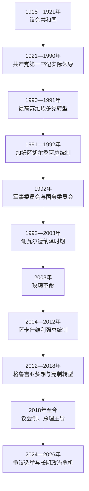

# 格鲁吉亚国家元首、政府首脑与苏维埃实际领导人表

## 范围与编排

本表覆盖1918年格鲁吉亚民主共和国、1921—1991年苏维埃时期，以及恢复独立后的国家元首、政府首脑和实际最高权力。不同政体的职位不能混为一张“总统表”：

- 1918—1921年实行议会共和制，没有共和国总统；议会主席承担国家代表职能，政府主席主持行政。
- 苏维埃时期，最高苏维埃主席等是法定国家机关首长，但共产党第一书记通常掌握实际最高政治权力，因此本表以第一书记为主。
- 1990—1995年先后出现最高苏维埃主席、总统、军事委员会和国务委员会，须按实际权力转换分段。
- 1995年以后总统与总理的权重随宪法改革变化；2018年宪法全面生效后，格鲁吉亚以议会制为主，总理和政府掌握主要行政权。
- 2024年议会与总统选举的公正性和合法性受到反对派及多个国际机构质疑。本表分别记录宪法机关实际履职者和政治争议，不把争议本身写成已经完成的政权更替。

中世纪至19世纪的王位更替另见[格鲁吉亚君主世系表](/%E4%BA%BA%E6%96%87%E7%A7%91%E5%AD%A6/%E5%8E%86%E5%8F%B2/%E8%A5%BF%E4%BA%9A/%E5%8D%97%E9%AB%98%E5%8A%A0%E7%B4%A2/%E6%A0%BC%E9%B2%81%E5%90%89%E4%BA%9A/%E6%A0%BC%E9%B2%81%E5%90%89%E4%BA%9A%E5%90%9B%E4%B8%BB%E4%B8%96%E7%B3%BB%E8%A1%A8.md)。

## 1918—1921年议会与政府领导人

### 议会最高负责人

| 顺序 | 姓名 | 职位 | 任期 | 说明 |
|---:|---|---|---|---|
| 1 | 尼古拉·齐赫泽 | 外高加索议会主席；格鲁吉亚国民议会、制宪会议主席 | 1918年2月10日—1921年3月16日 | 1918年5月26日前领导外高加索议会，独立后主持格鲁吉亚立法机关；议会制下没有共和国总统。 |

### 政府主席

| 顺序 | 姓名 | 任期 | 与前任关系 | 关键事项 |
|---:|---|---|---|---|
| 1 | 诺埃·拉米什维利 | 1918年5月26日—7月24日 | 独立后首任 | 建立首届内阁、国家安全和行政机构。 |
| 2 | **诺埃·若尔达尼亚** | 1918年7月24日—1921年3月18日 | 社会民主党同僚接任 | 主持议会共和国、土地改革和对外承认；红军占领后率政府流亡，流亡政府长期主张法律连续性。 |

## 苏维埃时期实际最高领导人

1921年红军进入后，共产党逐步垄断权力。1931—1934年等时段，共和国第一书记同外高加索边疆区党组织领导职务可能重叠；下表按格鲁吉亚共产党中央委员会第一书记的连续任期列出。

| 顺序 | 第一书记 | 任期 | 关键事项与结局 |
|---:|---|---|---|
| 1 | 马米亚·奥拉赫拉什维利 | 1921年3月—1922年4月 | 早期布尔什维克政权建立；后在大清洗中被处决。 |
| 2 | 米哈伊尔·奥库贾瓦 | 1922年4月—10月22日 | 短期任职，外高加索联邦形成阶段。 |
| 3 | 维萨里昂·洛米纳泽 | 1922年10月25日—1924年8月 | 1924年反苏起义前后的党组织领导。 |
| 4 | 米哈伊尔·卡希阿尼 | 1924年8月—1930年5月 | 起义镇压后巩固党国体系，后在清洗中被处决。 |
| 5 | 列万·戈戈别里泽 | 1930年5月—11月19日 | 集体化初期，任期短暂。 |
| 6 | 萨姆松·马穆利亚 | 1930年11月20日—1931年9月11日 | 农业集体化和反宗教运动扩大。 |
| 7 | 拉夫连季·卡特韦利什维利 | 1931年9月11日—11月14日 | 仅任两个月，后在大清洗中被处决。 |
| 8 | **拉夫连季·贝利亚** | 1931年11月14日—1932年10月18日 | 第一次；同时在外高加索党组织上升。 |
| 9 | 彼得·阿格尼阿什维利 | 1932年10月18日—1934年1月15日 | 共和国第一书记；贝利亚仍掌外高加索更高层权力。 |
| 10 | 拉夫连季·贝利亚 | 1934年1月15日—1938年8月31日 | 第二次；组织大清洗和干部镇压，后调任莫斯科。 |
| 11 | 坎季德·恰尔克维阿尼 | 1938年8月31日—1952年4月2日 | 第二次世界大战、战后重建和斯大林晚期统治。 |
| 12 | 阿卡基·姆格拉泽 | 1952年4月2日—1953年4月14日 | 斯大林晚期被提升，斯大林死后迅速撤职。 |
| 13 | 亚历山大·米尔茨胡拉瓦 | 1953年4月14日—9月19日 | 贝利亚失势前后的短暂过渡。 |
| 14 | 瓦西里·姆扎瓦纳泽 | 1953年9月20日—1972年9月29日 | 去斯大林化、1956年第比利斯示威及长期庇护网络时期。 |
| 15 | **爱德华·谢瓦尔德纳泽** | 1972年9月29日—1985年7月6日 | 以反腐名义整顿干部，后任苏联外交部长。 |
| 16 | 朱姆别尔·帕季阿什维利 | 1985年7月6日—1989年4月14日 | 改革开放和民族运动上升；4月9日镇压后辞职。 |
| 17 | 吉维·贡巴里泽 | 1989年4月14日—1990年12月7日 | 共产党失去垄断，1990年多党选举举行。 |
| 18 | 阿夫坦迪尔·马尔吉亚尼 | 1990年12月7日—1991年2月19日 | 已在反对派政府掌权条件下领导改名后的共产党。 |
| 19 | 杰马尔·米克拉泽 | 1991年2月20日—8月26日 | 最后一任；八一九事件后共产党被禁，职位终结。 |

> 约瑟夫·斯大林出生于格鲁吉亚并长期领导整个苏联，贝利亚也进入联盟最高权力核心；但他们担任的联盟职务不等于“格鲁吉亚国家元首”。本表只在实际共和国领导链中列贝利亚的第一书记任期。

## 1990—1995年政体转换与国家元首

| 顺序 | 国家最高权力 | 职位 | 任期 | 说明 |
|---:|---|---|---|---|
| 1 | **兹维亚德·加姆萨胡尔季阿** | 最高苏维埃主席 | 1990年11月14日—1991年4月14日 | 多党选举后成为共和国最高负责人，推动恢复独立。 |
| 2 | 兹维亚德·加姆萨胡尔季阿 | 总统 | 1991年4月14日—1992年1月6日 | 5月经普选确认；在第比利斯武装冲突中被军事委员会推翻，后在西部建立抵抗政府。 |
| — | 滕吉兹·基托瓦尼、贾巴·约谢利阿尼 | 军事委员会共同主席 | 1992年1月6日—3月10日 | 政变后的事实最高权力，不是经宪法选举产生的总统。 |
| 3 | **爱德华·谢瓦尔德纳泽** | 国务委员会主席 | 1992年3月10日—11月6日 | 应政变领导者邀请回国，主持过渡。 |
| 4 | 爱德华·谢瓦尔德纳泽 | 议会主席兼国家元首 | 1992年11月6日—1995年11月26日 | 经议会选举获得制度化地位，内战和阿布哈兹战争时期。 |
| — | 兹维亚德派政府 | 西格鲁吉亚并立权力 | 1993年9月24日—11月6日 | 加姆萨胡尔季阿短暂返回，别萨里昂·古古什维利等继续主张原政府合法性；军事失败后瓦解。 |

## 独立共和国总统

| 顺序 | 总统 | 任期 | 关键事项与权力中断 |
|---:|---|---|---|
| 1 | 兹维亚德·加姆萨胡尔季阿 | 1991年4月14日—1992年1月6日 | 首任民选总统；被武装政变推翻，死亡原因和政治责任长期有争议。 |
| 2 | **爱德华·谢瓦尔德纳泽** | 1995年11月26日—2003年11月23日 | 1995年宪法下首任总统；稳定部分国家机构，腐败与选举争议促成玫瑰革命。 |
| — | 尼诺·布尔贾纳泽（代理总统） | 2003年11月23日—2004年1月25日 | 议长依宪法代理。 |
| 3 | **米哈伊尔·萨卡什维利** | 2004年1月25日—2007年11月25日 | 第一任期；为提前选举辞职。 |
| — | 尼诺·布尔贾纳泽（代理总统） | 2007年11月25日—2008年1月20日 | 第二次代理。 |
| 3 | 米哈伊尔·萨卡什维利 | 2008年1月20日—2013年11月17日 | 第二任期；2008年俄格战争，之后宪改逐步把权力转向议会和总理。 |
| 4 | 格奥尔基·马尔格韦拉什维利 | 2013年11月17日—2018年12月16日 | 由直接选举产生，任内总统权力继续缩减。 |
| 5 | 萨洛梅·祖拉比什维利 | 2018年12月16日—2024年12月29日 | 最后一位由公民直接选出的总统；后同格鲁吉亚梦想政府决裂。她不承认2024年选举和继任者，卸任后继续作为反对运动代表，但未继续控制总统机关。 |
| 6 | **米哈伊尔·卡韦拉什维利** | 2024年12月29日至今 | 首位由选举人团选出；前执政党议员、人民力量共同创办人。截至2026年7月13日由宪法机关承认为总统，但反对派质疑产生他的议会和选举人团合法性。 |

## 1918—1921年及1990年后政府首脑

### 第一共和国

| 顺序 | 政府首脑 | 任期 | 备注 |
|---:|---|---|---|
| 1 | 诺埃·拉米什维利 | 1918年5月26日—7月24日 | 政府主席。 |
| 2 | 诺埃·若尔达尼亚 | 1918年7月24日—1921年3月18日 | 政府主席；流亡后继续领导流亡政府。 |

### 恢复独立前后的总理

| 顺序 | 总理 | 任期 | 关键说明 |
|---:|---|---|---|
| 1 | 滕吉兹·西古阿 | 1990年11月15日—1991年8月18日 | 加姆萨胡尔季阿政府首任。 |
| 2 | 别萨里昂·古古什维利 | 1991年8月23日—1992年1月6日 | 政变后随总统离开第比利斯；1993年短暂并立政府仍认其为总理。 |
| 3 | 滕吉兹·西古阿 | 1992年1月6日—1993年8月6日 | 政变后复任，服务军事委员会和国务委员会。 |
| 4 | 奥塔尔·帕察齐亚 | 1993年8月20日—1995年10月5日 | 总理职位在1995年宪法后改为国务部长。 |

### 国务部长

1995—2004年，总统是行政权核心，“国务部长”负责政府日常协调，权限弱于后来议会制总理。

| 顺序 | 国务部长 | 任期 | 说明 |
|---:|---|---|---|
| 1 | 尼科·莱基什维利 | 1995年12月8日—1998年8月7日 | 首任国务部长。 |
| 2 | 瓦扎·洛尔特基帕尼泽 | 1998年8月7日—2000年5月11日 | 前驻俄大使。 |
| 3 | 格奥尔基·阿尔谢尼什维利 | 2000年5月11日—2001年12月21日 | 经济和行政改革时期。 |
| 4 | 阿夫坦迪尔·乔尔别纳泽 | 2001年12月21日—2003年11月23日 | 谢瓦尔德纳泽末期；玫瑰革命时离任。 |
| 5 | 祖拉布·日瓦尼亚 | 2003年11月27日—2004年2月17日 | 过渡国务部长，随后成为恢复设置后的总理。 |

### 2004年后总理

| 顺序 | 总理 | 任期 | 关键说明 |
|---:|---|---|---|
| 1 | **祖拉布·日瓦尼亚** | 2004年2月17日—2005年2月3日 | 总理职位恢复后的首任；任内意外死亡。 |
| — | 格奥尔基·巴拉米泽（代理总理） | 2005年2月3—17日 | 副总理代理。 |
| 2 | 祖拉布·诺盖德利 | 2005年2月17日—2007年11月22日 | 经济改革与总统权力集中时期。 |
| 3 | 拉多·古尔格尼泽 | 2007年11月22日—2008年11月1日 | 2008年俄格战争时期。 |
| 4 | 格里戈尔·姆加洛布利什维利 | 2008年11月1日—2009年2月6日 | 战后短期政府。 |
| 5 | 尼卡·吉劳里 | 2009年2月6日—2012年7月4日 | 全球金融危机后经济管理。 |
| 6 | 瓦诺·梅拉比什维利 | 2012年7月4日—10月25日 | 统一民族运动选举失利后交权。 |
| 7 | **比济纳·伊万尼什维利** | 2012年10月25日—2013年11月20日 | 格鲁吉亚梦想创办人，完成首次选举后的政党轮替；卸任后仍对执政党有重大非正式影响。 |
| 8 | 伊拉克利·加里巴什维利 | 2013年11月20日—2015年12月30日 | 第一次任期。 |
| 9 | 格奥尔基·克维里卡什维利 | 2015年12月30日—2018年6月20日 | 欧盟免签和宪制转型时期。 |
| 10 | 马穆卡·巴赫塔泽 | 2018年6月20日—2019年9月8日 | 新宪法全面转向议会制。 |
| 11 | 格奥尔基·加哈里亚 | 2019年9月8日—2021年2月22日 | 抗议与疫情时期；因反对拘捕主要反对派领导人而辞职。 |
| 12 | 伊拉克利·加里巴什维利 | 2021年2月22日—2024年2月8日 | 第二次任期；俄乌战争后外交平衡争议。 |
| 13 | **伊拉克利·科巴希泽** | 2024年2月8日至今 | 格鲁吉亚梦想前党主席；截至2026年7月13日主持政府，国内反对派质疑2024年议会选举和其后政府授权。 |

## 截至2026年7月的实际权力结构

| 层次 | 人物或机构 | 实际作用 |
|---|---|---|
| 总统 | 米哈伊尔·卡韦拉什维利 | 国家元首，主要承担代表、任命和宪法程序职能；由选举人团产生，权力弱于政府。 |
| 总理与政府 | 伊拉克利·科巴希泽及内阁 | 掌握主要行政、国内安全、经济和外交政策。 |
| 议会 | 议长沙尔瓦·帕普阿什维利；格鲁吉亚梦想占主导 | 立法、选举政府和总统选举人团；反对派对2024年选举结果和议会合法性有持续异议。 |
| 执政党网络 | 格鲁吉亚梦想；名誉主席比济纳·伊万尼什维利 | 伊万尼什维利无国家职务，却被广泛视为执政联盟战略和干部安排的关键影响者。 |
| 反对派与公民社会 | 多个亲欧政党、前总统祖拉比什维利、媒体与社会组织 | 通过抗议、法律和国际动员挑战政府路线；2025—2026年面临扩大中的刑事、资金和政治活动限制。 |
| 阿布哈兹、南奥塞梯 | 事实当局与俄罗斯军队 | 第比利斯不控制两地；俄罗斯和少数国家承认其独立，多数国家仍承认格鲁吉亚主权。 |

## 演变关系

- 历史过程见[俄国、苏联与独立格鲁吉亚](/%E4%BA%BA%E6%96%87%E7%A7%91%E5%AD%A6/%E5%8E%86%E5%8F%B2/%E8%A5%BF%E4%BA%9A/%E5%8D%97%E9%AB%98%E5%8A%A0%E7%B4%A2/%E6%A0%BC%E9%B2%81%E5%90%89%E4%BA%9A/%E4%BF%84%E5%9B%BD%E3%80%81%E8%8B%8F%E8%81%94%E4%B8%8E%E7%8B%AC%E7%AB%8B%E6%A0%BC%E9%B2%81%E5%90%89%E4%BA%9A.md)。
- 区域冲突比较见[苏维埃划界、独立与地区冲突](/%E4%BA%BA%E6%96%87%E7%A7%91%E5%AD%A6/%E5%8E%86%E5%8F%B2/%E8%A5%BF%E4%BA%9A/%E5%8D%97%E9%AB%98%E5%8A%A0%E7%B4%A2/%E8%8B%8F%E7%BB%B4%E5%9F%83%E5%88%92%E7%95%8C%E3%80%81%E7%8B%AC%E7%AB%8B%E4%B8%8E%E5%9C%B0%E5%8C%BA%E5%86%B2%E7%AA%81.md)。
- 上级入口：[格鲁吉亚](/%E4%BA%BA%E6%96%87%E7%A7%91%E5%AD%A6/%E5%8E%86%E5%8F%B2/%E8%A5%BF%E4%BA%9A/%E5%8D%97%E9%AB%98%E5%8A%A0%E7%B4%A2/%E6%A0%BC%E9%B2%81%E5%90%89%E4%BA%9A/README.md)。
