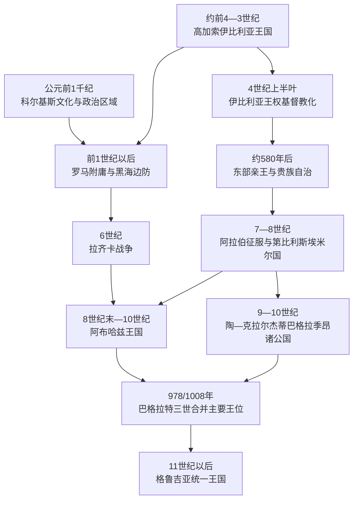

# 科尔基斯、伊比利亚与基督教化

## 时间

约公元前1千纪至10世纪末

## 概括

现代格鲁吉亚的古代政治文化并非来自一个从古至今连续不变的国家，而是在黑海东岸的科尔基斯—拉齐卡传统、东部的高加索伊比利亚王权、南部陶—克拉尔杰蒂公国以及格鲁吉亚语教会网络长期互动中形成。西部依托黑海港口和山地资源，同希腊、罗马及拜占庭世界联系密切；东部控制里海—黑海与南北高加索通道，长期处在罗马—拜占庭与安息—萨珊伊朗之间。4世纪王权基督教化、5世纪以来格鲁吉亚文字文献的发展以及修道院网络，使跨越政权分裂的文化共同体逐渐稳定。

8—10世纪，阿拔斯哈里发对外高加索的直接控制减弱，阿布哈兹王国、卡赫季与赫雷蒂、陶—克拉尔杰蒂的巴格拉季昂诸公国竞相扩张。巴格拉特三世于978年取得阿布哈兹王位，1008年又继承“格鲁吉亚人之王”的父系王位，成为统一王国形成的关键人物；但第比利斯埃米尔国、卡赫季—赫雷蒂和部分山区并未在1008年同时并入。

## 地理与社会基础

| 区域 | 古代政治中心 | 对外联系 | 长期作用 |
|---|---|---|---|
| 黑海东岸低地与河谷 | 科尔基斯，后为拉齐卡 / 埃格里西 | 希腊殖民城市、黑海航运、罗马—拜占庭 | 港口贸易、金属与林木资源、西部王权传统 |
| 库拉河上游与东格鲁吉亚 | 高加索伊比利亚 / 卡特利 | 亚美尼亚、伊朗、高加索山口、罗马边防 | 王权、贵族领地、姆茨赫塔宗教中心 |
| 南部山地 | 陶、克拉尔杰蒂、贾瓦赫季等 | 亚美尼亚高原、拜占庭安纳托利亚 | 8—10世纪巴格拉季昂复兴基地 |
| 西北山地与沿海 | 阿布哈兹及相邻诸族区域 | 黑海东北岸、拜占庭 | 8—10世纪阿布哈兹王国扩张并整合西部 |
| 第比利斯及交通走廊 | 先属伊比利亚，8世纪后形成埃米尔国 | 哈里发帝国、伊朗和跨高加索商路 | 城市税收与贸易中心，直到1122年才并入统一王国 |

“科尔基斯人”“伊比利亚人”“拉齐人”和后来使用格鲁吉亚语的政治共同体之间存在地域、语言与文化延续，但不能简单等同于现代民族国家。斯万、赞 / 明格列尔—拉兹以及格鲁吉亚语等卡特维尔语言群体在不同生态区发展，统一王权和教会才逐步把部分地方认同叠合为更广的“格鲁吉亚”身份。

## 分阶段发展

### 科尔基斯、希腊港口与本都统治

公元前1千纪，黑海东岸出现被希腊和近东文献称作科尔基斯的政治与文化区域。希腊神话中的金羊毛反映希腊人对这一金属资源丰富的遥远海岸的想象，不能直接当作史实。约公元前6世纪起，法西斯、迪奥斯库里亚斯等沿海城市进入希腊贸易网络，输入陶器、钱币与奢侈品，交换木材、金属、蜡及其他山地—平原产品；港口联系并未消除腹地社会和地方统治者。

公元前2世纪末至1世纪初，科尔基斯纳入本都国王米特里达梯六世的势力。公元前65年罗马将领庞培击败本都并进入高加索后，西部地区逐渐处于罗马军事和附庸体系之中。罗马主要掌握沿岸堡垒、港口和交通线，内陆地方王公仍保有很大自主性。晚期古代，西部政治中心以拉齐卡或埃格里西之名延续。

### 高加索伊比利亚的王权形成

高加索伊比利亚约在公元前4—3世纪形成王国，核心在姆茨赫塔及库拉河上游。格鲁吉亚中世纪编年传统把法尔纳瓦兹一世视为开国者，并将行政区划和文字创造归于其名下；现代研究通常承认早期王权形成的历史背景，但其具体年代、事迹和完整世系混合了后世记忆，不能按编年传统逐项视为已证实事实。

伊比利亚国王依赖王族领地、地方大贵族和军事长官。其战略价值来自达里亚尔等山口、通往亚美尼亚和伊朗的道路，以及在北方游牧力量与南方帝国之间的缓冲位置。公元前1世纪以后，罗马与安息先后干预王位；公元298年罗马—萨珊和约强化罗马在伊比利亚的影响，此后萨珊又多次恢复控制。地方君主并非始终忠于一方，而是借改换宗主、婚姻和军事援助维持王位。

### 王权基督教化与文化整合

格鲁吉亚传统将卡帕多西亚传教者圣尼诺、米里安三世和娜娜王后与伊比利亚皈依联系起来。具体年份常作326年、337年前后或4世纪30年代，存在纪年差异；较稳妥的结论是伊比利亚宫廷在4世纪上半叶接受基督教，并以姆茨赫塔为教会中心。基督教化是渐进过程：宫廷和城市先接受新宗教，乡村旧信仰、伊朗宗教影响和地方习俗持续更久。

5世纪的瓦赫唐一世“戈尔加萨利”在传统中被视为重整王权、扩建第比利斯并完善教会组织的君主。他在482年反抗萨珊控制，但未能永久摆脱伊朗宗主权。约580年萨珊王朝废除伊比利亚国王，改由地方首席亲王和贵族治理；王位终结不等于格鲁吉亚政治传统消失，教会、贵族家族和区域公国继续存在。

最早可确定的格鲁吉亚文铭文见于5世纪，5世纪末的《圣舒沙尼克殉道记》是早期文学代表。格鲁吉亚教会最初与亚美尼亚等高加索教会密切往来，6—7世纪围绕迦克墩教义逐渐分道，后来明确加入拜占庭东正教传统。教会自主地位的形成经历较长过程，不宜用单一年份概括。巴勒斯坦、西奈、南高加索和后来阿索斯山的修道院承担翻译、抄写、教育和精英联络，使语言共同体在政治分裂时仍能延续。

### 拉齐卡战争与西部归属

6世纪的拉齐卡是拜占庭和萨珊争夺黑海东岸的关键。拉齐卡国王古巴泽斯二世因不满拜占庭控制，于541年引入萨珊军队；波斯驻军和直接统治同样引发反抗，拉齐卡随后重新联结拜占庭。战争围绕佩特拉等要塞、补给线和当地王公反复展开。555年古巴泽斯被拜占庭军官杀害，拉齐人向皇帝申诉，涉事军官受审，显示地方精英既依赖帝国又保有政治能动性。562年和约确认拉齐卡留在拜占庭势力范围，西部因而更深地进入东罗马基督教和黑海体系。

### 阿拉伯征服与多中心格局

7世纪中叶起阿拉伯军队进入南高加索，地方统治者以纳贡、条约或军事抵抗应对。8世纪30年代马尔万的远征严重破坏部分地区，第比利斯此后发展为哈里发体系下的埃米尔国。埃米尔以城市、商路和税收为核心，其实际控制随哈里发强弱而变化；格鲁吉亚山区、卡赫季、西部和南部公国并未被同等程度直接治理。

阿拉伯统治没有造成单一的宗教替换。第比利斯形成穆斯林城市社会，农村与山地大多保留基督教；贵族可在哈里发、拜占庭和地方联盟之间转换。8世纪末以后，阿拔斯中央力量下降，卡赫季乔尔埃皮斯科帕特、赫雷蒂王国、阿布哈兹王国、陶—克拉尔杰蒂巴格拉季昂领地及第比利斯埃米尔国长期并立。

### 阿布哈兹王国、陶—克拉尔杰蒂与统一前夜

西部的列昂二世在8世纪末摆脱拜占庭的紧密控制，阿布哈兹王国以库塔伊西为中心向东扩展，逐渐覆盖原拉齐卡大部。其王室采用格鲁吉亚语教会与行政文化，说明“阿布哈兹王国”是中世纪多族群政体名称，不能直接套入现代民族冲突框架。

南部的阿绍特一世于9世纪初在陶—克拉尔杰蒂建立巴格拉季昂权力基地，利用山地要塞、修道院殖垦、拜占庭“库罗帕拉特”等头衔和阿拉伯势力衰退扩大领地。10世纪的大卫三世控制广阔南部领地，曾援助拜占庭皇帝巴西尔二世；但其死后部分领土被拜占庭接收，显示格鲁吉亚统一和拜占庭扩张同时发生。

巴格拉特三世兼有阿布哈兹王室和巴格拉季昂父系继承权，在养父大卫三世及地方精英支持下于978年成为阿布哈兹国王，1008年继承“格鲁吉亚人之王”。他随后压制竞争王公，并在约1010年控制卡赫季—赫雷蒂。这个过程以多重继承、婚姻、贵族联盟和军事征服共同完成，而非某一场战役突然建立现代意义的统一国家。

## 统治结构

| 层次 | 主要角色 | 运作方式 |
|---|---|---|
| 国王与王族 | 伊比利亚、拉齐卡、阿布哈兹及各地方王室 | 通过宗主册封、婚姻、共治和分封维持统治，王位常受外部帝国干预 |
| 地方贵族 | 埃里斯塔维、家族领主、山地首领 | 掌握土地、要塞与随从，可支持或推翻王位候选人 |
| 教会 | 主教、姆茨赫塔教座、修道院 | 提供文字教育、礼仪合法性、财产网络和跨区域联系 |
| 城市与商人 | 第比利斯、黑海港口及河谷市场 | 连接黑海、伊朗、亚美尼亚和高加索贸易，向统治者提供关税 |
| 外部宗主 | 罗马—拜占庭、安息—萨珊、哈里发 | 驻军、征税、授予头衔或扶立君主，但难以持续直辖全部山地 |

## 重要事件

| 时间 | 事件 | 过程与意义 |
|---|---|---|
| 约前6世纪起 | 黑海希腊港口发展 | 科尔基斯进入黑海贸易圈，港口与地方腹地形成互赖关系 |
| 前65年 | 庞培进入高加索 | 本都势力崩溃，科尔基斯和伊比利亚进入罗马附庸与边防体系 |
| 4世纪上半叶 | 伊比利亚王权基督教化 | 王室接受基督教，姆茨赫塔逐渐成为跨政权文化中心 |
| 482年起 | 瓦赫唐反萨珊战争 | 试图借高加索联盟摆脱伊朗控制，失败后王权进一步受限 |
| 541—562年 | 拉齐卡战争 | 当地王权在拜占庭与萨珊之间转向，最终留在拜占庭势力范围 |
| 约580年 | 萨珊废除伊比利亚王位 | 东部转为亲王—贵族自治，政治权力多中心化 |
| 7世纪中叶—8世纪 | 阿拉伯征服与第比利斯埃米尔国形成 | 城市纳入哈里发税收和贸易体系，外围基督教公国继续发展 |
| 8世纪末 | 阿布哈兹王国兴起 | 西部王权摆脱紧密宗属并向中部扩展 |
| 9世纪初 | 巴格拉季昂在陶—克拉尔杰蒂立足 | 以修道院、领地经营和拜占庭头衔建立统一王朝的南部基础 |
| 978—1008年 | 巴格拉特三世合并主要王位 | 先得阿布哈兹王位，后继承父系王号，统一王国主干形成 |

## 崛起与转型机制

### 统一条件

- **共同文化基础**：格鲁吉亚语礼仪、文学和修道院教育为不同公国提供共同政治词汇。
- **王朝继承网络**：巴格拉特三世同时连接阿布哈兹与巴格拉季昂王系，能够用合法继承减少部分征服成本。
- **帝国权力变化**：阿拔斯对高加索控制衰退；拜占庭虽强盛，却更愿利用有头衔的地方盟友治理边境。
- **经济与宗教开发**：陶—克拉尔杰蒂的修道院、农业聚落和要塞提供人口、文书与财政基础。
- **贵族选择**：部分贵族支持能制衡其他领主、保护教会和商路的王位候选人。

### 未完成的统一

1008年是王权合并的标志，不是全部格鲁吉亚土地同时归一。第比利斯埃米尔国延续到1122年，卡赫季—赫雷蒂的控制也曾反复，南部若干领土受拜占庭掌握，山地社群保有自治。统一王国的建立因此是约一个世纪的渐进整合，后续见[格鲁吉亚统一王国、分裂与帝国竞争](/%E4%BA%BA%E6%96%87%E7%A7%91%E5%AD%A6/%E5%8E%86%E5%8F%B2/%E8%A5%BF%E4%BA%9A/%E5%8D%97%E9%AB%98%E5%8A%A0%E7%B4%A2/%E6%A0%BC%E9%B2%81%E5%90%89%E4%BA%9A/%E7%BB%9F%E4%B8%80%E7%8E%8B%E5%9B%BD%E3%80%81%E5%88%86%E8%A3%82%E4%B8%8E%E5%B8%9D%E5%9B%BD%E7%AB%9E%E4%BA%89.md)。

## 史料与争议

- 法尔纳瓦兹一世以前后的完整伊比利亚王表主要依赖成书较晚的编年史，姓名次序、在位年和亲属关系有多种重建，因此不并入中世纪[格鲁吉亚君主世系表](/%E4%BA%BA%E6%96%87%E7%A7%91%E5%AD%A6/%E5%8E%86%E5%8F%B2/%E8%A5%BF%E4%BA%9A/%E5%8D%97%E9%AB%98%E5%8A%A0%E7%B4%A2/%E6%A0%BC%E9%B2%81%E5%90%89%E4%BA%9A/%E6%A0%BC%E9%B2%81%E5%90%89%E4%BA%9A%E5%90%9B%E4%B8%BB%E4%B8%96%E7%B3%BB%E8%A1%A8.md)。
- “圣尼诺使全国皈依”是宗教传统的核心叙事；历史过程应理解为王室率先采用、教会制度逐步扩展和地方信仰长期并存。
- 格鲁吉亚文字的确切创制者与最初年代仍有争论；可确定证据集中在5世纪铭文，不能仅凭后世传说断定由某一位古王一次创造。
- 阿布哈兹王国、伊比利亚和科尔基斯都是古代—中世纪政体，不应直接被现代民族主义独占为单一民族国家的前身。

## 演变关系

- 区域背景：[南高加索古代王国与基督教化](/%E4%BA%BA%E6%96%87%E7%A7%91%E5%AD%A6/%E5%8E%86%E5%8F%B2/%E8%A5%BF%E4%BA%9A/%E5%8D%97%E9%AB%98%E5%8A%A0%E7%B4%A2/%E5%8F%A4%E4%BB%A3%E7%8E%8B%E5%9B%BD%E4%B8%8E%E5%9F%BA%E7%9D%A3%E6%95%99%E5%8C%96.md)
- 本国入口：[格鲁吉亚](/%E4%BA%BA%E6%96%87%E7%A7%91%E5%AD%A6/%E5%8E%86%E5%8F%B2/%E8%A5%BF%E4%BA%9A/%E5%8D%97%E9%AB%98%E5%8A%A0%E7%B4%A2/%E6%A0%BC%E9%B2%81%E5%90%89%E4%BA%9A/README.md)
