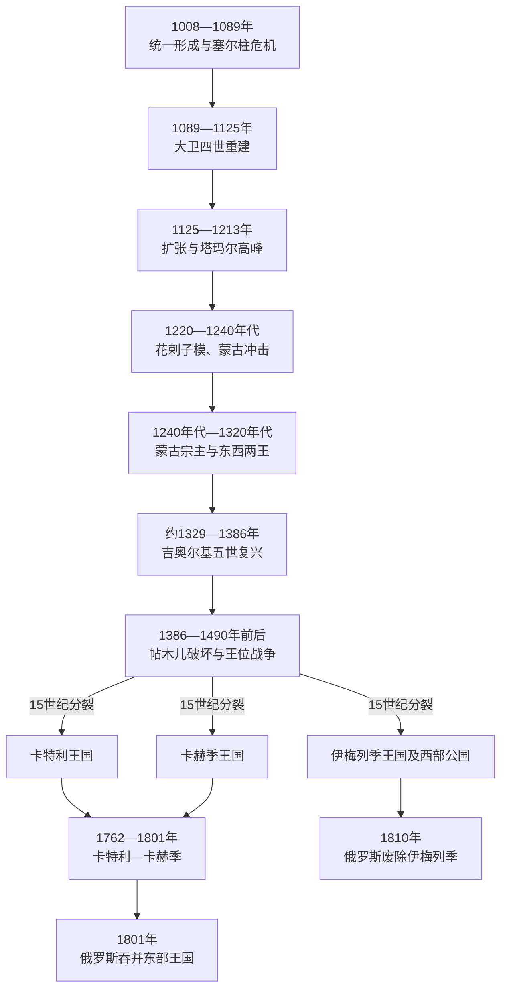

# 格鲁吉亚统一王国、分裂与帝国竞争

## 时间

1008—1810年

## 概括

格鲁吉亚统一王国不是在1008年一次性兼并全部格鲁吉亚地区，而是巴格拉季昂王室凭借多重继承、教会支持、贵族联盟与战争逐步整合的结果。11世纪后期塞尔柱入侵一度使王权濒临崩溃；大卫四世重组军队、教会和王室财政，于1121年迪德格里战役后夺回第比利斯。塔玛尔女王统治时，王国以直接领地、附庸国和盟邦构成南高加索强权，并形成文学、建筑与修道院文化高峰。

13世纪的花剌子模和蒙古征服摧毁财政与军事平衡。吉奥尔基五世曾恢复统一，帖木儿入侵和15世纪王位战争又使王国分裂为卡特利、卡赫季、伊梅列季三王国及多个西部、南部公国。16—18世纪，东部诸王常受萨法维或后继伊朗王朝册封，西部受到奥斯曼宗主权、驻军和奴隶贸易压力；地方王室并非单纯傀儡，仍利用改宗、纳贡、联姻和帝国战争争取空间。1762年卡特利与卡赫季再统一，但1783年的俄国保护没有阻止1795年第比利斯被卡扎尔军洗劫。俄罗斯于1801年废除东部王位，1810年以军事手段废除伊梅列季王位，中世纪以来的格鲁吉亚君主政体由此终结。

完整、按在位顺序编排的共治、复位、并立王位和短期争位者，见[格鲁吉亚君主世系表](/%E4%BA%BA%E6%96%87%E7%A7%91%E5%AD%A6/%E5%8E%86%E5%8F%B2/%E8%A5%BF%E4%BA%9A/%E5%8D%97%E9%AB%98%E5%8A%A0%E7%B4%A2/%E6%A0%BC%E9%B2%81%E5%90%89%E4%BA%9A/%E6%A0%BC%E9%B2%81%E5%90%89%E4%BA%9A%E5%90%9B%E4%B8%BB%E4%B8%96%E7%B3%BB%E8%A1%A8.md)。

## 分阶段发展

### 王位合并与11世纪危机

巴格拉特三世于978年成为阿布哈兹国王，1008年继承父亲古尔根的“格鲁吉亚人之王”称号，约1010年又控制卡赫季—赫雷蒂。他削弱部分王族旁支、修建教堂并以库塔伊西为重要中心，使几个王冠汇于一人，但第比利斯仍由穆斯林埃米尔统治，南部边境也同拜占庭存在争议。

吉奥尔基一世在1021—1022年同拜占庭皇帝巴西尔二世争夺陶地失败，被迫割地并送王子为质。巴格拉特四世幼年即位后，王太后、拜占庭、克尔德卡里大公利帕里特四世和王室相互争权；利帕里特一度控制国王并另立王族候选人，显示统一王权仍依赖大贵族。1071年曼齐刻尔特战役后拜占庭边防崩溃，塞尔柱部众进入格鲁吉亚。约1080年的“大突厥入侵”造成聚落废弃、农业中断和贡赋压力，吉奥尔基二世被迫纳贡，并于1089年让位给大卫四世。

### 大卫四世的重建与扩张

大卫四世首先整顿王室领地和贵族军权。1103年的鲁伊西—乌尔布尼西教会会议罢黜部分不合格主教，加强王权与教会合作；宫廷把重要文武职务结合，使教会财产和行政人才服务国家。传统记载他安置大批钦察家庭，以换取常备骑兵；具体人数可能经过夸张，但外来军户确实扩大了国王不完全依赖封建贵族的兵源。他又利用塞尔柱内部争斗，逐步停止纳贡、收复要塞和保障农民复耕。

1121年，格鲁吉亚军在迪德格里击败由周边穆斯林统治者组成的联军。胜利不是一次性“消灭塞尔柱”，却打破了对第比利斯的外部救援。1122年大卫夺取第比利斯，将其建设为首都并保留穆斯林、亚美尼亚人和其他城市社群的商业功能；1124年又短期控制阿尼。王室以土地、税收、城市关税和附庸贡赋支撑军队，格拉特修道院等教育中心把国家重建同文化事业结合。

### 12世纪的权力整合

德米特里一世和吉奥尔基三世维持扩张，但宫廷继承并不平稳。1154年大卫五世迫使父亲德米特里退位，数月后去世；德米特里复位后让幼子吉奥尔基三世继承。1177—1178年，大贵族支持德姆纳王子反叛，失败后遭没收、处刑或致盲。吉奥尔基三世随后让女儿塔玛尔共治，以预先加冕解决女性继承的合法性问题。

1184年塔玛尔独立执政之初，贵族要求恢复部分政治权利，库特卢·阿尔斯兰集团甚至提出由贵族会议分享决策。塔玛尔通过谈判、婚姻调整和任命忠诚官员重建权威；她与第一任丈夫尤里·博戈柳布斯基的婚姻失败并引发两次反叛，后来同阿兰王子大卫·索斯兰的联盟则稳定了王室军事核心。

### 塔玛尔时代的高峰

1195年沙姆科尔战役和1202/1203年前后的巴西安战役巩固格鲁吉亚在南高加索的优势。1204年第四次十字军攻占君士坦丁堡后，塔玛尔支持亲族在黑海南岸建立特拉比松帝国；格鲁吉亚还通过附庸、贡赋和盟约影响亚美尼亚城市及高加索东部。其政治版图包含直接统治区、由扎卡里德等家族管理的边疆、宗属政权和临时军事占领，不能全部等同于稳定的行政领土。

宫廷史书把塔玛尔时期塑造成“黄金时代”。这一繁荣有多重条件：王权在大卫四世改革后拥有较稳定税基；东西贸易经过第比利斯和黑海口岸；塞尔柱政权分裂，拜占庭又在1204年崩解；王室与教会赞助修道院、壁画、金工和文学。《虎皮武士》等作品体现宫廷文化的跨区域视野。高峰同时埋有弱点：边疆依靠大贵族家族，扩张性财政和附庸忠诚需要持续军事成功，继承人缺乏长期整合时间。

### 花剌子模冲击与蒙古征服

蒙古侦察军在1220—1221年穿过高加索，格鲁吉亚军多次失利。更直接的破坏来自花剌子模末代苏丹札兰丁：他在1226年攻占第比利斯，城市遭大规模杀戮与破坏，王室退守西部。1236年蒙古军系统征服东部，地方贵族分别投降；鲁苏丹女王最终接受宗主权，格鲁吉亚被纳入蒙古军役、贡赋和人口登记体系。

蒙古大汗于1240年代同时确认大卫六世“纳林”和大卫七世“乌鲁”，使共治合法化。大卫六世1259年反叛后转往西部，东西王位长期并立；大卫七世的反叛也遭镇压。蒙古要求格鲁吉亚军参加西亚战役，重税和征兵加重人口损耗，但部分贵族也借帝国军职扩大领地。1289年德米特里二世为避免汗廷惩罚臣民赴营被处死，成为教会记忆中的殉国者。

### 吉奥尔基五世复兴与帖木儿破坏

伊儿汗国衰落时，吉奥尔基五世“光辉者”利用同蒙古权臣的关系先整合东部，约1329—1330年恢复对西部的宗主，终止常态纳贡，重开商路并整顿货币和法律。他的复兴说明蒙古征服没有永久消除王国制度，但统一高度依赖有能力的君主和对地方贵族的个人控制。

1386—1403年间，帖木儿多次入侵格鲁吉亚。第比利斯失陷、巴格拉特五世被俘后曾名义改宗，随后又恢复抵抗。连续远征以迫使纳贡、打击托克塔米什盟友和控制高加索通道为目标，毁坏农田、城镇、教堂和人口基础。帖木儿死后，黑羊、白羊土库曼政权继续袭扰南部，王室难以恢复12世纪的税收与军力。

### 15世纪分裂

亚历山大一世曾试图重建要塞并让诸子共治，但提前分封使王子各有权力基地。1463年，西部贵族支持的巴格拉特在奇霍里击败吉奥尔基八世；1465年萨姆茨赫统治者克瓦尔克瓦雷二世又俘获吉奥尔基。巴格拉特取得第比利斯并称全格鲁吉亚国王，吉奥尔基逃往卡赫季另建王国，亚历山大一世之孙康斯坦丁二世则保有卡特利。

1490年前后王室会议承认卡特利、卡赫季和伊梅列季三王国并立，萨姆茨赫—萨塔巴戈、明格列尔、古里亚、阿布哈兹和斯瓦涅季等公国也取得不同程度自主。分裂不是某一外敌一举“灭亡格鲁吉亚”，而是王族共治与分封、贵族军事自主、长期外患和经济收缩共同作用的结果。

## 分裂后的统治结构

| 政体 | 核心区域 | 主要宗主压力 | 内部权力特点 |
|---|---|---|---|
| 卡特利王国 | 第比利斯及格鲁吉亚中东部 | 以萨法维、后继伊朗王朝为主，奥斯曼数次占领 | 国王常须在伊朗受册封或改宗；大贵族与教会保有土地 |
| 卡赫季王国 | 格鲁吉亚东部 | 萨法维伊朗、达吉斯坦袭击 | 葡萄种植与商路重要，王室多次被放逐或屠杀 |
| 伊梅列季王国 | 库塔伊西及西部腹地 | 奥斯曼宗主权和沿海驻军 | 诸侯强大，国王频繁被废、复位或致盲 |
| 萨姆茨赫—萨塔巴戈 | 西南部 | 16世纪后逐渐奥斯曼化 | 贾盖利家族统治，后改为奥斯曼省制 |
| 明格列尔、古里亚、阿布哈兹等 | 黑海沿岸与山地 | 奥斯曼、伊梅列季及彼此竞争 | 地方公爵拥有军队、关税与对外联姻，名义从属经常变化 |

统一王国时期，国王依靠王室议事机构、宫廷大臣、军队统帅、地方埃里斯塔维和教会治理。分裂后，贵族“塔瓦迪”及公国统治者更能把官职和领地世袭化。农民承担地租、劳役和军役，战争导致依附加深；西部沿海奴隶贸易又鼓励地方权贵掠卖人口。教会既拥有土地和司法特权，也保存语言、教育与王权合法性，不能仅视为王室附属。

## 奥斯曼—伊朗竞争

### 势力范围与反复战争

1514年查尔迪兰战役后，奥斯曼与萨法维在高加索竞争加剧。1555年《阿马西亚和约》大体把卡特利、卡赫季和东部置于萨法维势力圈，把伊梅列季、萨姆茨赫西部及黑海一带置于奥斯曼势力圈。边界不是不可越过的直线：1578年奥斯曼军占领第比利斯和南高加索多地，1603年后沙阿阿拔斯一世反攻，地方君主不断改变效忠。

1614—1616年，阿拔斯一世因卡赫季的泰穆拉兹一世拒绝完全服从而发动远征，大量居民被杀或迁往伊朗内地，卡赫季人口和农业遭重创。1625年吉奥尔基·萨阿卡泽在马尔特科皮发动反萨法维起义，格鲁吉亚军随后在马拉布达失利，但伊朗也无法轻易维持全面直辖。1639年《祖哈卜和约》再次确认奥斯曼—伊朗的大致分区。

### 改宗君主与“瓦利”体制

17世纪卡特利部分巴格拉季昂君主在伊朗宫廷改宗伊斯兰，以波斯名号受封为“瓦利”。罗斯托姆于1633年建立相对稳定的统治，重建城市、灌溉和贸易，并引入更深的波斯宫廷文化；其境内多数人口和格鲁吉亚教会仍为基督教。改宗是王室在萨法维权力体系中获得职位、军队和继承承认的政治策略，不等于全社会宗教改变，也不等于君主毫无地方自主权。

瓦赫唐六世在18世纪初主持法典编纂、历史整理和格鲁吉亚文印刷事业，试图借俄国—伊朗战争摆脱萨法维控制。俄国彼得一世未能提供预期援助，奥斯曼军于1723年占领第比利斯；瓦赫唐最终流亡俄国。这个失败显示格鲁吉亚君主借远方基督教强国制衡邻近帝国的策略，可能把保护期待转化为更深依赖。

## 18世纪复兴、保护条约与灭亡

纳迪尔沙在奥斯曼势力退却后重建伊朗在东格鲁吉亚的影响。1744年，他承认基督徒泰穆拉兹二世为卡特利王、其子埃雷克勒二世为卡赫季王，这是萨法维时期改宗册封模式的重要变化。1762年泰穆拉兹去世，埃雷克勒二世合并两王国，改善税制、军队和手工业，并寻求同俄国、欧洲及周边汗国建立更灵活的外交。

西部的所罗门一世削弱强大诸侯，1757年在赫雷西利击败奥斯曼支持者，并打击人口贩卖，暂时恢复伊梅列季王权。然而王室资源仍不足以长期制服明格列尔、古里亚等公国，奥斯曼沿海据点和继承争夺持续存在。

1783年《格奥尔吉耶夫斯克条约》规定卡特利—卡赫季接受俄罗斯保护，放弃独立外交；俄国承诺保护领土并保证巴格拉季昂王位世袭。俄军后来撤出，俄国在新的俄土战争中优先处理自身战略。埃雷克勒仍同伊朗对抗，卡扎尔王朝创建者阿迦·穆罕默德汗要求其恢复臣属。1795年克尔茨阿尼西战役后，卡扎尔军攻陷并洗劫第比利斯，俄国保护未能及时兑现。

吉奥尔基十二世1798年即位时重病，王族围绕继承激烈竞争；他向俄国请求更强保护和内部担保，谈判中提出的安排并不等于授权无条件废除王朝。保罗一世于1800年末发布兼并意旨，亚历山大一世于1801年正式宣布吞并并阻止王储加冕。东格鲁吉亚王室成员被迁往俄国内地。

伊梅列季国王所罗门二世面对俄军和内部反对者，既谈判又向奥斯曼、伊朗求援。俄国于1810年废黜其王位；所罗门逃亡后继续抵抗，最终死于特拉布宗。此后古里亚、明格列尔、斯瓦涅季和阿布哈兹等西部公国在名义保护下暂时保留，19世纪中叶前后才陆续被取消，详见[俄国、苏联与独立格鲁吉亚](/%E4%BA%BA%E6%96%87%E7%A7%91%E5%AD%A6/%E5%8E%86%E5%8F%B2/%E8%A5%BF%E4%BA%9A/%E5%8D%97%E9%AB%98%E5%8A%A0%E7%B4%A2/%E6%A0%BC%E9%B2%81%E5%90%89%E4%BA%9A/%E4%BF%84%E5%9B%BD%E3%80%81%E8%8B%8F%E8%81%94%E4%B8%8E%E7%8B%AC%E7%AB%8B%E6%A0%BC%E9%B2%81%E5%90%89%E4%BA%9A.md)。

## 重要事件

| 时间 | 事件 | 结果与长期影响 |
|---|---|---|
| 1008年 | 巴格拉特三世合并主要王位 | 形成统一王国主干，但整合仍未完成 |
| 1080年代 | “大突厥入侵” | 聚落与税基受损，促使大卫四世推行军事—财政重建 |
| 1121—1122年 | 迪德格里战役与收复第比利斯 | 王国摆脱塞尔柱压迫并取得商贸中心 |
| 1177—1178年 | 德姆纳叛乱与塔玛尔共治 | 大贵族受打击，女性继承获得预先制度安排 |
| 1195—1204年 | 沙姆科尔、巴西安与特拉比松建立 | 南高加索宗属网络达到高峰 |
| 1226年 | 花剌子模攻陷第比利斯 | 城市和人口遭重创，王国抵御蒙古的能力下降 |
| 1236—1243年 | 蒙古征服与宗主权确立 | 贡赋、军役和双王制度推动东西分裂 |
| 1320—1330年代 | 吉奥尔基五世恢复统一 | 短期重建财政、商路和王权 |
| 1386—1403年 | 帖木儿多次入侵 | 人口、农业和要塞持续损耗，复兴基础被破坏 |
| 1463—1490年前后 | 王位战争与三王国形成 | 统一王国实质及制度上解体 |
| 1555、1639年 | 两次奥斯曼—伊朗和约 | 大致固定东西势力圈，地方王位受两帝国干预 |
| 1614—1616年 | 阿拔斯一世进攻卡赫季 | 大规模死亡与强制迁徙，东部人口结构受创 |
| 1762年 | 卡特利—卡赫季合并 | 东部王权短暂复兴 |
| 1783年 | 《格奥尔吉耶夫斯克条约》 | 以外交自主换俄国保护，逐步打开兼并通道 |
| 1795年 | 第比利斯被卡扎尔军洗劫 | 暴露保护体系失效，加剧王国军事与继承危机 |
| 1801、1810年 | 俄国先后废除东、西王位 | 格鲁吉亚本土王国终结，转入帝国直辖阶段 |

## 鼎盛条件

- **军事—财政改革**：大卫四世扩大王室直属兵源、恢复农业与城市税收，使国王能压制外敌和大贵族。
- **国际权力真空**：塞尔柱分裂、拜占庭衰落及1204年剧变，降低周边大国对南高加索的协调压力。
- **交通与城市**：第比利斯、库塔伊西、阿尼和黑海路线连接伊朗、安纳托利亚与北高加索。
- **王朝与教会合作**：教会提供文字行政、教育和合法性，王室则资助修道院与跨境文化网络。
- **弹性宗属网络**：边疆家族和附庸政权以贡赋与军事合作维系扩张，但这也是后来离心的来源。

## 衰落与灭亡原因

| 层次 | 因素 | 作用方式 |
|---|---|---|
| 结构因素 | 王族共治、分封和大贵族世袭军权 | 继承危机时，临时封地转化为永久割据；地方领主可引入外援 |
| 财政与人口 | 农业反复毁坏、城市衰退、奴隶贸易和迁徙 | 税基不足以支持常备军和要塞，王室更依赖宗主补助 |
| 外部压力 | 花剌子模、蒙古、帖木儿、土库曼、奥斯曼与伊朗诸朝 | 征税、征兵、迁民、改宗册封和反复战争不断重置地方权力 |
| 地理条件 | 山地、河谷和东西交通分别指向不同市场 | 有利于地方生存，也提高统一行政和快速军事支援成本 |
| 近因 | 15世纪王位战争、18世纪王族继承争议 | 分裂获得制度承认；末期无法形成统一指挥 |
| 直接触发 | 1795年第比利斯毁灭及俄国军事—行政介入 | 东部王国失去防卫能力，俄国把保护条约转化为吞并 |
| 西部终结 | 伊梅列季诸侯竞争与俄军推进 | 所罗门二世外援失败，1810年被废黜 |

因此，“蒙古导致一切衰亡”或“俄国单纯应邀统一格鲁吉亚”都过于简化。蒙古和帖木儿造成深重破坏，却有过14世纪复兴；俄国确曾以共同对抗奥斯曼—伊朗为保护者进入，但最终单方面取消受保证的王位。

## 演变关系

- 前一阶段：[科尔基斯、伊比利亚与基督教化](/%E4%BA%BA%E6%96%87%E7%A7%91%E5%AD%A6/%E5%8E%86%E5%8F%B2/%E8%A5%BF%E4%BA%9A/%E5%8D%97%E9%AB%98%E5%8A%A0%E7%B4%A2/%E6%A0%BC%E9%B2%81%E5%90%89%E4%BA%9A/%E7%A7%91%E5%B0%94%E5%9F%BA%E6%96%AF%E3%80%81%E4%BC%8A%E6%AF%94%E5%88%A9%E4%BA%9A%E4%B8%8E%E5%9F%BA%E7%9D%A3%E6%95%99%E5%8C%96.md)
- 王位明细：[格鲁吉亚君主世系表](/%E4%BA%BA%E6%96%87%E7%A7%91%E5%AD%A6/%E5%8E%86%E5%8F%B2/%E8%A5%BF%E4%BA%9A/%E5%8D%97%E9%AB%98%E5%8A%A0%E7%B4%A2/%E6%A0%BC%E9%B2%81%E5%90%89%E4%BA%9A/%E6%A0%BC%E9%B2%81%E5%90%89%E4%BA%9A%E5%90%9B%E4%B8%BB%E4%B8%96%E7%B3%BB%E8%A1%A8.md)
- 帝国背景：[奥斯曼帝国](/%E4%BA%BA%E6%96%87%E7%A7%91%E5%AD%A6/%E5%8E%86%E5%8F%B2/%E8%A5%BF%E4%BA%9A/%E5%9C%9F%E8%80%B3%E5%85%B6/%E5%A5%A5%E6%96%AF%E6%9B%BC%E5%B8%9D%E5%9B%BD/README.md)、[伊朗](/%E4%BA%BA%E6%96%87%E7%A7%91%E5%AD%A6/%E5%8E%86%E5%8F%B2/%E8%A5%BF%E4%BA%9A/%E4%BC%8A%E6%9C%97/README.md)
- 本国入口：[格鲁吉亚](/%E4%BA%BA%E6%96%87%E7%A7%91%E5%AD%A6/%E5%8E%86%E5%8F%B2/%E8%A5%BF%E4%BA%9A/%E5%8D%97%E9%AB%98%E5%8A%A0%E7%B4%A2/%E6%A0%BC%E9%B2%81%E5%90%89%E4%BA%9A/README.md)
