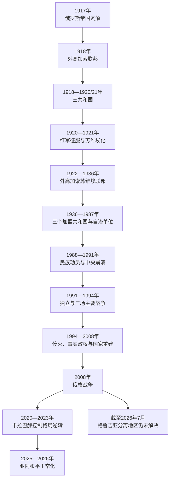

# 南高加索的苏维埃划界、独立与地区冲突

## 时间

1917年至今（当代部分核验截至2026年7月13日）

## 概括

1917年俄罗斯帝国崩溃后，南高加索先出现共同的地方委员会、外高加索议会和短暂联邦，继而于1918年分裂为格鲁吉亚、亚美尼亚和阿塞拜疆三个共和国。三国必须在世界大战、奥斯曼进军、英国短期驻军、白俄与布尔什维克竞争、经济崩溃及互相重叠的领土要求中建国。1920—1921年红军先后控制三国，把它们纳入苏维埃体系。

苏联以民族共和国和自治单位组织多族群空间：亚美尼亚、阿塞拜疆和格鲁吉亚成为联盟共和国，纳戈尔诺—卡拉巴赫自治州置于阿塞拜疆境内，纳希切万成为同阿塞拜疆相连的自治共和国，阿布哈兹和南奥塞梯则置于格鲁吉亚体系。划界既吸收了人口分布、经济交通和战争结果，也服从布尔什维克权力平衡；它不是凭一场秘密决定任意画出，却留下自治边界、共和国边界与居民认同不一致的问题。

苏联后期中央权威衰退后，自治地位争议、民族动员、安全恐惧和历史记忆迅速军事化。1991年前后，纳戈尔诺—卡拉巴赫、南奥塞梯和阿布哈兹战争造成大规模死亡、驱逐和难民；俄罗斯在停火、维和、基地和事实政权生存中持续发挥决定性作用。2008年俄格战争后，俄罗斯承认阿布哈兹与南奥塞梯“独立”，但联合国多数会员国仍承认其为格鲁吉亚领土。

2020年第二次纳戈尔诺—卡拉巴赫战争改变控制线，2023年阿塞拜疆军事行动后重新控制原自治州，几乎全部当地亚美尼亚居民离开。2025年亚美尼亚与阿塞拜疆在华盛顿签署政治宣言并草签和平协定文本，实际边境暴力显著下降；截至2026年7月，正式条约仍未完成签署和批准。格鲁吉亚的阿布哈兹、南奥塞梯问题则未获政治解决，2024年争议选举和欧盟进程停滞又使国内制度方向成为新的区域变量。

## 从帝国瓦解到三共和国

### 1917—1918年的共同机构

二月革命后，第比利斯的外高加索特别委员会代表俄国临时政府；十月革命后，格鲁吉亚孟什维克、亚美尼亚革命联盟和阿塞拜疆穆萨瓦特等党派建立外高加索委员部，拒绝承认布尔什维克中央。1918年2月，外高加索议会成立。

俄国军队从高加索战线解体撤退，奥斯曼要求收回1878年后失地并继续东进。各党对继续战争、同奥斯曼和谈以及是否脱离俄国意见不同。1918年4月成立的外高加索民主联邦共和国缺乏共同军队、财政和统一外交，仅维持约一个月：格鲁吉亚于5月26日退出，亚美尼亚和阿塞拜疆于5月28日分别独立。

### 1918—1920年的国家竞争

| 国家 | 政体与支持 | 主要危机 |
|---|---|---|
| 格鲁吉亚民主共和国 | 孟什维克主导的议会共和国；先获德国、后同英国及协约国联系 | 阿布哈兹与南奥塞梯冲突、同白俄势力和土耳其的边界问题、1918年洛里地区同亚美尼亚短期战争。 |
| 亚美尼亚共和国 | 亚美尼亚革命联盟主导；接收种族灭绝幸存者和高加索战线难民 | 饥荒、疫病、奥斯曼进军，同阿塞拜疆争夺卡拉巴赫、赞格祖尔和纳希切万；1920年再同土耳其民族主义军作战。 |
| 阿塞拜疆民主共和国 | 穆萨瓦特为核心的议会共和国；首都先在占贾，后进入巴库 | 巴库委员会、奥斯曼“伊斯兰军”和英国先后控制巴库；同亚美尼亚争夺边界，需整合多地武装与石油经济。 |

三个共和国都建立议会、政府和外交机构，但没有获得稳定边界。巴黎和会的有限承认未能提供军事保障。奥斯曼、英国、土耳其民族运动、白俄和布尔什维克先后改变力量平衡；战争、难民和互相报复把混居地区变为安全困局。

## 苏维埃化过程

| 时间 | 过程 | 直接结果 |
|---|---|---|
| 1920年4月 | 红军进入阿塞拜疆，巴库政府交权 | 阿塞拜疆苏维埃社会主义共和国建立，布尔什维克获得石油中心和通往伊朗、南高加索的基地。 |
| 1920年9—11月 | 土耳其民族主义军击败亚美尼亚共和国 | 亚美尼亚失去卡尔斯等地，国内政府崩溃。 |
| 1920年11—12月 | 红军进入亚美尼亚，达成政权移交 | 亚美尼亚苏维埃化；1921年2月反布尔什维克起义一度夺回埃里温，4月失败。 |
| 1921年2—3月 | 红军进攻格鲁吉亚 | 第比利斯失守，格鲁吉亚政府流亡；部分地区战斗延续。 |
| 1921年3、10月 | 《莫斯科条约》《卡尔斯条约》 | 苏俄／南高加索苏维埃共和国同土耳其确定边界框架；纳希切万在阿塞拜疆保护下取得自治地位。 |
| 1922年 | 外高加索社会主义联邦苏维埃共和国成立 | 三国合组一个联盟成员，并作为创始单位加入苏联。 |
| 1936年 | 外高加索联邦撤销 | 亚美尼亚、阿塞拜疆和格鲁吉亚各自成为苏联加盟共和国。 |

苏维埃化既依靠红军征服，也利用本地布尔什维克、工人组织、战争疲劳和社会革命诉求。土地国有化、党国机关和秘密警察迅速取代旧议会体制。1921年格鲁吉亚、1921年亚美尼亚及1924年格鲁吉亚等反抗表明新秩序并非普遍自愿接受。

## 自治划界

| 单位 | 苏联安排 | 形成背景 | 独立后的地位 |
|---|---|---|---|
| 纳戈尔诺—卡拉巴赫自治州 | 1923年设于阿塞拜疆苏维埃社会主义共和国境内，居民以亚美尼亚人为主 | 亚美尼亚与阿塞拜疆均提出主张；布尔什维克同时考虑交通、区域权力和对两共和国关系的控制 | 1991—2023年形成亚美尼亚人事实政权；国际上普遍承认为阿塞拜疆领土。2023年后由阿塞拜疆控制，原亚美尼亚居民几乎全部离开。 |
| 纳希切万自治共和国 | 1921年条约框架下由阿塞拜疆保护，1924年成为自治共和国 | 土耳其、苏俄、亚美尼亚和阿塞拜疆战争及人口分布共同决定 | 阿塞拜疆的飞地自治共和国，同本土被亚美尼亚隔开。 |
| 阿布哈兹 | 1921年一度为阿布哈兹苏维埃社会主义共和国，以条约关系同格鲁吉亚相连；1931年改为格鲁吉亚境内自治共和国 | 阿布哈兹、格鲁吉亚及俄国政治传统交叠，早期布尔什维克体制多次调整 | 1992—1993年战争后形成事实政权；俄罗斯和少数国家承认，多数国家仍视为格鲁吉亚领土。 |
| 南奥塞梯自治州 | 1922年设于格鲁吉亚苏维埃社会主义共和国境内 | 1918—1920年冲突、奥塞梯人口聚居和布尔什维克胜利 | 1991—1992年战争后形成事实政权；2008年后获俄罗斯和少数国家承认，多数国家仍视为格鲁吉亚领土。 |
| 阿扎尔自治共和国 | 1921年在格鲁吉亚境内建立，居民主要为格鲁吉亚语群体且有较多穆斯林 | 《卡尔斯条约》把宗教自治与格鲁吉亚主权结合 | 仍是格鲁吉亚自治共和国；2004年中央恢复完整控制，未形成持续分离政权。 |

这些单位的法律层级不同，不能统称为“苏联随意制造的飞地”。边界形成经过党内决定、地方力量、战争和国际条约；但党国体制压制公开争论，也允许加盟共和国与自治单位在资源、语言和干部任命上形成不对等。苏联解体时，加盟共和国依据宪法和国际承认成为独立国家，自治单位则没有自动获得同等外部承认，这一层级差异成为战争核心。

## 苏联时期的国家与社会

### 党国、工业化与镇压

1920年代有限文化本土化培养亚美尼亚语、格鲁吉亚语和阿塞拜疆语干部与学校，同时所有政治权力归共产党。农业集体化、反宗教运动和快速工业化在1930年代推进。斯大林大清洗处决或流放党政干部、知识分子、神职人员和普通居民，民族共和国也无法免于中央恐怖。

第二次世界大战中，数十万南高加索居民进入红军，巴库石油成为苏联战争经济关键。战后工业、城市化、教育和科学机构扩张，埃里温、第比利斯、巴库成为共和国中心。计划经济改善识字率、基础设施与社会流动，也造成环境破坏、住房短缺和对莫斯科资源分配的依赖。

### 民族制度的双重作用

苏联既压制独立民族政治，也通过共和国领土、官方语言、科学院、历史叙事和干部体系把民族制度固定下来。1965年埃里温大规模纪念亚美尼亚种族灭绝，促使官方纪念碑建立；1978年格鲁吉亚民众抗议宪法语言条款并保住格鲁吉亚语地位。阿塞拜疆的石油工业、共和国干部网络与突厥语文化亦在苏联框架内发展。

人口移动改变地方结构。纳戈尔诺—卡拉巴赫仍以亚美尼亚人为主，纳希切万的亚美尼亚人口持续减少；阿布哈兹境内格鲁吉亚人口增长，阿布哈兹人担忧语言和政治地位；南奥塞梯同北奥塞梯的文化联系受联盟边界切分。中央强制维持秩序时，矛盾被制度化但未解决。

## 苏联解体与战争

### 纳戈尔诺—卡拉巴赫冲突

| 阶段 | 过程 | 结果 |
|---|---|---|
| 1988—1991年 | 自治州亚美尼亚人要求转隶亚美尼亚；苏联和共和国机关拒绝。苏姆盖特、巴库等地发生针对亚美尼亚人的暴力，亚美尼亚境内阿塞拜疆人也遭驱逐和袭击 | 双方人口大规模离开混居地区，警察和民兵冲突升级。 |
| 1991—1994年 | 苏联解体后全面战争；当地亚美尼亚武装在亚美尼亚支持下控制原自治州及周边七个阿塞拜疆区的大部 | 1994年停火后形成未获承认的亚美尼亚人事实政权；数十万阿塞拜疆人和亚美尼亚人成为难民或境内流离失所者。 |
| 1994—2016年 | 欧安组织明斯克小组调停，控制线高度军事化 | 未能就地位、周边区归还、安全与返乡形成协议；2016年爆发“四日战争”。 |
| 2020年 | 阿塞拜疆依靠军队现代化、土耳其支持和无人机优势发动战争 | 收复周边区及舒沙等地；俄方斡旋停火，俄罗斯维和部队进驻连接亚美尼亚与卡拉巴赫的通道。 |
| 2021—2023年 | 边境另有交火；拉钦走廊通行受阻，地区出现物资危机 | 停火机制和俄方威慑削弱。 |
| 2023年9月 | 阿塞拜疆发动约一天军事行动，事实政权接受解除武装 | 阿塞拜疆恢复对原自治州的实际控制，十万左右亚美尼亚居民在短期内离开；事实机构宣布停止运作。 |
| 2024—2026年 | 双方推进边界划定、村庄移交、交通和和平文本谈判 | 2025年8月草签和平协定并签署华盛顿宣言；截至2026年7月正式条约尚未签署批准，难民、在押人员、文化遗产、返乡和交通安排仍具争议。 |

对这场冲突必须同时写明两个层面：纳戈尔诺—卡拉巴赫在国际法与各国正式承认中属于阿塞拜疆；当地亚美尼亚人长期提出安全、自决和历史家园诉求。承认领土归属不能抹去居民权利和强迫流离失所问题，讨论居民遭遇也不能把周边七区长期占领排除在外。

### 南奥塞梯与阿布哈兹

1989—1990年民族动员和格鲁吉亚中央取消自治的行动使南奥塞梯争端武装化。1991—1992年战争后，俄罗斯斡旋停火并部署混合维和力量，地区同第比利斯实际分离。格鲁吉亚内部同时经历总统兹维亚德·加姆萨胡尔季阿被推翻和内战。

阿布哈兹的自治地位、人口权力和格鲁吉亚国家建构争议于1992年升级。格鲁吉亚军队进入后，同阿布哈兹武装、北高加索志愿者及俄方力量交战；1993年格军失败，绝大多数当地格鲁吉亚居民遭驱逐。1994年停火后，独联体维和与联合国观察机制维持脆弱分界。

2003年“玫瑰革命”后，米哈伊尔·萨卡什维利政府重建中央机构并加快北约、欧盟方向，同时试图改变分离地区现状。2008年8月，格鲁吉亚攻击茨欣瓦利，俄军大规模介入并进入格鲁吉亚其他地区；关于战前挑衅、责任链和战争开始的叙述存在政治争议，但格军发动对茨欣瓦利的大规模炮击、俄方随后越出南奥塞梯实施广泛军事行动均是理解升级不可缺的环节。

欧盟斡旋六点停火后，俄罗斯承认阿布哈兹和南奥塞梯独立并长期驻军。格鲁吉亚及多数国家称两地为被俄罗斯占领的格鲁吉亚领土；事实当局和俄罗斯则主张其为独立国家。到2026年，边界设施、拘留、通行、教育、财产权和约30万登记流离失所者问题持续。日内瓦国际讨论仍是主要多方机制，但未就不使用武力、国际安全安排和返乡取得最终协议。

## 三国独立后的政治与发展

### 亚美尼亚

独立初期由列翁·捷尔-彼得罗相领导，在战争、封锁和能源危机中建立国家。1998年他因卡拉巴赫和解路线争议辞职，罗伯特·科恰良与谢尔日·萨尔基相时期形成强总统制、寡头经济和与俄罗斯的安全依赖。2008年争议选举后的示威遭武力驱散。

2018年反对长期执政集团的“天鹅绒革命”使尼科尔·帕希尼扬出任总理，议会制和竞争性选举得到新动力。2020年战败与2023年卡拉巴赫亚美尼亚人外流引发严重政治危机，也促使政府减少对俄罗斯单一安全依赖，深化欧盟和美国关系并推进对阿塞拜疆、土耳其正常化。2026年6月议会选举中，“公民契约”获约49.7%选票并取得可独立组阁的多数，帕希尼扬路线获得续任授权。

### 阿塞拜疆

独立初期战争、军事失败和政变频仍。盖达尔·阿利耶夫1993年掌权后稳定总统制，以1994年“世纪合同”吸引外资开发里海石油，并在停火后重建国家军队。伊利哈姆·阿利耶夫2003年继任，能源收入支持基础设施、军费和外交影响，也形成高度集中的行政、媒体和选举环境。

巴库—第比利斯—杰伊汉管线和南方天然气走廊降低对俄罗斯线路依赖。2020年战争与2023年行动使阿塞拜疆恢复国际承认领土的实际控制，国内政权合法性显著增强；战后重建、排雷和原流离失所者回迁推进。与此同时，亚美尼亚居民安全返乡、文化遗产、边境划定、政治竞争和公民自由仍是外部与国内争议。

### 格鲁吉亚

爱德华·谢瓦尔德纳泽在内战后重建部分国家机构，但腐败、停电和选举问题削弱政府。2003年玫瑰革命后，萨卡什维利政府改革警察、税收和公共服务，也被批评权力集中、监狱滥权和压制反对派。2008年战争成为安全与领土重大转折。

2012年“格鲁吉亚梦想”联盟通过选举上台，完成首次和平政党轮替。格鲁吉亚同欧盟签署联系国协议并于2023年获候选国地位，但2024年“外国影响透明法”、争议议会选举及政府宣布暂缓推动入盟谈判至2028年，引发持续抗议。到2026年，反对派、媒体和公民社会受到的法律限制继续扩大，欧盟进程实际停滞；执政党称这些措施维护主权、反对外部干涉，欧洲机构和国内反对者则视为民主倒退。领土问题仍由日内瓦讨论和欧盟观察团维持危机管理，而非政治解决。

## 2025—2026年的和平与外交重组

2025年3月，亚美尼亚与阿塞拜疆宣布和平协定文本谈判完成。8月8日，两国领导人在华盛顿签署联合宣言，外长草签《建立和平与国家间关系协定》；文本确认苏联加盟共和国边界转为国际边界、相互无领土要求、不使用武力、建立外交关系和继续划界。双方还共同请求终止欧安组织明斯克进程，并提出在亚美尼亚主权、管辖范围内连接阿塞拜疆本土与纳希切万的交通项目。

草签不等于生效。阿塞拜疆要求亚美尼亚处理其宪法序言所援引文件中的领土主张问题，亚美尼亚则强调已通过相互承认边界消除主张并准备签署。到2026年5—7月，双方已有货运、贸易和接触的有限改善，边境一年多未出现射击死亡；但正式签署、批准、完整划界、通道运营、安全保证和社会和解仍待完成。

亚美尼亚同欧盟关系在2026年首次亚美尼亚—欧盟峰会后深化，同时继续维持同俄罗斯的经济和安全联系；阿塞拜疆依靠能源、土耳其联盟和跨里海交通扩大自主。格鲁吉亚原本是东西向运输和欧盟联系核心，但国内政治危机使其欧洲方向受阻。三国由共同后苏联安全体系走向差异化外交，并不意味着俄罗斯、土耳其和伊朗影响消失。

## 当代区域矩阵

| 主体 | 截至2026年7月的制度与实际控制 | 主要未决问题 |
|---|---|---|
| 亚美尼亚 | 议会共和国；帕希尼扬领导的“公民契约”在2026年选举后继续组阁 | 对阿塞拜疆正式签约、边界划定、交通开放、难民安置、对俄安全关系和对欧接近。 |
| 阿塞拜疆 | 强总统制；伊利哈姆·阿利耶夫在任，中央控制包括原纳戈尔诺—卡拉巴赫自治州在内的国际承认领土 | 和平条约批准、排雷与重建、亚美尼亚居民权利和返乡、边界与交通安排。 |
| 格鲁吉亚 | 议会制，格鲁吉亚梦想控制政府与议会；2024年后选举合法性和民主制度受持续争议 | 阿布哈兹、南奥塞梯、流离失所者、对俄关系、欧盟进程和国内政治权利。 |
| 阿布哈兹事实政权 | 控制原自治共和国大部，依赖俄罗斯安全、财政和边境支持 | 国际承认极有限；格鲁吉亚居民返乡、财产权、人口流失及与俄整合程度。 |
| 南奥塞梯事实政权 | 控制原自治州大部，俄军驻扎，与俄罗斯北奥塞梯联系紧密 | 国际承认极有限；边界化、通行、拘留和是否进一步并入俄罗斯的争论。 |
| 纳希切万自治共和国 | 阿塞拜疆组成部分，与本土隔着亚美尼亚 | 对外交通、亚美尼亚境内线路的主权和管理方式。 |

## 重要事件

| 时间 | 事件 | 结果与长期影响 |
|---|---|---|
| 1917年 | 俄国革命与高加索战线解体 | 帝国行政、军队和财政崩溃。 |
| 1918年4—5月 | 外高加索联邦成立后迅速解体 | 亚美尼亚、阿塞拜疆和格鲁吉亚分别建国。 |
| 1920—1921年 | 红军先后控制三国 | 短暂共和国结束，苏维埃制度建立。 |
| 1921年 | 《莫斯科》《卡尔斯》条约 | 土耳其—南高加索边界和纳希切万安排定型。 |
| 1922—1936年 | 外高加索联邦共和国 | 三国先合组加入苏联，后改为三个加盟共和国。 |
| 1922—1923年 | 南奥塞梯与纳戈尔诺—卡拉巴赫自治单位设立 | 自治和共和国层级差异被制度化。 |
| 1931年 | 阿布哈兹改为格鲁吉亚境内自治共和国 | 后来成为阿布哈兹民族政治的重要历史争议。 |
| 1930年代 | 集体化与大清洗 | 党国控制巩固，社会和精英遭大规模镇压。 |
| 1988年 | 卡拉巴赫运动与苏姆盖特暴力 | 苏联后期民族冲突开始军事化。 |
| 1989年4月 | 苏军驱散第比利斯示威 | 格鲁吉亚独立运动扩大。 |
| 1990年1月 | 苏军进入巴库“黑色一月” | 阿塞拜疆反苏情绪和独立诉求上升。 |
| 1991年 | 三国恢复独立 | 苏联行政边界转为国际边界。 |
| 1991—1994年 | 卡拉巴赫、南奥塞梯、阿布哈兹战争 | 形成事实政权和大规模人口迁移。 |
| 2003年 | 格鲁吉亚玫瑰革命 | 国家改革与亲欧大西洋路线加速。 |
| 2008年 | 俄格战争 | 俄罗斯承认阿布哈兹、南奥塞梯并长期驻军。 |
| 2018年 | 亚美尼亚天鹅绒革命 | 旧执政集团退出，议会民主和外交争论进入新阶段。 |
| 2020年 | 第二次卡拉巴赫战争 | 阿塞拜疆收复大部分失地，俄军维和机制建立。 |
| 2023年9月 | 阿塞拜疆控制原自治州 | 当地亚美尼亚人几乎全部离开，事实政权结束。 |
| 2024年 | 格鲁吉亚争议选举与欧盟进程停滞 | 国内长期抗议和制度危机形成。 |
| 2025年8月 | 亚美尼亚—阿塞拜疆华盛顿宣言与和平文本草签 | 数十年冲突转入正式正常化阶段，但条约尚未生效。 |
| 2026年6月 | 亚美尼亚议会选举 | 公民契约继续执政，和平与外交多元化路线获得新授权。 |
| 2026年7月 | 第67轮日内瓦国际讨论前后 | 阿布哈兹、南奥塞梯安全与人道问题仍无最终解决。 |

## 冲突形成与延续机制

### 结构因素

- 苏联把民族领土、自治层级和人口混居同时制度化，却没有提供中央崩溃后可被各方接受的地位变更程序。
- 山地走廊、飞地和交通线使局部边界具有全国安全意义。
- 帝国、种族灭绝、驱逐和战争记忆为各方提供互相排斥的历史正当性。
- 弱国家、武装民兵和安全机关碎片化使政治争议在1988—1993年迅速转成战争。
- 石油收入、军队改革和外部武器改变相对力量，使长期停火并不等于稳定和平。

### 外部压力

- 俄罗斯兼具前帝国中心、调停者、维和者、驻军国和冲突参与方等多重角色。
- 土耳其支持阿塞拜疆并同格鲁吉亚发展能源交通，同时与亚美尼亚边界长期关闭；正常化受亚阿关系牵动。
- 伊朗反对国际边界变化，重视亚美尼亚通道，也同阿塞拜疆在宗教、安全和以色列关系上存在竞争。
- 欧盟、美国和欧安组织提供调停、观察、援助与制度吸引，却没有统一安全保证。
- 2008年后俄西关系恶化、2022年俄乌战争及俄罗斯资源转移改变了各方判断。

### 直接触发

1988年自治州转隶诉求及族群暴力、1990年前后取消自治和独立宣言、2008年茨欣瓦利炮击与俄军介入、2020年大规模进攻、2023年拉钦通道危机和阿塞拜疆军事行动，都是把结构矛盾推向新阶段的直接触发点。任何单一事件都不足以解释冲突全史，但必须明确其发动顺序与实际后果。

## 关键辨析

- **行政划界不等于国际任意赠与**：苏联边界包含党内决策和权力计算，也受既有人口、交通、战争和国际条约影响。
- **自治单位不等于加盟共和国**：1991年后，两者在独立程序和国际承认上的法律位置不同。
- **实际控制不等于国际承认**：2023年前的卡拉巴赫、今天的阿布哈兹和南奥塞梯都必须分别说明控制者与被承认主权国。
- **领土完整与居民权利不是二选一**：国际边界、自治、安全、返乡、财产和文化遗产是不同问题。
- **俄罗斯角色并非单一“中立维和”或单一“制造冲突”**：其政策随时期变化，同时包含调停、驻军、承认事实政权和维护地区影响。
- **和平文本不等于全面和解**：亚美尼亚与阿塞拜疆2025年草签文本是重大转折，但批准、边界、交通和社会记忆仍需长期处理。

## 演变关系

- 前一阶段：[伊朗、奥斯曼与俄罗斯帝国竞争](/%E4%BA%BA%E6%96%87%E7%A7%91%E5%AD%A6/%E5%8E%86%E5%8F%B2/%E8%A5%BF%E4%BA%9A/%E5%8D%97%E9%AB%98%E5%8A%A0%E7%B4%A2/%E4%BC%8A%E6%9C%97%E3%80%81%E5%A5%A5%E6%96%AF%E6%9B%BC%E4%B8%8E%E4%BF%84%E7%BD%97%E6%96%AF%E5%B8%9D%E5%9B%BD%E7%AB%9E%E4%BA%89.md)。
- 分国现代史：[俄国、苏联与独立亚美尼亚](/%E4%BA%BA%E6%96%87%E7%A7%91%E5%AD%A6/%E5%8E%86%E5%8F%B2/%E8%A5%BF%E4%BA%9A/%E5%8D%97%E9%AB%98%E5%8A%A0%E7%B4%A2/%E4%BA%9A%E7%BE%8E%E5%B0%BC%E4%BA%9A/%E4%BF%84%E5%9B%BD%E3%80%81%E8%8B%8F%E8%81%94%E4%B8%8E%E7%8B%AC%E7%AB%8B%E4%BA%9A%E7%BE%8E%E5%B0%BC%E4%BA%9A.md)、[短暂共和国、苏联与独立阿塞拜疆](/%E4%BA%BA%E6%96%87%E7%A7%91%E5%AD%A6/%E5%8E%86%E5%8F%B2/%E8%A5%BF%E4%BA%9A/%E5%8D%97%E9%AB%98%E5%8A%A0%E7%B4%A2/%E9%98%BF%E5%A1%9E%E6%8B%9C%E7%96%86/%E7%9F%AD%E6%9A%82%E5%85%B1%E5%92%8C%E5%9B%BD%E3%80%81%E8%8B%8F%E8%81%94%E4%B8%8E%E7%8B%AC%E7%AB%8B%E9%98%BF%E5%A1%9E%E6%8B%9C%E7%96%86.md)、[俄国、苏联与独立格鲁吉亚](/%E4%BA%BA%E6%96%87%E7%A7%91%E5%AD%A6/%E5%8E%86%E5%8F%B2/%E8%A5%BF%E4%BA%9A/%E5%8D%97%E9%AB%98%E5%8A%A0%E7%B4%A2/%E6%A0%BC%E9%B2%81%E5%90%89%E4%BA%9A/%E4%BF%84%E5%9B%BD%E3%80%81%E8%8B%8F%E8%81%94%E4%B8%8E%E7%8B%AC%E7%AB%8B%E6%A0%BC%E9%B2%81%E5%90%89%E4%BA%9A.md)。
- 上级入口：[南高加索](/%E4%BA%BA%E6%96%87%E7%A7%91%E5%AD%A6/%E5%8E%86%E5%8F%B2/%E8%A5%BF%E4%BA%9A/%E5%8D%97%E9%AB%98%E5%8A%A0%E7%B4%A2/README.md)。
