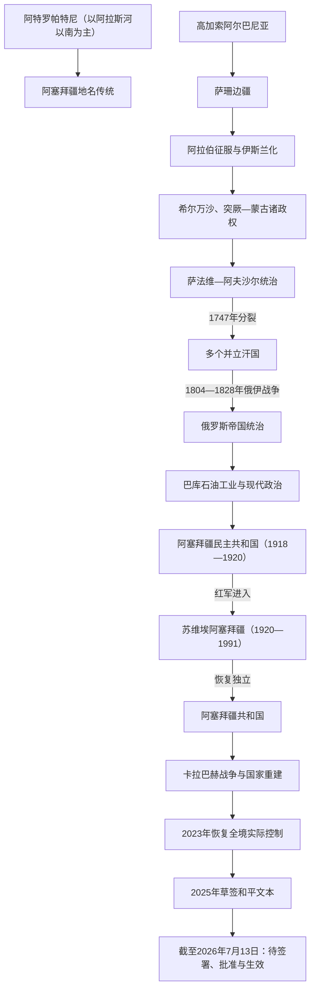

# 阿塞拜疆

## 历史主线

阿塞拜疆历史连接东高加索、里海、西北伊朗、草原和安纳托利亚。古代的高加索阿尔巴尼亚与阿特罗帕特尼属于不同地理—政治传统；萨珊、哈里发、希尔万沙、突厥—蒙古王朝与萨法维统治逐步塑造宗教、语言和城市网络。1747年后多个汗国并立，19世纪俄国征服和巴库石油工业重组社会。1918年共和国、1920年苏维埃化和1991年恢复独立构成现代国家主线；卡拉巴赫冲突则长期影响国家建设、人口与外交。

## 演变图

## 按时间排序的时期导航

| 顺序 | 阶段 | 时间 | 入口 | 简要概括 |
|---:|---|---|---|---|
| 1 | 高加索阿尔巴尼亚与伊朗—伊斯兰统治 | 约前4世纪—1747年 | [高加索阿尔巴尼亚与伊朗—伊斯兰统治](/%E4%BA%BA%E6%96%87%E7%A7%91%E5%AD%A6/%E5%8E%86%E5%8F%B2/%E8%A5%BF%E4%BA%9A/%E5%8D%97%E9%AB%98%E5%8A%A0%E7%B4%A2/%E9%98%BF%E5%A1%9E%E6%8B%9C%E7%96%86/%E9%AB%98%E5%8A%A0%E7%B4%A2%E9%98%BF%E5%B0%94%E5%B7%B4%E5%B0%BC%E4%BA%9A%E4%B8%8E%E4%BC%8A%E6%9C%97%E2%80%94%E4%BC%8A%E6%96%AF%E5%85%B0%E7%BB%9F%E6%B2%BB.md) | 古代王国、基督教化、萨珊与哈里发边疆、希尔万沙、突厥语传播和萨法维整合。 |
| 2 | 汗国、俄国征服与石油城市 | 1747—1917年 | [汗国、俄国征服与石油城市](/%E4%BA%BA%E6%96%87%E7%A7%91%E5%AD%A6/%E5%8E%86%E5%8F%B2/%E8%A5%BF%E4%BA%9A/%E5%8D%97%E9%AB%98%E5%8A%A0%E7%B4%A2/%E9%98%BF%E5%A1%9E%E6%8B%9C%E7%96%86/%E6%B1%97%E5%9B%BD%E3%80%81%E4%BF%84%E5%9B%BD%E5%BE%81%E6%9C%8D%E4%B8%8E%E7%9F%B3%E6%B2%B9%E5%9F%8E%E5%B8%82.md) | 并立汗国在俄伊竞争中被逐一吞并，巴库石油、铁路、工人运动和新式文化推动现代转型。 |
| 3 | 共和国、苏联与独立国家 | 1918年至今 | [短暂共和国、苏联与独立阿塞拜疆](/%E4%BA%BA%E6%96%87%E7%A7%91%E5%AD%A6/%E5%8E%86%E5%8F%B2/%E8%A5%BF%E4%BA%9A/%E5%8D%97%E9%AB%98%E5%8A%A0%E7%B4%A2/%E9%98%BF%E5%A1%9E%E6%8B%9C%E7%96%86/%E7%9F%AD%E6%9A%82%E5%85%B1%E5%92%8C%E5%9B%BD%E3%80%81%E8%8B%8F%E8%81%94%E4%B8%8E%E7%8B%AC%E7%AB%8B%E9%98%BF%E5%A1%9E%E6%8B%9C%E7%96%86.md) | 1918年议会共和国、苏维埃工业化与划界、1991年独立、油气国家建设及卡拉巴赫战争。 |

## 统治者与领导结构专表

| 专表 | 覆盖范围 | 用途 |
|---|---|---|
| [阿塞拜疆主要汗国统治者表](/%E4%BA%BA%E6%96%87%E7%A7%91%E5%AD%A6/%E5%8E%86%E5%8F%B2/%E8%A5%BF%E4%BA%9A/%E5%8D%97%E9%AB%98%E5%8A%A0%E7%B4%A2/%E9%98%BF%E5%A1%9E%E6%8B%9C%E7%96%86/%E9%98%BF%E5%A1%9E%E6%8B%9C%E7%96%86%E4%B8%BB%E8%A6%81%E6%B1%97%E5%9B%BD%E7%BB%9F%E6%B2%BB%E8%80%85%E8%A1%A8.md) | 巴库、古巴、希尔万、舍基、甘贾、卡拉巴赫、纳希切万、塔雷什 | 分别列出并立汗国的完整统治次序、复位、共治、外来占领及废除过程。 |
| [共和国、苏联与独立国家](/%E4%BA%BA%E6%96%87%E7%A7%91%E5%AD%A6/%E5%8E%86%E5%8F%B2/%E8%A5%BF%E4%BA%9A/%E5%8D%97%E9%AB%98%E5%8A%A0%E7%B4%A2/%E9%98%BF%E5%A1%9E%E6%8B%9C%E7%96%86/%E7%9F%AD%E6%9A%82%E5%85%B1%E5%92%8C%E5%9B%BD%E3%80%81%E8%8B%8F%E8%81%94%E4%B8%8E%E7%8B%AC%E7%AB%8B%E9%98%BF%E5%A1%9E%E6%8B%9C%E7%96%86.md) | 1918年国家元首与总理、苏维埃实际最高领导人、独立后总统与总理 | 共和国体制不套用王朝表，分别呈现正式职位与实际权力结构。 |

## 重要转折与时间节点

| 时间 | 转折 | 意义 |
|---|---|---|
| 前4世纪末 | 阿特罗帕特尼与高加索阿尔巴尼亚形成 | 奠定南北两种古代地理—政治背景；二者均不能直接等同现代国家。 |
| 4—5世纪 | 高加索阿尔巴尼亚基督教化 | 教会和本地文字传统形成，山区基督教社群长期延续。 |
| 7世纪 | 阿拉伯征服 | 城市与平原逐步伊斯兰化，阿兰进入哈里发行政和贸易网络。 |
| 9世纪以后 | 希尔万沙等地方王朝兴起 | 哈里发直辖减弱，沙马基—巴库城市与波斯语宫廷文化发展。 |
| 11世纪以后 | 乌古斯迁徙和突厥王朝统治 | 突厥语经数百年逐步普及，与伊朗语和高加索语传统交织。 |
| 1501—1538年 | 萨法维建立并吞并希尔万沙 | 区域纳入什叶派伊朗帝国，地方王朝终结。 |
| 1747年 | 纳迪尔沙遇刺 | 阿夫沙尔军政体系崩溃，多个汗国取得实际自主。 |
| 1804—1828年 | 两次俄伊战争 | 俄罗斯控制阿拉斯河以北；汗国被逐个废除，现代俄伊边界基本形成。 |
| 1872年以后 | 巴库石油工业化 | 跨国资本、铁路、工人阶级和多族群都市迅速发展。 |
| 1918年5月28日 | 阿塞拜疆民主共和国成立 | 建立多党议会、责任内阁与包括女性在内的普选权。 |
| 1920年4月 | 红军进入巴库 | 第一共和国终结，苏维埃体制建立。 |
| 1923—1924年 | 卡拉巴赫自治州、纳希切万自治共和国形成 | 苏联民族区域划界为后来边界与自治争议提供制度框架。 |
| 1988—1994年 | 第一次卡拉巴赫战争 | 苏联解体、族群暴力、人口相互逃离与领土控制变化叠加。 |
| 1991年 | 恢复独立 | 现代主权共和国建立。 |
| 1993—1994年 | 盖达尔·阿利耶夫上台、停火与石油合同 | 强总统制、能源战略和国家重建模式成形。 |
| 2020年 | 第二次卡拉巴赫战争 | 阿塞拜疆收复周边地区及原自治州部分地区，俄维和部队进驻。 |
| 2023年9月 | 阿塞拜疆恢复卡拉巴赫全境实际控制 | 当地事实政权解体，绝大多数亚美尼亚居民外流。 |
| 2025年8月8日 | 两国外长草签17条和平协定文本 | 形成建交、互认边界与不使用武力的法律框架；领导人另签华盛顿联合声明。 |
| 2026年7月13日 | 当代核验截止 | 和平协定尚未正式签署、批准或生效，实际缓和与法律未决并存。 |

## 阅读提示

- “阿塞拜疆”既是历史地名，也是1918年以来的国家名。古代阿特罗帕特尼主要位于阿拉斯河以南，高加索阿尔巴尼亚主要位于东高加索，不能以现代边界倒推古代民族国家。
- 18世纪各汗国彼此并立，常承认伊朗名义宗主权；古巴或卡拉巴赫的短期霸权不等于统一阿塞拜疆王朝。
- 俄国“保护条约”、军事占领、俄伊条约确认和废除汗位是不同步骤，需要分别判断名义主权与实际控制。
- 卡拉巴赫叙事应区分苏联法定边界、自治安排、事实政权、战场控制、国际承认和人口变化，并同时记录亚美尼亚人与阿塞拜疆人的伤亡、驱逐与难民经验。
- 2025年完成的是文本草签；正式签署、国内批准、批准书交换和条约生效是后续不同法律阶段。

## 上级与区域关联

- 直接上级：[南高加索](/%E4%BA%BA%E6%96%87%E7%A7%91%E5%AD%A6/%E5%8E%86%E5%8F%B2/%E8%A5%BF%E4%BA%9A/%E5%8D%97%E9%AB%98%E5%8A%A0%E7%B4%A2/README.md)
- 帝国竞争：[伊朗、奥斯曼与俄罗斯帝国竞争](/%E4%BA%BA%E6%96%87%E7%A7%91%E5%AD%A6/%E5%8E%86%E5%8F%B2/%E8%A5%BF%E4%BA%9A/%E5%8D%97%E9%AB%98%E5%8A%A0%E7%B4%A2/%E4%BC%8A%E6%9C%97%E3%80%81%E5%A5%A5%E6%96%AF%E6%9B%BC%E4%B8%8E%E4%BF%84%E7%BD%97%E6%96%AF%E5%B8%9D%E5%9B%BD%E7%AB%9E%E4%BA%89.md)
- 苏维埃与冲突：[苏维埃划界、独立与地区冲突](/%E4%BA%BA%E6%96%87%E7%A7%91%E5%AD%A6/%E5%8E%86%E5%8F%B2/%E8%A5%BF%E4%BA%9A/%E5%8D%97%E9%AB%98%E5%8A%A0%E7%B4%A2/%E8%8B%8F%E7%BB%B4%E5%9F%83%E5%88%92%E7%95%8C%E3%80%81%E7%8B%AC%E7%AB%8B%E4%B8%8E%E5%9C%B0%E5%8C%BA%E5%86%B2%E7%AA%81.md)
- 宏观区域：[西亚](/%E4%BA%BA%E6%96%87%E7%A7%91%E5%AD%A6/%E5%8E%86%E5%8F%B2/%E8%A5%BF%E4%BA%9A/README.md)
- 历史总览：[历史](/%E4%BA%BA%E6%96%87%E7%A7%91%E5%AD%A6/%E5%8E%86%E5%8F%B2/README.md)
