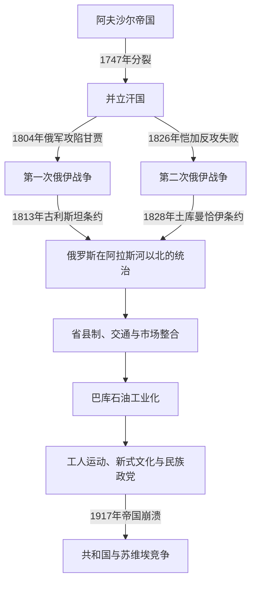

# 阿塞拜疆汗国、俄国征服与石油城市

## 时间

1747—1917年

## 概括

纳迪尔沙1747年遇刺后，东高加索不是出现一个统一王朝，而是形成巴库、古巴、希尔万、舍基、甘贾、卡拉巴赫、纳希切万、塔雷什等并立汗国。它们沿用伊朗政治文化，在恺加伊朗、格鲁吉亚、达吉斯坦势力和俄罗斯帝国之间结盟、纳贡与交战。1804—1828年两次俄伊战争把阿拉斯河以北大部纳入俄罗斯，俄方随后废除汗国。19世纪后期，巴库石油工业、铁路和跨帝国资本使边疆城市转为全球工业中心，也催生工人运动、新式教育和现代阿塞拜疆民族政治。

## 汗国的建立背景

纳迪尔沙以征兵、高税和调动部落维持横跨伊朗、印度边缘与高加索的军政体系。他死后，国库、军队与王位同时失去稳定中心。原省级总督、部落首领、城市显贵和地方军事家掌握堡垒与税源，便以“汗”自立或取得实际自治。各汗仍使用波斯语文书、伊朗式官号与钱币，许多统治者承认赞德或恺加沙阿的名义宗主权；“半自主伊朗边疆政权”比“现代意义上的独立民族国家”更准确。

## 并立汗国与区域霸权

| 政权 | 中心 | 崛起基础 | 鼎盛与限制 | 终结 |
|---|---|---|---|---|
| 舍基汗国 | 舍基／努哈 | 哈吉·切莱比反抗纳迪尔官员，依托山麓农业和堡垒 | 1752年击败格鲁吉亚军，一度影响希尔万；继承争斗削弱王族 | 1805年受俄保护，1806年改立亲俄王族，1819年废除 |
| 古巴汗国 | 古巴 | 凯塔格系世袭地方官、里海北路和多族群税源 | 法塔利汗控制杰尔宾特、萨利扬，并支配巴库、希尔万；其死后联盟迅速解体 | 1806年俄军占领 |
| 卡拉巴赫汗国 | 舒沙 | 贾万希尔部武装、平原牧地与舒沙堡垒 | 帕纳赫、易卜拉欣·哈利勒同山地亚美尼亚梅利克时战时盟，扩展至周边 | 1805年受俄保护，1822年废除 |
| 甘贾汗国 | 甘贾 | 齐亚多格鲁恺加尔家族、农业城市与商路 | 在格鲁吉亚与卡拉巴赫间纳贡求存；贾瓦德汗转向恺加 | 1804年俄军强攻，贾瓦德汗战死，汗国立即废除 |
| 希尔万汗国 | 沙马基／阿克苏 | 丝绸区、城市显贵和地方王族 | 受古巴、舍基反复瓜分，共治与复位频繁 | 1805—1806年受俄保护，1820年废除 |
| 巴库汗国 | 巴库 | 港口、盐场、天然油井与阿布歇隆村社 | 常受古巴支配，后在俄伊间周旋 | 1806年俄军占领 |
| 纳希切万汗国 | 纳希切万 | 康加尔部骑兵和阿拉斯河交通 | 在卡拉巴赫、霍伊、埃里温与恺加任命间反复废立 | 1827年俄军占领，1828年条约确认并入 |
| 塔雷什汗国 | 连科兰 | 里海南岸通道、稻作与地方赛义德家族 | 借俄国抵御恺加，北南边界在战争中改变 | 北部1826年前后被俄废除，1828年边界最终确认 |

完整统治次序见[阿塞拜疆主要汗国统治者表](/%E4%BA%BA%E6%96%87%E7%A7%91%E5%AD%A6/%E5%8E%86%E5%8F%B2/%E8%A5%BF%E4%BA%9A/%E5%8D%97%E9%AB%98%E5%8A%A0%E7%B4%A2/%E9%98%BF%E5%A1%9E%E6%8B%9C%E7%96%86/%E9%98%BF%E5%A1%9E%E6%8B%9C%E7%96%86%E4%B8%BB%E8%A6%81%E6%B1%97%E5%9B%BD%E7%BB%9F%E6%B2%BB%E8%80%85%E8%A1%A8.md)。

## 汗国统治结构

| 层级 | 角色 | 权力与限制 |
|---|---|---|
| 汗 | 军事统帅、最高裁判者和土地授予者 | 权力依赖家族、部落骑兵、堡垒和外部承认；继承通常不具固定长子制 |
| 迪万与宫廷官员 | 维齐尔、书记、财务与外交人员 | 处理波斯语文书、税收、条约和土地账目 |
| 马哈尔地方长官 | 纳伊卜、贝格、苏丹或世袭首领 | 征税、征兵、调解乡村事务；山地和边缘区自主性较高 |
| 宗教与社群领袖 | 穆斯林法官、乌理玛、亚美尼亚梅利克与教会等 | 管理宗教法、慈善、社区财产；卡拉巴赫山地梅利克拥有堡垒和武装 |
| 农牧民与城市居民 | 农民、游牧部落、手工业者和商人 | 承担地租、实物税、劳役与军需；不同法权和身份随地区而异 |

汗国的“鼎盛”多依赖强势统治者个人：哈吉·切莱比、古巴法塔利汗、卡拉巴赫易卜拉欣·哈利勒汗通过婚姻、人质、纳贡、驻军和短期联盟扩大影响。统治者去世或战败后，附属地常立即脱离，说明这些霸权不是稳定中央集权国家。

## 恺加恢复与俄罗斯南下

### 俄国战略的形成

18世纪俄国曾两度短暂占领里海沿岸，但直到吞并东格鲁吉亚后才具备持续推进条件。1801年俄罗斯正式并入卡尔特利—卡赫季，以第比利斯为军政基地。高加索统帅齐齐阿诺夫要求各汗接受保护、驻军和对外关系限制；汗们有时把保护条约当作对付邻国的联盟，俄方则把它解释为永久主权转移。

### 第一次俄伊战争（1804—1813年）

1804年1月，齐齐阿诺夫强攻甘贾。贾瓦德汗拒绝投降并在城破时战死，俄国将甘贾改名叶利扎维特波尔。这一行动使恺加王储阿巴斯·米尔扎出兵，战争由局部扩张转为俄伊全面冲突。

1805年，卡拉巴赫汗易卜拉欣·哈利勒与俄方签《库雷克恰伊条约》，舍基随后接受保护；希尔万也在军事压力下屈服。1806年，齐齐阿诺夫在巴库受降谈判中被侯赛因·库里汗部下杀死，但俄军继续占领杰尔宾特、古巴和巴库。同年，俄军因怀疑卡拉巴赫汗倒向伊朗而杀死易卜拉欣及家属，暴露“保护”关系中的权力不对等。

战争后期，俄军在阿斯兰杜兹与连科兰取胜。1813年《古利斯坦条约》确认伊朗放弃对达吉斯坦、东格鲁吉亚及卡拉巴赫、甘贾、舍基、希尔万、古巴、巴库和北塔雷什等地的主权要求。条约结束战争，却没有立即统一行政；俄方随后逐一取消仍存汗位。

### 第二次俄伊战争（1826—1828年）

1826年，阿巴斯·米尔扎利用当地不满与俄军部署空隙越过阿拉斯河，一度收复甘贾等地。俄军反攻后占领纳希切万、埃里温并进入大不里士。1828年《土库曼恰伊条约》把埃里温、纳希切万汗国割予俄罗斯，确定阿拉斯河为重要边界，并规定赔款、通商与臣民迁徙安排。

直接结果是历史上相互连通的高加索穆斯林地区与伊朗阿塞拜疆被国界分隔。穆斯林、亚美尼亚人和其他居民在战争、条约与国家鼓励下跨境迁移；不同民族史叙事常只强调一方损失，实际过程则包含战乱、逃亡、返迁与帝国人口政策的叠加。

## 汗国被废除的过程

| 时间 | 政权 | 直接过程 |
|---|---|---|
| 1804年 | 甘贾 | 俄军攻城后取消汗位，改设军政管辖 |
| 1806年 | 巴库、古巴 | 俄军占领港口与城堡，统治者流亡或继续山地抵抗 |
| 1819年 | 舍基 | 末代敦布利汗死后，俄国拒绝续立继承人 |
| 1820年 | 希尔万 | 叶尔莫洛夫指控穆斯塔法汗不忠，迫其出走并改直辖 |
| 1822年 | 卡拉巴赫 | 迈赫迪·库里汗被疑联伊朗而出走，俄方取消汗国 |
| 1826年前后 | 北塔雷什 | 俄国在第二次战争前后撤销地方汗权，末代汗转投伊朗 |
| 1827—1828年 | 纳希切万 | 俄军占领，《土库曼恰伊条约》确认并入，康加尔贵族转为俄国地方精英 |

汗国灭亡既有结构原因，也有直接触发因素。结构上，小国财政与兵力不足、继承竞争频繁，且无法形成反俄共同战线；外部上，恺加军改革未能弥补后勤和炮兵劣势，俄罗斯则可依托格鲁吉亚基地持续补给；直接触发常是拒绝最后通牒、被指“叛变”、末代汗死亡或战争条约确认主权。

## 俄罗斯帝国的行政重组

俄国先以军事司令、临时省和旧汗官员过渡治理，再通过1840、1846年等改革建立县、省体系。沙马基省在1859年地震后把行政中心迁往巴库并改称巴库省；西部多属叶利扎维特波尔省，纳希切万进入埃里温省。旧汗家族部分被确认贵族身份、加入俄军或保留地产，部分流亡伊朗。

农民仍承受地主地租和国家税赋。1830年代的古巴、舍基、塔雷什等地起义反对军政官僚、征税和土地安排，但缺乏跨地区协调。1870年农民改革改变法律身份，却没有普遍解决土地短缺与债务。帝国法、伊斯兰法与社群习惯在基层长期并存。

## 巴库石油城市的崛起

### 从天然油井到工业开采

阿布歇隆半岛自古利用地表油气。俄国早期把油井作为国家包税资源；1840年代比比海巴特出现机械钻井尝试。1872年政府取消包税制并拍卖油田租权，私人资本迅速进入。诺贝尔兄弟建立炼油、储运和里海油轮体系，罗斯柴尔德资本参与铁路与出口，哈吉·泽纳拉布丁·塔吉耶夫、穆尔图扎·穆赫塔罗夫等本地企业家积累财富并资助学校、剧院和慈善。

1883年巴库—第比利斯铁路通车，1907年巴库—巴统输油管建成。19世纪末至20世纪初，巴库一度贡献世界石油产量的极大份额。城市人口急增，形成由阿塞拜疆穆斯林、亚美尼亚人、俄人、犹太人、格鲁吉亚人、波斯移民和欧洲技术人员构成的工业社会。

### 增长的代价

油田、炼厂和“黑城”带来污染、火灾、高伤亡与拥挤住宅。技术、资本和管理职位分配不均，季节工与外来劳工生活脆弱。石油财富使巴库成为全球网络节点，却也让地区经济依赖单一资源，城乡和地区差距扩大。

## 新式文化、工人运动与民族政治

- 米尔扎·法塔利·阿洪多夫以戏剧、文字改革与世俗批判影响新知识阶层。
- 1875年哈桑贝·泽尔达比创办《耕夫报》，扩大阿塞拜疆语公共讨论。
- 俄语学校、穆斯林新式学校、慈善团体和女子教育培养律师、教师、工程师与记者。
- 1901年前后社会民主组织进入油田；1904年巴库工人罢工取得集体协议，布尔什维克、孟什维克、社会革命党与民族政党都在城市活动。
- 1905年革命期间，罢工、帝国警政失灵和政治动员同亚美尼亚—阿塞拜疆族群暴力交织。巴库、舒沙、纳希切万等地发生屠杀与报复，不能归结为“古老民族仇恨”；土地、城市权力、武装组织和帝国治理危机都是直接因素。
- “迪法伊”等穆斯林自卫组织和1911年成立的穆萨瓦特党，把自治、伊斯兰团结、突厥文化与社会改革以不同方式结合。
- 第一次世界大战加剧通货膨胀和物资紧张。1917年二月革命使总督体系崩溃，工兵代表苏维埃、民族委员会和政党竞逐权力，为共和国阶段打开空间。

## 重要事件

| 时间 | 事件 | 结果与长期影响 |
|---|---|---|
| 1747年 | 纳迪尔沙遇刺 | 帝国军政中心瓦解，多个汗国取得实际自主 |
| 1752年 | 舍基哈吉·切莱比击败格鲁吉亚联军 | 汗国成为区域主要军事力量之一 |
| 1758—1789年 | 古巴法塔利汗扩张 | 形成短暂北方霸权，也暴露个人联盟难以制度化 |
| 1795、1797年 | 阿迦·穆罕默德沙两次进入高加索 | 恺加试图恢复伊朗权威；1797年沙在舒沙遇刺后控制再次松动 |
| 1804年 | 俄军攻陷甘贾 | 第一次俄伊战争爆发，甘贾汗国直接灭亡 |
| 1805年 | 《库雷克恰伊条约》 | 卡拉巴赫、随后舍基接受俄国保护，保护权转向主权控制 |
| 1806年 | 齐齐阿诺夫在巴库被杀 | 未能阻止俄军同年占领巴库、古巴等地 |
| 1813年 | 《古利斯坦条约》 | 伊朗承认失去阿拉斯河以北多数汗国 |
| 1826—1828年 | 第二次俄伊战争与《土库曼恰伊条约》 | 纳希切万、埃里温并入俄罗斯，俄伊边界基本定型 |
| 1872年 | 石油租权改革 | 私人和跨国资本大规模进入，工业化加速 |
| 1883、1907年 | 铁路与输油管接通黑海 | 巴库融入欧洲市场，石油出口体系成熟 |
| 1904—1905年 | 大罢工、革命与族群暴力 | 劳工组织、民族政党和武装自卫同时发展 |
| 1917年 | 俄罗斯帝国革命 | 旧行政与军队瓦解，现代国家竞争开始 |

## 兴盛、衰落与直接更替原因

### 汗国阶段

- 崛起机制：帝国崩解留下权力真空；堡垒、港口、丝绸和牧地提供地方税源；部落武装与城市显贵合作。
- 鼎盛条件：强势汗能用婚姻、人质、纳贡和外援整合邻国，但这些关系通常不具可继承的中央制度。
- 结构性衰落：财政窄小、继承争斗和互相征伐削弱共同防御。
- 外部压力：恺加恢复与俄罗斯南下把汗国变成代理竞争对象。
- 直接灭亡：俄军攻城、保护条约转为驻军统治、末代汗出走或死亡，以及1813、1828年条约的国际确认。

### 俄国—石油阶段

- 崛起机制：帝国统一市场、里海航运、铁路、钻井技术与跨国资本共同把巴库变成工业中心。
- 鼎盛条件：高产油田、廉价劳动力、国家租权和欧洲能源需求相互强化。
- 结构性矛盾：资源依赖、阶级差距、地区不均、社群竞争和有限政治参与。
- 直接更替：战争造成供应危机，1917年革命摧毁帝国权威，城市苏维埃与民族政治组织转而争夺国家主权。

## 演变关系

- 前一阶段：[高加索阿尔巴尼亚与伊朗—伊斯兰统治](/%E4%BA%BA%E6%96%87%E7%A7%91%E5%AD%A6/%E5%8E%86%E5%8F%B2/%E8%A5%BF%E4%BA%9A/%E5%8D%97%E9%AB%98%E5%8A%A0%E7%B4%A2/%E9%98%BF%E5%A1%9E%E6%8B%9C%E7%96%86/%E9%AB%98%E5%8A%A0%E7%B4%A2%E9%98%BF%E5%B0%94%E5%B7%B4%E5%B0%BC%E4%BA%9A%E4%B8%8E%E4%BC%8A%E6%9C%97%E2%80%94%E4%BC%8A%E6%96%AF%E5%85%B0%E7%BB%9F%E6%B2%BB.md)
- 统治者专表：[阿塞拜疆主要汗国统治者表](/%E4%BA%BA%E6%96%87%E7%A7%91%E5%AD%A6/%E5%8E%86%E5%8F%B2/%E8%A5%BF%E4%BA%9A/%E5%8D%97%E9%AB%98%E5%8A%A0%E7%B4%A2/%E9%98%BF%E5%A1%9E%E6%8B%9C%E7%96%86/%E9%98%BF%E5%A1%9E%E6%8B%9C%E7%96%86%E4%B8%BB%E8%A6%81%E6%B1%97%E5%9B%BD%E7%BB%9F%E6%B2%BB%E8%80%85%E8%A1%A8.md)
- 区域背景：[伊朗、奥斯曼与俄罗斯帝国竞争](/%E4%BA%BA%E6%96%87%E7%A7%91%E5%AD%A6/%E5%8E%86%E5%8F%B2/%E8%A5%BF%E4%BA%9A/%E5%8D%97%E9%AB%98%E5%8A%A0%E7%B4%A2/%E4%BC%8A%E6%9C%97%E3%80%81%E5%A5%A5%E6%96%AF%E6%9B%BC%E4%B8%8E%E4%BF%84%E7%BD%97%E6%96%AF%E5%B8%9D%E5%9B%BD%E7%AB%9E%E4%BA%89.md)
- 后一阶段：[短暂共和国、苏联与独立阿塞拜疆](/%E4%BA%BA%E6%96%87%E7%A7%91%E5%AD%A6/%E5%8E%86%E5%8F%B2/%E8%A5%BF%E4%BA%9A/%E5%8D%97%E9%AB%98%E5%8A%A0%E7%B4%A2/%E9%98%BF%E5%A1%9E%E6%8B%9C%E7%96%86/%E7%9F%AD%E6%9A%82%E5%85%B1%E5%92%8C%E5%9B%BD%E3%80%81%E8%8B%8F%E8%81%94%E4%B8%8E%E7%8B%AC%E7%AB%8B%E9%98%BF%E5%A1%9E%E6%8B%9C%E7%96%86.md)
