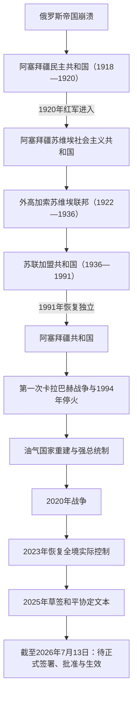

# 短暂共和国、苏联与独立阿塞拜疆

## 时间

1918年至今（当代部分核验截至2026年7月13日）

## 概括

1918年阿塞拜疆民主共和国在俄国帝国、外高加索联邦和第一次世界大战秩序同时崩溃时成立，建立多党议会、责任内阁与普选制度，却因战争、边界冲突和红军南下仅存续23个月。1920年后，阿塞拜疆先成为苏维埃共和国，继而加入外高加索联邦与苏联；共产党垄断政治，石油、工业化、教育普及、清洗和民族区域划界共同塑造社会。1991年恢复独立后，国家经历政权更替、第一次卡拉巴赫战争与经济崩溃；海上油气开发帮助重建国家能力，权力则逐渐集中于总统、阿利耶夫家族和新阿塞拜疆党。2020年战争与2023年军事行动使阿塞拜疆恢复对国际承认领土的实际控制。2025年两国草签和平协定文本，但截至核验日仍未正式签署、批准或生效。

## 阿塞拜疆民主共和国（1918—1920年）

### 建立背景与过程

1917年二月革命后，俄国高加索总督区瓦解；十月革命后，外高加索委员会、议会和短暂的外高加索民主联邦先后试图维持共同政府。1918年5月26日联邦解体，阿塞拜疆民族委员会于5月28日在第比利斯宣布独立。巴库当时由布尔什维克主导的巴库公社控制，共和国政府先在甘贾办公。

城市冲突带有阶级、政党、帝国战争与族群多重性质。1918年3月，巴库公社与达什纳克武装镇压穆斯林政治和军事力量，造成大批穆斯林平民死亡；9月，奥斯曼支持的“高加索伊斯兰军”攻占巴库后，又发生针对亚美尼亚人的屠杀。把两次暴力简化为单一民族的连续复仇，会遮蔽布尔什维克、穆萨瓦特、达什纳克、奥斯曼与地方武装各自的政治目标。

《穆德洛斯停战协定》后奥斯曼军撤离，英军于1918年11月进入巴库。政府在12月召集多党、多族群议会。共和国确立阿塞拜疆语为国语、建立大学和军队，并实行包括女性在内的普选权。与此同时，卡拉巴赫、赞格祖尔、纳希切万及同格鲁吉亚的部分边界仍有争议，战争与难民使财政和粮食体系承压。

1920年1月，协约国最高委员会给予阿塞拜疆事实承认。春季，军队主力被调往卡拉巴赫应对起义，北部防线空虚。4月27日，第十一红军越境，布尔什维克向议会发出交权最后通牒；议会在避免巴库巷战的条件下同意移交，4月28日苏维埃共和国成立。随后甘贾等地爆发反苏起义并被镇压。

### 国家元首与议会领导

| 顺序 | 姓名 | 职务 | 任期 | 说明 |
|---:|---|---|---|---|
| 1 | **马梅德·阿明·拉苏尔扎德** | 民族委员会主席 | 1918年5月28日—12月7日 | 代表集体委员会而非总统个人制；领导独立宣言阶段。 |
| 2 | 阿利马尔丹·托普丘巴绍夫 | 议会议长 | 1918年12月7日—1920年4月27日 | 长期率代表团在国外争取承认；哈桑贝·阿加耶夫等副议长在巴库主持会议。 |

### 政府首脑与内阁

| 顺序 | 政府首脑 | 任期 | 内阁与政治基础 | 关键事项 |
|---:|---|---|---|---|
| 1 | **法塔利汗·霍伊斯基** | 1918年5月28日—1919年4月14日 | 先后三届内阁，由民族委员会与议会支持 | 组织国家机关、迁都巴库、建立军队与外交体系；在外军存在下艰难维持秩序。 |
| 2 | 纳西布贝·尤西夫贝利 | 1919年4月14日—1920年4月1日 | 先后两届联合内阁 | 推动大学、教育和土地改革议程；受边界战争、党争与财政危机牵制。 |
| — | 马梅德·哈桑·哈金斯基 | 1920年4月1—22日受命组阁 | 未能组成获议会确认的新内阁 | 同布尔什维克谈判期间组阁失败，不作为完整任期总理计算。 |

### 崛起与灭亡原因

| 层次 | 因素 |
|---|---|
| 建立条件 | 帝国崩溃与民族委员会成熟；巴库石油和城市知识阶层提供财政、干部与国际意义；奥斯曼军事支持使政府取得首都。 |
| 制度成就 | 多党议会、责任内阁、普选权、大学、军队和外交代表团提供现代国家框架。 |
| 结构性脆弱 | 行政基础薄弱、税收和军队尚未制度化；城乡政治差异大；边界未定，难民与族群暴力持续；石油出口受战争封锁。 |
| 外部压力 | 奥斯曼、英国先后驻军，白军、红军与协约国态度变化使主权受限；邻国边界战争分散资源。 |
| 直接触发 | 1920年春军队被卡拉巴赫战事牵制，第十一红军越境并发出最后通牒，议会在军事劣势下交权。 |

## 苏维埃阿塞拜疆（1920—1991年）

### 政体与实际权力结构

1920年成立阿塞拜疆苏维埃社会主义共和国。1922—1936年，它与亚美尼亚、格鲁吉亚组成外高加索社会主义联邦苏维埃共和国，再作为一体加入苏联；1936年联邦撤销后，阿塞拜疆成为苏联加盟共和国。宪法上的最高苏维埃、主席团和部长会议分别承担立法、国家元首与行政职能，但重大干部、经济和安全决定由共产党中央及莫斯科系统控制，共和国共产党第一书记是实际最高领导人。

### 共产党实际最高领导人

1920年职务先称主席团主席、执行书记，1921年后逐步固定为第一书记。以下按实际党务最高职位连续列出。

| 顺序 | 姓名 | 任期 | 职务或阶段 | 关键说明 |
|---:|---|---|---|---|
| 1 | 米尔扎·达乌德·侯赛诺夫 | 1920年4月28日—7月23日 | 党主席团主席 | 红军进入后建立苏维埃机关。 |
| 2 | 维克托·纳涅伊什维利 | 1920年7月23日—9月9日 | 党主席团主席 | 早期苏维埃化过渡。 |
| 3 | 叶莲娜·斯塔索娃 | 1920年9月9—15日 | 党主席团主席 | 短暂任职。 |
| 4 | 弗拉基米尔·敦巴泽 | 1920年9月15日—11月24日 | 党主席团主席 | 同执行书记任期一度重叠。 |
| 5 | 格里戈里·卡明斯基 | 1920年10月24日—1921年7月24日 | 执行书记 | 组织一党体制与经济国有化。 |
| 6 | 谢尔盖·基洛夫 | 1921年7月24日—1925年1月5日 | 第一书记 | 镇压反抗并把巴库石油纳入苏联供应体系。 |
| 7 | 鲁胡拉·阿洪多夫 | 1925年1月5日—1926年1月21日 | 第一书记 | 后在大清洗中被处决。 |
| 8 | 列翁·米尔佐扬 | 1926年1月21日—1929年7月11日 | 第一书记 | 加强党内整肃和中央控制。 |
| 9 | 尼古拉·吉卡洛 | 1929年7月11日—1930年8月5日 | 第一书记 | 集体化初期。 |
| 10 | 弗拉基米尔·波隆斯基 | 1930年8月5日—1933年2月7日 | 第一书记 | 强制集体化和工业计划推进。 |
| 11 | 鲁边·鲁边诺夫 | 1933年2月7日—12月10日 | 第一书记 | 短期过渡。 |
| 12 | **米尔·贾法尔·巴吉罗夫** | 1933年12月10日—1953年4月6日 | 第一书记 | 斯大林时期长期统治；工业化、战争动员与大清洗并行。 |
| 13 | 米尔·泰穆尔·雅库博夫 | 1953年4月6日—1954年2月17日 | 第一书记 | 去斯大林化前的过渡。 |
| 14 | 伊玛目·穆斯塔法耶夫 | 1954年2月17日—1959年7月10日 | 第一书记 | 赫鲁晓夫时期调整；阿塞拜疆语地位有所恢复。 |
| 15 | 韦利·阿洪多夫 | 1959年7月10日—1969年7月14日 | 第一书记 | 石油相对地位下降，工业多元化有限推进。 |
| 16 | **盖达尔·阿利耶夫** | 1969年7月14日—1982年12月3日 | 第一书记 | 加强干部网络、教育与工业投资；1982年升任苏共中央政治局委员及苏联部长会议第一副主席。 |
| 17 | 卡姆兰·巴吉罗夫 | 1982年12月3日—1988年5月21日 | 第一书记 | 经济停滞与卡拉巴赫危机开始。 |
| 18 | 阿卜杜拉赫曼·韦济罗夫 | 1988年5月21日—1990年1月25日 | 第一书记 | 改革派但无力控制族群冲突与大众动员；“黑色一月”后下台。 |
| 19 | 阿亚兹·穆塔利博夫 | 1990年1月25日—1991年9月14日 | 第一书记，后兼总统 | 党国体制末期转向总统制；苏共瓦解后党权终结。 |

### 社会、经济与边界重组

- 1920年政府把石油、银行和大工业国有化；粮食征集与政治镇压引发甘贾等地起义。
- 1921年《莫斯科条约》《卡尔斯条约》确定纳希切万在阿塞拜疆保护下的自治地位；1924年建立纳希切万自治苏维埃社会主义共和国。
- 1923年在阿塞拜疆境内建立纳戈尔诺—卡拉巴赫自治州。苏联行政边界既承认当地亚美尼亚人口集中，也把自治州置于阿塞拜疆共和国体系内，后来成为主权争议的制度框架。
- 1920—1930年代识字教育、妇女公共参与、世俗化和工业就业扩大；与此同时，集体化、反宗教运动、文字由阿拉伯字母转拉丁、再转西里尔，以及大清洗造成文化断裂。
- 第二次世界大战中，巴库是苏联最关键的油料中心之一；数十万居民参军，德军1942年高加索攻势的重要目标即为油田。
- 战后，苏姆盖特石化、机械、能源和城市住房扩张，教育与专业干部增加；里海污染、资源型工业和城乡差距也累积。
- 1969年后盖达尔·阿利耶夫利用莫斯科关系争取投资、扩大本地干部比例，但裙带网络和非正式经济同样增长。
- 1988年，纳戈尔诺—卡拉巴赫亚美尼亚人要求转隶亚美尼亚，引发大规模示威；苏姆盖特等地发生反亚美尼亚人暴力，亚美尼亚和阿塞拜疆人口随后相互逃离或被驱逐。
- 1990年1月，苏军进入巴库镇压人民阵线与反苏运动，造成大量平民死亡，史称“黑色一月”。事件严重摧毁苏联合法性。
- 1991年8月30日最高苏维埃宣布恢复独立，10月18日通过独立宪法文件，12月公投确认；苏联解体使法律独立成为现实。

### 苏维埃体制衰落原因

计划经济过度依赖联盟分工，成熟油田减产、工业效率低和环境成本上升；一党政治缺乏公开解决边界、历史记忆和资源分配争议的机制。改革开放媒体后，卡拉巴赫归属、难民与暴力迅速民族化。莫斯科在调停、武力镇压和行政变更之间摇摆，既无法恢复信任，也刺激双方建立民族武装。1991年苏共政变失败和联盟财政军政解体，成为体制终结的直接触发因素。

## 独立共和国（1991年至今）

### 1991—1994年：战争与政权更替

独立初期，穆塔利博夫政府延续部分苏维埃干部体系。1992年霍贾雷平民死亡、舒沙与拉钦失守引发政治危机；穆塔利博夫辞职、短暂复位后再被人民阵线推翻。阿布法兹·埃利奇别伊在1992年当选总统，推动突厥化、拉丁字母、市场改革和俄军撤离，但军队派系、经济崩溃和战场失利削弱政府。

1993年，军事指挥官苏拉特·侯赛诺夫在甘贾反叛并向巴库推进。埃利奇别伊离开首都，纳希切万领导人盖达尔·阿利耶夫出任议会主席、代行总统权，随后经选举就任总统。1994年比什凯克停火时，亚美尼亚部队和卡拉巴赫亚美尼亚武装控制原自治州及周边七区大部，数十万阿塞拜疆人流离失所；亚美尼亚人此前也已大批逃离阿塞拜疆。停火冻结前线，却未解决地位、回返和安全问题。

### 1994—2003年：国家重建与石油战略

盖达尔·阿利耶夫压制军事派系，挫败1994、1995年的政变或兵变，把军队、安全机构和地方行政重新纳入总统体系。1994年同国际财团签“世纪合同”，开发阿泽里—奇拉格—古纳什利海上油田；1999年设国家石油基金，巴库—第比利斯—杰伊汉输油管于2006年投运，路线绕开俄罗斯与伊朗。能源收入、土耳其和西方伙伴关系增强国家能力，也使经济和财政更依赖油气价格。

新阿塞拜疆党成为执政核心。1995年宪法确立强总统制；议会、内阁和法院保留正式职能，但总统任免、资源配置和安全体系居主导。政府以稳定、领土完整和经济恢复作为合法性来源，反对派、媒体与选举竞争空间则逐步收窄。

### 2003年以来：阿利耶夫时期

盖达尔·阿利耶夫健康恶化后，其子伊利哈姆先短任总理，2003年当选总统。油价上涨支持基础设施、军费、社会支出和巴库城市改造，南方天然气走廊进一步把阿塞拜疆接入欧洲市场。石油基金为财政提供缓冲，但2014年后油价下跌、2015年货币贬值显示资源依赖风险。

2009年公投取消总统连任次数限制；2016年公投把总统任期从五年延至七年，并设第一副总统等职位；2017年梅赫丽班·阿利耶娃获任第一副总统。官方选举结果给予执政党和总统高支持率，国际观察和人权组织则持续批评候选资格、媒体、结社与计票环境受限。理解这一体制需同时看到国家能力、战争动员和经济建设，也要区分宪法机构与实际权力集中。

## 独立共和国国家元首

| 顺序 | 姓名 | 任期 | 身份与交接 | 关键事件 |
|---:|---|---|---|---|
| 1 | 阿亚兹·穆塔利博夫 | 1991年10月18日—1992年3月6日 | 苏维埃时期总统转为独立共和国总统 | 第一次卡拉巴赫战争失利后辞职。 |
| — | 亚古布·马梅多夫 | 1992年3月6日—5月14日 | 议长代行总统 | 过渡政府。 |
| 1 | 阿亚兹·穆塔利博夫（复位） | 1992年5月14—18日 | 议会短暂恢复 | 人民阵线夺权后再次下台。 |
| — | 伊萨·甘巴尔 | 1992年5月18日—6月17日 | 议长代行总统 | 主持总统选举过渡。 |
| 2 | 阿布法兹·埃利奇别伊 | 1992年6月17日—1993年6月24日 | 民选总统，人民阵线领袖 | 推动脱俄与改革；甘贾兵变后失去实际权力。 |
| — | 盖达尔·阿利耶夫 | 1993年6月24日—10月10日 | 议长代行总统 | 处理兵变并重组中央权力。 |
| 3 | **盖达尔·阿利耶夫** | 1993年10月10日—2003年10月31日 | 两次当选总统 | 1994年停火、石油合同、强总统制和新阿塞拜疆党统治定型。 |
| 4 | **伊利哈姆·阿利耶夫** | 2003年10月31日至今 | 2003、2008、2013、2018、2024年当选 | 能源扩张、权力进一步集中；2020、2023年军事胜利改变卡拉巴赫控制格局。 |

## 独立共和国政府首脑

| 顺序 | 姓名 | 任期 | 性质 | 说明 |
|---:|---|---|---|---|
| 1 | 哈桑·哈桑诺夫 | 1991年2月—1992年4月 | 总理 | 从苏维埃末期延续至独立初期。 |
| — | 菲鲁兹·穆斯塔法耶夫 | 1992年4—5月 | 代理总理 | 政权危机中的短期过渡。 |
| 2 | 拉希姆·侯赛诺夫 | 1992年5月—1993年1月 | 总理 | 战争与经济急剧萎缩时期。 |
| — | 阿里·马西莫夫 | 1993年2—4月 | 代理总理 | 人民阵线政府末期。 |
| — | 帕纳赫·侯赛因 | 1993年4—6月 | 代行／总理 | 甘贾兵变前后的政府首脑。 |
| 3 | 苏拉特·侯赛诺夫 | 1993年6月—1994年10月 | 总理、武装派系领袖 | 兵变后入阁；后被指发动政变而罢免。 |
| 4 | 福阿德·库里耶夫 | 1994年10月—1996年7月 | 代理后任总理 | 国家稳定与经济合同初期。 |
| 5 | 阿图尔·拉西扎德 | 1996年7月—2003年8月 | 总理 | 盖达尔·阿利耶夫时期主要政府首脑。 |
| 6 | 伊利哈姆·阿利耶夫 | 2003年8—11月 | 总理 | 总统交接前短任；拉西扎德一度代行日常职务。 |
| 5 | 阿图尔·拉西扎德（复任） | 2003年11月—2018年4月 | 总理 | 在强总统制下负责内阁行政。 |
| 7 | 诺夫鲁兹·马梅多夫 | 2018年4月—2019年10月 | 总理 | 短期政府调整。 |
| 8 | **阿里·阿萨多夫** | 2019年10月8日至今 | 总理 | 2024年2月获再次任命；截至2026年7月13日在任。 |

## 现行统治结构（截至2026年7月13日）

| 层级 | 现任人物／机构 | 法定角色 | 实际权力位置 |
|---|---|---|---|
| 总统 | **伊利哈姆·阿利耶夫** | 国家元首、武装力量最高统帅；任命总理和内阁，主导外交与安全 | 政治体系核心，控制行政议程与高级任命 |
| 第一副总统 | **梅赫丽班·阿利耶娃** | 总统不能履职时优先代行；承担总统交办事务 | 阿利耶夫家族与执政党核心成员，2017年起在任 |
| 总理与内阁 | **阿里·阿萨多夫**及部长会议 | 组织经济、财政与行政政策执行 | 受总统领导，政策自主性低于总统府 |
| 国民议会 | 125席；议长**萨希芭·加法罗娃** | 立法、预算、同意总理任命等 | 新阿塞拜疆党占主导，独立与反对派议员影响有限 |
| 执政党 | 新阿塞拜疆党 | 政党组织、议会多数和干部动员 | 同总统行政体系高度结合 |
| 纳希切万自治共和国 | 自治议会与行政代表体系 | 在阿塞拜疆主权内享自治地位 | 2022年后中央总统全权代表的作用增强 |

## 卡拉巴赫冲突的阶段过程

### 1994年停火至2016年

欧洲安全与合作组织明斯克小组长期主持谈判，核心难题包括原自治州地位、周边地区归还、难民回返、安全保障和拉钦通道。双方军事化持续，接触线时有伤亡。2016年“四日战争”使阿塞拜疆取得少量阵地，表明冻结冲突可能重新转为大战。

### 2020年第二次卡拉巴赫战争

2020年9月27日全面战争爆发。阿塞拜疆以无人机、远程火力、特种部队和土耳其支持突破周边防线，收复多数周边地区，并在11月攻占具有军事和象征意义的舒沙／舒希。11月9—10日俄方促成停火：阿塞拜疆保留战场所得，亚美尼亚交还其余周边区，俄罗斯维和部队部署于剩余亚美尼亚人居住区和拉钦通道。胜利提高阿塞拜疆政府威望，却没有建立最终和平条约。

### 2022—2023年：封锁、人道危机与控制权终结

2022年边境发生大规模冲突。2022年12月起拉钦通道通行受阻，2023年阿塞拜疆设置检查站；当地亚美尼亚居民面临食品、药品和燃料短缺。2023年9月19日，阿塞拜疆发动约一天的军事行动，称目标为解除非法武装并恢复宪法秩序。当地事实政权接受停火、缴械与解散安排，阿塞拜疆恢复全境实际控制。

数日内，十万余名、即当地绝大多数亚美尼亚居民前往亚美尼亚。亚美尼亚政府及部分国际观察者把这一结果称为强迫迁移或族群清洗；阿塞拜疆否认，并宣布愿以公民身份保障留下或返回者权利。无论法律定性如何，人口几乎完全外流是该地区社会史的断裂点。战争罪、被拘人员、失踪者、财产、文化遗产与安全回返仍是长期问题。

### 2024年后的重建与谈判

2024年俄罗斯维和部队提前撤出。阿塞拜疆推进排雷、道路、机场、住房和原流离失所者回返计划；地雷、土地权属、基础设施与亚美尼亚文化遗产保护构成持续挑战。同年两国边界委员会以1991年《阿拉木图宣言》为原则启动局部划界，亚美尼亚交还边境四村附近地区，为直接谈判提供先例。

## 2025年草签和平文本及截至2026年的状态

### 从文本谈妥到华盛顿草签

2025年3月13日，两国宣布已就《建立和平与国家间关系协定》全部条文达成一致。8月8日，阿塞拜疆外长与亚美尼亚外长在华盛顿、两国领导人与美国总统见证下草签17条协定文本；阿塞拜疆总统与亚美尼亚总理另行签署《华盛顿联合声明》。

“草签”表示谈判代表确认文本，不等于国家已经正式签署，更不等于国内批准和条约生效。联合声明明确要求继续完成正式签署与最终批准。

### 草签协定的主要内容

| 主题 | 草签文本安排 |
|---|---|
| 边界与主权 | 承认原苏维埃加盟共和国边界成为国际边界，尊重彼此主权、领土完整与政治独立 |
| 领土主张 | 双方确认没有、未来也不提出领土要求，不支持破坏对方领土完整的行动 |
| 安全 | 不使用或威胁使用武力，不允许第三国利用本国领土攻击对方；共同边界不部署第三方军队 |
| 建交与划界 | 在批准书交换后规定期限内建立外交关系；边界委员会继续谈判勘界与立界 |
| 人道事项 | 合作查明失踪与强迫失踪人员，交换信息并寻回遗骸 |
| 合作 | 可另订经济、交通、环境、人道与文化协议 |
| 执行与争端 | 设双边执行委员会，先直接协商争端；条约生效后处理或撤回既有国家间法律诉讼 |
| 生效 | 双方完成国内程序并交换通知后生效；在此之前不得实施破坏协定目的的行为 |

《华盛顿联合声明》还提出在尊重亚美尼亚主权、领土完整和司法管辖的前提下，建设连接阿塞拜疆本土与纳希切万的“国际和平与繁荣特朗普路线”（TRIPP），并共同请求关闭欧安组织明斯克进程及相关机构。交通项目与和平协定相互关联，但不是同一法律文件。

### 截至2026年7月13日

- 和平协定文本已经草签并公开，但尚未由两国完成正式签署、批准书交换和生效。
- 两国尚未因该协定建立正式外交关系；边界划定、交通开放、失踪人员和被拘人员等事项仍需后续安排。
- 阿塞拜疆政府继续把亚美尼亚宪法与《独立宣言》中被其解释为含有领土要求的表述修改，视为正式签约前提；亚美尼亚方面主张协定本身已经排除领土要求，并推进本国宪法讨论。
- 双方在边界委员会、交通方案和有限互信措施上继续接触，现实敌对程度较战时下降；这可以称为事实上的缓和，却不能替代尚未生效的和平条约。
- 因而，2023年终结的是卡拉巴赫事实政权及其军事控制，2025年草签的是和平法律框架；截至核验日，国家间冲突的最终法律终结仍未完成。

## 重要事件

| 时间 | 事件 | 结果与长期影响 |
|---|---|---|
| 1918年5月28日 | 宣布独立 | 建立阿塞拜疆民主共和国 |
| 1918年9月 | 高加索伊斯兰军进入巴库 | 政府取得首都；随后发生反亚美尼亚暴力 |
| 1918年12月 | 议会开幕 | 多党、多族群议会与责任内阁运行 |
| 1920年4月27—28日 | 红军进入、议会交权 | 民主共和国终结，苏维埃化开始 |
| 1922—1936年 | 加入外高加索联邦 | 共和国主权进一步纳入苏联联邦体系 |
| 1923年 | 设纳戈尔诺—卡拉巴赫自治州 | 为后来的主权与民族自决冲突留下行政框架 |
| 1933—1953年 | 巴吉罗夫长期统治 | 工业化、战争动员与大清洗并存 |
| 1941—1945年 | 巴库支撑苏联战争油料 | 城市成为轴心国高加索战略的核心目标 |
| 1969年 | 盖达尔·阿利耶夫任第一书记 | 本地干部网络与发展模式成形 |
| 1988年 | 卡拉巴赫运动与族群暴力升级 | 第一次战争和人口相互驱逐的起点 |
| 1990年1月 | “黑色一月” | 苏军镇压加速独立运动 |
| 1991年10月18日 | 恢复独立 | 共和国进入主权国家阶段 |
| 1992—1993年 | 总统更替与甘贾兵变 | 人民阵线政府倒台，盖达尔·阿利耶夫上台 |
| 1994年 | 卡拉巴赫停火与“世纪合同” | 冻结前线；油气成为国家重建基础 |
| 2003年 | 伊利哈姆·阿利耶夫继任 | 家族与执政党权力连续 |
| 2009、2016年 | 宪法公投 | 取消任期次数限制、延长总统任期并设副总统 |
| 2016年 | 四日战争 | 冻结冲突开始明显松动 |
| 2020年 | 第二次卡拉巴赫战争 | 阿塞拜疆收复周边区和部分原自治州，俄军维和进驻 |
| 2023年9月 | 阿塞拜疆军事行动 | 恢复对卡拉巴赫全境控制，当地亚美尼亚人口几乎全部外流 |
| 2024年 | 俄维和部队撤出、局部边界划定 | 冲突后秩序转向双边谈判 |
| 2025年3月、8月 | 文本谈妥并在华盛顿草签 | 形成17条和平框架，但尚未正式签署与批准 |
| 2026年7月13日 | 核验截止 | 协定仍未生效，事实缓和与法律未决并存 |

## 国家崛起、危机与转折的因果框架

### 国家能力的形成

- 1918年共和国留下国旗、议会、军队、大学与外交记忆，成为1991年国家象征的重要来源。
- 苏维埃工业、教育、城市化和官僚体系提供现代国家的人力与基础设施，代价是政治压制和中央依赖。
- 1994年后的停火、军事派系整合和油气合同使中央重新获得财政、军队和国际伙伴。
- 土耳其结盟、能源管线与军队现代化，为2020年的战场优势提供长期条件。

### 结构性风险

- 油气收入强化财政，也制造价格波动、区域差距、寻租与经济多元化不足。
- 强总统制提高决策和战争动员效率，但有限政治竞争、媒体约束与家族化继承削弱问责。
- 难民记忆、失踪人员、战俘、文化遗产与互不信任使和平不能只靠军事控制。
- 俄罗斯、土耳其、伊朗、欧盟和美国的利益交错，交通路线与安全安排易被大国竞争影响。

### 直接转折

1920年红军最后通牒终结第一共和国；1993年甘贾兵变使人民阵线政府倒台；1994年停火和石油合同把国家从生存危机转向重建；2020年军事突破和2023年短促行动改变实际控制；2025年草签文本把冲突从地位谈判转向边界、建交和交通安排。最后一步仍取决于正式签署、批准与可执行的互信机制。

## 演变关系

- 前一阶段：[汗国、俄国征服与石油城市](/%E4%BA%BA%E6%96%87%E7%A7%91%E5%AD%A6/%E5%8E%86%E5%8F%B2/%E8%A5%BF%E4%BA%9A/%E5%8D%97%E9%AB%98%E5%8A%A0%E7%B4%A2/%E9%98%BF%E5%A1%9E%E6%8B%9C%E7%96%86/%E6%B1%97%E5%9B%BD%E3%80%81%E4%BF%84%E5%9B%BD%E5%BE%81%E6%9C%8D%E4%B8%8E%E7%9F%B3%E6%B2%B9%E5%9F%8E%E5%B8%82.md)
- 本目录总览：[阿塞拜疆](/%E4%BA%BA%E6%96%87%E7%A7%91%E5%AD%A6/%E5%8E%86%E5%8F%B2/%E8%A5%BF%E4%BA%9A/%E5%8D%97%E9%AB%98%E5%8A%A0%E7%B4%A2/%E9%98%BF%E5%A1%9E%E6%8B%9C%E7%96%86/README.md)
- 区域比较：[南高加索的苏维埃划界、独立与地区冲突](/%E4%BA%BA%E6%96%87%E7%A7%91%E5%AD%A6/%E5%8E%86%E5%8F%B2/%E8%A5%BF%E4%BA%9A/%E5%8D%97%E9%AB%98%E5%8A%A0%E7%B4%A2/%E8%8B%8F%E7%BB%B4%E5%9F%83%E5%88%92%E7%95%8C%E3%80%81%E7%8B%AC%E7%AB%8B%E4%B8%8E%E5%9C%B0%E5%8C%BA%E5%86%B2%E7%AA%81.md)
