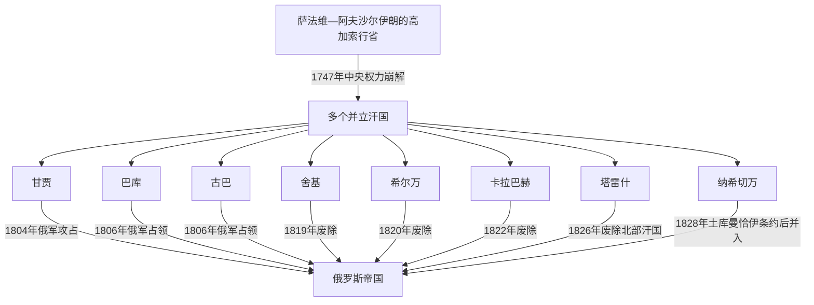

# 阿塞拜疆主要汗国统治者表

## 时间

约1743—1828年

## 概括

18世纪中叶至19世纪初，今阿塞拜疆共和国及其相邻地区存在多个彼此并立的汗国。它们沿用伊朗世界的汗、贝格勒贝伊、马哈尔等政治制度，对伊朗沙阿的名义宗主权、实际自主程度以及同俄罗斯的关系随战争而变。本表分别列出主要汗国的统治者，不把它们合并成一个“阿塞拜疆王朝”。

## 编排口径

- 在位时间按现有研究中较常见的编年排列；18世纪地方史料常以伊斯兰历、敕令、钱币或后出编年史保存，换算年份可能相差一至两年。
- 共治、外来占领、复位和俄军监督期分行列出。某位统治者同时控制多个汗国，不等于这些汗国永久合并。
- 纳希切万、舍基和巴库后期的统治次序存在版本差异，表内以“约”“短暂”或“有争议”标明，不用伪精确日期掩盖不确定性。
- 埃里温汗国的中心位于今亚美尼亚，杰尔宾特汗国的中心位于今俄罗斯达吉斯坦，故不列入本表；两者仍是理解俄伊边疆竞争的重要邻接政权。
- 萨利扬、贾瓦德等短期小汗国或附属领地的统治谱系残缺，正文只在其政治关系中说明，不补造连续世系。

## 并立与终结关系

## 巴库汗国

巴库汗国控制阿布歇隆半岛、港口和油盐资源。古巴汗国一度支配巴库，统治者复位次序因“本地在位”与“实际控制”口径不同而有差异。

| 顺序 | 统治者 | 在位时间 | 与前任关系 | 关键事件与说明 |
|---:|---|---|---|---|
| 1 | 米尔扎·穆罕默德汗一世 | 1747—1768年 | 德尔加赫·库里贝格之子，汗国建立者 | 纳迪尔沙死后取得实际自主；后来承认古巴法塔利汗的优势。 |
| — | 法塔利汗（古巴汗） | 1768—1770年 | 外来宗主与实际控制者 | 通过婚姻、驻军和政治压力控制巴库；是否计作巴库汗存在口径差异。 |
| — | 阿卜杜拉贝格 | 约1770—1772年 | 古巴方面扶植者 | 过渡性统治，旋被本地王族恢复。 |
| 2 | 马利克·穆罕默德汗 | 1772—1783年 | 米尔扎·穆罕默德一世之子 | 在古巴优势下恢复本家统治，曾遭卡拉巴赫方面扣押。 |
| 3 | 米尔扎·穆罕默德汗二世 | 1784—1791年 | 马利克·穆罕默德之子 | 法塔利汗死后谋求更大自主；后被叔父夺位。 |
| 4 | 穆罕默德·库里汗 | 1791—1792年 | 米尔扎·穆罕默德二世之叔 | 借王族内争掌权，旋为侯赛因·库里取代。 |
| 5 | 侯赛因·库里汗 | 1792—1797年 | 本家旁支 | 在恺加伊朗、俄国和古巴之间周旋；1796年俄军短暂进入巴库。 |
| 3 | 米尔扎·穆罕默德汗二世（复位） | 约1797—1801年 | 前任复位 | 阿迦·穆罕默德沙遇刺后的权力真空中短暂恢复；实际控制范围有争议。 |
| 5 | 侯赛因·库里汗（复位） | 约1801—1806年 | 前任复位 | 1806年谈判时俄军统帅齐齐阿诺夫被杀；俄军随后占领巴库，汗流亡伊朗。 |

## 古巴汗国

| 顺序 | 统治者 | 在位时间 | 与前任关系 | 关键事件与说明 |
|---:|---|---|---|---|
| 1 | 侯赛因·阿里汗 | 1747—1758年 | 凯塔格系地方总督，汗国建立者 | 以古巴为中心巩固地方权力。 |
| 2 | **法塔利汗** | 1758—1789年 | 前任之子 | 控制杰尔宾特、萨利扬并一度支配巴库与希尔万，建立北方汗国联盟；扩张依赖个人军事与婚姻网络。 |
| 3 | 艾哈迈德汗 | 1789—1791年 | 法塔利汗之子 | 无力维持父亲的区域联盟，附属地相继脱离。 |
| 4 | 谢赫·阿里汗 | 1791—1806年 | 艾哈迈德汗之弟 | 抵抗俄军并在山地盟友支持下反复作战；1806年古巴被俄军占领，之后仍发动抵抗。 |

## 希尔万汗国

希尔万以沙马基和阿克苏为双重中心。1760—1780年代，旧沙马基与新沙马基、古巴与舍基的干预造成共治和占领。

| 顺序 | 统治者 | 在位时间 | 与前任关系 | 关键事件与说明 |
|---:|---|---|---|---|
| 1 | 哈吉·穆罕默德·阿里汗 | 1761—1763年 | 沙马基地方显贵推举 | 取代卡拉克鲁总督，形成汗国。 |
| 2 | 阿迦西汗、穆罕默德·赛义德汗 | 1763—1768年 | 同一家族的共治者 | 分据旧、新沙马基；共治并不稳定。 |
| — | 法塔利汗（古巴汗） | 1768—1774年 | 外来征服者 | 与舍基瓜分希尔万，囚禁或弄瞎原统治者。 |
| 2 | 阿迦西汗、穆罕默德·赛义德汗（复位） | 1774—1782年 | 共治者复位 | 借古巴控制松动恢复，仍受邻国压力。 |
| 3 | 穆罕默德·礼萨汗 | 1782—1785年 | 共治家族成员 | 继承争斗中即位。 |
| — | 法塔利汗（古巴汗，第二次控制） | 1785—1789年 | 外来征服者 | 再次把希尔万纳入古巴势力范围。 |
| 4 | 阿斯卡尔汗 | 1789年 | 本地王族 | 法塔利汗死后短暂即位。 |
| 5 | 卡西姆汗 | 1789—1792年 | 本地王族 | 在持续的家族竞争中掌权。 |
| 6 | **穆斯塔法汗** | 1792—1820年 | 阿迦西汗之子 | 1805—1806年转向俄国；1813年后受俄国监督，1820年被叶尔莫洛夫废黜并流亡。 |

## 舍基汗国

| 顺序 | 统治者 | 在位时间 | 与前任关系 | 关键事件与说明 |
|---:|---|---|---|---|
| 1 | **哈吉·切莱比汗** | 1743—1755年 | 地方首领，汗国建立者 | 反抗纳迪尔沙官员；1752年在沙姆基尔附近击败格鲁吉亚军并释放被扣诸汗。 |
| 2 | 阿迦·基希贝格 | 1755—1759年 | 前任之子 | 延续与希尔万、古巴的联盟，遭姻亲谋杀。 |
| 3 | 穆罕默德·侯赛因汗 | 1759—约1780年 | 哈吉·切莱比之孙 | 驱逐外来势力，重建家族统治；迁治努哈。 |
| 4 | 哈吉·阿卜杜勒卡迪尔汗 | 约1780—1783年 | 王族竞争者 | 在宫廷冲突中取代前任。 |
| 5 | 穆罕默德·哈桑汗 | 1783—1795年 | 切莱比家族 | 首次统治；同卡拉巴赫、格鲁吉亚和达吉斯坦势力周旋。 |
| 6 | 萨利姆汗 | 1795—约1797年 | 穆罕默德·哈桑之弟 | 借外援夺位，后被兄长恢复。 |
| 5 | 穆罕默德·哈桑汗（复位） | 约1797—1802年 | 前任复位 | 后期失明并被逐；具体终年在编年中略有差异。 |
| 6 | 萨利姆汗（复位） | 约1802—1805年 | 前任复位 | 1805年接受俄国保护；因俄军杀害其盟友卡拉巴赫汗而反叛。 |
| 7 | 法塔利汗 | 1805年、1806年短暂 | 王族成员 | 两次由对立派系扶立，均未形成稳定统治。 |
| 8 | 贾法尔·库里汗·敦布利 | 1806—1814年 | 俄国从霍伊扶植的外来统治者 | 取代切莱比家族，依赖俄军。 |
| 9 | 伊斯玛仪汗·敦布利 | 1814—1819年 | 前任之子 | 缺乏地方支持；死后俄国废除汗国。 |

## 甘贾汗国

| 顺序 | 统治者 | 在位时间 | 与前任关系 | 关键事件与说明 |
|---:|---|---|---|---|
| 1 | 沙赫维尔迪汗·齐亚多格鲁 | 1747—1761年 | 齐亚多格鲁恺加尔家族，汗国建立者 | 借格鲁吉亚支持夺取甘贾，向格鲁吉亚或卡拉巴赫纳贡以维持平衡。 |
| 2 | 穆罕默德·哈桑汗 | 1761—约1778／1781年 | 前任之子 | 延续平衡政策；不同编年对其终年以及是否与下列穆罕默德汗分列意见不一。 |
| 3 | 穆罕默德汗 | 约1778—1780／1781年 | 沙赫维尔迪之子，或被部分编年视为穆罕默德·哈桑的简称 | 家族内争中掌权，后被格鲁吉亚—卡拉巴赫联军废黜并弄瞎；身份与任期存在争议。 |
| — | 易卜拉欣·哈利勒汗（卡拉巴赫汗） | 约1780／1781—1784年 | 外来占领者 | 与格鲁吉亚方面瓜分控制甘贾，并设置代理人。 |
| 4 | 哈吉贝格 | 1784—1786年 | 齐亚多格鲁家族亲属 | 驱逐外来代理人，恢复本地王族。 |
| 5 | 拉希姆汗 | 1786年 | 沙赫维尔迪之子 | 短暂统治，旋被弟弟取代。 |
| 6 | **贾瓦德汗** | 1786—1804年 | 拉希姆之弟 | 承认恺加宗主权；拒绝俄国最后通牒，1804年俄军强攻甘贾时战死，汗国被直接废除。 |

## 卡拉巴赫汗国

| 顺序 | 统治者 | 在位时间 | 与前任关系 | 关键事件与说明 |
|---:|---|---|---|---|
| 1 | **帕纳赫·阿里汗·贾万希尔** | 1748—约1763年 | 贾万希尔部首领，汗国建立者 | 建巴亚特、沙赫布拉格和舒沙堡；逐步压服或结盟山地五个亚美尼亚梅利克领。后被卡里姆汗赞德带往设拉子并死于当地。 |
| 2 | **易卜拉欣·哈利勒汗** | 约1763—1806年 | 前任之子 | 借舒沙防御与联盟扩大影响；抵抗阿迦·穆罕默德沙，1805年签《库雷克恰伊条约》转受俄国保护，1806年被俄军误杀。 |
| 3 | 迈赫迪·库里汗 | 1806—1822年 | 前任之子 | 由俄国确认；实际军权受俄军限制，1822年因被疑联络伊朗而出走，俄罗斯随即废除汗国。 |

## 纳希切万汗国

纳希切万处于卡拉巴赫、埃里温、霍伊和恺加军队之间，康加尔部家族在强邻干预下频繁废立。不同编年对1780—1820年代若干短期统治的起止年有差异。

| 顺序 | 统治者 | 在位时间 | 与前任关系 | 关键事件与说明 |
|---:|---|---|---|---|
| 1 | 海达尔·库里汗·康加尔 | 1747—1764年 | 康加尔部首领，汗国建立者 | 推翻纳迪尔沙官员，借联盟维持小国生存。 |
| 2 | 哈吉汗·康加尔 | 1764—1765年 | 同族继承者 | 短期统治。 |
| 3 | 拉希姆汗·康加尔 | 1765—1770年 | 同族继承者 | 在邻国压力下维持汗国。 |
| 4 | 阿里·库里汗·康加尔 | 1770—1773年 | 同族继承者 | 短期统治。 |
| 5 | 瓦利·库里汗·康加尔 | 1773—1781年 | 同族继承者 | 继承竞争加剧。 |
| 6 | 阿巴斯·库里汗·康加尔 | 1781—1783年 | 康加尔王族 | 首次统治，后被堂亲贾法尔取代。 |
| 7 | 贾法尔·库里汗·康加尔 | 1783—1785年 | 前任堂亲 | 获霍伊方面支持；在邻国竞争中失位。 |
| 8 | 舒库尔·阿里汗 | 约1785—1787年 | 过渡性统治者 | 部分编年列入，身份和准确年限不一。 |
| 9 | **卡尔巴里汗·康加尔** | 1787—1796年 | 海达尔·库里之子 | 首次长期统治；拒绝完全服从恺加，1795年遭惩罚并一度失明。 |
| 6 | 阿巴斯·库里汗（复位） | 约1797—1801年；1806年短暂 | 前任复位 | 借恺加支持返回；地方控制时断时续，1806年又曾短暂出现于统治者编年。 |
| 9 | 卡尔巴里汗（复位） | 1801—1807年 | 前任复位 | 在俄伊双方之间周旋。 |
| 10 | 卡里姆汗 | 1808年、1813—1816年 | 恺加方面任命或支持 | 多次短期执政，显示汗国受伊朗军事调度。 |
| 9 | 卡尔巴里汗（再次复位） | 1809—1810年、1816—1820年 | 前任复位 | 统治被外来任命反复中断。 |
| 11 | 纳扎尔·阿里汗 | 1820年短暂 | 卡尔巴里家族成员 | 由恺加方面调整权力，未形成稳定统治。 |
| — | 侯赛因·米尔扎 | 1822—1823年 | 恺加王子、军事长官 | 作为总督或裁决者而非世袭汗掌权。 |
| 10 | 卡里姆汗（再次执政） | 1823—1827年 | 复位 | 第二次俄伊战争中随恺加军防守。 |
| 12 | 穆罕默德·巴吉尔汗 | 1827年 | 恺加方面任命 | 俄军攻占前的末期过渡统治者。 |
| — | 埃赫桑汗·纳希切万斯基 | 1828—1839年 | 康加尔贵族、俄方地方长官 | 《土库曼恰伊条约》后协助俄国，任“裁决官”等地方职；此时汗国已不再是独立或半自主政体。 |

## 塔雷什汗国

| 顺序 | 统治者 | 在位时间 | 与前任关系 | 关键事件与说明 |
|---:|---|---|---|---|
| 1 | 贾马勒丁汗（卡拉汗） | 1747—1786年 | 赛义德·阿巴斯之子，汗国建立者 | 以连科兰为都，在吉兰、古巴和伊朗中央之间维持自主。 |
| 2 | **米尔·穆斯塔法汗** | 1786—1814年 | 前任之子 | 1780年代末摆脱古巴优势；为抵御恺加而靠近俄罗斯，1809年接受俄国保护。 |
| 3 | 米尔·哈桑汗 | 1814—约1826年；1826—1828年曾复起 | 前任之子 | 俄方逐步削夺其权力；第二次俄伊战争中转向伊朗并短暂恢复部分地区，战败后流亡。其名义统治终点有1826、1828或1829年等口径。 |

## 汗国兴衰的共同机制

| 层次 | 崛起条件 | 衰落与终结因素 |
|---|---|---|
| 结构因素 | 纳迪尔沙死后伊朗中央军政瓦解；地方部落、城市显贵和旧省级官员掌握税源与武装；堡垒、商路、丝绸、盐和港口支撑小政权。 | 领土与税源有限，继承缺乏稳定规则；对雇佣军、部落骑兵与个人联盟依赖过重；共治、复位和外来干预频繁。 |
| 区域竞争 | 汗国通过婚姻、纳贡、扣押人质与短期联盟扩大势力；舍基、古巴和卡拉巴赫先后形成区域霸权。 | 汗国之间互相牵制，未能形成共同防御；伊朗、格鲁吉亚和达吉斯坦势力可扶植不同候选人。 |
| 外部压力 | 伊朗宗主权一度只具象征性，给地方自治留下空间。 | 恺加伊朗重新统一与俄罗斯帝国自格鲁吉亚南下形成双重挤压；俄军拥有更稳定的财政、炮兵和补给。 |
| 直接触发 | 个别汗主动接受保护，希望借强国压制邻国与家族对手。 | 1804年俄军强攻甘贾开启全面战争；1805—1806年保护条约转化为驻军控制；1813、1828年俄伊条约确认领土转移，俄方随后逐个废除汗国。 |

## 演变关系

- 时代背景：[高加索阿尔巴尼亚与伊朗—伊斯兰统治](/%E4%BA%BA%E6%96%87%E7%A7%91%E5%AD%A6/%E5%8E%86%E5%8F%B2/%E8%A5%BF%E4%BA%9A/%E5%8D%97%E9%AB%98%E5%8A%A0%E7%B4%A2/%E9%98%BF%E5%A1%9E%E6%8B%9C%E7%96%86/%E9%AB%98%E5%8A%A0%E7%B4%A2%E9%98%BF%E5%B0%94%E5%B7%B4%E5%B0%BC%E4%BA%9A%E4%B8%8E%E4%BC%8A%E6%9C%97%E2%80%94%E4%BC%8A%E6%96%AF%E5%85%B0%E7%BB%9F%E6%B2%BB.md)
- 主笔记：[汗国、俄国征服与石油城市](/%E4%BA%BA%E6%96%87%E7%A7%91%E5%AD%A6/%E5%8E%86%E5%8F%B2/%E8%A5%BF%E4%BA%9A/%E5%8D%97%E9%AB%98%E5%8A%A0%E7%B4%A2/%E9%98%BF%E5%A1%9E%E6%8B%9C%E7%96%86/%E6%B1%97%E5%9B%BD%E3%80%81%E4%BF%84%E5%9B%BD%E5%BE%81%E6%9C%8D%E4%B8%8E%E7%9F%B3%E6%B2%B9%E5%9F%8E%E5%B8%82.md)
- 后续阶段：[短暂共和国、苏联与独立阿塞拜疆](/%E4%BA%BA%E6%96%87%E7%A7%91%E5%AD%A6/%E5%8E%86%E5%8F%B2/%E8%A5%BF%E4%BA%9A/%E5%8D%97%E9%AB%98%E5%8A%A0%E7%B4%A2/%E9%98%BF%E5%A1%9E%E6%8B%9C%E7%96%86/%E7%9F%AD%E6%9A%82%E5%85%B1%E5%92%8C%E5%9B%BD%E3%80%81%E8%8B%8F%E8%81%94%E4%B8%8E%E7%8B%AC%E7%AB%8B%E9%98%BF%E5%A1%9E%E6%8B%9C%E7%96%86.md)
