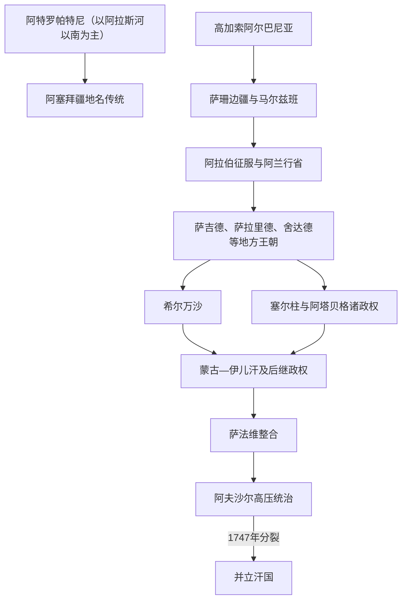

# 高加索阿尔巴尼亚与伊朗—伊斯兰统治

## 时间

约公元前4世纪至1747年

## 概括

现代阿塞拜疆共和国的古代与中世纪史不是一个民族国家连续扩张的历史，而是库拉河—阿拉斯河流域、里海西岸、东高加索山麓和伊朗高原北缘多重政治传统的叠合。高加索阿尔巴尼亚是东高加索多语言王国；“阿特罗帕特尼”主要位于阿拉斯河以南，是“阿塞拜疆”名称的词源背景。其后，萨珊边疆、阿拉伯哈里发、希尔万沙、突厥与蒙古政权、萨法维什叶派国家依次重组区域，却没有抹去山地社群、基督教教会、伊朗文化和城市贸易的连续性。

## 地名、政体与现代身份辨析

| 概念 | 历史范围 | 与现代阿塞拜疆的关系 |
|---|---|---|
| 阿特罗帕特尼 | 亚历山大帝国瓦解后形成，核心大致在今伊朗西北 | 古名经中古波斯语、阿拉伯语演变为“Azerbaijan”；不能把其疆域直接等同于今共和国 |
| 高加索阿尔巴尼亚 | 库拉河以北和东高加索为核心，疆界随时代变化 | 构成今阿塞拜疆北部与达吉斯坦南部的重要古代政体背景；与巴尔干阿尔巴尼亚无关 |
| 阿兰／阿兰地区 | 伊斯兰时代对库拉—阿拉斯低地常用的地理名称 | 是阿拉伯行政、城市和商路史中的区域概念，不等同于单一民族国家 |
| 希尔万 | 里海西岸、沙马基及其周边 | 中世纪长期存在的地区与王朝中心，巴库后来成为重要港口与避难都城 |
| 阿塞拜疆共和国 | 1918年采用国名，1991年恢复独立 | 现代国名承接更广的地理文化名称，但人口、语言与边界是在长期迁徙和帝国治理中形成的 |

## 历史进程

### 阿特罗帕特尼与高加索阿尔巴尼亚

亚历山大去世后，米底总督阿特罗帕特在公元前4世纪末维持独立，其领地阿特罗帕特尼主要位于阿拉斯河以南。罗马、帕提亚和萨珊文献中的“阿尔巴尼亚”则是另一政体：它由多种语言和地方共同体组成，早期都城通常认为在卡巴拉，晚期政治中心转向帕尔塔夫，即后来的巴尔达。

公元前65年，庞培追击米特里达梯与提格兰时进入高加索，阿尔巴尼亚王奥罗伊泽斯与罗马作战；罗马获得名义臣服，却未建立持久直辖。此后阿尔巴尼亚多在帕提亚—萨珊政治秩序内保留王权。约4世纪，王室接受基督教；传统把传教与乌尔奈尔王、亚美尼亚教会及高加索本地教士联系起来。5世纪出现用于高加索阿尔巴尼亚教会语言的字母与译经活动，但具体创制过程、使用范围和年代仍有争议。

### 萨珊边疆化与王权终结

萨珊帝国把东高加索视为防御北方游牧力量的要地，修筑杰尔宾特等里海关隘，设置边疆总督，并利用本地王族、教会和贵族治理。5世纪的瓦切二世曾反抗萨珊；瓦查甘三世在约485年后短暂恢复王权并整顿教会。约510年，萨珊废除阿尔巴尼亚王位，改设马尔兹班；7世纪米赫拉尼德亲王又以地方领袖身份出现。

这一阶段的兴盛依赖三点：控制里海通道和跨高加索商路；帝国以本地精英降低边疆治理成本；基督教组织把分散社群纳入共同制度。衰落则来自萨珊—拜占庭长期战争、北方突厥与可萨突袭，以及萨珊帝国在7世纪的财政军事崩溃。

### 阿拉伯征服与伊斯兰化

640年代以后阿拉伯军队多次进入南高加索。本地亲王贾万希尔先后在萨珊残余、拜占庭和哈里发之间周旋；他遇刺后，继承人瓦拉兹·特尔达特仍保留有限自治。705年前后，倭马亚政权废除米赫拉尼德政治自主，把阿兰与亚美尼亚、格鲁吉亚边区纳入更直接的哈里发行政。

征服不等于居民立即改宗。巴尔达、甘贾、沙马基等平原城市以及军政、税收和贸易网络较早伊斯兰化；山区基督徒长期保留教会传统，高加索阿尔巴尼亚教会逐步受亚美尼亚使徒教会统辖。阿拉伯定居者、本地伊朗语与高加索语居民、后来到来的突厥语群体共同改变人口结构。8—9世纪的税负、地方割据和巴巴克领导的胡拉米起义，显示哈里发统治并不稳定。

### 地方王朝、希尔万沙与突厥化

9世纪哈里发控制减弱后，萨吉德、萨拉里德、舍达德等王朝先后控制阿兰和阿塞拜疆部分城市。希尔万沙从9世纪后期形成长期地方王朝，以沙马基为中心，经营丝绸、葡萄酒、陶器和里海贸易。1191年地震后，巴库的重要性增加；希尔万沙宫殿群反映波斯语宫廷文化与本地建筑传统的结合。

11世纪塞尔柱扩张和乌古斯部落迁入，使突厥语在平原与军政集团中加速传播；这一转变持续数百年，并非一次人口替换。阿塔贝格政权、格鲁吉亚王国、花剌子模和地方诸侯反复争夺甘贾、纳希切万和希尔万。波斯语仍是行政、史学和高雅文学的重要语言，尼扎米等城市文学传统说明突厥语传播与波斯文化并存。

### 蒙古征服至萨法维整合

1220年代蒙古军首次进入，1230年代后建立持久控制。伊儿汗国以伊朗为中心统治南高加索，重整税收和驿路，也使战争、征发和城市破坏加重。伊儿汗国瓦解后，绰班、札剌亦儿、帖木儿、黑羊与白羊王朝相继竞争。希尔万沙常以纳贡、婚姻和堡垒维持存续，但自主空间不断收缩。

1501年，出身阿尔达比勒萨法维教团的伊斯玛仪一世在红头军支持下建立王朝。萨法维把什叶派十二伊玛目信仰制度化，以贝格勒贝伊、部落军和宫廷任命治理高加索；希尔万沙在1538年被塔赫玛斯普一世正式吞并。16—17世纪，奥斯曼—萨法维战争造成反复占领和人口迁徙，沙阿阿拔斯一世又迁移亚美尼亚商人与其他社群，以控制边疆与贸易。什叶派化、突厥语普及和波斯语行政文化在这一时期共同塑造近代阿塞拜疆社会。

### 萨法维崩溃与汗国前夜

1722年萨法维中央崩溃后，俄国沿里海进军，奥斯曼占领南高加索西部；1724年俄奥协议划分势力范围。纳迪尔在1730年代击败奥斯曼并迫使俄罗斯归还里海沿岸，1736年建立阿夫沙尔王朝。他以高额征税、军事征发、调动部落和更换地方官恢复帝国，却削弱地方对中央的忠诚。1747年纳迪尔遇刺，军队和财政体系迅速碎裂，巴库、古巴、舍基、甘贾、卡拉巴赫、希尔万、纳希切万、塔雷什等汗国相继取得实际自主。

## 统治结构的阶段变化

| 阶段 | 名义最高权力 | 地方治理 | 主要整合机制 |
|---|---|---|---|
| 高加索阿尔巴尼亚王国 | 国王，常承认帕提亚或萨珊宗主 | 王族、地方贵族、神庙／教会与部落首领 | 王朝婚姻、贡赋、军事动员、基督教化 |
| 萨珊马尔兹班时期 | 伊朗沙阿 | 边疆总督、本地亲王与教会 | 要塞体系、驻军、税收和贵族合作 |
| 哈里发统治 | 哈里发及其总督 | 阿米尔、税务官、城市显贵与基督教共同体 | 军事征服、城市驻军、土地税和商路 |
| 地方王朝时期 | 地方埃米尔或希尔万沙，时向强权纳贡 | 宫廷官僚、土地贵族、城市行会与宗教机构 | 堡垒、货币、丝路贸易和波斯语文书 |
| 萨法维时期 | 沙阿 | 贝格勒贝伊、红头军首领、地方汗与宗教法官 | 什叶派国家制度、部落军役、人口迁移和省级税收 |

## 重要事件

| 时间 | 事件 | 过程与影响 |
|---|---|---|
| 前4世纪末 | 阿特罗帕特尼形成 | 米底北部总督保持独立，其名称成为后世“阿塞拜疆”的词源。 |
| 前65年 | 罗马军进入高加索 | 阿尔巴尼亚与庞培交战后名义臣服，罗马未能长期直辖。 |
| 4—5世纪 | 基督教化与本地文字传统 | 王室、教会和译经活动推动制度整合；山区基督教传统延续至伊斯兰时代。 |
| 约510年 | 萨珊废除阿尔巴尼亚王位 | 王国转为边疆行省，本地王族仍以亲王、教会领袖等形式保留影响。 |
| 7世纪中后期 | 阿拉伯征服 | 贾万希尔等在帝国间周旋，705年前后地方政治自主终结。 |
| 9世纪以后 | 地方王朝复兴 | 哈里发衰弱，希尔万沙与阿兰诸王朝依靠城市、商路和纳贡体系生存。 |
| 11世纪以后 | 乌古斯迁徙与突厥王朝统治 | 突厥语逐步成为区域主要语言之一，过程与伊朗、高加索文化长期交织。 |
| 1230年代 | 蒙古建立持久统治 | 南高加索纳入蒙古—伊儿汗财政军事网络，城市与乡村承受征发。 |
| 1501—1538年 | 萨法维建立并吞并希尔万沙 | 区域纳入什叶派伊朗帝国，长期地方王朝终结。 |
| 1722—1735年 | 俄奥占领与纳迪尔收复 | 萨法维崩溃引发列强瓜分，纳迪尔以军事手段暂时恢复伊朗控制。 |
| 1747年 | 纳迪尔沙遇刺 | 高压帝国失去中心，地方汗国成为下一个阶段的主要政治单位。 |

## 崛起、鼎盛与衰落原因

### 长期整合条件

- 里海港口、库拉—阿拉斯农业区、山口和东西商路提供税源。
- 强大帝国往往容许本地王族、教会、部落首领或城市显贵参与治理，使多语言社会可以低成本运转。
- 基督教会、伊斯兰法与苏菲网络、波斯语书写文化和突厥语口语共同形成跨地区联系。

### 结构性脆弱

- 山地与平原、游牧与农耕、城市与部落的利益差异，使任何中央政权都难以完全直辖。
- 区域位于伊朗、安纳托利亚、北高加索和黑海草原之间，外部战争经常转化为迁徙、征税和代理人竞争。
- 许多地方王朝依赖统治者个人、纳贡和婚姻联盟，继承冲突容易引来外力干预。

### 直接更替原因

萨珊王权毁于帝国战争与阿拉伯征服；哈里发直辖随财政军事分裂而让位于地方王朝；希尔万沙在萨法维中央集权和宗教—军事整合下被吞并；萨法维与阿夫沙尔体系则因长期战争、高税、宫廷危机和纳迪尔死后的军队分裂而崩解。1747年的汗国化因此不是突然“建国潮”，而是帝国省制、部落军权和城市地方利益重新组合的结果。

## 演变关系

- 本目录总览：[阿塞拜疆](/%E4%BA%BA%E6%96%87%E7%A7%91%E5%AD%A6/%E5%8E%86%E5%8F%B2/%E8%A5%BF%E4%BA%9A/%E5%8D%97%E9%AB%98%E5%8A%A0%E7%B4%A2/%E9%98%BF%E5%A1%9E%E6%8B%9C%E7%96%86/README.md)
- 区域背景：[南高加索古代王国与基督教化](/%E4%BA%BA%E6%96%87%E7%A7%91%E5%AD%A6/%E5%8E%86%E5%8F%B2/%E8%A5%BF%E4%BA%9A/%E5%8D%97%E9%AB%98%E5%8A%A0%E7%B4%A2/%E5%8F%A4%E4%BB%A3%E7%8E%8B%E5%9B%BD%E4%B8%8E%E5%9F%BA%E7%9D%A3%E6%95%99%E5%8C%96.md)
- 伊朗主线：[萨法维王朝](/%E4%BA%BA%E6%96%87%E7%A7%91%E5%AD%A6/%E5%8E%86%E5%8F%B2/%E8%A5%BF%E4%BA%9A/%E4%BC%8A%E6%9C%97/%E8%90%A8%E6%B3%95%E7%BB%B4%E7%8E%8B%E6%9C%9D.md)
- 后续：[汗国、俄国征服与石油城市](/%E4%BA%BA%E6%96%87%E7%A7%91%E5%AD%A6/%E5%8E%86%E5%8F%B2/%E8%A5%BF%E4%BA%9A/%E5%8D%97%E9%AB%98%E5%8A%A0%E7%B4%A2/%E9%98%BF%E5%A1%9E%E6%8B%9C%E7%96%86/%E6%B1%97%E5%9B%BD%E3%80%81%E4%BF%84%E5%9B%BD%E5%BE%81%E6%9C%8D%E4%B8%8E%E7%9F%B3%E6%B2%B9%E5%9F%8E%E5%B8%82.md)
