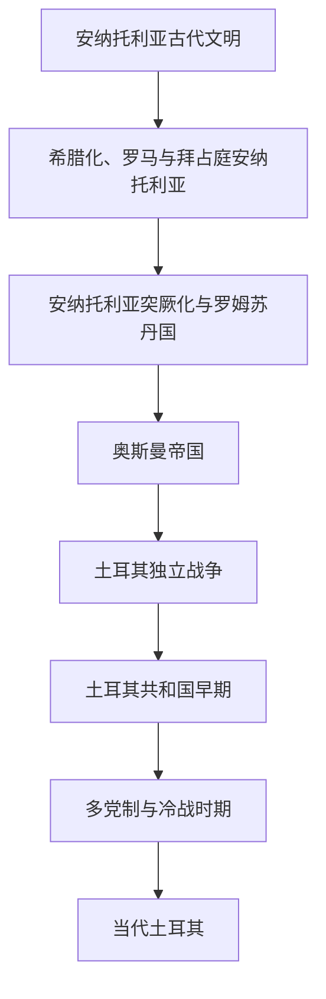

# 土耳其

## 历史主线

本目录以现代土耳其国家主线为中心整理。奥斯曼帝国虽然是跨区域帝国，曾统治巴尔干、阿拉伯地区、北非、黑海和东地中海，但土耳其共和国通常被视为其最直接继承国家，因此完整奥斯曼帝国史放在本目录维护；其他地区以后只需建立“奥斯曼统治时期”节点并引用本目录。

## 名称辨析

- “土耳其”主要指现代土耳其国家及其安纳托利亚历史主线。
- “奥斯曼帝国”是跨区域帝国，不等同于现代土耳其民族国家，但其王朝、首都和解体后的核心继承与土耳其关系最直接。
- “安纳托利亚”是地理区域，包含古代赫梯、希腊化、罗马、拜占庭和突厥化等多层历史。

## 演变图

## 按时间排序的时期导航

| 顺序 | 阶段 | 时间 | 入口 | 简要概括 |
|---:|---|---|---|---|
| 1 | 安纳托利亚古代文明 | 前3千纪-前6世纪 | [安纳托利亚古代文明](/%E4%BA%BA%E6%96%87%E7%A7%91%E5%AD%A6/%E5%8E%86%E5%8F%B2/%E8%A5%BF%E4%BA%9A/%E5%9C%9F%E8%80%B3%E5%85%B6/%E5%AE%89%E7%BA%B3%E6%89%98%E5%88%A9%E4%BA%9A%E5%8F%A4%E4%BB%A3%E6%96%87%E6%98%8E/README.md) | 安纳托利亚是赫梯、弗里吉亚、[吕底亚](/%E4%BA%BA%E6%96%87%E7%A7%91%E5%AD%A6/%E5%8E%86%E5%8F%B2/%E8%A5%BF%E4%BA%9A/%E5%9C%9F%E8%80%B3%E5%85%B6/%E5%AE%89%E7%BA%B3%E6%89%98%E5%88%A9%E4%BA%9A%E5%8F%A4%E4%BB%A3%E6%96%87%E6%98%8E/%E5%90%95%E5%BA%95%E4%BA%9A%E7%8E%8B%E5%9B%BD.md)、乌拉尔图等古代文明活动区域，长期连接爱琴海、两河流域和伊朗高原。 |
| 2 | 希腊化、罗马与拜占庭安纳托利亚 | 前6世纪-11世纪 | [希腊化、罗马与拜占庭安纳托利亚](/%E4%BA%BA%E6%96%87%E7%A7%91%E5%AD%A6/%E5%8E%86%E5%8F%B2/%E8%A5%BF%E4%BA%9A/%E5%9C%9F%E8%80%B3%E5%85%B6/%E5%B8%8C%E8%85%8A%E5%8C%96%E3%80%81%E7%BD%97%E9%A9%AC%E4%B8%8E%E6%8B%9C%E5%8D%A0%E5%BA%AD%E5%AE%89%E7%BA%B3%E6%89%98%E5%88%A9%E4%BA%9A.md) | 安纳托利亚先后受波斯、希腊化王国、罗马和拜占庭统治，拜占庭时期成为帝国核心腹地之一。 |
| 3 | 安纳托利亚突厥化与罗姆苏丹国 | 11世纪-14世纪 | [安纳托利亚突厥化与罗姆苏丹国](/%E4%BA%BA%E6%96%87%E7%A7%91%E5%AD%A6/%E5%8E%86%E5%8F%B2/%E8%A5%BF%E4%BA%9A/%E5%9C%9F%E8%80%B3%E5%85%B6/%E5%AE%89%E7%BA%B3%E6%89%98%E5%88%A9%E4%BA%9A%E7%AA%81%E5%8E%A5%E5%8C%96%E4%B8%8E%E7%BD%97%E5%A7%86%E8%8B%8F%E4%B8%B9%E5%9B%BD.md) | 1071年曼齐刻尔特战役后，突厥势力深入安纳托利亚，罗姆苏丹国和诸贝伊国推动安纳托利亚突厥化。 |
| 4 | 奥斯曼帝国时期 | 约1299年-1922年 | [奥斯曼帝国时期](/%E4%BA%BA%E6%96%87%E7%A7%91%E5%AD%A6/%E5%8E%86%E5%8F%B2/%E8%A5%BF%E4%BA%9A/%E5%9C%9F%E8%80%B3%E5%85%B6/%E5%A5%A5%E6%96%AF%E6%9B%BC%E5%B8%9D%E5%9B%BD%E6%97%B6%E6%9C%9F.md) | 奥斯曼帝国从安纳托利亚西北边境贝伊国发展为横跨欧亚非的帝国，是土耳其共和国最直接的帝国前身。 |
| 5 | 土耳其独立战争 | 1919年-1923年 | [土耳其独立战争](/%E4%BA%BA%E6%96%87%E7%A7%91%E5%AD%A6/%E5%8E%86%E5%8F%B2/%E8%A5%BF%E4%BA%9A/%E5%9C%9F%E8%80%B3%E5%85%B6/%E5%9C%9F%E8%80%B3%E5%85%B6%E7%8B%AC%E7%AB%8B%E6%88%98%E4%BA%89.md) | 一战后奥斯曼帝国被协约国瓜分，穆斯塔法·凯末尔领导民族运动，通过独立战争建立土耳其共和国。 |
| 6 | 土耳其共和国早期 | 1923年-1950年 | [土耳其共和国早期](/%E4%BA%BA%E6%96%87%E7%A7%91%E5%AD%A6/%E5%8E%86%E5%8F%B2/%E8%A5%BF%E4%BA%9A/%E5%9C%9F%E8%80%B3%E5%85%B6/%E5%9C%9F%E8%80%B3%E5%85%B6%E5%85%B1%E5%92%8C%E5%9B%BD%E6%97%A9%E6%9C%9F.md) | 共和国早期通过世俗化、拉丁字母、法律和教育改革重塑国家制度。 |
| 7 | 多党制与冷战时期 | 1950年-20世纪末 | [多党制与冷战时期](/%E4%BA%BA%E6%96%87%E7%A7%91%E5%AD%A6/%E5%8E%86%E5%8F%B2/%E8%A5%BF%E4%BA%9A/%E5%9C%9F%E8%80%B3%E5%85%B6/%E5%A4%9A%E5%85%9A%E5%88%B6%E4%B8%8E%E5%86%B7%E6%88%98%E6%97%B6%E6%9C%9F.md) | 1950年后土耳其进入多党竞争、军政干预、北约体系和冷战格局并存的阶段。 |
| 8 | 当代土耳其 | 20世纪末至今 | [当代土耳其](/%E4%BA%BA%E6%96%87%E7%A7%91%E5%AD%A6/%E5%8E%86%E5%8F%B2/%E8%A5%BF%E4%BA%9A/%E5%9C%9F%E8%80%B3%E5%85%B6/%E5%BD%93%E4%BB%A3%E5%9C%9F%E8%80%B3%E5%85%B6.md) | 当代土耳其在欧亚地缘、政党政治、经济转型和区域安全议题中持续重组国家方向。 |

## 安纳托利亚古代文明入口

- 古代安纳托利亚已升为目录：[安纳托利亚古代文明](/%E4%BA%BA%E6%96%87%E7%A7%91%E5%AD%A6/%E5%8E%86%E5%8F%B2/%E8%A5%BF%E4%BA%9A/%E5%9C%9F%E8%80%B3%E5%85%B6/%E5%AE%89%E7%BA%B3%E6%89%98%E5%88%A9%E4%BA%9A%E5%8F%A4%E4%BB%A3%E6%96%87%E6%98%8E/README.md)。
- 下级节点：[赫梯帝国](/%E4%BA%BA%E6%96%87%E7%A7%91%E5%AD%A6/%E5%8E%86%E5%8F%B2/%E8%A5%BF%E4%BA%9A/%E5%9C%9F%E8%80%B3%E5%85%B6/%E5%AE%89%E7%BA%B3%E6%89%98%E5%88%A9%E4%BA%9A%E5%8F%A4%E4%BB%A3%E6%96%87%E6%98%8E/%E8%B5%AB%E6%A2%AF%E5%B8%9D%E5%9B%BD.md)、[弗里吉亚王国](/%E4%BA%BA%E6%96%87%E7%A7%91%E5%AD%A6/%E5%8E%86%E5%8F%B2/%E8%A5%BF%E4%BA%9A/%E5%9C%9F%E8%80%B3%E5%85%B6/%E5%AE%89%E7%BA%B3%E6%89%98%E5%88%A9%E4%BA%9A%E5%8F%A4%E4%BB%A3%E6%96%87%E6%98%8E/%E5%BC%97%E9%87%8C%E5%90%89%E4%BA%9A%E7%8E%8B%E5%9B%BD.md)、[吕底亚王国](/%E4%BA%BA%E6%96%87%E7%A7%91%E5%AD%A6/%E5%8E%86%E5%8F%B2/%E8%A5%BF%E4%BA%9A/%E5%9C%9F%E8%80%B3%E5%85%B6/%E5%AE%89%E7%BA%B3%E6%89%98%E5%88%A9%E4%BA%9A%E5%8F%A4%E4%BB%A3%E6%96%87%E6%98%8E/%E5%90%95%E5%BA%95%E4%BA%9A%E7%8E%8B%E5%9B%BD.md)、[乌拉尔图王国](/%E4%BA%BA%E6%96%87%E7%A7%91%E5%AD%A6/%E5%8E%86%E5%8F%B2/%E8%A5%BF%E4%BA%9A/%E5%9C%9F%E8%80%B3%E5%85%B6/%E5%AE%89%E7%BA%B3%E6%89%98%E5%88%A9%E4%BA%9A%E5%8F%A4%E4%BB%A3%E6%96%87%E6%98%8E/%E4%B9%8C%E6%8B%89%E5%B0%94%E5%9B%BE%E7%8E%8B%E5%9B%BD.md)。

## 奥斯曼帝国入口

- 完整奥斯曼帝国史：[奥斯曼帝国](/%E4%BA%BA%E6%96%87%E7%A7%91%E5%AD%A6/%E5%8E%86%E5%8F%B2/%E8%A5%BF%E4%BA%9A/%E5%9C%9F%E8%80%B3%E5%85%B6/%E5%A5%A5%E6%96%AF%E6%9B%BC%E5%B8%9D%E5%9B%BD/README.md)。
- 其他地区如果涉及奥斯曼统治，应优先引用此目录，避免重复维护完整帝国史。

## 相关欧洲历史

- 安纳托利亚的罗马、拜占庭背景见[东罗马帝国与拜占庭帝国](/%E4%BA%BA%E6%96%87%E7%A7%91%E5%AD%A6/%E5%8E%86%E5%8F%B2/%E6%AC%A7%E6%B4%B2/_%E9%80%9A%E5%8F%B2/%E5%8F%A4%E7%BD%97%E9%A9%AC/%E4%B8%9C%E7%BD%97%E9%A9%AC%E5%B8%9D%E5%9B%BD%E4%B8%8E%E6%8B%9C%E5%8D%A0%E5%BA%AD%E5%B8%9D%E5%9B%BD.md)。
- 十字军运动与安纳托利亚突厥化相互关联，参见[十字军东征](/%E4%BA%BA%E6%96%87%E7%A7%91%E5%AD%A6/%E5%8E%86%E5%8F%B2/%E6%AC%A7%E6%B4%B2/_%E9%80%9A%E5%8F%B2/%E5%8D%81%E5%AD%97%E5%86%9B%E4%B8%9C%E5%BE%81/README.md)。
- 奥斯曼帝国进入巴尔干并最终攻陷君士坦丁堡，是欧洲史重要节点，参见[欧洲历史](/%E4%BA%BA%E6%96%87%E7%A7%91%E5%AD%A6/%E5%8E%86%E5%8F%B2/%E6%AC%A7%E6%B4%B2/README.md)。

## 相关区域

- 西亚区域总览：[西亚](/%E4%BA%BA%E6%96%87%E7%A7%91%E5%AD%A6/%E5%8E%86%E5%8F%B2/%E8%A5%BF%E4%BA%9A/README.md)。
- 伊朗与萨法维、恺加等对照：[伊朗](/%E4%BA%BA%E6%96%87%E7%A7%91%E5%AD%A6/%E5%8E%86%E5%8F%B2/%E8%A5%BF%E4%BA%9A/%E4%BC%8A%E6%9C%97/README.md)。
- 欧洲交叉节点：[东罗马帝国与拜占庭帝国](/%E4%BA%BA%E6%96%87%E7%A7%91%E5%AD%A6/%E5%8E%86%E5%8F%B2/%E6%AC%A7%E6%B4%B2/_%E9%80%9A%E5%8F%B2/%E5%8F%A4%E7%BD%97%E9%A9%AC/%E4%B8%9C%E7%BD%97%E9%A9%AC%E5%B8%9D%E5%9B%BD%E4%B8%8E%E6%8B%9C%E5%8D%A0%E5%BA%AD%E5%B8%9D%E5%9B%BD.md)、[十字军东征](/%E4%BA%BA%E6%96%87%E7%A7%91%E5%AD%A6/%E5%8E%86%E5%8F%B2/%E6%AC%A7%E6%B4%B2/_%E9%80%9A%E5%8F%B2/%E5%8D%81%E5%AD%97%E5%86%9B%E4%B8%9C%E5%BE%81/README.md)。
- 突厥—波斯化军事集团进入北印度后形成德里苏丹国和后续莫卧儿背景，南亚侧见[印度](/%E4%BA%BA%E6%96%87%E7%A7%91%E5%AD%A6/%E5%8E%86%E5%8F%B2/%E5%8D%97%E4%BA%9A/%E5%8D%B0%E5%BA%A6/README.md)。

## 相关西亚与北非历史

- 安纳托利亚突厥化与塞尔柱政治网络相关，参见[塞尔柱与突厥化时期](/%E4%BA%BA%E6%96%87%E7%A7%91%E5%AD%A6/%E5%8E%86%E5%8F%B2/%E8%A5%BF%E4%BA%9A/%E4%BC%8A%E6%9C%97/%E5%A1%9E%E5%B0%94%E6%9F%B1%E4%B8%8E%E7%AA%81%E5%8E%A5%E5%8C%96%E6%97%B6%E6%9C%9F.md)和[安纳托利亚突厥化与罗姆苏丹国](/%E4%BA%BA%E6%96%87%E7%A7%91%E5%AD%A6/%E5%8E%86%E5%8F%B2/%E8%A5%BF%E4%BA%9A/%E5%9C%9F%E8%80%B3%E5%85%B6/%E5%AE%89%E7%BA%B3%E6%89%98%E5%88%A9%E4%BA%9A%E7%AA%81%E5%8E%A5%E5%8C%96%E4%B8%8E%E7%BD%97%E5%A7%86%E8%8B%8F%E4%B8%B9%E5%9B%BD.md)。
- 奥斯曼帝国扩张到阿拉伯地区和北非，后续区域史应引用[奥斯曼帝国](/%E4%BA%BA%E6%96%87%E7%A7%91%E5%AD%A6/%E5%8E%86%E5%8F%B2/%E8%A5%BF%E4%BA%9A/%E5%9C%9F%E8%80%B3%E5%85%B6/%E5%A5%A5%E6%96%AF%E6%9B%BC%E5%B8%9D%E5%9B%BD/README.md)而不是重复维护完整帝国史。
- 奥斯曼与萨法维竞争是土耳其和伊朗共同节点，参见[萨法维王朝](/%E4%BA%BA%E6%96%87%E7%A7%91%E5%AD%A6/%E5%8E%86%E5%8F%B2/%E8%A5%BF%E4%BA%9A/%E4%BC%8A%E6%9C%97/%E8%90%A8%E6%B3%95%E7%BB%B4%E7%8E%8B%E6%9C%9D.md)。

## 目录层级

- 直接上级：[西亚](/%E4%BA%BA%E6%96%87%E7%A7%91%E5%AD%A6/%E5%8E%86%E5%8F%B2/%E8%A5%BF%E4%BA%9A/README.md)
- 历史总览：[历史](/%E4%BA%BA%E6%96%87%E7%A7%91%E5%AD%A6/%E5%8E%86%E5%8F%B2/README.md)
