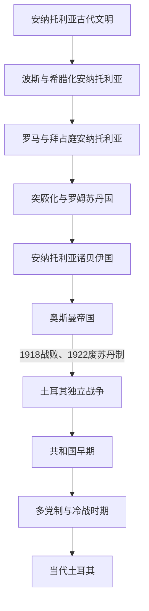

# 土耳其

## 历史主线

本目录以安纳托利亚及现代土耳其国家的前后政权为主线。安纳托利亚古代有多个并立文明，不能都视作“土耳其民族国家前身”；希腊化、罗马和拜占庭时期构成长期区域层，11世纪以后突厥迁徙、罗姆苏丹国和诸贝伊国推动语言、宗教与政治结构转变。奥斯曼帝国是跨欧亚非帝国，不等同于现代土耳其，但共和国直接继承其安纳托利亚核心、首都之外的大部分官僚和人口问题，完整奥斯曼通史因此在本目录维护。1919—1923年民族战争建立安卡拉主权中心，1923年共和国成立；此后经历一党改革、多党制、军方干预和2018年总统制转型。

## 演变图

图中箭头表示本地区主要政治阶段的先后，不表示古代各族群直系演化成现代土耳其人。奥斯曼帝国与独立战争在1919—1922年时间重叠，因为伊斯坦布尔苏丹政府和安卡拉大国民议会政府曾并立。

## 按时间排序的时期导航

| 顺序 | 阶段 | 时间 | 简要概括 |
|---:|---|---|---|
| 1 | [安纳托利亚古代文明](/%E4%BA%BA%E6%96%87%E7%A7%91%E5%AD%A6/%E5%8E%86%E5%8F%B2/%E8%A5%BF%E4%BA%9A/%E5%9C%9F%E8%80%B3%E5%85%B6/%E5%AE%89%E7%BA%B3%E6%89%98%E5%88%A9%E4%BA%9A%E5%8F%A4%E4%BB%A3%E6%96%87%E6%98%8E/README.md) | 约前17世纪—前6世纪 | 赫梯、弗里吉亚、乌拉尔图、吕底亚等在不同地区兴衰并部分重叠。 |
| 2 | [希腊化、罗马与拜占庭安纳托利亚](/%E4%BA%BA%E6%96%87%E7%A7%91%E5%AD%A6/%E5%8E%86%E5%8F%B2/%E8%A5%BF%E4%BA%9A/%E5%9C%9F%E8%80%B3%E5%85%B6/%E5%B8%8C%E8%85%8A%E5%8C%96%E3%80%81%E7%BD%97%E9%A9%AC%E4%B8%8E%E6%8B%9C%E5%8D%A0%E5%BA%AD%E5%AE%89%E7%BA%B3%E6%89%98%E5%88%A9%E4%BA%9A.md) | 前6世纪—11世纪 | 波斯行省、希腊化王国、罗马和拜占庭先后重塑城市、宗教与行政。 |
| 3 | [安纳托利亚突厥化与罗姆苏丹国](/%E4%BA%BA%E6%96%87%E7%A7%91%E5%AD%A6/%E5%8E%86%E5%8F%B2/%E8%A5%BF%E4%BA%9A/%E5%9C%9F%E8%80%B3%E5%85%B6/%E5%AE%89%E7%BA%B3%E6%89%98%E5%88%A9%E4%BA%9A%E7%AA%81%E5%8E%A5%E5%8C%96%E4%B8%8E%E7%BD%97%E5%A7%86%E8%8B%8F%E4%B8%B9%E5%9B%BD.md) | 11世纪中叶—14世纪初 | 迁徙、战争、苏菲网络、城市治理和蒙古征服共同推动突厥化与政治重组。 |
| 4 | [奥斯曼帝国时期](/%E4%BA%BA%E6%96%87%E7%A7%91%E5%AD%A6/%E5%8E%86%E5%8F%B2/%E8%A5%BF%E4%BA%9A/%E5%9C%9F%E8%80%B3%E5%85%B6/%E5%A5%A5%E6%96%AF%E6%9B%BC%E5%B8%9D%E5%9B%BD%E6%97%B6%E6%9C%9F.md) | 约1299—1922年 | 边疆贝伊国成长为跨区域帝国，历经鼎盛、制度转型、近代改革和战败解体。 |
| 5 | [土耳其独立战争](/%E4%BA%BA%E6%96%87%E7%A7%91%E5%AD%A6/%E5%8E%86%E5%8F%B2/%E8%A5%BF%E4%BA%9A/%E5%9C%9F%E8%80%B3%E5%85%B6/%E5%9C%9F%E8%80%B3%E5%85%B6%E7%8B%AC%E7%AB%8B%E6%88%98%E4%BA%89.md) | 1919—1923年 | 安卡拉民族运动击败分割方案，以洛桑体系取得国际承认。 |
| 6 | [土耳其共和国早期](/%E4%BA%BA%E6%96%87%E7%A7%91%E5%AD%A6/%E5%8E%86%E5%8F%B2/%E8%A5%BF%E4%BA%9A/%E5%9C%9F%E8%80%B3%E5%85%B6/%E5%9C%9F%E8%80%B3%E5%85%B6%E5%85%B1%E5%92%8C%E5%9B%BD%E6%97%A9%E6%9C%9F.md) | 1923—1950年 | 世俗法律、教育、文字与国家经济改革在一党主导下推进，战后转向多党选举。 |
| 7 | [多党制与冷战时期](/%E4%BA%BA%E6%96%87%E7%A7%91%E5%AD%A6/%E5%8E%86%E5%8F%B2/%E8%A5%BF%E4%BA%9A/%E5%9C%9F%E8%80%B3%E5%85%B6/%E5%A4%9A%E5%85%9A%E5%88%B6%E4%B8%8E%E5%86%B7%E6%88%98%E6%97%B6%E6%9C%9F.md) | 1950—1991年 | 竞争选举、北约结盟、经济变迁与1960、1971、1980年军方干预交错。 |
| 8 | [当代土耳其](/%E4%BA%BA%E6%96%87%E7%A7%91%E5%AD%A6/%E5%8E%86%E5%8F%B2/%E8%A5%BF%E4%BA%9A/%E5%9C%9F%E8%80%B3%E5%85%B6/%E5%BD%93%E4%BB%A3%E5%9C%9F%E8%80%B3%E5%85%B6.md) | 1991—2026年7月 | 联合政府、正义与发展党长期执政、2016未遂政变、总统制与库尔德和平进程构成主要转折。 |

## 专题与专表

| 主题 | 入口 | 说明 |
|---|---|---|
| 奥斯曼帝国全史 | [奥斯曼帝国](/%E4%BA%BA%E6%96%87%E7%A7%91%E5%AD%A6/%E5%8E%86%E5%8F%B2/%E8%A5%BF%E4%BA%9A/%E5%9C%9F%E8%80%B3%E5%85%B6/%E5%A5%A5%E6%96%AF%E6%9B%BC%E5%B8%9D%E5%9B%BD/README.md) | 分阶段整理扩张、制度、改革和解体。 |
| 奥斯曼36位苏丹 | [奥斯曼苏丹世系表](/%E4%BA%BA%E6%96%87%E7%A7%91%E5%AD%A6/%E5%8E%86%E5%8F%B2/%E8%A5%BF%E4%BA%9A/%E5%9C%9F%E8%80%B3%E5%85%B6/%E5%A5%A5%E6%96%AF%E6%9B%BC%E5%B8%9D%E5%9B%BD/%E5%A5%A5%E6%96%AF%E6%9B%BC%E8%8B%8F%E4%B8%B9%E4%B8%96%E7%B3%BB%E8%A1%A8.md) | 含空位期争位者、复位、废立与实际权力说明。 |
| 共和国领导层 | [土耳其共和国国家元首与政府首脑表](/%E4%BA%BA%E6%96%87%E7%A7%91%E5%AD%A6/%E5%8E%86%E5%8F%B2/%E8%A5%BF%E4%BA%9A/%E5%9C%9F%E8%80%B3%E5%85%B6/%E5%9C%9F%E8%80%B3%E5%85%B6%E5%85%B1%E5%92%8C%E5%9B%BD%E5%9B%BD%E5%AE%B6%E5%85%83%E9%A6%96%E4%B8%8E%E6%94%BF%E5%BA%9C%E9%A6%96%E8%84%91%E8%A1%A8.md) | 分列总统、27位总理、代理任职、军方委员会和2018年后总统制。 |

## 重要转折与时间节点

| 时间 | 转折 | 意义 |
|---|---|---|
| 约前1650年 | 哈图沙赫梯王权形成 | 安纳托利亚进入可由本地王室档案连续追踪的帝国阶段。 |
| 约前1190—前1180年 | 赫梯统一王权解体 | 中部、东部和西部分别出现新的政治中心。 |
| 前546年前后 | 波斯征服吕底亚 | 安纳托利亚大部进入阿契美尼德帝国。 |
| 330年 | 君士坦丁堡建都 | 安纳托利亚成为东罗马帝国核心腹地。 |
| 1071年 | 曼齐刻尔特战役 | 拜占庭内战与突厥迁徙共同加速中部控制重组。 |
| 1243年 | 罗姆苏丹国克塞山战败 | 蒙古宗主权和地方贝伊国崛起。 |
| 1453年 | 奥斯曼征服君士坦丁堡 | 帝国获得新首都，拜占庭王权终结。 |
| 1699年 | 《卡洛维茨条约》 | 奥斯曼在欧洲由扩张转为长期领土净损失。 |
| 1839年 | 坦志麦特开始 | 近代中央行政、法律和臣民制度重组。 |
| 1908—1913年 | 恢复宪政与联合进步委员会掌权 | 帝国权力由宫廷转向议会、政党和军官集团竞争。 |
| 1922—1923年 | 废除苏丹制、洛桑条约、共和国成立 | 王朝帝国转为以民族主权为合法性的共和国。 |
| 1950年 | 首次和平政党轮替 | 一党主导结束，多党制成为正式政治框架。 |
| 1960、1971、1980、1997年 | 不同形式军方干预 | 军队长期扮演宪制监护者，干预方式从政变到施压不等。 |
| 2018年 | 总统制实施 | 总理职位取消，总统兼任行政首脑。 |
| 2025—2026年 | PKK宣布解散、议会讨论解除武装后法律安排 | 和平进程出现重大转折，但截至2026年7月具体融入立法尚未完成。 |

## 关键辨析

- “安纳托利亚史”是地区史；赫梯、罗马、拜占庭、塞尔柱和奥斯曼之间存在制度与人口连续，也有征服、迁徙和断裂。
- 1071年并非拜占庭一日内失去全部安纳托利亚；突厥化和伊斯兰化持续数世纪。
- 奥斯曼帝国不是单一民族国家，其阿拉伯、巴尔干和北非领土应在各地区另述当地经验，本目录只维护帝国共同主线。
- 共和国总统在1923—2018年通常不等于政府首脑；1960—1961、1980—1983年军方委员会又高于日常内阁。2018年后才由总统兼行政首脑。
- 当代“至今”内容以2026年7月为截止；尚在推进的解除武装与融入立法不写成已经完成。

## 上级

- [西亚历史](/%E4%BA%BA%E6%96%87%E7%A7%91%E5%AD%A6/%E5%8E%86%E5%8F%B2/%E8%A5%BF%E4%BA%9A/README.md)
- [历史总览](/%E4%BA%BA%E6%96%87%E7%A7%91%E5%AD%A6/%E5%8E%86%E5%8F%B2/README.md)
