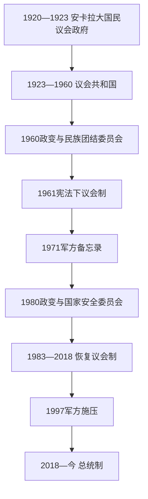

# 土耳其共和国国家元首与政府首脑表

## 范围

本表从1920年安卡拉大国民议会政府列至2026年7月，区分国家元首、政府首脑、代理任职和实际军政权力。1923—2018年通常由总统担任国家元首、总理主持内阁；1960—1961年和1980—1983年军方委员会掌握最高权力，1971年与1997年则是在议会形式保留时迫使政府更替。2018年7月9日起总理职位取消，总统同时成为国家元首和行政首脑。

## 制度演变图

## 独立战争时期的安卡拉政府首脑

| 顺序 | 政府首脑 | 任期 | 实际权力与说明 |
|---:|---|---|---|
| 1 | **穆斯塔法·凯末尔** | 1920年5月3日—1921年1月24日 | 大国民议会议长兼执行部长会议主席，是民族运动政治与军事核心。 |
| 2 | 费夫齐·恰克马克 | 1921年1月24日—1922年7月9日 | 在议会政府制下主持执行部长会议，同时承担主要军事职责。 |
| 3 | 拉乌夫·奥尔巴伊 | 1922年7月12日—1923年8月4日 | 主持停战、洛桑谈判前期和废除苏丹制后的政府。 |
| 4 | 费特希·奥克亚尔 | 1923年8月14日—10月27日 | 共和国宣布前最后一任执行部长会议主席。 |

这一表属于革命政府，不计入共和国27位正式总理的编号。

## 历任总统

| 顺序 | 总统 | 任期 | 产生方式与实际地位 |
|---:|---|---|---|
| 1 | **穆斯塔法·凯末尔·阿塔图尔克** | 1923年10月29日—1938年11月10日 | 由议会四次选举；兼共和人民党核心领袖，实际主导建国和一党改革。 |
| 2 | **伊斯麦特·伊诺努** | 1938年11月11日—1950年5月22日 | 由议会选举；“民族领袖”时期掌握一党体制核心权力，战后开放多党竞争。 |
| 3 | 杰拉勒·拜亚尔 | 1950年5月22日—1960年5月27日 | 由议会选举；民主党执政时期国家元首，1960年政变被推翻。 |
| 4 | 杰马勒·古尔塞尔 | 1960年5月27日—1966年3月28日 | 先任民族团结委员会主席和国家元首，1961年10月后为议会选举总统；军政过渡色彩强。 |
| 5 | 杰夫德特·苏奈 | 1966年3月28日—1973年3月28日 | 前总参谋长，由议会选举；1971年军方备忘录期间在位。 |
| 6 | 法赫里·科鲁蒂尔克 | 1973年4月6日—1980年4月6日 | 前海军司令，由议会选举；联合政府与政治暴力时期在位。 |
| 7 | **凯南·埃夫伦** | 1980年9月12日—1989年11月9日 | 1980—1982年以国家安全委员会主席、国家元首身份统治；1982年宪法公投后任总统。 |
| 8 | 图尔古特·厄扎尔 | 1989年11月9日—1993年4月17日 | 由议会选举；在外交、市场化和库尔德问题上扩大总统能动性。 |
| 9 | 苏莱曼·德米雷尔 | 1993年5月16日—2000年5月16日 | 由议会选举；联合政府和1997年军方施压时期在位。 |
| 10 | 艾哈迈德·内吉代特·塞泽尔 | 2000年5月16日—2007年8月28日 | 前宪法法院院长，由议会选举；与内阁在任命、世俗主义等问题上多次冲突。 |
| 11 | 阿卜杜拉·居尔 | 2007年8月28日—2014年8月28日 | 由议会选举；2007年修宪后总统改为全民直选，但修正制度从下一任起实施。 |
| 12 | **雷杰普·塔伊普·埃尔多安** | 2014年8月28日至今 | 2014年首次全民直选，2018年起兼行政首脑；2023年再次当选，截至2026年7月仍在任。 |

## 代理国家元首与军政过渡

| 人物 / 机构 | 时间 | 身份与权限 |
|---|---|---|
| 阿卜杜勒哈利克·伦达 | 1938年11月10—11日 | 阿塔图尔克去世后，作为议长短期代理国家元首。 |
| 民族团结委员会，主席杰马勒·古尔塞尔 | 1960年5月27日—1961年10月 | 政变后暂停旧议会，委员会兼握制宪与行政最高权力；古尔塞尔同时任政府首脑至1961年10月。 |
| 易卜拉欣·谢夫基·阿塔萨贡 | 1966年2月2日—3月28日 | 古尔塞尔患病不能履职时，作为共和国参议院议长代理国家元首职能。 |
| 泰金·阿勒布伦 | 1973年3月28日—4月6日 | 总统任期届满、议会尚未选出继任者时代理。 |
| 伊赫桑·萨布里·恰拉扬吉尔 | 1980年4月6日—9月12日 | 科鲁蒂尔克任满后以参议院议长代理，至1980年政变。 |
| 国家安全委员会，主席凯南·埃夫伦 | 1980年9月12日—1983年12月 | 解散议会、政党并控制立法与行政；1982年宪法公投后逐步把日常政府交给文官内阁。 |
| 许萨梅丁·金多鲁克 | 1993年4月17日—5月16日 | 厄扎尔去世后，作为议长代理国家元首。 |

## 历任共和国总理

下表列出27位正式总理，复任者在同一行列出全部任期。日期按内阁就任与离任计算；仅短期代理者另表，不占正式顺序。

| 顺序 | 总理 | 全部任期 | 主要政治阶段 |
|---:|---|---|---|
| 1 | **伊斯麦特·伊诺努** | 1923年10月30日—1924年11月22日；1925年3月6日—1937年11月1日；1961年10月27日—1965年2月20日 | 共和国初期改革执行者；1961年后又主持三个联合政府。 |
| 2 | 费特希·奥克亚尔 | 1924年11月22日—1925年3月6日 | 东部叛乱和反对党形成时的短期政府。 |
| 3 | 杰拉勒·拜亚尔 | 1937年11月1日—1939年1月25日 | 一党体制后期，强调经济和行政实务。 |
| 4 | 雷菲克·赛达姆 | 1939年1月25日—1942年7月8日 | 二战初期动员、配给与中立政策。 |
| 5 | 许克吕·萨拉焦卢 | 1942年7月9日—1946年8月7日 | 二战后期与多党化开端。 |
| 6 | 雷杰普·佩克尔 | 1946年8月7日—1947年9月10日 | 首次多党选举后的共和人民党政府。 |
| 7 | 哈桑·萨卡 | 1947年9月10日—1949年1月16日 | 加入西方援助与安全体系的转向。 |
| 8 | 谢姆塞丁·居纳尔塔伊 | 1949年1月16日—1950年5月22日 | 主持1950年选举和和平交权。 |
| 9 | **阿德南·曼德列斯** | 1950年5月22日—1960年5月27日 | 民主党十年执政；政变后被审判并处决。 |
| 10 | 杰马勒·古尔塞尔 | 1960年5月27日—1961年10月27日 | 军政府首脑，同时为国家元首。 |
| 11 | 苏阿特·海里·于尔居普吕 | 1965年2月20日—10月27日 | 过渡联合政府。 |
| 12 | **苏莱曼·德米雷尔** | 1965年10月27日—1971年3月26日；1975年3月31日—1977年6月21日；1977年7月21日—1978年1月5日；1979年11月12日—1980年9月12日；1991年11月20日—1993年5月16日 | 多次组阁，分别被1971备忘录和1980政变迫使离任；冷战后再任。 |
| 13 | 尼哈特·埃里姆 | 1971年3月26日—1972年4月17日 | 军方备忘录后“超党派”技术官僚政府。 |
| 14 | 费里特·梅伦 | 1972年4月17日—1973年4月15日 | 继续备忘录后的军方监护。 |
| 15 | 纳伊姆·塔卢 | 1973年4月15日—1974年1月25日 | 军方影响下的过渡政府，至选举后联合内阁成立。 |
| 16 | **比伦特·埃杰维特** | 1974年1月25日—11月17日；1977年6月21日—7月21日；1978年1月5日—1979年11月12日；1999年1月11日—2002年11月18日 | 塞浦路斯行动、1970年代危机和1999—2002联合政府。 |
| 17 | 萨迪·伊尔马克 | 1974年11月17日—1975年3月31日 | 未获议会信任仍以看守内阁维持行政。 |
| 18 | 比连德·乌卢苏 | 1980年9月21日—1983年12月13日 | 军政府任命的退役海军将领，日常行政受国家安全委员会控制。 |
| 19 | **图尔古特·厄扎尔** | 1983年12月13日—1989年11月9日 | 恢复选举后的市场化和出口导向改革。 |
| 20 | 耶尔德勒姆·阿克布卢特 | 1989年11月9日—1991年6月23日 | 祖国党政府。 |
| 21 | **梅苏特·耶尔马兹** | 1991年6月23日—11月20日；1996年3月6日—6月28日；1997年6月30日—1999年1月11日 | 三次短期或联合政府，第三次接替受军方施压辞职的埃尔巴坎。 |
| 22 | **坦苏·奇莱尔** | 1993年6月25日—1996年3月6日 | 首位女性总理；经济危机、库尔德冲突和联合政府时期。 |
| 23 | 内吉梅丁·埃尔巴坎 | 1996年6月28日—1997年6月30日 | 福利党领袖；二二八进程后辞职。 |
| 24 | 阿卜杜拉·居尔 | 2002年11月18日—2003年3月14日 | 正义与发展党首届过渡政府。 |
| 25 | **雷杰普·塔伊普·埃尔多安** | 2003年3月14日—2014年8月28日 | 欧盟改革、经济增长与后期权力集中并行；后转任总统。 |
| 26 | 艾哈迈德·达武特奥卢 | 2014年8月28日—2016年5月24日 | 叙利亚战争、难民与国内安全冲突加重。 |
| 27 | **比纳利·耶尔德勒姆** | 2016年5月24日—2018年7月9日 | 最后一任总理，主持2017修宪后向总统制过渡。 |

## 代理总理

| 代理者 | 时间 | 原因 |
|---|---|---|
| 艾哈迈德·菲克里·蒂泽尔 | 1942年7月8—9日 | 赛达姆任内去世后短期代理，随后萨拉焦卢组阁。 |
| 埃尔达尔·伊诺努 | 1993年5月16日—6月25日 | 德米雷尔转任总统后代理，至奇莱尔组阁。 |

短暂代行日常职务而未形成独立内阁者不另计为正式总理。

## 2018年后的行政首脑与副总统

| 职位 | 人物 | 任期 | 权力结构 |
|---|---|---|---|
| 总统兼行政首脑 | **雷杰普·塔伊普·埃尔多安** | 2018年7月9日至今 | 任免副总统、部长与高级官员，可发布总统令；预算需经议会审议，法律优先于总统令。 |
| 副总统 | 福阿德·奥克塔伊 | 2018年7月9日—2023年6月3日 | 首任副总统，在总统缺位或授权时代理行政职能。 |
| 副总统 | 杰夫德特·耶尔马兹 | 2023年6月3日至今 | 截至2026年7月在任，协调经济和跨部门政策；政治权力仍以总统为中心。 |

## 实际军政权力阶段

| 阶段 | 法定政府 | 实际最高权力 |
|---|---|---|
| 1923—1950年 | 总统、总理、议会 | 共和人民党一党体制；阿塔图尔克、伊诺努兼具国家元首和执政党核心地位。 |
| 1950—1960年 | 多党议会制 | 民主党议会多数与曼德列斯内阁掌日常权力，总统拜亚尔深度参与党政。 |
| 1960—1961年 | 军政过渡 | 民族团结委员会高于内阁和被暂停的旧议会。 |
| 1961—1971年 | 议会制 | 总理与联合政府执政，军方通过国家安全委员会和政治威望保持否决能力。 |
| 1971—1973年 | 议会形式保留 | 总参谋部备忘录迫使德米雷尔辞职，连续技术官僚内阁受军方政策约束。 |
| 1973—1980年 | 多党议会制 | 联合政府频繁更替，军方、总统和安全官僚影响扩大，最终发生政变。 |
| 1980—1983年 | 军政府 | 国家安全委员会控制立法、行政和制宪，比连德·乌卢苏内阁负责日常行政。 |
| 1983—1997年 | 议会制恢复 | 文官总理掌政府，1982年宪法仍赋总统和国家安全委员会较强地位。 |
| 1997—2002年 | 议会制、军方监护减弱前夕 | 1997年军方以国家安全委员会决议和官僚压力迫使埃尔巴坎辞职，未直接解散议会。 |
| 2002—2016年 | 议会制 | 正义与发展党长期多数；民选政府逐步削弱军方直接监护，随后行政权向埃尔多安个人与党组织集中。 |
| 2016—2018年 | 紧急状态下议会制 | 未遂政变失败，政府大规模整编军队、司法和官僚体系；总理仍法定存在。 |
| 2018年至今 | 总统制 | 总统兼任国家元首和行政首脑，不再设总理；内阁对总统负责，议会继续立法、审预算和监督。 |

## 相关阶段

- 建国过程：[土耳其独立战争](/%E4%BA%BA%E6%96%87%E7%A7%91%E5%AD%A6/%E5%8E%86%E5%8F%B2/%E8%A5%BF%E4%BA%9A/%E5%9C%9F%E8%80%B3%E5%85%B6/%E5%9C%9F%E8%80%B3%E5%85%B6%E7%8B%AC%E7%AB%8B%E6%88%98%E4%BA%89.md)。
- 一党国家：[土耳其共和国早期](/%E4%BA%BA%E6%96%87%E7%A7%91%E5%AD%A6/%E5%8E%86%E5%8F%B2/%E8%A5%BF%E4%BA%9A/%E5%9C%9F%E8%80%B3%E5%85%B6/%E5%9C%9F%E8%80%B3%E5%85%B6%E5%85%B1%E5%92%8C%E5%9B%BD%E6%97%A9%E6%9C%9F.md)。
- 军政干预与冷战：[多党制与冷战时期](/%E4%BA%BA%E6%96%87%E7%A7%91%E5%AD%A6/%E5%8E%86%E5%8F%B2/%E8%A5%BF%E4%BA%9A/%E5%9C%9F%E8%80%B3%E5%85%B6/%E5%A4%9A%E5%85%9A%E5%88%B6%E4%B8%8E%E5%86%B7%E6%88%98%E6%97%B6%E6%9C%9F.md)。
- 当代制度：[当代土耳其](/%E4%BA%BA%E6%96%87%E7%A7%91%E5%AD%A6/%E5%8E%86%E5%8F%B2/%E8%A5%BF%E4%BA%9A/%E5%9C%9F%E8%80%B3%E5%85%B6/%E5%BD%93%E4%BB%A3%E5%9C%9F%E8%80%B3%E5%85%B6.md)。
- 总入口：[土耳其](/%E4%BA%BA%E6%96%87%E7%A7%91%E5%AD%A6/%E5%8E%86%E5%8F%B2/%E8%A5%BF%E4%BA%9A/%E5%9C%9F%E8%80%B3%E5%85%B6/README.md)。
