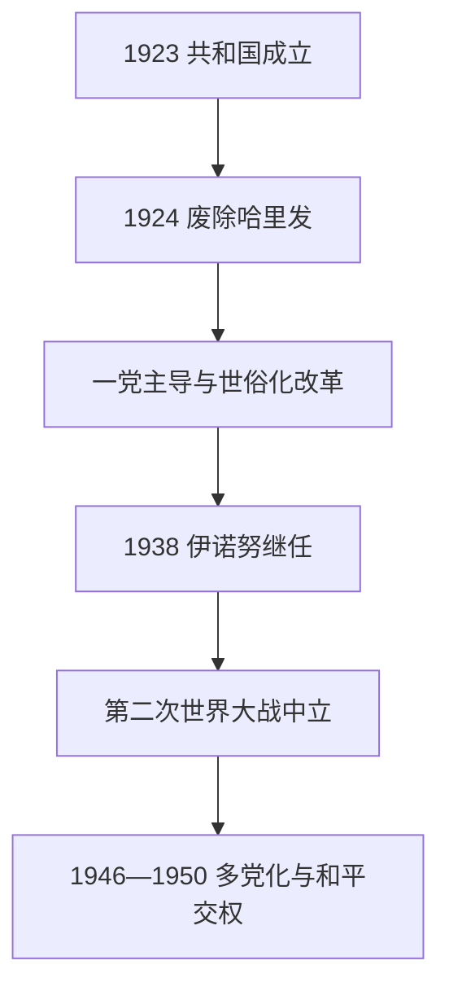

# 土耳其共和国早期

## 时间

1923年—1950年

## 概括

共和国早期把独立战争形成的安卡拉政权改造为世俗民族国家。凯末尔和共和人民党以议会为法律中心，但长期维持一党主导，通过废除哈里发、统一教育、采用欧洲法典、拉丁字母和姓氏制度重塑国家与社会。改革扩大教育和官僚能力，也压缩宗教机构、库尔德地方认同及反对党活动。伊诺努时期在第二次世界大战中保持中立，战后转向竞争性多党选举。

## 国家元首

| 顺序 | 总统 | 任期 | 说明 |
|---:|---|---|---|
| 1 | **穆斯塔法·凯末尔·阿塔图尔克** | 1923—1938 | 共和国创建者；连续四次由议会选举，主导世俗化、民族国家和国家主义改革。 |
| 2 | **伊斯麦特·伊诺努** | 1938—1950 | 前独立战争将领；实行“民族领袖”时期的一党统治，二战保持中立，战后开放多党竞争。 |

## 政府首脑

| 总理 | 任期 | 主要作用 |
|---|---|---|
| 伊斯麦特·伊诺努 | 1923—1924；1925—1937 | 承担多数凯末尔改革的政府执行；镇压1925年叛乱。 |
| 费特希·奥克亚尔 | 1924—1925 | 较温和政府；东部叛乱后辞职。 |
| 杰拉勒·拜亚尔 | 1937—1939 | 强调经济实务，后成为民主党创建者。 |
| 雷菲克·赛达姆 | 1939—1942 | 二战初期管制经济与动员。 |
| 艾哈迈德·菲克里·蒂泽尔 | 1942年短期代理 | 赛达姆去世后临时主持政府。 |
| 许克吕·萨拉焦卢 | 1942—1946 | 二战中立与战时税制；1945年对德日宣战以参与战后国际组织。 |
| 雷杰普·佩克尔 | 1946—1947 | 首次多党选举后的共和人民党政府。 |
| 哈桑·萨卡 | 1947—1949 | 推动对美合作与西方援助。 |
| 谢姆塞丁·居纳尔塔伊 | 1949—1950 | 放宽部分宗教教育政策，主持向民主党移交政权。 |

## 制度与社会改革

- **1923年定都安卡拉**：以安纳托利亚内陆的民族运动中心取代帝国首都伊斯坦布尔。
- **1924年废除哈里发**：奥斯曼王族被逐，宗教基金和宗教学校纳入国家管理，教育统一。
- **法律世俗化**：1926年采用以瑞士民法为蓝本的民法典，并改革刑法、商法；宗教法庭被取消。
- **文字与语言**：1928年以拉丁字母取代奥斯曼土耳其文所用阿拉伯字母；国家推动识字运动和语言“纯化”。
- **公民身份**：1934年姓氏法要求采用固定姓氏；女性获地方及全国选举权，但社会参与仍受城乡差异限制。
- **国家主义经济**：1930年代在私人资本不足和全球萧条下建设国营工业、铁路和银行。
- **民族同质化**：人口交换后非穆斯林比例显著下降；国家以统一土耳其身份处理语言与族群差异。

## 重要事件

- 1923年10月29日共和国成立，凯末尔当选总统。
- 1924年废哈里发与新宪法确立议会共和国。
- 1925年谢赫赛义德叛乱结合宗教、地方和库尔德因素，政府以《维持秩序法》镇压并限制反对派。
- 1925年进步共和党被解散；1930年自由共和党短暂成立后解散，显示有限反对党实验失败。
- 1928年宪法删除国教条款并推行拉丁字母；1937年世俗主义等原则写入宪法。
- 1937—1938年德尔西姆军事行动造成大量死亡和迁徙，是共和国民族整合中的重大暴力事件。
- 1938年阿塔图尔克去世，伊诺努继任。
- 1939—1945年土耳其避免直接参战，但实行征兵、配给和财富税；财富税对非穆斯林商人打击尤重。
- 1946年首次多党选举存在程序争议；1950年民主党赢得较自由选举，共和人民党和平交权。

## 成效、矛盾与阶段转折

改革建立统一教育、世俗法律、现代官僚和国家工业，显著改变社会日常。其自上而下方式、一党统治和军事镇压使政治参与有限；库尔德认同、宗教表达和少数群体权利成为长期争议。二战后苏联压力、加入西方体系的需要和国内社会分化推动多党化。1950年政权和平轮替标志共和国从一党国家进入[多党制与冷战时期](/%E4%BA%BA%E6%96%87%E7%A7%91%E5%AD%A6/%E5%8E%86%E5%8F%B2/%E8%A5%BF%E4%BA%9A/%E5%9C%9F%E8%80%B3%E5%85%B6/%E5%A4%9A%E5%85%9A%E5%88%B6%E4%B8%8E%E5%86%B7%E6%88%98%E6%97%B6%E6%9C%9F.md)。

## 演进图

## 完整领导人专表

本页保留本阶段总统和总理摘要；全部总统、27位正式总理、代理任职及实际军政权力分期见[土耳其共和国国家元首与政府首脑表](/%E4%BA%BA%E6%96%87%E7%A7%91%E5%AD%A6/%E5%8E%86%E5%8F%B2/%E8%A5%BF%E4%BA%9A/%E5%9C%9F%E8%80%B3%E5%85%B6/%E5%9C%9F%E8%80%B3%E5%85%B6%E5%85%B1%E5%92%8C%E5%9B%BD%E5%9B%BD%E5%AE%B6%E5%85%83%E9%A6%96%E4%B8%8E%E6%94%BF%E5%BA%9C%E9%A6%96%E8%84%91%E8%A1%A8.md)。

## 演变关系

- 前一阶段：[土耳其独立战争](/%E4%BA%BA%E6%96%87%E7%A7%91%E5%AD%A6/%E5%8E%86%E5%8F%B2/%E8%A5%BF%E4%BA%9A/%E5%9C%9F%E8%80%B3%E5%85%B6/%E5%9C%9F%E8%80%B3%E5%85%B6%E7%8B%AC%E7%AB%8B%E6%88%98%E4%BA%89.md)。
- 后一阶段：[多党制与冷战时期](/%E4%BA%BA%E6%96%87%E7%A7%91%E5%AD%A6/%E5%8E%86%E5%8F%B2/%E8%A5%BF%E4%BA%9A/%E5%9C%9F%E8%80%B3%E5%85%B6/%E5%A4%9A%E5%85%9A%E5%88%B6%E4%B8%8E%E5%86%B7%E6%88%98%E6%97%B6%E6%9C%9F.md)。
- 上级：[土耳其](/%E4%BA%BA%E6%96%87%E7%A7%91%E5%AD%A6/%E5%8E%86%E5%8F%B2/%E8%A5%BF%E4%BA%9A/%E5%9C%9F%E8%80%B3%E5%85%B6/README.md)。
