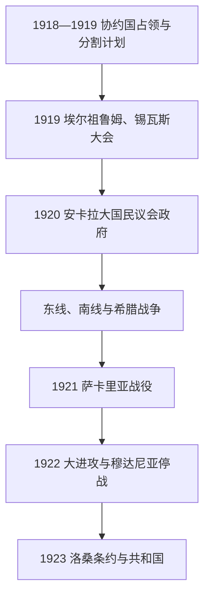

# 土耳其独立战争

## 时间

1919年—1923年

## 概括

第一次世界大战后，协约国依据停战条款占领奥斯曼战略地区，并计划按《色佛尔条约》分割安纳托利亚。穆斯塔法·凯末尔及地方抵抗组织把分散的保乡力量整合到安卡拉大国民议会之下，先后与亚美尼亚共和国、法国占领军、希腊军队及伊斯坦布尔苏丹政府对抗。军事胜利和外交谈判废除了分割方案，1923年《洛桑条约》确认新国家边界；同年土耳其共和国成立。

## 参战方与权力中心

| 力量 | 目标与作用 |
|---|---|
| 安卡拉大国民议会政府 | 主张民族主权，拒绝《色佛尔条约》，建立军队、税收和外交体系。 |
| 伊斯坦布尔苏丹政府 | 在协约国占领下维持王朝与条约合法性，曾派军镇压民族运动。 |
| 希腊王国 | 1919年登陆士麦那，试图控制爱琴海沿岸和西安纳托利亚。 |
| 法国与亚美尼亚军队 | 法国控制奇里乞亚等地；亚美尼亚共和国与民族军争夺东部边界。 |
| 英国、意大利及其他协约国 | 英国控制海峡并支持分割秩序；意大利占西南部，但较早与安卡拉妥协。 |
| 苏俄 | 为制衡协约国并稳定高加索，向安卡拉提供武器和资金，双方划定边界。 |

## 过程

### 组织民族运动（1919—1920）

1919年5月19日穆斯塔法·凯末尔抵达萨姆松。阿马西亚通告提出国家独立将由民族意志挽救；埃尔祖鲁姆和锡瓦斯大会把地方保卫权利组织联合起来。1920年协约国正式占领伊斯坦布尔并解散议会后，安卡拉召开大国民议会，形成与苏丹政府并立的国家权力。

### 多线战争与正规化（1920—1921）

东线军击败亚美尼亚共和国，1920年《亚历山德罗波尔条约》及随后与苏俄、高加索共和国的条约确定东部边界。南线地方武装抵抗法国，1921年《安卡拉协定》使法国撤出大部奇里乞亚。西线最初由地方民兵承担，后转为议会控制的正规军；伊斯麦特帕夏在两次伊诺努战役中阻止希腊推进。

### 决战与停战（1921—1922）

希腊军推进至安卡拉附近，1921年萨卡里亚战役持续三周后撤退。1922年8月“大进攻”和杜姆卢珀纳尔战役击溃希腊主力，土军进入士麦那；城市火灾与人口逃亡造成灾难。军队向海峡推进引发与英军对峙，最终以《穆达尼亚停战协定》结束战斗。

## 重要事件

- 1919年希腊军登陆士麦那，暴力冲突使地方抵抗迅速扩大。
- 1919年埃尔祖鲁姆、锡瓦斯大会建立统一政治纲领。
- 1920年安卡拉大国民议会开幕；伊斯坦布尔政府签署《色佛尔条约》。
- 1920年东线胜利和1921年《莫斯科条约》稳定东部。
- 1921年萨卡里亚战役阻止希腊军夺取安卡拉，穆斯塔法·凯末尔获元帅称号。
- 1922年“大进攻”结束希腊在安纳托利亚的军事存在。
- 1922年11月大国民议会废除苏丹制，[奥斯曼帝国](/%E4%BA%BA%E6%96%87%E7%A7%91%E5%AD%A6/%E5%8E%86%E5%8F%B2/%E8%A5%BF%E4%BA%9A/%E5%9C%9F%E8%80%B3%E5%85%B6/%E5%A5%A5%E6%96%AF%E6%9B%BC%E5%B8%9D%E5%9B%BD/README.md)终结。
- 1923年《洛桑条约》取代《色佛尔条约》，国际承认土耳其主权与大体边界。
- 希土人口交换以宗教身份为主要标准，强制迁移约数百万人，造成长期财产和记忆问题。

## 胜利原因与代价

民族运动成功在于把地方组织纳入议会与正规军，利用希腊军补给线过长、协约国利益分裂和苏俄援助，并在军事胜利后及时谈判。其代价包括安纳托利亚希腊人和土耳其穆斯林的大规模迁移、城市破坏及少数群体空间急剧收缩。独立战争建立的是以民族主权和安卡拉议会为合法性的新国家，不是奥斯曼帝国简单更名。

## 演进图

## 政府首脑专表

民族运动内部的国家元首、执行部长会议主席和共和国总理不能混为一谈。1920—1923年安卡拉政府首脑的完整任期见[土耳其共和国国家元首与政府首脑表](/%E4%BA%BA%E6%96%87%E7%A7%91%E5%AD%A6/%E5%8E%86%E5%8F%B2/%E8%A5%BF%E4%BA%9A/%E5%9C%9F%E8%80%B3%E5%85%B6/%E5%9C%9F%E8%80%B3%E5%85%B6%E5%85%B1%E5%92%8C%E5%9B%BD%E5%9B%BD%E5%AE%B6%E5%85%83%E9%A6%96%E4%B8%8E%E6%94%BF%E5%BA%9C%E9%A6%96%E8%84%91%E8%A1%A8.md)。

## 演变关系

- 前一阶段：[第一次世界大战与奥斯曼帝国解体](/%E4%BA%BA%E6%96%87%E7%A7%91%E5%AD%A6/%E5%8E%86%E5%8F%B2/%E8%A5%BF%E4%BA%9A/%E5%9C%9F%E8%80%B3%E5%85%B6/%E5%A5%A5%E6%96%AF%E6%9B%BC%E5%B8%9D%E5%9B%BD/%E7%AC%AC%E4%B8%80%E6%AC%A1%E4%B8%96%E7%95%8C%E5%A4%A7%E6%88%98%E4%B8%8E%E5%A5%A5%E6%96%AF%E6%9B%BC%E5%B8%9D%E5%9B%BD%E8%A7%A3%E4%BD%93.md)。
- 后一阶段：[土耳其共和国早期](/%E4%BA%BA%E6%96%87%E7%A7%91%E5%AD%A6/%E5%8E%86%E5%8F%B2/%E8%A5%BF%E4%BA%9A/%E5%9C%9F%E8%80%B3%E5%85%B6/%E5%9C%9F%E8%80%B3%E5%85%B6%E5%85%B1%E5%92%8C%E5%9B%BD%E6%97%A9%E6%9C%9F.md)。
- 上级：[土耳其](/%E4%BA%BA%E6%96%87%E7%A7%91%E5%AD%A6/%E5%8E%86%E5%8F%B2/%E8%A5%BF%E4%BA%9A/%E5%9C%9F%E8%80%B3%E5%85%B6/README.md)。
