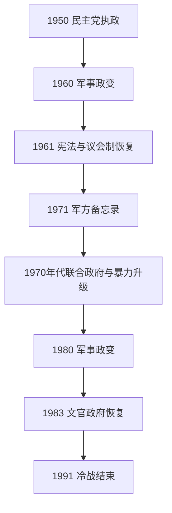

# 多党制与冷战时期

## 时间

1950年—1991年

## 概括

1950年民主党胜选开启持续的多党竞争，土耳其加入北约并成为冷战南翼国家。选举政治、快速城市化和市场经济扩大社会动员，但军方把自身视为凯末尔主义与国家统一的监护者，先后在1960、1971和1980年干预政权。左右翼暴力、库尔德问题、塞浦路斯冲突和高通胀反复冲击议会制度；1980年后军政府重塑宪法，厄扎尔政府推行出口导向和金融开放。

## 国家元首与军政过渡

| 国家元首 / 总统 | 任期 | 权力性质与要点 |
|---|---|---|
| 杰拉勒·拜亚尔 | 1950—1960 | 民主党总统；1960年政变后被军方推翻。 |
| 杰马勒·古尔塞尔 | 1960—1966 | 先任民族团结委员会主席，1961年后任总统。 |
| 杰夫代特·苏奈 | 1966—1973 | 前总参谋长；1971年军方备忘录期间在位。 |
| 法赫里·科鲁蒂尔克 | 1973—1980 | 海军出身；联合政府频繁更迭和政治暴力期间在位。 |
| 凯南·埃夫伦 | 1980—1989 | 1980年政变领袖；1982年宪法后任总统。 |
| 图尔古特·厄扎尔 | 1989—1993 | 祖国党经济改革领导人；本阶段末出任总统。 |

## 政府首脑与主要政治阶段

| 阶段 | 主要总理 / 力量 | 说明 |
|---|---|---|
| 民主党时期 | 阿德南·曼德列斯（1950—1960） | 农业机械化、对美合作和宗教空间放宽；后期经济与反对派压制加剧。 |
| 1961宪法时期 | 伊斯麦特·伊诺努、苏莱曼·德米雷尔等 | 新宪法扩大法院、大学与工会空间，联合政府和军方影响并存。 |
| 1970年代危机 | 比伦特·埃杰维特、德米雷尔 | 左右政党轮替，民族主义武装与左翼组织冲突，经济短缺严重。 |
| 军政府 | 国家安全委员会（1980—1983） | 取缔政党、镇压工会和政治组织，制定强化总统与军方影响的1982年宪法。 |
| 祖国党时期 | 图尔古特·厄扎尔（1983—1989）、耶尔德勒姆·阿克布卢特等 | 市场化、出口和城市消费增长，同时贫富差距与通胀扩大。 |

## 重要事件

- 1950年民主党胜选，首次通过竞争性选举和平更替政府。
- 1952年土耳其加入北约，向朝鲜战争派兵成为入约的重要政治资本；美国军事与经济援助扩大。
- 1955年伊斯坦布尔针对希腊人及其他非穆斯林的暴力事件导致人口进一步外流。
- 1960年军队政变，曼德列斯等人被审判并处决；1961年新宪法建立更复杂的制衡机构。
- 1971年军方以备忘录迫使政府辞职，技术官僚政府在紧急状态下执政。
- 1974年塞浦路斯希腊军政府支持政变后，土耳其出兵控制岛北；此后岛屿分裂成为外交核心。
- 1970年代石油危机、外汇短缺、联合政府不稳与街头暴力相互强化。
- 1980年9月12日军队接管国家，大规模逮捕、酷刑和政党禁令重塑政治社会。
- 1984年库尔德工人党开始武装斗争，东南部安全冲突长期化。
- 1987年土耳其申请加入欧洲共同体，显示西方联盟从安全关系转向制度与市场议题。
- 1989年保加利亚土耳其族人口大量进入土耳其；1991年海湾战争使伊拉克边境和库尔德难民问题突出。

## 政体变化与冷战定位

土耳其以北约成员身份控制黑海—地中海通道，允许美国使用军事设施，同时保持对中东与苏联的独立考量。军方干预通常宣称恢复秩序和凯末尔原则，但每次都削弱文官政治连续性并留下军方制度特权。1961年宪法相对自由，1982年宪法则强化国家安全、总统和行政权。政党社会基础从城市官僚扩展到乡村移民、工商业和宗教保守群体。

## 成长与危机原因

人口从农村向安卡拉、伊斯坦布尔和工业城市迁移，教育与大众媒体扩大，产生新的劳工、学生、宗教和民族政治。进口替代工业化带来制造业，又因外汇不足在1970年代陷入危机；1980年后出口导向政策恢复增长，却加深通胀与社会不平等。冷战结束时，军方监护、多党竞争、市场经济和库尔德冲突共同构成当代政治的制度遗产。

## 演进图

## 完整领导人专表

本阶段存在总统、总理、军方委员会和受军方施压的技术官僚内阁，不能用单一“领导人”序列概括。完整任期与实际权力结构见[土耳其共和国国家元首与政府首脑表](/%E4%BA%BA%E6%96%87%E7%A7%91%E5%AD%A6/%E5%8E%86%E5%8F%B2/%E8%A5%BF%E4%BA%9A/%E5%9C%9F%E8%80%B3%E5%85%B6/%E5%9C%9F%E8%80%B3%E5%85%B6%E5%85%B1%E5%92%8C%E5%9B%BD%E5%9B%BD%E5%AE%B6%E5%85%83%E9%A6%96%E4%B8%8E%E6%94%BF%E5%BA%9C%E9%A6%96%E8%84%91%E8%A1%A8.md)。

## 演变关系

- 前一阶段：[土耳其共和国早期](/%E4%BA%BA%E6%96%87%E7%A7%91%E5%AD%A6/%E5%8E%86%E5%8F%B2/%E8%A5%BF%E4%BA%9A/%E5%9C%9F%E8%80%B3%E5%85%B6/%E5%9C%9F%E8%80%B3%E5%85%B6%E5%85%B1%E5%92%8C%E5%9B%BD%E6%97%A9%E6%9C%9F.md)。
- 后一阶段：[当代土耳其](/%E4%BA%BA%E6%96%87%E7%A7%91%E5%AD%A6/%E5%8E%86%E5%8F%B2/%E8%A5%BF%E4%BA%9A/%E5%9C%9F%E8%80%B3%E5%85%B6/%E5%BD%93%E4%BB%A3%E5%9C%9F%E8%80%B3%E5%85%B6.md)。
- 上级：[土耳其](/%E4%BA%BA%E6%96%87%E7%A7%91%E5%AD%A6/%E5%8E%86%E5%8F%B2/%E8%A5%BF%E4%BA%9A/%E5%9C%9F%E8%80%B3%E5%85%B6/README.md)。
