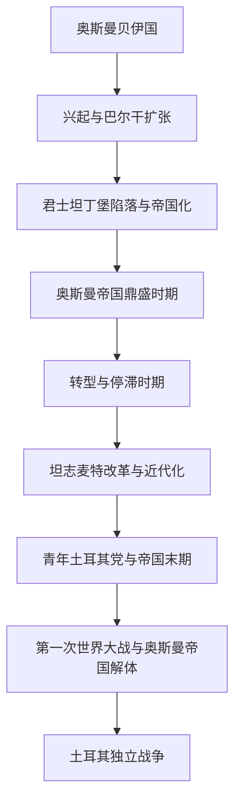

# 奥斯曼帝国

## 概括

奥斯曼帝国由安纳托利亚西北部的奥斯曼贝伊国发展而来，最终成为横跨安纳托利亚、巴尔干、阿拉伯地区、北非和黑海的跨区域帝国。虽然奥斯曼帝国不是现代土耳其民族国家，但土耳其共和国是其最直接继承者，因此本目录把完整奥斯曼帝国史放在土耳其主线下维护。

## 演变图

## 按时间排序的时期导航

| 顺序 | 阶段 | 时间 | 入口 | 简要概括 |
|---:|---|---|---|---|
| 1 | 奥斯曼贝伊国 | 约1299年-1362年 | [奥斯曼贝伊国](/%E4%BA%BA%E6%96%87%E7%A7%91%E5%AD%A6/%E5%8E%86%E5%8F%B2/%E8%A5%BF%E4%BA%9A/%E5%9C%9F%E8%80%B3%E5%85%B6/%E5%A5%A5%E6%96%AF%E6%9B%BC%E5%B8%9D%E5%9B%BD/%E5%A5%A5%E6%96%AF%E6%9B%BC%E8%B4%9D%E4%BC%8A%E5%9B%BD.md) | 奥斯曼家族在比提尼亚边境兴起，利用拜占庭边境、加齐传统和安纳托利亚诸贝伊竞争逐步扩张。 |
| 2 | 奥斯曼帝国兴起与巴尔干扩张 | 1362年-1453年 | [奥斯曼帝国兴起与巴尔干扩张](/%E4%BA%BA%E6%96%87%E7%A7%91%E5%AD%A6/%E5%8E%86%E5%8F%B2/%E8%A5%BF%E4%BA%9A/%E5%9C%9F%E8%80%B3%E5%85%B6/%E5%A5%A5%E6%96%AF%E6%9B%BC%E5%B8%9D%E5%9B%BD/%E5%A5%A5%E6%96%AF%E6%9B%BC%E5%B8%9D%E5%9B%BD%E5%85%B4%E8%B5%B7%E4%B8%8E%E5%B7%B4%E5%B0%94%E5%B9%B2%E6%89%A9%E5%BC%A0.md) | 奥斯曼从安纳托利亚边境政权转向巴尔干强权，控制色雷斯、保加利亚、塞尔维亚等地，并多次围攻君士坦丁堡。 |
| 3 | 君士坦丁堡陷落与帝国化 | 1453年-1520年 | [君士坦丁堡陷落与帝国化](/%E4%BA%BA%E6%96%87%E7%A7%91%E5%AD%A6/%E5%8E%86%E5%8F%B2/%E8%A5%BF%E4%BA%9A/%E5%9C%9F%E8%80%B3%E5%85%B6/%E5%A5%A5%E6%96%AF%E6%9B%BC%E5%B8%9D%E5%9B%BD/%E5%90%9B%E5%A3%AB%E5%9D%A6%E4%B8%81%E5%A0%A1%E9%99%B7%E8%90%BD%E4%B8%8E%E5%B8%9D%E5%9B%BD%E5%8C%96.md) | 1453年穆罕默德二世攻陷君士坦丁堡，奥斯曼获得新首都并继承东地中海帝国传统，向巴尔干、安纳托利亚和阿拉伯地区扩张。 |
| 4 | 奥斯曼帝国鼎盛时期 | 1520年-1566年 | [奥斯曼帝国鼎盛时期](/%E4%BA%BA%E6%96%87%E7%A7%91%E5%AD%A6/%E5%8E%86%E5%8F%B2/%E8%A5%BF%E4%BA%9A/%E5%9C%9F%E8%80%B3%E5%85%B6/%E5%A5%A5%E6%96%AF%E6%9B%BC%E5%B8%9D%E5%9B%BD/%E5%A5%A5%E6%96%AF%E6%9B%BC%E5%B8%9D%E5%9B%BD%E9%BC%8E%E7%9B%9B%E6%97%B6%E6%9C%9F.md) | 苏莱曼一世时期奥斯曼在欧洲、地中海和中东达到高峰，行政、法律和军事体系成熟。 |
| 5 | 奥斯曼帝国转型与停滞时期 | 1566年-18世纪 | [奥斯曼帝国转型与停滞时期](/%E4%BA%BA%E6%96%87%E7%A7%91%E5%AD%A6/%E5%8E%86%E5%8F%B2/%E8%A5%BF%E4%BA%9A/%E5%9C%9F%E8%80%B3%E5%85%B6/%E5%A5%A5%E6%96%AF%E6%9B%BC%E5%B8%9D%E5%9B%BD/%E5%A5%A5%E6%96%AF%E6%9B%BC%E5%B8%9D%E5%9B%BD%E8%BD%AC%E5%9E%8B%E4%B8%8E%E5%81%9C%E6%BB%9E%E6%97%B6%E6%9C%9F.md) | 奥斯曼并非简单停滞，而是在财政、军队、地方权力和欧洲竞争压力下转型，中央与地方关系发生变化。 |
| 6 | 坦志麦特改革与近代化 | 1839年-1876年 | [坦志麦特改革与近代化](/%E4%BA%BA%E6%96%87%E7%A7%91%E5%AD%A6/%E5%8E%86%E5%8F%B2/%E8%A5%BF%E4%BA%9A/%E5%9C%9F%E8%80%B3%E5%85%B6/%E5%A5%A5%E6%96%AF%E6%9B%BC%E5%B8%9D%E5%9B%BD/%E5%9D%A6%E5%BF%97%E9%BA%A6%E7%89%B9%E6%94%B9%E9%9D%A9%E4%B8%8E%E8%BF%91%E4%BB%A3%E5%8C%96.md) | 坦志麦特改革试图通过法律、行政、军队和臣民平等改革重塑帝国，以应对欧洲压力和内部民族问题。 |
| 7 | 青年土耳其党与帝国末期 | 1876年-1918年 | [青年土耳其党与帝国末期](/%E4%BA%BA%E6%96%87%E7%A7%91%E5%AD%A6/%E5%8E%86%E5%8F%B2/%E8%A5%BF%E4%BA%9A/%E5%9C%9F%E8%80%B3%E5%85%B6/%E5%A5%A5%E6%96%AF%E6%9B%BC%E5%B8%9D%E5%9B%BD/%E9%9D%92%E5%B9%B4%E5%9C%9F%E8%80%B3%E5%85%B6%E5%85%9A%E4%B8%8E%E5%B8%9D%E5%9B%BD%E6%9C%AB%E6%9C%9F.md) | 宪政、民族主义、青年土耳其党和一战把奥斯曼推向帝国解体。 |
| 8 | 第一次世界大战与奥斯曼帝国解体 | 1914年-1922年 | [第一次世界大战与奥斯曼帝国解体](/%E4%BA%BA%E6%96%87%E7%A7%91%E5%AD%A6/%E5%8E%86%E5%8F%B2/%E8%A5%BF%E4%BA%9A/%E5%9C%9F%E8%80%B3%E5%85%B6/%E5%A5%A5%E6%96%AF%E6%9B%BC%E5%B8%9D%E5%9B%BD/%E7%AC%AC%E4%B8%80%E6%AC%A1%E4%B8%96%E7%95%8C%E5%A4%A7%E6%88%98%E4%B8%8E%E5%A5%A5%E6%96%AF%E6%9B%BC%E5%B8%9D%E5%9B%BD%E8%A7%A3%E4%BD%93.md) | 一战失败、协约国占领和土耳其民族运动共同终结奥斯曼帝国。 |
| 9 | 奥斯曼帝国的统治结构 | 约14世纪-20世纪初 | [奥斯曼帝国的统治结构](/%E4%BA%BA%E6%96%87%E7%A7%91%E5%AD%A6/%E5%8E%86%E5%8F%B2/%E8%A5%BF%E4%BA%9A/%E5%9C%9F%E8%80%B3%E5%85%B6/%E5%A5%A5%E6%96%AF%E6%9B%BC%E5%B8%9D%E5%9B%BD/%E5%A5%A5%E6%96%AF%E6%9B%BC%E5%B8%9D%E5%9B%BD%E7%9A%84%E7%BB%9F%E6%B2%BB%E7%BB%93%E6%9E%84.md) | 以苏丹、哈里发象征、帕夏官僚、米利特制度、蒂玛尔和常备军等结构理解帝国治理。 |

## 关键辨析

- 奥斯曼帝国不等于现代土耳其，但土耳其是其最直接继承国家。
- 巴尔干、叙利亚、伊拉克、埃及、北非等地区都有奥斯曼时期，但这些地区以后应建立区域视角笔记并引用本目录。
- “奥斯曼土耳其”可作为俗称，但目录名统一使用“奥斯曼帝国”。

## 相关欧洲历史

- 奥斯曼攻陷君士坦丁堡终结东罗马 / 拜占庭，欧洲侧见[东罗马帝国与拜占庭帝国](/%E4%BA%BA%E6%96%87%E7%A7%91%E5%AD%A6/%E5%8E%86%E5%8F%B2/%E6%AC%A7%E6%B4%B2/_%E9%80%9A%E5%8F%B2/%E5%8F%A4%E7%BD%97%E9%A9%AC/%E4%B8%9C%E7%BD%97%E9%A9%AC%E5%B8%9D%E5%9B%BD%E4%B8%8E%E6%8B%9C%E5%8D%A0%E5%BA%AD%E5%B8%9D%E5%9B%BD.md)。
- 奥斯曼巴尔干扩张、维也纳战役和东欧反奥斯曼战争，欧洲侧可参见[欧洲历史](/%E4%BA%BA%E6%96%87%E7%A7%91%E5%AD%A6/%E5%8E%86%E5%8F%B2/%E6%AC%A7%E6%B4%B2/README.md)与[波兰-立陶宛联邦](/%E4%BA%BA%E6%96%87%E7%A7%91%E5%AD%A6/%E5%8E%86%E5%8F%B2/%E6%AC%A7%E6%B4%B2/%E6%96%AF%E6%8B%89%E5%A4%AB/%E8%A5%BF%E6%96%AF%E6%8B%89%E5%A4%AB/%E6%B3%A2%E5%85%B0-%E7%AB%8B%E9%99%B6%E5%AE%9B%E8%81%94%E9%82%A6.md)。
- 十字军运动后期与反奥斯曼战争相连，参见[十字军东征](/%E4%BA%BA%E6%96%87%E7%A7%91%E5%AD%A6/%E5%8E%86%E5%8F%B2/%E6%AC%A7%E6%B4%B2/_%E9%80%9A%E5%8F%B2/%E5%8D%81%E5%AD%97%E5%86%9B%E4%B8%9C%E5%BE%81/README.md)。

## 相关笔记

- 土耳其主线：[土耳其](/%E4%BA%BA%E6%96%87%E7%A7%91%E5%AD%A6/%E5%8E%86%E5%8F%B2/%E8%A5%BF%E4%BA%9A/%E5%9C%9F%E8%80%B3%E5%85%B6/README.md)。
- 后续节点：[土耳其独立战争](/%E4%BA%BA%E6%96%87%E7%A7%91%E5%AD%A6/%E5%8E%86%E5%8F%B2/%E8%A5%BF%E4%BA%9A/%E5%9C%9F%E8%80%B3%E5%85%B6/%E5%9C%9F%E8%80%B3%E5%85%B6%E7%8B%AC%E7%AB%8B%E6%88%98%E4%BA%89.md)。
- 拜占庭背景：[东罗马帝国与拜占庭帝国](/%E4%BA%BA%E6%96%87%E7%A7%91%E5%AD%A6/%E5%8E%86%E5%8F%B2/%E6%AC%A7%E6%B4%B2/_%E9%80%9A%E5%8F%B2/%E5%8F%A4%E7%BD%97%E9%A9%AC/%E4%B8%9C%E7%BD%97%E9%A9%AC%E5%B8%9D%E5%9B%BD%E4%B8%8E%E6%8B%9C%E5%8D%A0%E5%BA%AD%E5%B8%9D%E5%9B%BD.md)。

## 相关西亚与北非历史

- 奥斯曼夺取叙利亚、埃及和两圣地后继承部分哈里发象征，前史可参见[阿拉伯帝国](/%E4%BA%BA%E6%96%87%E7%A7%91%E5%AD%A6/%E5%8E%86%E5%8F%B2/%E8%A5%BF%E4%BA%9A/_%E9%80%9A%E5%8F%B2/%E9%98%BF%E6%8B%89%E4%BC%AF%E5%B8%9D%E5%9B%BD/README.md)与[阿拔斯王朝](/%E4%BA%BA%E6%96%87%E7%A7%91%E5%AD%A6/%E5%8E%86%E5%8F%B2/%E8%A5%BF%E4%BA%9A/_%E9%80%9A%E5%8F%B2/%E9%98%BF%E6%8B%89%E4%BC%AF%E5%B8%9D%E5%9B%BD/%E9%98%BF%E6%8B%94%E6%96%AF%E7%8E%8B%E6%9C%9D.md)。
- 奥斯曼—萨法维竞争重塑安纳托利亚、伊朗和两河边界，参见[萨法维王朝](/%E4%BA%BA%E6%96%87%E7%A7%91%E5%AD%A6/%E5%8E%86%E5%8F%B2/%E8%A5%BF%E4%BA%9A/%E4%BC%8A%E6%9C%97/%E8%90%A8%E6%B3%95%E7%BB%B4%E7%8E%8B%E6%9C%9D.md)与[伊朗](/%E4%BA%BA%E6%96%87%E7%A7%91%E5%AD%A6/%E5%8E%86%E5%8F%B2/%E8%A5%BF%E4%BA%9A/%E4%BC%8A%E6%9C%97/README.md)。
- 帝国解体后现代土耳其主线见[土耳其](/%E4%BA%BA%E6%96%87%E7%A7%91%E5%AD%A6/%E5%8E%86%E5%8F%B2/%E8%A5%BF%E4%BA%9A/%E5%9C%9F%E8%80%B3%E5%85%B6/README.md)，阿拉伯地区和北非后续应各自另建地区节点并引用本目录。
