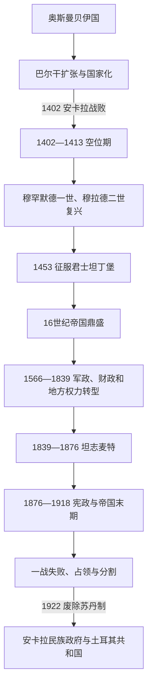

# 奥斯曼帝国

## 概括

奥斯曼帝国由13世纪末安纳托利亚西北边境贝伊国发展而来，鼎盛时统治东南欧、安纳托利亚、阿拉伯地区和北非。它不是现代土耳其民族国家，但土耳其共和国是王朝核心区最直接的继承国家，因此完整帝国通史在此维护；巴尔干、西亚和北非各地区笔记只需说明当地奥斯曼统治经验并链接本目录。

## 演进图

## 历史主线

奥斯曼的早期优势来自拜占庭边疆的权力真空、跨宗教边疆联盟、巴尔干与安纳托利亚双基地，以及能把征服土地、蒂玛尔税收和常备军连接起来的制度。1402年败于帖木儿后，国家经历11年诸王子内战，却依靠巴尔干军政网络恢复。1453年征服君士坦丁堡后，穆罕默德二世强化中央宫廷、火器军队和王室土地；塞利姆一世、苏莱曼一世又把帝国扩至叙利亚、埃及、伊拉克、匈牙利和北非。

苏莱曼一世以后，帝国没有突然“停止”，而是从征服—蒂玛尔模式转向现金税收、包税、常备军和地方显贵合作。1683—1699年后在欧洲转入长期净失地，18—19世纪俄国扩张和欧洲工业财政优势持续加压。马哈茂德二世、坦志麦特官僚与青年土耳其党都试图以新军、统一法律、学校、铁路和宪政重建国家；改革增强动员，也加深债务、征兵、民族认同和中央化冲突。一战失败使王朝失去大部分领土与主权，安卡拉民族政府最终取代伊斯坦布尔苏丹政府。

## 按时间排序的时期导航

| 顺序 | 阶段 | 时间 | 简要概括 |
|---:|---|---|---|
| 1 | [奥斯曼贝伊国](/%E4%BA%BA%E6%96%87%E7%A7%91%E5%AD%A6/%E5%8E%86%E5%8F%B2/%E8%A5%BF%E4%BA%9A/%E5%9C%9F%E8%80%B3%E5%85%B6/%E5%A5%A5%E6%96%AF%E6%9B%BC%E5%B8%9D%E5%9B%BD/%E5%A5%A5%E6%96%AF%E6%9B%BC%E8%B4%9D%E4%BC%8A%E5%9B%BD.md) | 约1299—1362年 | 从瑟于特边境联盟成长为控制布尔萨、尼西亚和加里波利的国家。 |
| 2 | [奥斯曼帝国兴起与巴尔干扩张](/%E4%BA%BA%E6%96%87%E7%A7%91%E5%AD%A6/%E5%8E%86%E5%8F%B2/%E8%A5%BF%E4%BA%9A/%E5%9C%9F%E8%80%B3%E5%85%B6/%E5%A5%A5%E6%96%AF%E6%9B%BC%E5%B8%9D%E5%9B%BD/%E5%A5%A5%E6%96%AF%E6%9B%BC%E5%B8%9D%E5%9B%BD%E5%85%B4%E8%B5%B7%E4%B8%8E%E5%B7%B4%E5%B0%94%E5%B9%B2%E6%89%A9%E5%BC%A0.md) | 1362—1453年 | 以埃迪尔内为中心进入巴尔干，经历安卡拉败战、空位期和复兴。 |
| 3 | [君士坦丁堡陷落与帝国化](/%E4%BA%BA%E6%96%87%E7%A7%91%E5%AD%A6/%E5%8E%86%E5%8F%B2/%E8%A5%BF%E4%BA%9A/%E5%9C%9F%E8%80%B3%E5%85%B6/%E5%A5%A5%E6%96%AF%E6%9B%BC%E5%B8%9D%E5%9B%BD/%E5%90%9B%E5%A3%AB%E5%9D%A6%E4%B8%81%E5%A0%A1%E9%99%B7%E8%90%BD%E4%B8%8E%E5%B8%9D%E5%9B%BD%E5%8C%96.md) | 1453—1520年 | 新首都、火器、宫廷法制和安纳托利亚—阿拉伯扩张塑造帝国结构。 |
| 4 | [奥斯曼帝国鼎盛时期](/%E4%BA%BA%E6%96%87%E7%A7%91%E5%AD%A6/%E5%8E%86%E5%8F%B2/%E8%A5%BF%E4%BA%9A/%E5%9C%9F%E8%80%B3%E5%85%B6/%E5%A5%A5%E6%96%AF%E6%9B%BC%E5%B8%9D%E5%9B%BD/%E5%A5%A5%E6%96%AF%E6%9B%BC%E5%B8%9D%E5%9B%BD%E9%BC%8E%E7%9B%9B%E6%97%B6%E6%9C%9F.md) | 1520—1566年 | 苏莱曼一世时期领土、法律、财政和建筑文化达到高峰。 |
| 5 | [奥斯曼帝国转型与停滞时期](/%E4%BA%BA%E6%96%87%E7%A7%91%E5%AD%A6/%E5%8E%86%E5%8F%B2/%E8%A5%BF%E4%BA%9A/%E5%9C%9F%E8%80%B3%E5%85%B6/%E5%A5%A5%E6%96%AF%E6%9B%BC%E5%B8%9D%E5%9B%BD/%E5%A5%A5%E6%96%AF%E6%9B%BC%E5%B8%9D%E5%9B%BD%E8%BD%AC%E5%9E%8B%E4%B8%8E%E5%81%9C%E6%BB%9E%E6%97%B6%E6%9C%9F.md) | 1566—1839年 | 火器战争、包税、军团和地方显贵促成制度转型，并非三百年静止。 |
| 6 | [坦志麦特改革与近代化](/%E4%BA%BA%E6%96%87%E7%A7%91%E5%AD%A6/%E5%8E%86%E5%8F%B2/%E8%A5%BF%E4%BA%9A/%E5%9C%9F%E8%80%B3%E5%85%B6/%E5%A5%A5%E6%96%AF%E6%9B%BC%E5%B8%9D%E5%9B%BD/%E5%9D%A6%E5%BF%97%E9%BA%A6%E7%89%B9%E6%94%B9%E9%9D%A9%E4%B8%8E%E8%BF%91%E4%BB%A3%E5%8C%96.md) | 1839—1876年 | 以中央部委、法典、征兵、学校和臣民平等重建帝国。 |
| 7 | [青年土耳其党与帝国末期](/%E4%BA%BA%E6%96%87%E7%A7%91%E5%AD%A6/%E5%8E%86%E5%8F%B2/%E8%A5%BF%E4%BA%9A/%E5%9C%9F%E8%80%B3%E5%85%B6/%E5%A5%A5%E6%96%AF%E6%9B%BC%E5%B8%9D%E5%9B%BD/%E9%9D%92%E5%B9%B4%E5%9C%9F%E8%80%B3%E5%85%B6%E5%85%9A%E4%B8%8E%E5%B8%9D%E5%9B%BD%E6%9C%AB%E6%9C%9F.md) | 1876—1918年 | 首次宪政、哈米德集权、1908革命、巴尔干战争和党国化。 |
| 8 | [第一次世界大战与奥斯曼帝国解体](/%E4%BA%BA%E6%96%87%E7%A7%91%E5%AD%A6/%E5%8E%86%E5%8F%B2/%E8%A5%BF%E4%BA%9A/%E5%9C%9F%E8%80%B3%E5%85%B6/%E5%A5%A5%E6%96%AF%E6%9B%BC%E5%B8%9D%E5%9B%BD/%E7%AC%AC%E4%B8%80%E6%AC%A1%E4%B8%96%E7%95%8C%E5%A4%A7%E6%88%98%E4%B8%8E%E5%A5%A5%E6%96%AF%E6%9B%BC%E5%B8%9D%E5%9B%BD%E8%A7%A3%E4%BD%93.md) | 1914—1922年 | 总体战、人口灾难、战败占领、安卡拉政权兴起与废除苏丹制。 |

## 专题与专表

| 主题 | 入口 | 用途 |
|---|---|---|
| 36位公认苏丹与争位者 | [奥斯曼苏丹世系表](/%E4%BA%BA%E6%96%87%E7%A7%91%E5%AD%A6/%E5%8E%86%E5%8F%B2/%E8%A5%BF%E4%BA%9A/%E5%9C%9F%E8%80%B3%E5%85%B6/%E5%A5%A5%E6%96%AF%E6%9B%BC%E5%B8%9D%E5%9B%BD/%E5%A5%A5%E6%96%AF%E6%9B%BC%E8%8B%8F%E4%B8%B9%E4%B8%96%E7%B3%BB%E8%A1%A8.md) | 核对在位顺序、两次在位、废立和1402—1413年空位期。 |
| 帝国治理机制 | [奥斯曼帝国的统治结构](/%E4%BA%BA%E6%96%87%E7%A7%91%E5%AD%A6/%E5%8E%86%E5%8F%B2/%E8%A5%BF%E4%BA%9A/%E5%9C%9F%E8%80%B3%E5%85%B6/%E5%A5%A5%E6%96%AF%E6%9B%BC%E5%B8%9D%E5%9B%BD/%E5%A5%A5%E6%96%AF%E6%9B%BC%E5%B8%9D%E5%9B%BD%E7%9A%84%E7%BB%9F%E6%B2%BB%E7%BB%93%E6%9E%84.md) | 区分苏丹、大维齐尔、军队、行省、税制、法律和宗教共同体。 |
| 土耳其主线中的帝国概括 | [奥斯曼帝国时期](/%E4%BA%BA%E6%96%87%E7%A7%91%E5%AD%A6/%E5%8E%86%E5%8F%B2/%E8%A5%BF%E4%BA%9A/%E5%9C%9F%E8%80%B3%E5%85%B6/%E5%A5%A5%E6%96%AF%E6%9B%BC%E5%B8%9D%E5%9B%BD%E6%97%B6%E6%9C%9F.md) | 把跨区域帝国放回安纳托利亚—土耳其历史序列。 |

## 重要转折与时间节点

| 时间 | 转折 | 意义 |
|---|---|---|
| 1354年前后 | 占据加里波利 | 建立巴尔干永久桥头堡。 |
| 1402—1413年 | 安卡拉败战与空位期 | 王朝几近分裂，随后重建统一。 |
| 1453年 | 征服君士坦丁堡 | 新首都和中央化帝国形成。 |
| 1516—1517年 | 征服叙利亚、埃及 | 帝国进入阿拉伯地区和红海—印度洋竞争。 |
| 1526年 | 摩哈赤战役 | 匈牙利王国主力瓦解，哈布斯堡—奥斯曼长期竞争开始。 |
| 1683—1699年 | 维也纳失败至《卡洛维茨条约》 | 欧洲战线由扩张转为长期领土收缩。 |
| 1826年 | 消灭耶尼切里 | 新军与中央官僚改革获得制度空间。 |
| 1839年 | 坦志麦特开始 | 统一臣民、法律与行政的近代国家建设展开。 |
| 1908—1913年 | 恢复宪政至联合进步委员会掌权 | 王朝、议会和党军关系根本改变。 |
| 1918—1922年 | 战败、占领、民族战争、废苏丹制 | 帝国主权和王朝制度相继终结。 |

## 演变关系

- 前史：[安纳托利亚突厥化与罗姆苏丹国](/%E4%BA%BA%E6%96%87%E7%A7%91%E5%AD%A6/%E5%8E%86%E5%8F%B2/%E8%A5%BF%E4%BA%9A/%E5%9C%9F%E8%80%B3%E5%85%B6/%E5%AE%89%E7%BA%B3%E6%89%98%E5%88%A9%E4%BA%9A%E7%AA%81%E5%8E%A5%E5%8C%96%E4%B8%8E%E7%BD%97%E5%A7%86%E8%8B%8F%E4%B8%B9%E5%9B%BD.md)。
- 后续：[土耳其独立战争](/%E4%BA%BA%E6%96%87%E7%A7%91%E5%AD%A6/%E5%8E%86%E5%8F%B2/%E8%A5%BF%E4%BA%9A/%E5%9C%9F%E8%80%B3%E5%85%B6/%E5%9C%9F%E8%80%B3%E5%85%B6%E7%8B%AC%E7%AB%8B%E6%88%98%E4%BA%89.md)。
- 上级：[土耳其历史](/%E4%BA%BA%E6%96%87%E7%A7%91%E5%AD%A6/%E5%8E%86%E5%8F%B2/%E8%A5%BF%E4%BA%9A/%E5%9C%9F%E8%80%B3%E5%85%B6/README.md)。
