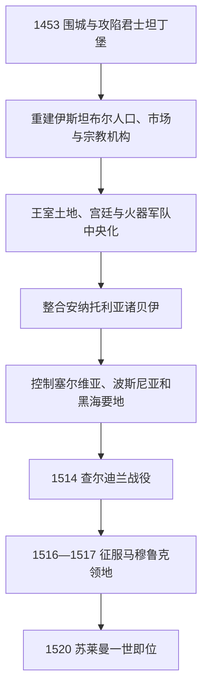

# 君士坦丁堡陷落与帝国化

## 时间

1453年—1520年

## 概括

1453年穆罕默德二世攻陷君士坦丁堡，使奥斯曼获得连接黑海、巴尔干和东地中海的帝国首都。此后王朝消灭巴尔干和安纳托利亚的重要竞争者，重建首都人口与贸易，发展宫廷奴仆—官僚体系，并以罗马帝国继承者和伊斯兰君主的多重语言建立合法性。塞利姆一世征服叙利亚和埃及后，帝国又取得两圣地保护权和阿拉伯行省。

## 主要统治者

| 统治者 | 在位 | 主要作用 |
|---|---|---|
| **穆罕默德二世** | 1451—1481 | 征服君士坦丁堡；吞并塞尔维亚、摩里亚、特拉布宗和卡拉曼等；制定中央集权法典。 |
| 巴耶济德二世 | 1481—1512 | 与弟弟杰姆争位后稳定帝国；接纳伊比利亚犹太移民；面对萨法维影响与王子竞争。 |
| **塞利姆一世** | 1512—1520 | 击败萨法维、灭马穆鲁克，征服叙利亚、埃及和汉志宗主权，使帝国转为西亚—北非强权。 |

完整世系见[奥斯曼苏丹世系表](/%E4%BA%BA%E6%96%87%E7%A7%91%E5%AD%A6/%E5%8E%86%E5%8F%B2/%E8%A5%BF%E4%BA%9A/%E5%9C%9F%E8%80%B3%E5%85%B6/%E5%A5%A5%E6%96%AF%E6%9B%BC%E5%B8%9D%E5%9B%BD/%E5%A5%A5%E6%96%AF%E6%9B%BC%E8%8B%8F%E4%B8%B9%E4%B8%96%E7%B3%BB%E8%A1%A8.md)。

## 1453年征服过程

穆罕默德二世修建如梅利堡控制博斯普鲁斯海峡，集结陆军、舰队与大型火炮。拜占庭守军数量有限，却依靠狄奥多西城墙和金角湾锁链抵抗近两月。奥斯曼把部分舰船经陆路拖入金角湾，分散守军；5月29日发动总攻，皇帝君士坦丁十一世阵亡。征服结束了拜占庭国家，但城市居民、东正教会和罗马法—行政传统并未同时消失。

## 帝国化与统治整合

- **首都重建**：通过迁入穆斯林、基督徒和犹太居民恢复人口，建设托普卡帕宫、市场、宗教设施和供水系统。
- **宗教共同体**：承认君士坦丁堡普世牧首在东正教事务中的地位，但后世概括为固定“米利特制度”的模式是逐步发展而来。
- **中央王权**：宫廷学校、德夫希尔梅和耶尼切里扩大苏丹直属力量；王位争夺仍可能引发内战，王子杀戮被法理化。
- **行省与税收**：鲁米利亚、安纳托利亚等行省由贝勒贝伊和桑贾克长官管理，蒂玛尔骑兵与中央常备军互补。
- **海陆并进**：控制黑海港口、爱琴海岛屿和巴尔干内陆，迫使威尼斯等海上力量以战争和条约并用。

## 重要事件

- 1453年5月29日君士坦丁堡陷落，东罗马 / 拜占庭国家终结；欧洲侧见[东罗马帝国与拜占庭帝国](/%E4%BA%BA%E6%96%87%E7%A7%91%E5%AD%A6/%E5%8E%86%E5%8F%B2/%E6%AC%A7%E6%B4%B2/_%E9%80%9A%E5%8F%B2/%E5%8F%A4%E7%BD%97%E9%A9%AC/%E4%B8%9C%E7%BD%97%E9%A9%AC%E5%B8%9D%E5%9B%BD%E4%B8%8E%E6%8B%9C%E5%8D%A0%E5%BA%AD%E5%B8%9D%E5%9B%BD.md)。
- 1459—1463年塞尔维亚和摩里亚专制国先后被吞并，巴尔干南部控制加深。
- 1461年特拉布宗帝国灭亡，黑海南岸重要拜占庭后继政权终结。
- 1463—1479年与威尼斯长期战争，以奥斯曼取得阿尔巴尼亚和爱琴海优势结束。
- 1473年奥特鲁克贝利战役击败白羊王朝，巩固安纳托利亚东部影响。
- 1480年奥特朗托远征显示进军意大利的可能，穆罕默德二世去世后撤回。
- 1492年后，来自伊比利亚的犹太难民进入塞萨洛尼基、伊斯坦布尔等城市，增强商业和手工业网络。
- 1514年查尔迪兰战役击败[萨法维王朝](/%E4%BA%BA%E6%96%87%E7%A7%91%E5%AD%A6/%E5%8E%86%E5%8F%B2/%E8%A5%BF%E4%BA%9A/%E4%BC%8A%E6%9C%97/%E8%90%A8%E6%B3%95%E7%BB%B4%E7%8E%8B%E6%9C%9D.md)，火器和后勤优势遏制萨法维向安纳托利亚扩张。
- 1516—1517年塞利姆一世灭马穆鲁克，控制叙利亚、埃及和两圣地朝觐路线。

## 强盛基础与未解决问题

首都区位、黑海粮食、巴尔干税源、火器军队和多语言官僚体系共同支撑帝国化。征服马穆鲁克后，奥斯曼掌握更大税源和宗教声望。但快速扩张也增加行省治理成本；安纳托利亚的红头派动员、王子争位和海上竞争仍是风险。1520年苏莱曼一世继位时，帝国已有成熟基础，随即进入[奥斯曼帝国鼎盛时期](/%E4%BA%BA%E6%96%87%E7%A7%91%E5%AD%A6/%E5%8E%86%E5%8F%B2/%E8%A5%BF%E4%BA%9A/%E5%9C%9F%E8%80%B3%E5%85%B6/%E5%A5%A5%E6%96%AF%E6%9B%BC%E5%B8%9D%E5%9B%BD/%E5%A5%A5%E6%96%AF%E6%9B%BC%E5%B8%9D%E5%9B%BD%E9%BC%8E%E7%9B%9B%E6%97%B6%E6%9C%9F.md)。

## 演进图

## 演变关系

- 前一阶段：[奥斯曼帝国兴起与巴尔干扩张](/%E4%BA%BA%E6%96%87%E7%A7%91%E5%AD%A6/%E5%8E%86%E5%8F%B2/%E8%A5%BF%E4%BA%9A/%E5%9C%9F%E8%80%B3%E5%85%B6/%E5%A5%A5%E6%96%AF%E6%9B%BC%E5%B8%9D%E5%9B%BD/%E5%A5%A5%E6%96%AF%E6%9B%BC%E5%B8%9D%E5%9B%BD%E5%85%B4%E8%B5%B7%E4%B8%8E%E5%B7%B4%E5%B0%94%E5%B9%B2%E6%89%A9%E5%BC%A0.md)。
- 后一阶段：[奥斯曼帝国鼎盛时期](/%E4%BA%BA%E6%96%87%E7%A7%91%E5%AD%A6/%E5%8E%86%E5%8F%B2/%E8%A5%BF%E4%BA%9A/%E5%9C%9F%E8%80%B3%E5%85%B6/%E5%A5%A5%E6%96%AF%E6%9B%BC%E5%B8%9D%E5%9B%BD/%E5%A5%A5%E6%96%AF%E6%9B%BC%E5%B8%9D%E5%9B%BD%E9%BC%8E%E7%9B%9B%E6%97%B6%E6%9C%9F.md)。
- 上级：[奥斯曼帝国](/%E4%BA%BA%E6%96%87%E7%A7%91%E5%AD%A6/%E5%8E%86%E5%8F%B2/%E8%A5%BF%E4%BA%9A/%E5%9C%9F%E8%80%B3%E5%85%B6/%E5%A5%A5%E6%96%AF%E6%9B%BC%E5%B8%9D%E5%9B%BD/README.md)；[土耳其](/%E4%BA%BA%E6%96%87%E7%A7%91%E5%AD%A6/%E5%8E%86%E5%8F%B2/%E8%A5%BF%E4%BA%9A/%E5%9C%9F%E8%80%B3%E5%85%B6/README.md)。
