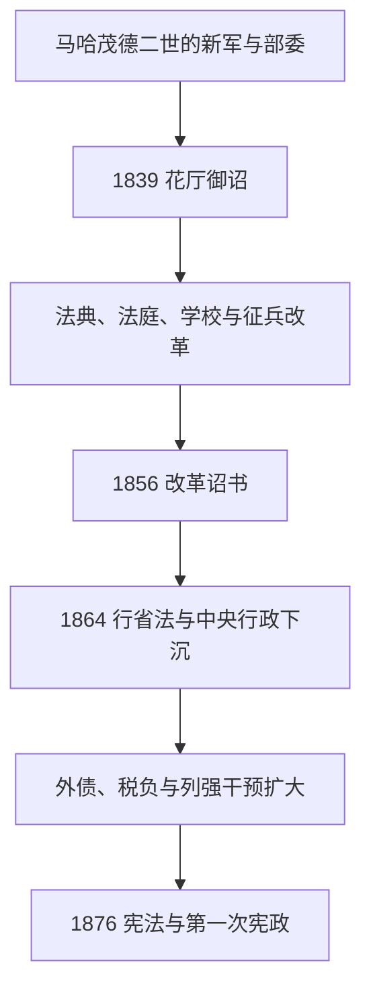

# 坦志麦特改革与近代化

## 时间

1839年—1876年

## 概括

坦志麦特意为“重组”。它不是单一法令，而是奥斯曼中央官僚在军事失败、地方分权、欧洲列强干预和财政危机下推行的一系列行政、法律、军队、教育与臣民身份改革。改革试图把不同宗教共同体转化为权利义务原则上更统一的奥斯曼臣民，并以中央部委、法典和征兵直接管理人口；其成果加强国家能力，也造成债务、税负、地方抵抗和民族政治的新矛盾。

## 统治者与改革集团

| 统治者 | 在位 | 改革重点 |
|---|---|---|
| 阿卜杜勒·迈吉德一世 | 1839—1861 | 颁布《花厅御诏》和《改革诏书》，发展新式学校、军队与法庭。 |
| 阿卜杜勒·阿齐兹 | 1861—1876 | 扩充海军、铁路与中央机构；财政借款加速，1876年被废。 |
| 穆拉德五世 | 1876 | 在位93天，因健康问题被废。 |
| 阿卜杜勒·哈米德二世 | 1876—1909 | 本阶段末继位并颁布宪法，随后进入宪政暂停与个人集权。 |

大维齐尔穆斯塔法·雷希德帕夏、阿里帕夏和福阿德帕夏等官僚是改革主要设计者。完整继承见[奥斯曼苏丹世系表](/%E4%BA%BA%E6%96%87%E7%A7%91%E5%AD%A6/%E5%8E%86%E5%8F%B2/%E8%A5%BF%E4%BA%9A/%E5%9C%9F%E8%80%B3%E5%85%B6/%E5%A5%A5%E6%96%AF%E6%9B%BC%E5%B8%9D%E5%9B%BD/%E5%A5%A5%E6%96%AF%E6%9B%BC%E8%8B%8F%E4%B8%B9%E4%B8%96%E7%B3%BB%E8%A1%A8.md)。

## 主要改革

- **1839年《花厅御诏》**：承诺保障生命、荣誉和财产，规范征税、征兵和司法，强调国家依法行政。
- **1856年《改革诏书》**：在克里米亚战争后的列强压力下，进一步宣布穆斯林与非穆斯林臣民在公职、教育和法律上的平等原则。
- **地方行政**：省制改革建立省、县等层级和地方议会，意在把税收、治安和公共工程纳入中央监督。
- **法律体系**：商业、刑事和土地法典大量借鉴欧洲模式；宗教法庭之外出现混合法庭与世俗法院，后期编纂《梅杰勒》民法。
- **教育与官僚**：发展军事、医学、行政和世俗中等学校，培养掌握外语与新式文书的官员。
- **军事与基础设施**：实行更有规则的征兵，建设电报、港口和铁路；改革提高动员，也扩大财政开支。
- **臣民身份**：1869年国籍法试图以统一奥斯曼国籍取代仅按宗教共同体区分的政治身份。

## 重要事件

- 1839年马哈茂德二世去世后，阿卜杜勒·迈吉德一世颁布《花厅御诏》。
- 1839—1841年第二次埃及危机在列强干预下结束，穆罕默德·阿里家族获得埃及世袭统治，中央名义宗主权保留。
- 1853—1856年克里米亚战争中奥斯曼与英法联合抵抗俄国；战后《巴黎条约》把帝国纳入欧洲列强秩序。
- 1856年《改革诏书》推动臣民平等，但穆斯林、基督徒地方群体和宗教机构均对利益变化产生抵抗。
- 1858年土地法试图登记土地与纳税责任，部分地区却使地方权贵更容易取得法律产权。
- 1860年黎巴嫩山和大马士革发生宗派暴力，随后在国际干预下建立黎巴嫩山特殊行政体制。
- 1864年省制法重组地方行政；米德哈特帕夏在多瑙省等地试行公共工程与地方议会。
- 1875年帝国宣布暂停偿付部分外债，暴露铁路、军费和宫廷开支造成的财政依赖。
- 1876年阿卜杜勒·阿齐兹被废、穆拉德五世短暂在位；《奥斯曼基本法》颁布并召开议会。

## 成效与局限

改革建立了更专业的官僚、学校、法典和交通通信网络，为后续土耳其及多个后奥斯曼国家继承。它也将更多社会生活纳入登记、征兵和直接征税，引发地方抵抗。臣民平等在法律文本与实际执行间有距离；欧洲列强常以保护基督徒为名介入内政。外债为军队和基础设施提供资金，却在1875年危机后使财政受国际债权人控制。改革因此既不是失败的“西化模仿”，也未能解决帝国民族、宗教和主权矛盾。

## 演进图

## 演变关系

- 前一阶段：[奥斯曼帝国转型与停滞时期](/%E4%BA%BA%E6%96%87%E7%A7%91%E5%AD%A6/%E5%8E%86%E5%8F%B2/%E8%A5%BF%E4%BA%9A/%E5%9C%9F%E8%80%B3%E5%85%B6/%E5%A5%A5%E6%96%AF%E6%9B%BC%E5%B8%9D%E5%9B%BD/%E5%A5%A5%E6%96%AF%E6%9B%BC%E5%B8%9D%E5%9B%BD%E8%BD%AC%E5%9E%8B%E4%B8%8E%E5%81%9C%E6%BB%9E%E6%97%B6%E6%9C%9F.md)。
- 后一阶段：[青年土耳其党与帝国末期](/%E4%BA%BA%E6%96%87%E7%A7%91%E5%AD%A6/%E5%8E%86%E5%8F%B2/%E8%A5%BF%E4%BA%9A/%E5%9C%9F%E8%80%B3%E5%85%B6/%E5%A5%A5%E6%96%AF%E6%9B%BC%E5%B8%9D%E5%9B%BD/%E9%9D%92%E5%B9%B4%E5%9C%9F%E8%80%B3%E5%85%B6%E5%85%9A%E4%B8%8E%E5%B8%9D%E5%9B%BD%E6%9C%AB%E6%9C%9F.md)。
- 欧洲背景：[欧洲历史](/%E4%BA%BA%E6%96%87%E7%A7%91%E5%AD%A6/%E5%8E%86%E5%8F%B2/%E6%AC%A7%E6%B4%B2/README.md)。
- 上级：[奥斯曼帝国](/%E4%BA%BA%E6%96%87%E7%A7%91%E5%AD%A6/%E5%8E%86%E5%8F%B2/%E8%A5%BF%E4%BA%9A/%E5%9C%9F%E8%80%B3%E5%85%B6/%E5%A5%A5%E6%96%AF%E6%9B%BC%E5%B8%9D%E5%9B%BD/README.md)；[土耳其](/%E4%BA%BA%E6%96%87%E7%A7%91%E5%AD%A6/%E5%8E%86%E5%8F%B2/%E8%A5%BF%E4%BA%9A/%E5%9C%9F%E8%80%B3%E5%85%B6/README.md)。
